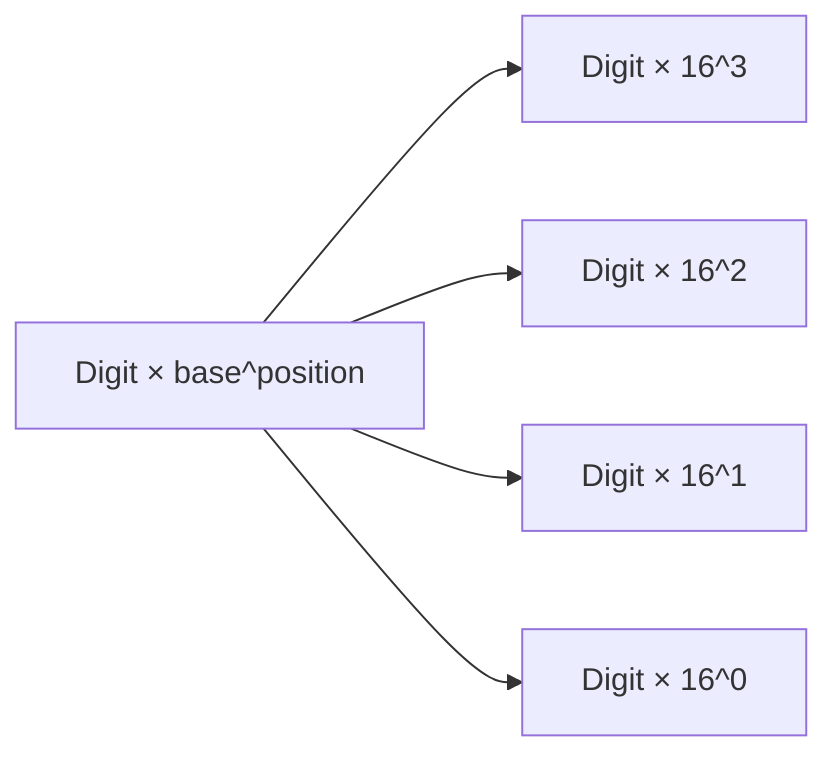
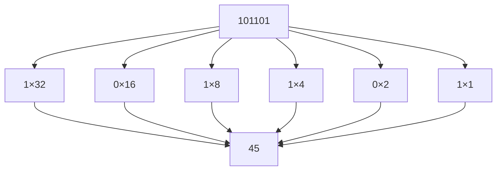
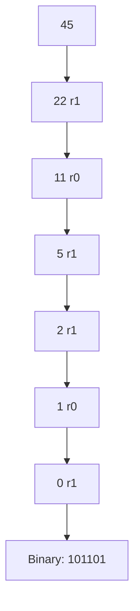
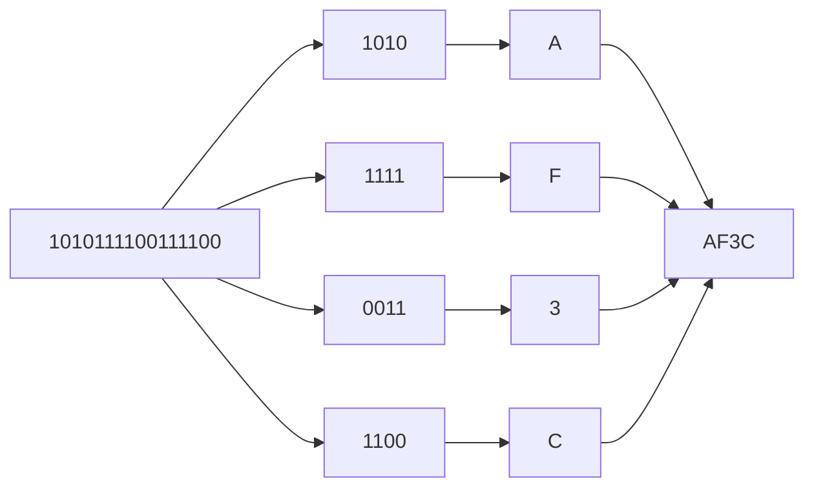
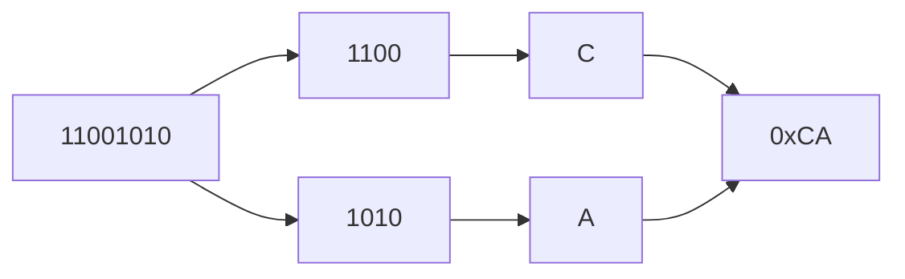
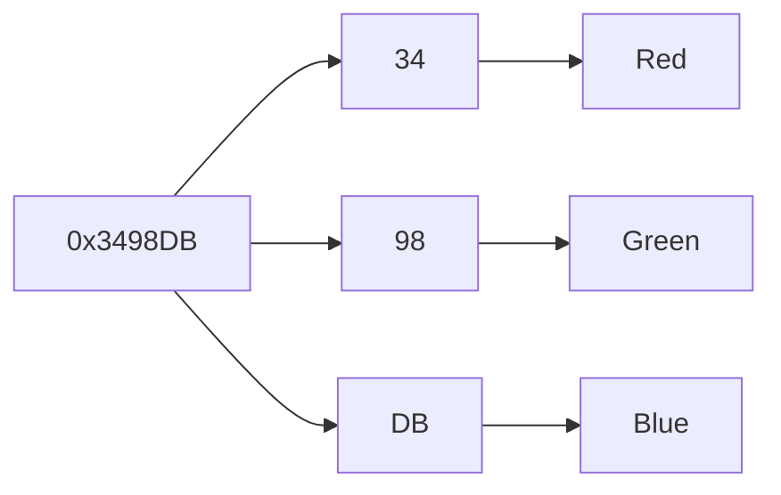

# Binary and Hexadecimal

!!! tip "Mental Model"
    Binary is the computer's native tongue -- every value is a string of 0s and 1s. Hexadecimal is a shorthand that humans invented to read binary without going cross-eyed: each hex digit maps to exactly four bits, so a byte like `11010010` becomes `D2`. Whenever you see hex in debuggers, memory dumps, or color codes, you are looking at binary in disguise.

Computers store and manipulate data using **binary numbers**—numbers written in base 2. While binary is ideal for hardware, it is often inconvenient for humans to read or write long sequences of bits.

To make binary data easier to work with, programmers frequently use **hexadecimal** (base 16) and sometimes **octal** (base 8). These number systems provide compact representations of the same underlying bit patterns.

Understanding how to convert between these bases is an essential skill when working with:

* debugging tools and memory dumps
* binary file formats
* network protocols
* cryptographic data
* low-level systems programming

---

## 1. Number Systems and Bases

A **number system** (or **base**) defines how numbers are represented using digits and positional value.

Each digit position represents a power of the base.

For a base (b):

[
\text{value} = \sum d_i b^i
]

where (d_i) are the digits.

---

### Common bases used in computing

| Base | Name        | Digits   |
| ---- | ----------- | -------- |
| 2    | Binary      | 0–1      |
| 8    | Octal       | 0–7      |
| 10   | Decimal     | 0–9      |
| 16   | Hexadecimal | 0–9, A–F |

Hexadecimal extends decimal with six additional symbols:

| Hex | Value |
| --- | ----- |
| A   | 10    |
| B   | 11    |
| C   | 12    |
| D   | 13    |
| E   | 14    |
| F   | 15    |

---

### Visualization of positional value



Each position represents a power of the base.

---

## 2. Binary Numbers

Binary uses only two digits:

```text
0 and 1
```

Each position represents a power of two.

| Position | Value |
| -------- | ----- |
| (2^0)    | 1     |
| (2^1)    | 2     |
| (2^2)    | 4     |
| (2^3)    | 8     |
| (2^4)    | 16    |
| (2^5)    | 32    |
| (2^6)    | 64    |
| (2^7)    | 128   |

---

### Example: binary to decimal

Convert:

```text
101101
```

[
1\cdot2^5 + 0\cdot2^4 + 1\cdot2^3 + 1\cdot2^2 + 0\cdot2^1 + 1\cdot2^0
]

[
= 32 + 8 + 4 + 1 = 45
]

---

#### Visualization



---

## 3. Decimal to Binary Conversion

To convert a decimal number to binary, repeatedly **divide by 2** and record the remainders.

---

### Example: convert 45 to binary

| Division | Quotient | Remainder |
| -------- | -------- | --------- |
| 45 ÷ 2   | 22       | 1         |
| 22 ÷ 2   | 11       | 0         |
| 11 ÷ 2   | 5        | 1         |
| 5 ÷ 2    | 2        | 1         |
| 2 ÷ 2    | 1        | 0         |
| 1 ÷ 2    | 0        | 1         |

Reading remainders **bottom to top**:

```text
101101
```

---

#### Visualization



---

## 4. Hexadecimal

Binary numbers become long quickly. For example:

```text
1010111100111100
```

To make these easier to read, programmers use **hexadecimal**.

Hexadecimal uses **base 16**, with digits:

```text
0 1 2 3 4 5 6 7 8 9 A B C D E F
```

---

### Why hexadecimal is useful

Hexadecimal aligns perfectly with binary.

```text
1 hex digit = 4 bits
```

So a **byte (8 bits)** equals:

```text
2 hex digits
```

---

#### Binary to hex grouping

Binary:

```text
1010 1111 0011 1100
```

Group into 4 bits:

```text
1010 1111 0011 1100
```

Convert each group:

| Binary | Hex |
| ------ | --- |
| 1010   | A   |
| 1111   | F   |
| 0011   | 3   |
| 1100   | C   |

Result:

```text
AF3C
```

---

#### Visualization



---

## 5. Hexadecimal to Decimal

To convert hex to decimal, multiply each digit by the corresponding power of 16.

Example:

```text
0xAF
```

[
A\times16^1 + F\times16^0
]

[
10\times16 + 15 = 175
]

---

### Larger example

```text
0x3C7
```

[
3\times16^2 + 12\times16^1 + 7\times16^0
]

[
= 768 + 192 + 7 = 967
]

---

## 6. Octal

Octal (base 8) uses digits:

```text
0–7
```

Octal was historically useful because:

```text
1 octal digit = 3 bits
```

Example:

```text
101 110 111
```

Convert groups:

| Binary | Octal |
| ------ | ----- |
| 101    | 5     |
| 110    | 6     |
| 111    | 7     |

Result:

```text
567
```

Today, octal is mainly used in **Unix permissions**.

Example:

```text
755
```

means:

```text
rwxr-xr-x
```

---

## 7. Binary, Hex, and Bytes

Because hexadecimal aligns perfectly with binary, it is widely used when inspecting raw data.

Example byte:

```text
11001010
```

Group bits:

```text
1100 1010
```

Convert:

```text
CA
```

So:

```text
11001010 = 0xCA
```

---

#### Visualization



---

## 8. Python and Number Bases

Python provides convenient syntax for working with different bases.

---

### Literals

Python uses prefixes to specify number bases.

| Prefix | Base        |
| ------ | ----------- |
| `0b`   | binary      |
| `0x`   | hexadecimal |
| `0o`   | octal       |

Example:

```python
print(0b101101)   # 45
print(0xFF)       # 255
print(0o755)      # 493
```

---

### Converting integers to strings

```python
print(bin(45))   # '0b101101'
print(hex(255))  # '0xff'
print(oct(493))  # '0o755'
```

---

### Parsing numbers from strings

```python
print(int('101101', 2))  # 45
print(int('FF', 16))     # 255
```

---

## 9. Practical Uses of Hexadecimal

Hexadecimal appears frequently in programming because it represents binary data compactly.

Common uses include:

* memory addresses
* binary file formats
* color values
* machine instructions
* cryptographic hashes

---

### Example: RGB colors

Many graphics systems represent colors using hexadecimal.

Example:

```text
#3498DB
```

Structure:

```text
RR GG BB
```

Each pair represents a byte.

---

#### Extracting color components

```python
color = 0x3498DB

r = (color >> 16) & 0xFF
g = (color >> 8) & 0xFF
b = color & 0xFF

print(r, g, b)
```

Result:

```text
52 152 219
```

---

#### Visualization



---

## 10. Fixed-Width Formatting

Programs often display numbers using a fixed number of digits.

Example:

```python
format(45, '08b')
```

Output:

```text
00101101
```

This shows the number as **8-bit binary**.

---

#### Hex formatting

```python
format(255, '02x')
```

Output:

```text
ff
```

---

## 11. Bytes and Hex Strings

Binary data is frequently represented as hexadecimal strings.

Example:

```python
data = bytes([0xDE, 0xAD, 0xBE, 0xEF])
```

This produces:

```text
deadbeef
```

which is a well-known hexadecimal example used in debugging.

Example:

```python
print(data.hex())
print(bytes.fromhex('deadbeef'))
```

---

## 12. Worked Examples

#### Example 1

Convert `11011010` to hex.

Group bits:

```text
1101 1010
```

Convert:

```text
D A
```

Result:

```text
0xDA
```

---

#### Example 2

Convert `0x7B` to decimal.

[
7\times16 + 11 = 123
]

---

#### Example 3

Convert 73 to binary.

Break into powers of two:

[
64 + 8 + 1
]

Binary:

```text
01001001
```

---

## 13. Exercises

1. Convert `10101101` to decimal.
2. Convert 91 to binary.
3. Convert `11100110` to hexadecimal.
4. Convert `0x2F` to decimal.
5. Convert `0xA3` to binary.
6. Convert `755` (octal) to decimal.
7. Why does hexadecimal align so well with binary?
8. What hex value corresponds to `11111111`?

---

**Exercise 9.**
The positional value formula says that a number in base $b$ is $\sum d_i \cdot b^i$. Using this formula, explain *why* every hex digit maps to exactly four binary digits, every octal digit maps to exactly three binary digits, but there is no clean grouping of binary digits that maps to one decimal digit. What mathematical property must the base have for such a clean mapping to exist?

??? success "Solution to Exercise 9"
    A clean digit-to-digit mapping between base $b_1$ and base $b_2$ exists if and only if $b_1$ is a power of $b_2$ (or vice versa). Hexadecimal is $16 = 2^4$, so each hex digit corresponds to exactly $4$ binary digits. Octal is $8 = 2^3$, so each octal digit corresponds to exactly $3$ binary digits.

    Decimal ($10$) is *not* a power of $2$. There is no integer $k$ such that $10 = 2^k$. This means there is no fixed number of binary digits that maps cleanly to one decimal digit. Converting between binary and decimal requires actual arithmetic (multiplication, addition, division), not just grouping.

    This is why hexadecimal became the preferred shorthand for binary data: the conversion is purely mechanical grouping with no arithmetic required.

---

**Exercise 10.**
Consider the following Python session:

```python
x = 0xFF
y = int('FF', 16)
z = 255
print(x == y == z)           # What does this print?
print(type(x), type(y), type(z))  # What types are these?
```

Predict the output. Then explain: when Python encounters `0xFF` in source code, does it store the number internally in hexadecimal? What is the relationship between a number's *value* and its *representation in a particular base*?

??? success "Solution to Exercise 10"
    The output is:

    ```text
    True
    <class 'int'> <class 'int'> <class 'int'>
    ```

    All three variables hold the same integer value `255` and have the same type `int`. Python does *not* store numbers in hexadecimal, decimal, or any particular base internally. The prefixes `0x`, `0b`, `0o` are *source code notations* -- they tell the parser how to interpret the literal, but the resulting integer object is base-independent. Internally, CPython stores the value as an array of binary chunks (base $2^{30}$ digits), but this is an implementation detail.

    A number's *value* is abstract and independent of base. A *representation* is how we write that value using a specific base and digit symbols. `0xFF`, `255`, `0b11111111`, and `0o377` are four different representations of the same value.

---

**Exercise 11.**
A programmer writes `format(255, '04x')` and gets `'00ff'`. They then try `format(-1, '04x')` expecting `'ff'` (thinking of 8-bit two's complement), but instead get `'-1'`. Explain *why* Python's `format()` with `'x'` does not produce two's complement hex for negative numbers. How does this relate to the fact that Python integers have no fixed bit width? What would the programmer need to do to get the 8-bit two's complement hex representation of `-1`?

??? success "Solution to Exercise 11"
    Python's `format()` with `'x'` treats the integer as a mathematical value, not as a fixed-width bit pattern. Since Python integers have arbitrary precision (no fixed bit width), there is no "natural" two's complement representation for negative numbers. The format specifier simply prepends a minus sign for negative values.

    In a language like C, `-1` as an `int8` is `0xFF` because `int8` has exactly 8 bits. But Python's `-1` could be 8-bit, 16-bit, 32-bit, or any width -- there is no single "correct" hex representation.

    To get the 8-bit two's complement hex:

    ```python
    value = -1
    twos_comp = value & 0xFF  # Mask to 8 bits: gives 255
    print(format(twos_comp, '02x'))  # 'ff'
    ```

    The `& 0xFF` operation forces the value into an 8-bit unsigned range, effectively computing the two's complement representation at that width.

---

**Exercise 12.**
RGB color values are often written as 6-digit hex strings like `#3498DB`. Explain why hexadecimal is the natural choice for this rather than decimal or binary. Then consider: if humans could comfortably read base-256 (with 256 distinct digit symbols), how would the same color be written? Why don't we use base-256 in practice, and what does this tell us about why hexadecimal became the standard "human-friendly binary shorthand"?

??? success "Solution to Exercise 12"
    Hexadecimal is natural for RGB colors because each color channel is one byte (8 bits = values 0--255), and one byte is exactly two hex digits. So `#3498DB` immediately reveals three channels: `34` (red = 52), `98` (green = 152), `DB` (blue = 219). The representation is compact (6 characters) and each channel boundary aligns with a digit boundary.

    In decimal, the same color would be `52, 152, 219` -- three separate numbers requiring delimiters, with no fixed width. In binary, it would be `00110100 10011000 11011011` -- 24 characters, hard to read.

    In base-256, each channel would be a single "digit," so the color would be just 3 digits. This would be maximally compact, but humans cannot memorize 256 distinct symbols. Hexadecimal (16 symbols: 0--9, A--F) is the sweet spot: it is a power of 2 (so binary conversion is trivial), each digit represents exactly 4 bits, and 16 symbols are few enough for humans to learn easily. This balance between compactness and human readability is why hexadecimal became the standard shorthand.

---

## 14. Short Answers

1. 173
2. `01011011`
3. `E6`
4. 47
5. `10100011`
6. 493
7. Because one hex digit equals four bits
8. `FF`

## 15. Summary

* Binary (base 2) is the fundamental number system used by computers.
* Hexadecimal (base 16) provides a compact representation of binary data.
* Octal (base 8) groups bits in sets of three and appears in Unix permissions.
* One hex digit represents exactly **four bits**.
* One byte corresponds to **two hex digits**.
* Programmers frequently convert between bases when debugging, inspecting memory, or working with binary protocols.

Understanding binary and hexadecimal allows programmers to reason about **bit patterns, memory layout, and low-level data formats** with precision.

## Exercises

**Exercise 1.** Convert the decimal number 42 to binary and hexadecimal.

??? success "Solution to Exercise 1"
    Binary: 42 = 32 + 8 + 2 = 101010 in binary. Hexadecimal: 42 = 2 * 16 + 10 = 0x2A.

---

**Exercise 2.** Why is hexadecimal commonly used in computing instead of decimal.

??? success "Solution to Exercise 2"
    Each hexadecimal digit corresponds to exactly 4 binary digits (bits), making conversion between hex and binary trivial. A byte (8 bits) is always exactly 2 hex digits. This makes hexadecimal a compact, human-readable representation of binary data that preserves bit-level structure.

