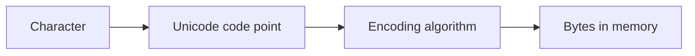
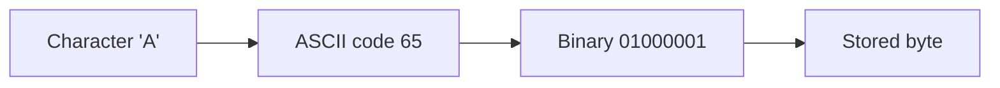
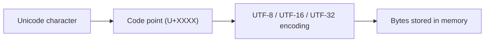
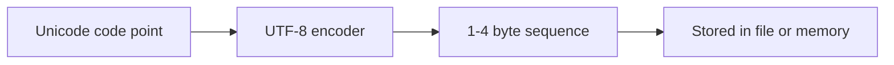
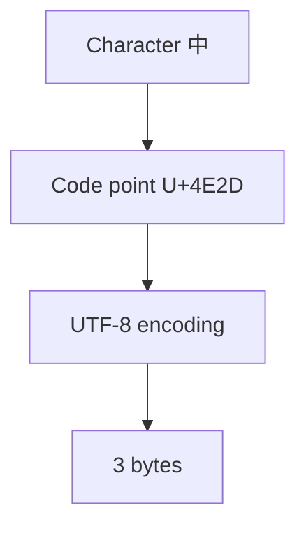
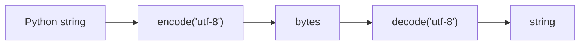

# Character Encoding

!!! tip "Mental Model"
    A character encoding is a lookup table that translates between human-readable characters and the bytes a computer stores. Without agreeing on which table to use, the same bytes can display as completely different text on different systems. UTF-8 has become the universal answer: it can represent every character in every language while staying backward-compatible with ASCII.

Computers ultimately store information as **binary data**—patterns of bits and bytes. Human languages, however, consist of **characters** such as letters, digits, punctuation, and symbols.

A **character encoding** defines how these characters are represented as sequences of bytes so that computers can store, transmit, and display text.

When character encodings are interpreted incorrectly, the result is **garbled text**, sometimes called *mojibake*.

Understanding character encoding is essential when working with:

* text files
* web data
* databases
* international languages
* network protocols

---

## 1. Characters, Code Points, and Encodings

Text representation involves three distinct concepts.

| Concept    | Meaning                                    |
| ---------- | ------------------------------------------ |
| Character  | An abstract symbol (e.g., A, 中, ☕)         |
| Code point | Numeric identifier assigned to a character |
| Encoding   | Mapping from code points to bytes          |

---

### Example

Character:

```text
A
```

Unicode code point:

```text
U+0041
```

Encoding (UTF-8):

```text
0x41
```

---

#### Conceptual pipeline



---

## 2. ASCII: The First Standard

The earliest widely adopted character encoding was **ASCII** (American Standard Code for Information Interchange), standardized in 1963.

ASCII defined **128 characters** using **7 bits**.

---

### ASCII table overview

| Range  | Meaning              |
| ------ | -------------------- |
| 0–31   | control characters   |
| 32–126 | printable characters |
| 127    | delete               |

Example characters:

| Character | Code | Binary   |
| --------- | ---- | -------- |
| A         | 65   | 01000001 |
| a         | 97   | 01100001 |
| 0         | 48   | 00110000 |

---

#### ASCII visualization



---

### Limitations of ASCII

ASCII works well for English but cannot represent:

* accented Latin characters (é, ñ)
* non-Latin scripts (中文, العربية)
* symbols and emoji

To support additional characters, various **8-bit extensions** were created.

Examples:

* ISO-8859-1 (Latin-1)
* Windows-1252
* MacRoman

Unfortunately, these encodings were **incompatible**, meaning the same byte value could represent different characters in different systems.

---

## 3. Unicode: A Universal Character Set

To solve encoding incompatibility, the **Unicode standard** was created.

Unicode assigns every character in every writing system a **unique code point**.

Example code points:

| Character | Code point |
| --------- | ---------- |
| A         | U+0041     |
| é         | U+00E9     |
| 中         | U+4E2D     |
| ☕         | U+2615     |

Unicode supports over **1.1 million possible code points**, though only a fraction are currently assigned.

---

### Unicode architecture

Unicode defines **characters and code points**, but not how they are stored in memory.

Encodings such as **UTF-8**, **UTF-16**, and **UTF-32** specify the actual byte representation.

---

#### Visualization



---

## 4. UTF-8 Encoding

The most widely used encoding today is **UTF-8**.

UTF-8 is a **variable-length encoding** that uses **1 to 4 bytes per character**.

Advantages:

* ASCII compatibility
* efficient for English text
* compact representation
* self-synchronizing
* no byte-order problems

---

### UTF-8 byte structure

| Bytes | Bits    | Range                  |
| ----- | ------- | ---------------------- |
| 1     | 7 bits  | ASCII                  |
| 2     | 11 bits | Latin extensions       |
| 3     | 16 bits | CJK characters         |
| 4     | 21 bits | emoji and rare symbols |

---

#### Bit pattern rules

UTF-8 uses specific leading bit patterns.

| Bytes | Pattern                               |
| ----- | ------------------------------------- |
| 1     | `0xxxxxxx`                            |
| 2     | `110xxxxx 10xxxxxx`                   |
| 3     | `1110xxxx 10xxxxxx 10xxxxxx`          |
| 4     | `11110xxx 10xxxxxx 10xxxxxx 10xxxxxx` |

These patterns allow a decoder to identify **character boundaries automatically**.

---

#### Visualization



---

## 5. Example: Encoding Characters in UTF-8

#### ASCII character

Character:

```text
A
```

Code point:

```text
U+0041
```

UTF-8 bytes:

```text
01000001
```

One byte.

---

#### Chinese character

Character:

```text
中
```

Code point:

```text
U+4E2D
```

UTF-8 representation:

```text
11100100 10111000 10101101
```

Three bytes.

---

#### Visualization



---

## 6. UTF-16 and UTF-32

Unicode also defines other encodings.

---

### UTF-16

Uses **2 or 4 bytes per character**.

Advantages:

* fixed 2-byte units for most characters
* efficient for some languages

Disadvantages:

* surrogate pairs complicate processing
* byte-order issues (big-endian vs little-endian)

---

### UTF-32

Uses **4 bytes per character**.

Advantages:

* constant width
* easy indexing

Disadvantages:

* high memory usage

---

#### Comparison

| Encoding | Bytes per char | Notes                           |
| -------- | -------------- | ------------------------------- |
| UTF-8    | 1–4            | most common                     |
| UTF-16   | 2–4            | used internally in some systems |
| UTF-32   | 4              | simple but large                |

---

## 7. Python Strings and Unicode

In Python 3, **strings are sequences of Unicode code points**.

Example:

```python
text = "Hello"
```

Internally, Python stores characters as Unicode.

The length of a string counts **code points**, not bytes.

---

### Example

```python
text = "Hello, 世界!"
print(len(text))
```

Output:

```text
10
```

But when encoded as UTF-8:

```python
encoded = text.encode("utf-8")
print(len(encoded))
```

Output:

```text
14
```

because the Chinese characters require **3 bytes each**.

---

## 8. Encoding and Decoding

Converting between text and bytes requires explicit encoding and decoding.

---

### Encoding

```python
text = "Hello, 世界!"
encoded = text.encode("utf-8")
print(encoded)
```

Example result:

```text
b'Hello, \xe4\xb8\x96\xe7\x95\x8c!'
```

---

### Decoding

```python
decoded = encoded.decode("utf-8")
print(decoded)
```

Output:

```text
Hello, 世界!
```

---

#### Visualization



---

## 9. File Encodings

Files store text as **bytes**, not characters.

Therefore programs must specify the encoding used when reading or writing text files.

---

### Writing a file

```python
with open("data.txt", "w", encoding="utf-8") as f:
    f.write("café ☕")
```

---

### Reading a file

```python
with open("data.txt", "r", encoding="utf-8") as f:
    print(f.read())
```

Specifying the encoding prevents platform-dependent errors.

---

## 10. Handling Encoding Errors

Sometimes byte sequences do not correspond to valid characters.

Example:

```python
invalid = b'\xff\xfe'
invalid.decode("utf-8")
```

Result:

```text
UnicodeDecodeError
```

Python allows error handling strategies.

---

### Replace invalid characters

```python
invalid.decode("utf-8", errors="replace")
```

Output:

```text
��
```

---

### Ignore errors

```python
invalid.decode("utf-8", errors="ignore")
```

Invalid bytes are skipped.

---

## 11. Common Encoding Problems

#### Mojibake

Occurs when text is decoded with the wrong encoding.

Example:

```text
café
```

interpreted incorrectly might appear as:

```text
café
```

---

#### Mixing encodings

Files created in one encoding (e.g., Windows-1252) may break when interpreted as UTF-8.

---

#### Forgetting to specify encoding

Always specify the encoding in file operations.

---

## 12. Worked Examples

#### Example 1

Find the Unicode code point of a character.

```python
print(ord("中"))
```

Output:

```text
20013
```

Hex form:

```python
print(hex(ord("中")))
```

```text
0x4e2d
```

---

#### Example 2

Convert a code point to a character.

```python
print(chr(65))
```

Output:

```text
A
```

---

#### Example 3

Inspect UTF-8 bytes.

```python
"中".encode("utf-8")
```

Result:

```text
b'\xe4\xb8\xad'
```

---

## 13. Exercises

1. What is the difference between a character set and an encoding?
2. How many characters did ASCII support?
3. What is the Unicode code point for the letter A?
4. Why is UTF-8 compatible with ASCII?
5. How many bytes can UTF-8 use for one character?
6. Why does `len()` sometimes differ from the number of bytes in UTF-8?
7. What happens if a byte sequence is decoded with the wrong encoding?

---

**Exercise 8.**
In Python 3, `len("Hello, 世界!")` returns `10`, but `len("Hello, 世界!".encode("utf-8"))` returns `14`. Explain *why* these two lengths differ. What fundamental distinction does this reveal about the difference between "characters" (code points) and "bytes"? Could you design an encoding where these two lengths are always equal for all possible strings? What trade-off would that encoding make?

??? success "Solution to Exercise 8"
    `len("Hello, 世界!")` returns 10 because Python's `len()` on a `str` counts **Unicode code points** -- abstract characters. There are 10 characters: `H`, `e`, `l`, `l`, `o`, `,`, ` `, `世`, `界`, `!`.

    `len("Hello, 世界!".encode("utf-8"))` returns 14 because `.encode("utf-8")` produces a `bytes` object, and `len()` on `bytes` counts **bytes**. The 7 ASCII characters each use 1 byte, while `世` and `界` each use 3 bytes in UTF-8: $7 + 3 + 3 + 1 = 14$.

    This reveals that characters and bytes are fundamentally different units. A "character" is an abstract symbol; a "byte" is a unit of storage. The mapping between them depends on the encoding and can be one-to-many.

    You could design an encoding where the two lengths are always equal: **UTF-32**. It uses exactly 4 bytes per code point, so `len(text) == len(text.encode("utf-32-be")) // 4`. The trade-off is massive space waste -- ASCII text uses 4x the memory compared to UTF-8. This is why UTF-32 is rarely used for storage or transmission.

---

**Exercise 9.**
UTF-8 is described as "self-synchronizing." Explain what this means by considering the following scenario: a program starts reading a UTF-8 byte stream from the middle (not from the beginning). How can it determine where the next valid character starts without backtracking to the beginning of the stream? What specific property of UTF-8's bit patterns makes this possible, and why couldn't a fixed-width encoding like ASCII extended to two bytes (with no special marker bits) provide this property?

??? success "Solution to Exercise 9"
    "Self-synchronizing" means that a decoder can find the start of the next valid character from any arbitrary position in the byte stream, without needing to read from the beginning.

    This works because UTF-8 has three distinct byte categories identifiable from their leading bits:

    - **Start bytes** begin with `0` (single-byte) or `11` (multi-byte leader)
    - **Continuation bytes** always begin with `10`

    If a decoder lands on a continuation byte (`10xxxxxx`), it knows this is NOT the start of a character. It simply skips forward until it finds a byte that does NOT start with `10` -- that byte must be a start byte.

    A hypothetical "ASCII extended to two bytes" with no marker bits (just using raw 16-bit values) would NOT be self-synchronizing. If the decoder lands in the middle of a two-byte character, it sees a byte that looks identical to any other byte -- there is no way to distinguish "first byte of a character" from "second byte of a character" without context. The decoder would produce garbage until it happened to realign by luck.

---

**Exercise 10.**
Consider two programmers. Programmer A writes a file using Windows-1252 encoding. Programmer B reads the file assuming UTF-8 encoding. For pure ASCII text (code points 0--127), will Programmer B see any errors? Why or why not? Now consider the character `é` (code point 233 in Windows-1252, stored as the single byte `0xE9`). What happens when Programmer B tries to decode this byte as UTF-8? Trace through the UTF-8 bit pattern rules to explain the failure.

??? success "Solution to Exercise 10"
    For pure ASCII text (bytes `0x00`--`0x7F`), Programmer B will see no errors. UTF-8 was deliberately designed so that ASCII bytes have the same encoding in both ASCII and UTF-8. Every byte in the range `0x00`--`0x7F` is a valid single-byte UTF-8 character with the same meaning.

    For `é` (Windows-1252 byte `0xE9` = `11101001` in binary): in UTF-8, a byte starting with `1110` signals the first byte of a **3-byte sequence**. The UTF-8 decoder expects two continuation bytes (starting with `10`) to follow. But the next bytes in the stream are whatever comes after `é` in the file -- likely ASCII bytes starting with `0`, not `10`. The decoder detects an invalid sequence and raises a `UnicodeDecodeError`.

    Specifically, `0xE9` in UTF-8 means "I am the start of a 3-byte character, and the next 2 bytes must be continuation bytes." When those continuation bytes are missing or wrong, the decoding fails. This is why mixing encodings is dangerous for any non-ASCII characters.

---

**Exercise 11.**
Python 3 made a deliberate design decision: strings (`str`) are sequences of Unicode code points, and raw bytes are a separate type (`bytes`). Python 2, by contrast, blurred the distinction, with `str` being bytes and `unicode` being a separate type. Explain *why* the Python 3 design is more correct from a character-encoding perspective. What category of bugs does the strict `str`/`bytes` separation prevent? Give a concrete scenario where Python 2's conflation would silently produce wrong results.

??? success "Solution to Exercise 11"
    The Python 3 design is more correct because it enforces the fundamental distinction between **text** (a sequence of abstract characters) and **binary data** (a sequence of bytes). These are genuinely different types of data that require an explicit encoding/decoding step to convert between them.

    The strict separation prevents **silent encoding bugs**. In Python 2, `str` was bytes, so operations like concatenation (`str + unicode`) would silently attempt implicit encoding/decoding using ASCII. This works for pure ASCII data but fails unpredictably when non-ASCII characters appear.

    **Concrete scenario:** In Python 2, a function receives a user's name as a `unicode` string: `u"José"`. It concatenates this with a byte string: `"Hello, " + name`. Python 2 silently tries to encode the `unicode` to ASCII for the concatenation. This raises `UnicodeEncodeError` because `é` is not ASCII -- but only at runtime, only for users with non-ASCII names. The bug is invisible during testing with ASCII-only test data and manifests only in production with international users.

---

## 14. Short Answers

1. Character set defines characters; encoding defines byte representation
2. 128
3. U+0041
4. ASCII characters use the same byte values in UTF-8
5. 1–4 bytes
6. Some characters require multiple bytes
7. Garbled text (mojibake)

## 15. Summary

* Computers store **bytes**, not characters.
* Character encodings map characters to byte sequences.
* ASCII defined the first widely used encoding but supported only English.
* Unicode assigns unique code points to characters from all languages.
* UTF-8 is the dominant encoding because it is compact and ASCII-compatible.
* Python 3 strings represent **Unicode code points**, not raw bytes.
* Encoding converts text to bytes; decoding converts bytes to text.

Understanding character encoding is essential for reliable text processing, especially when working with **files, networks, and multilingual data**.

## Exercises

**Exercise 1.** Explain the difference between ASCII and UTF-8. Why is UTF-8 backward-compatible with ASCII.

??? success "Solution to Exercise 1"
    ASCII uses 7 bits to encode 128 characters (English letters, digits, punctuation, control characters). UTF-8 is a variable-length encoding (1-4 bytes) that can represent all Unicode characters (over 143,000). UTF-8 is backward-compatible because it encodes the 128 ASCII characters using the same single-byte values (0x00-0x7F), so any valid ASCII file is also valid UTF-8.

---

**Exercise 2.** What is the difference between a code point and an encoding.

??? success "Solution to Exercise 2"
    A code point is an abstract number assigned to a character in the Unicode standard (e.g., U+0041 for "A"). An encoding is a concrete scheme for representing code points as byte sequences. The same code point can be encoded differently: U+00E9 (e with accent) is 2 bytes in UTF-8 (0xC3 0xA9), 2 bytes in UTF-16 (0x00E9), and 4 bytes in UTF-32 (0x000000E9).

