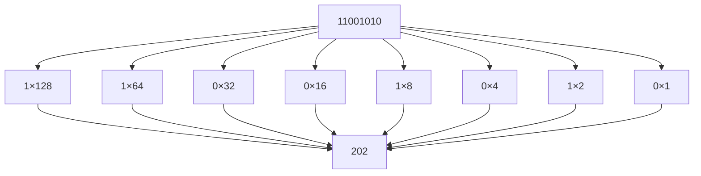
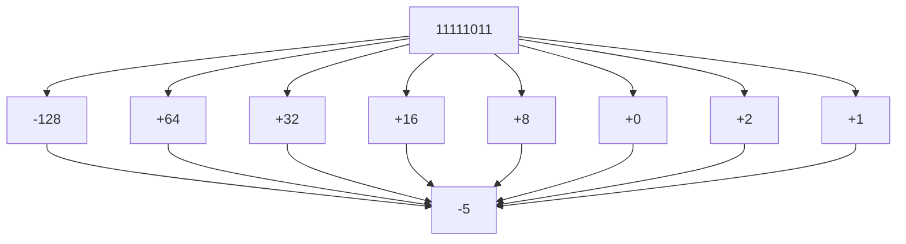
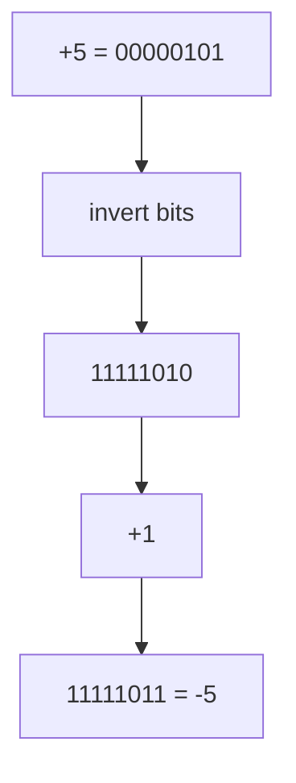
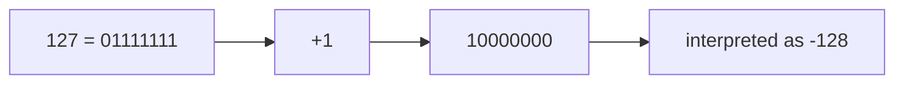
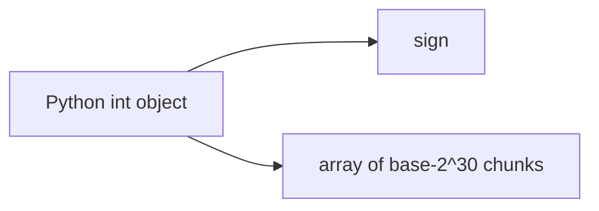
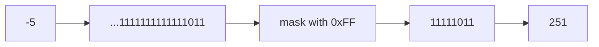

# Integer Representation

!!! tip "Mental Model"
    In hardware, an integer is a fixed-width row of bits -- like an odometer with a set number of digits. Once all digits roll over, the value wraps around (overflow). Two's complement cleverly uses the highest bit as a sign indicator, letting the same addition circuitry handle both positive and negative numbers. Python sidesteps the overflow problem entirely by using arbitrary-precision integers that grow as large as memory allows.

Computers represent integers using **binary numbers stored in fixed-width memory**. The exact representation depends on the programming environment.

Most programming languages and hardware systems use **fixed-width two’s complement integers**, while Python uses **arbitrary-precision integers** that grow dynamically as needed.

Understanding these representations is important for:

* preventing **overflow bugs**
* reasoning about **memory usage**
* understanding **bitwise operations**
* working with **NumPy and low-level code**

This chapter explains how integers are represented in hardware, how two’s complement works, and how Python’s integer implementation differs.

---

## 1. Unsigned Integers

The simplest integer representation is an **unsigned integer**.

An **n-bit unsigned integer** stores values using standard binary positional notation.

[
\text{value} = \sum_{i=0}^{n-1} b_i 2^i
]

where each (b_i) is either 0 or 1.

---

### Range of unsigned integers

Because each bit has two possible states, an (n)-bit value has:

[
2^n
]

possible patterns.

Therefore the range is:

[
0 \text{ to } 2^n - 1
]

Examples:

| Bits   | Range                        |
| ------ | ---------------------------- |
| 8-bit  | 0–255                        |
| 16-bit | 0–65535                      |
| 32-bit | 0–4,294,967,295              |
| 64-bit | 0–18,446,744,073,709,551,615 |

---

### Example

Consider the 8-bit number:

```text
11001010
```

[
1\cdot128 + 1\cdot64 + 0\cdot32 + 0\cdot16 + 1\cdot8 + 0\cdot4 + 1\cdot2 + 0\cdot1
]

[
= 202
]

---

#### Visualization



Unsigned integers cannot represent negative numbers.

To store signed values efficiently, computers use **two’s complement representation**.

---

## 2. Signed Integers and Two’s Complement

Modern hardware almost universally uses **two’s complement** to represent signed integers.

Two’s complement provides two important advantages:

1. **Addition hardware works for both signed and unsigned values**
2. **Zero has only one representation**

---

### Range of two’s complement integers

For an (n)-bit signed integer:

[
-2^{n-1} \le x \le 2^{n-1}-1
]

Example ranges:

| Bits   | Range                           |
| ------ | ------------------------------- |
| 8-bit  | -128 to 127                     |
| 16-bit | -32768 to 32767                 |
| 32-bit | -2,147,483,648 to 2,147,483,647 |

---

### Bit weights in two’s complement

In an 8-bit signed integer, the leftmost bit has a **negative weight**.

| Bit   | Value |
| ----- | ----- |
| (b_7) | −128  |
| (b_6) | 64    |
| (b_5) | 32    |
| (b_4) | 16    |
| (b_3) | 8     |
| (b_2) | 4     |
| (b_1) | 2     |
| (b_0) | 1     |

---

### Example: interpreting a value

Consider:

```text
11111011
```

Compute:

[
-128 + 64 + 32 + 16 + 8 + 0 + 2 + 1
]

[
= -5
]

So:

```text
11111011 = -5
```

---

#### Visualization



---

## 3. Negating Numbers in Two’s Complement

To compute the negative of a number in fixed-width binary:

1. invert all bits
2. add 1

---

### Example: represent −5 in 8 bits

Start with +5:

```text
00000101
```

Invert bits:

```text
11111010
```

Add 1:

```text
11111011
```

Result:

```text
-5 = 11111011
```

---

#### Visualization



---

## 4. Why Two’s Complement Works

Two’s complement enables subtraction to be performed using **addition hardware**.

Instead of computing:

[
a - b
]

the hardware computes:

[
a + (-b)
]

Because negation is easy (invert bits + add 1), subtraction becomes simple.

---

### Example

Compute:

[
7 - 3
]

Binary form:

```text
7 = 00000111
3 = 00000011
```

Compute −3:

```text
11111101
```

Add:

```text
 00000111
+11111101
---------
 00000100
```

Result:

```text
4
```

The carry beyond the leftmost bit is discarded.

---

## 5. Overflow in Fixed-Width Integers

Hardware integers have **fixed width**.

If a computation produces a value outside the representable range, the result **wraps around**.

Mathematically, arithmetic occurs **modulo (2^n)**.

---

### Example: 8-bit overflow

Maximum signed value:

```text
127 = 01111111
```

Add 1:

```text
 01111111
+00000001
---------
 10000000
```

But:

```text
10000000 = -128
```

So the value wraps.

---

#### Visualization



Overflow occurs silently in many programming environments.

---

## 6. NumPy and Fixed-Width Integers

Libraries like **NumPy** use fixed-width integer types.

Examples include:

| dtype   | size    |
| ------- | ------- |
| `int8`  | 1 byte  |
| `int16` | 2 bytes |
| `int32` | 4 bytes |
| `int64` | 8 bytes |

Because these types follow hardware behavior, **overflow wraps around silently**.

---

### Example: overflow in NumPy

```python
import numpy as np

x = np.int8(127)
print(x + 1)
```

Output:

```text
-128
```

The value wraps because the maximum 8-bit signed integer is 127.

---

## 7. Python Integers

Python integers behave differently.

Python uses **arbitrary-precision integers**, meaning the number of bits expands automatically when needed.

As a result:

* Python integers **never overflow**
* integer size grows dynamically
* operations may require more memory and time

Example:

```python
print(2 ** 1000)
```

This produces a very large integer without overflow.

---

## 8. How Python Stores Integers

Internally, Python stores integers as:

* a **sign**
* a variable-length array of digits

Each digit stores **30 bits of the number**.

Conceptually:



This design allows Python integers to grow without limit.

However, it also means Python integers consume more memory than fixed-width integers.

---

## 9. Memory Comparison

Small Python integers require around **28 bytes of memory**.

Fixed-width integers are much smaller.

Example:

```python
import sys
import numpy as np

print(sys.getsizeof(42))
print(np.int64(42).nbytes)
print(np.int8(42).nbytes)
```

Typical results:

| Type         | Memory    |
| ------------ | --------- |
| Python `int` | ~28 bytes |
| `np.int64`   | 8 bytes   |
| `np.int8`    | 1 byte    |

---

## 10. Bitwise Operations on Python Integers

Python simulates **infinite-width two’s complement arithmetic** for bitwise operations.

This means negative numbers behave as if they have infinitely many leading **1 bits**.

Example:

```python
print(bin(-5))
```

Output:

```text
-0b101
```

But internally Python behaves as if:

```text
...1111111111111111111111111011
```

---

### Example: masking

```python
-5 & 0xFF
```

Result:

```text
251
```

Explanation:

```text
11111011 (8-bit two's complement)
```

This is the unsigned representation of −5.

---

#### Visualization



---

## 11. Choosing the Right Integer Type

Different situations require different integer representations.

#### Python integers

Advantages:

* no overflow
* simple arithmetic
* arbitrary precision

Disadvantages:

* larger memory usage
* slower for large arrays

---

#### NumPy integers

Advantages:

* compact
* fast vectorized operations
* predictable memory layout

Disadvantages:

* overflow wraps silently
* range must be chosen carefully

---

### Example: incorrect dtype

```python
import numpy as np

prices = np.array([30000, 35000, 40000], dtype=np.int16)
print(prices)
```

Output:

```text
[30000 -30536 -25536]
```

The values exceed the `int16` maximum of **32767**.

Correct solution:

```python
prices = np.array([30000, 35000, 40000], dtype=np.int32)
```

---

## 12. Worked Examples

#### Example 1

Interpret `11111110` as an 8-bit signed integer.

[
-128 + 64 + 32 + 16 + 8 + 4 + 2 + 0 = -2
]

---

#### Example 2

Represent −12 in 8-bit two’s complement.

1. Write 12:

```text
00001100
```

2. Invert:

```text
11110011
```

3. Add 1:

```text
11110100
```

---

#### Example 3

Detect overflow.

```text
120 + 20
```

In 8-bit signed arithmetic:

```text
120 = 01111000
20  = 00010100
```

Sum:

```text
10001100
```

This equals **−116**, showing overflow.

---

## 13. Exercises

1. What is the range of a 12-bit unsigned integer?
2. What is the range of a 12-bit two’s complement integer?
3. Interpret `11110110` as an 8-bit signed integer.
4. Represent −9 using 8-bit two’s complement.
5. What happens when `np.int8(120) + np.int8(20)` is computed?
6. Why does Python never overflow on integer arithmetic?
7. How many bytes does an `np.int32` use?
8. Why does two’s complement simplify hardware design?

---

**Exercise 9.**
In two’s complement, there is an asymmetry: an 8-bit signed integer can represent $-128$ but only $+127$. Explain *why* this asymmetry exists by reasoning about the bit patterns. What happens if you try to negate $-128$ using the "invert bits and add 1" rule? What bit pattern do you get, and what does it mean? Why is there no positive counterpart to the most negative value?

??? success "Solution to Exercise 9"
    In 8-bit two's complement, the bit patterns `00000000` through `01111111` represent $0$ through $127$ (128 non-negative values), and `10000000` through `11111111` represent $-128$ through $-1$ (128 negative values). The total is $256 = 2^8$ patterns.

    The asymmetry arises because zero uses one of the non-negative patterns (`00000000`), leaving only 127 positive values but 128 negative values.

    Negating $-128$ (`10000000`): invert bits gives `01111111`, add 1 gives `10000000` -- which is $-128$ again. The negation maps $-128$ back to itself. This means $-(-128) = -128$ in 8-bit arithmetic, which is an overflow -- the mathematical result $+128$ is outside the representable range $[-128, 127]$.

    There is no positive counterpart because $+128$ requires 8 bits for the magnitude alone (`10000000`), but the sign bit occupies that position. The most negative value is "alone" at the extreme end of the range.

---

**Exercise 10.**
Python integers never overflow because they have arbitrary precision. But this comes at a cost. Consider this comparison:

```python
import sys
import numpy as np

py_int = 42
np_int = np.int64(42)
print(sys.getsizeof(py_int))  # ?
print(np_int.itemsize)         # ?
```

Predict the output. Then explain: *why* does a Python `int` storing the value `42` need so much more memory than a NumPy `int64`? What extra information does the Python object store beyond the numeric value? How does this relate to Python’s "everything is an object" philosophy?

??? success "Solution to Exercise 10"
    Typical output:

    ```text
    28
    8
    ```

    A Python `int` storing `42` uses **28 bytes** while a NumPy `int64` uses only **8 bytes**.

    The Python `int` requires more memory because it is a full Python object. Every Python object carries:

    - **Reference count** (8 bytes) -- for garbage collection
    - **Type pointer** (8 bytes) -- pointer to the `int` type object
    - **Object size/digit count** (variable) -- for arbitrary-precision support
    - **The actual numeric data** (at least 4 bytes for small values)

    This overhead exists because Python treats *everything* as an object. The integer `42` is not just a value -- it is an object with an identity, a type, a reference count, and methods. This enables Python's uniform object model (you can call `(42).bit_length()`, pass integers to generic functions, etc.) but costs substantial memory per value.

    NumPy's `int64` stores only the raw 8-byte value with no per-element object overhead, which is why NumPy arrays are dramatically more memory-efficient for large datasets.

---

**Exercise 11.**
A programmer writing C-style code in Python does the following to extract the sign of a number:

```python
def sign_bit(x):
    return (x >> 31) & 1
```

This works in C for 32-bit signed integers (the sign bit is bit 31). Explain why this approach is **fundamentally broken** in Python, even for numbers that fit in 32 bits. What does Python’s `>>` operator do with negative numbers, and how does Python’s model of "infinite-width two’s complement" affect the result of right-shifting?

??? success "Solution to Exercise 11"
    In C, a 32-bit signed integer has exactly 32 bits, so bit 31 is the sign bit. Right-shifting by 31 positions brings the sign bit to position 0, and masking with `& 1` extracts it.

    In Python, integers have **no fixed bit width**. Python models negative numbers as having infinitely many leading 1-bits (conceptual infinite-width two's complement). So for `-1`:

    ```python
    print((-1) >> 31)  # -1, not 1!
    ```

    Right-shifting a negative Python integer by any amount still produces a negative number, because Python performs **arithmetic right shift** -- it fills from the left with the sign bit (which is `1` for negative numbers). Shifting `-1` right by 31 gives `-1` (all 1-bits, shifted, still all 1-bits). Then `(-1) & 1` gives `1`, which happens to be correct for `-1` but the intermediate value is wrong.

    For `-5`, `(-5) >> 31` gives `-1` (not `0` or `1`), and `(-1) & 1` gives `1`. But for `5`, `(5) >> 31` gives `0`, and `0 & 1` gives `0`. The function seems to "work" for some cases by coincidence, but it is conceptually wrong -- it returns `1` for **all** negative numbers and `0` for **all** non-negative numbers, which is not the same as extracting "bit 31" (a concept that does not exist for arbitrary-precision integers).

---

**Exercise 12.**
Consider the expression `-5 & 0xFF` in Python, which produces `251`. Explain step by step what Python is doing internally. Why does masking a negative Python integer with `0xFF` give the same result as the 8-bit unsigned two’s complement representation? How does Python’s "conceptually infinite leading 1-bits" model for negative integers make this work?

??? success "Solution to Exercise 12"
    Python models negative integers as if they have infinitely many leading 1-bits. Conceptually, `-5` in Python behaves as:

    ```text
    ...11111111111111111111111111111011
    ```

    The operation `& 0xFF` masks all bits except the lowest 8:

    ```text
    ...11111111111111111111111111111011
    &  00000000000000000000000011111111
    =  00000000000000000000000011111011
    ```

    The result `11111011` in binary is `251` in unsigned decimal.

    This gives the same result as 8-bit two's complement because that is exactly how two's complement works: $-5$ in 8-bit two's complement is $256 - 5 = 251$, stored as `11111011`. Python's infinite-width model is simply the limit of $n$-bit two's complement as $n \to \infty$. Masking with `0xFF` "truncates" the infinite representation to 8 bits, recovering the standard 8-bit two's complement pattern.

    This is why `value & 0xFF` is the standard Python idiom for converting a signed integer to its unsigned $n$-bit representation.

---

## 14. Short Answers

1. (0) to (4095)
2. −2048 to 2047
3. −10
4. `11110111`
5. Overflow occurs and the value wraps
6. Python integers expand dynamically
7. 4 bytes
8. Addition hardware works for both positive and negative numbers

## 15. Summary

* **Unsigned integers** represent values from (0) to (2^n - 1).
* **Two’s complement** is the standard signed representation used in hardware.
* Signed integers range from (−2^{n−1}) to (2^{n−1} − 1).
* Negation is performed by **inverting bits and adding 1**.
* Fixed-width integers can **overflow**, wrapping around modulo (2^n).
* **NumPy integers** follow hardware behavior and may overflow silently.
* **Python integers** use arbitrary precision and never overflow, but require more memory.

Understanding integer representation is essential for reasoning about **overflow, bitwise operations, memory efficiency, and numerical correctness** in software systems.

## Exercises

**Exercise 1.** In two's complement representation using 8 bits, what is the range of representable integers.

??? success "Solution to Exercise 1"
    With 8 bits in two's complement, the range is -128 to 127. The most significant bit is the sign bit: 0 for non-negative, 1 for negative. The minimum value is 10000000 = -128, and the maximum is 01111111 = 127.

---

**Exercise 2.** Explain what integer overflow is and give an example with 8-bit unsigned integers.

??? success "Solution to Exercise 2"
    Integer overflow occurs when an arithmetic operation produces a result outside the representable range. With 8-bit unsigned integers (range 0-255), adding 200 + 100 = 300, but 300 cannot be stored in 8 bits. The result wraps around: 300 mod 256 = 44. This can cause subtle bugs in programs.

