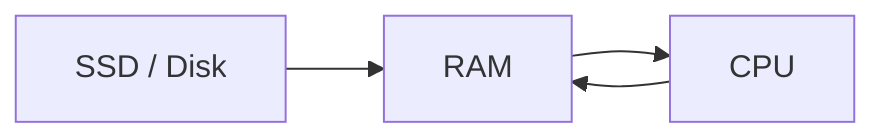
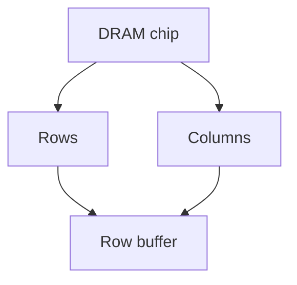
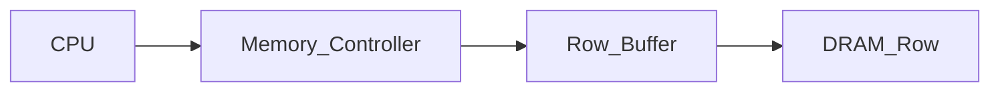
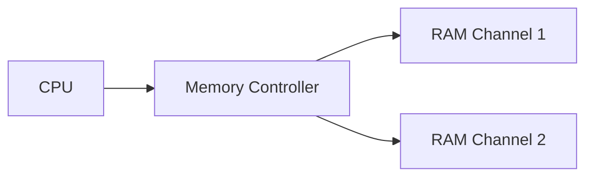
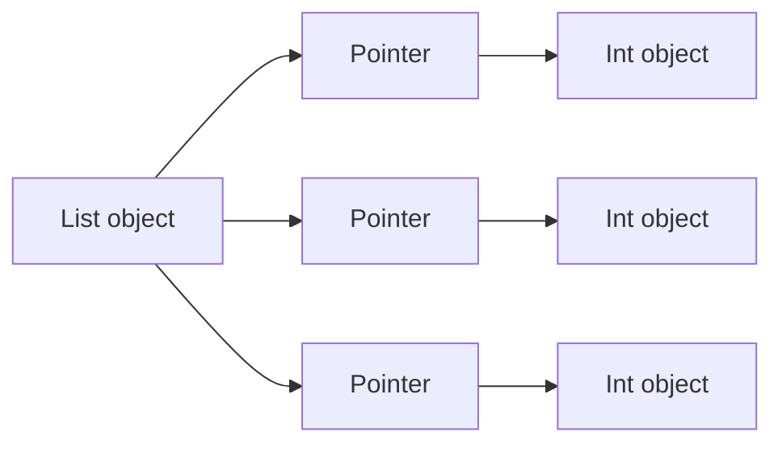
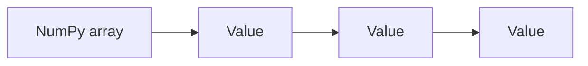

# RAM (Main Memory)

!!! tip "Mental Model"
    RAM is the computer's large scratch pad -- big enough to hold all the programs and data currently in use, but wiped clean the moment power is cut. Every running program lives in RAM: code, variables, stacks, and heap objects all reside here. RAM is fast compared to disk but slow compared to cache, so it often becomes the bottleneck for data-heavy Python workloads.

**RAM (Random Access Memory)** is the main working memory of a computer. It stores the programs currently running on the system as well as the data they operate on.

Unlike registers and caches, which are small and extremely fast, RAM is much larger but significantly slower. Despite this latency, RAM provides the capacity needed for large datasets and complex applications.

For many numerical programs—especially those written in Python—**memory bandwidth and latency** become the primary performance bottlenecks rather than CPU speed.

---

## 1. What RAM Stores

RAM contains all active components of a running system.

Examples include:

* program instructions
* application data
* operating system structures
* stack and heap memory
* dynamically allocated objects

When a program starts, its executable code and data are loaded from disk into RAM. The CPU then reads instructions and data from RAM during execution.

---

#### Data flow in a running program



Programs constantly move data between the CPU and RAM.

---

## 2. Volatile Memory

RAM is **volatile memory**, meaning its contents disappear when power is lost.

This contrasts with **non-volatile storage**, such as SSDs or hard drives, which retain data permanently.

| Storage Type | Volatile | Example        |
| ------------ | -------- | -------------- |
| Registers    | Yes      | CPU registers  |
| Cache        | Yes      | L1/L2/L3 cache |
| RAM          | Yes      | DRAM           |
| Disk         | No       | SSD / HDD      |

Because RAM is volatile, programs must periodically save important data to persistent storage.

---

## 3. DRAM: How RAM Stores Bits

Modern main memory uses **DRAM (Dynamic Random Access Memory)**.

Each bit is stored as **electric charge in a capacitor**.

The capacitor either:

* contains charge → **1**
* has no charge → **0**

---

#### DRAM cell structure

A DRAM cell consists of:

* one capacitor
* one transistor


Because capacitors slowly leak charge, DRAM must periodically **refresh** all stored bits.

---

## 4. Refresh Cycles

DRAM cells lose their stored charge over time.

To maintain correct values, memory controllers refresh each cell periodically.

Typical refresh interval:

```text
~64 milliseconds
```

During a refresh operation, the stored charge is read and rewritten.

Although refresh operations occur frequently, they are scheduled in a way that minimizes performance impact.

---

## 5. DRAM Organization

DRAM chips are organized internally as large **two-dimensional arrays**.

Memory cells are arranged in rows and columns.

To access memory, the controller:

1. selects a row
2. selects a column within that row

---

#### DRAM structure visualization



The row buffer temporarily holds an entire row of memory cells.

---

## 6. Row Buffers and Memory Access

DRAM accesses occur in two stages:

1. **row activation**
2. **column access**

When a row is activated, the entire row is loaded into the **row buffer**.

Subsequent accesses to the same row can be performed quickly.

---

### Row hit vs row miss

| Event    | Description                  | Latency    |
| -------- | ---------------------------- | ---------- |
| Row hit  | requested row already open   | ~20 ns     |
| Row miss | different row must be opened | ~80–120 ns |

Row misses are slower because the controller must:

1. close the current row
2. activate a new row
3. read the requested column

---

#### Visualization



Row hits reuse the data already in the row buffer.

---

## 7. Memory Latency vs CPU Speed

RAM access is much slower than CPU operations.

Typical values:

| Operation       | Time       |
| --------------- | ---------- |
| CPU cycle       | ~0.3 ns    |
| L1 cache access | ~1 ns      |
| L3 cache access | ~12 ns     |
| RAM access      | ~80–120 ns |

A RAM access may take **hundreds of CPU cycles**.

This gap between CPU speed and memory speed is called the **memory wall**.

---

## 8. DDR Memory

Modern RAM modules use **DDR (Double Data Rate)** technology.

DDR memory transfers data **twice per clock cycle**:

* once on the rising edge
* once on the falling edge

This doubles effective bandwidth without increasing clock frequency.

---

### DDR generations

| Generation | Transfer Rate | Bandwidth (per channel) |
| ---------- | ------------- | ----------------------- |
| DDR4       | ~3200 MT/s    | ~25 GB/s                |
| DDR5       | ~6400 MT/s    | ~50 GB/s                |

(MT/s = million transfers per second)

---

## 9. Memory Channels

Modern CPUs support multiple **memory channels**.

Each channel provides an independent data path between RAM and the memory controller.

---

### Example configurations

| Configuration  | Effective bandwidth |
| -------------- | ------------------- |
| Single channel | 25 GB/s             |
| Dual channel   | ~50 GB/s            |
| Quad channel   | ~100 GB/s           |

Multiple channels allow the CPU to read from several RAM modules simultaneously.

---

#### Visualization



More channels increase total bandwidth.

---

## 10. Python Memory Layout

In Python, most data structures allocate objects on the **heap**.

Each object includes metadata such as:

* type information
* reference counts
* memory management fields

This overhead makes Python objects significantly larger than raw data values.

---

### Example

```python
import sys

print(sys.getsizeof(42))
```

Typical result:

```text
28 bytes
```

Even though the integer value itself requires only 4–8 bytes.

---

### Python lists

A Python list stores **pointers to objects**, not the objects themselves.

Example:

```python
lst = [1, 2, 3]
```

Memory structure:

```text
list → pointer → object
```

---

#### Visualization



This layout scatters elements throughout memory, reducing cache efficiency.

---

## 11. NumPy and Memory Efficiency

NumPy arrays store values as **raw contiguous memory blocks**.

Example:

```python
import numpy as np

arr = np.zeros(125_000_000, dtype=np.float64)
```

Each element occupies exactly **8 bytes**.

Total memory:

```text
125,000,000 × 8 = 1,000,000,000 bytes
```

or about:

```text
1 GB
```

---

#### Visualization



Because the values are stored consecutively, NumPy arrays are both:

* **more memory efficient**
* **more cache friendly**

---

## 12. Memory-Mapped Files

Sometimes datasets are larger than available RAM.

In these cases, programs can use **memory-mapped files**.

Memory mapping allows files on disk to appear as arrays in memory.

The operating system automatically loads pages of the file when needed.

---

### Example

```python
import numpy as np

mmap_arr = np.memmap(
    "large_array.dat",
    dtype="float64",
    mode="w+",
    shape=(100_000_000,)
)

mmap_arr[0] = 42.0
print(mmap_arr[0])
```

The OS transparently swaps data between disk and RAM.

---

#### Visualization


This allows programs to work with datasets larger than physical memory.

---

## 13. Worked Examples

#### Example 1

How many float64 values fit in 1 GB?

[
1,000,000,000 / 8 = 125,000,000
]

---

#### Example 2

Why is RAM slower than cache?

DRAM requires row activation and capacitor refresh, while caches use fast SRAM cells.

---

#### Example 3

Explain why Python lists use more memory than NumPy arrays.

Python lists store pointers to separate objects, while NumPy arrays store raw values contiguously.

---

## 14. Exercises

1. What does RAM store?
2. Why is RAM called volatile memory?
3. What technology is used in modern main memory?
4. Why must DRAM refresh its contents?
5. What is a row buffer?
6. What is the difference between a row hit and a row miss?
7. What does DDR stand for?
8. Why are NumPy arrays more memory efficient than Python lists?

---

**Exercise 9.**
RAM is volatile (data disappears when power is lost), while SSDs and HDDs are non-volatile. Yet we always load programs from storage into RAM before executing them. Explain *why* the CPU cannot simply execute programs directly from an SSD. What fundamental property of RAM (random access latency, addressability, and speed) makes it essential as working memory, even though it loses data on power loss?

??? success "Solution to Exercise 9"
    The CPU cannot execute programs directly from an SSD for several reasons:

    1. **Latency**: Even the fastest NVMe SSDs have access latencies of ~10--100 microseconds, while RAM access takes ~50--100 nanoseconds -- roughly 100--1000x faster. The CPU needs to fetch instructions every few nanoseconds; waiting for an SSD on every instruction fetch would make execution thousands of times slower.

    2. **Byte-addressability**: RAM is byte-addressable -- the CPU can read or write any individual byte. SSDs operate in blocks (typically 4 KB pages); reading a single byte requires reading an entire page. The CPU's instruction fetch and data access patterns require fine-grained random access.

    3. **Read/write symmetry**: RAM allows equally fast reads and writes to any address. SSDs have asymmetric performance (writes are slower than reads) and limited write endurance. Program execution involves constant writes (stack frames, variable updates, etc.) that would quickly wear out flash memory.

    RAM serves as the essential intermediary because it provides the speed, granularity, and read/write symmetry that CPU execution demands, while storage provides the persistence and capacity for long-term data retention.

---

**Exercise 10.**
A programmer has a Python program that creates a list of 100 million `float` values. Each Python `float` object uses about 24 bytes, and each list pointer uses 8 bytes, for a total of roughly 3.2 GB. Their machine has 4 GB of RAM. Explain what happens as this list is being built: at what point does the program's behavior change, and what mechanism does the operating system use to keep the program running? What would be the performance consequence, and how would switching to a NumPy `float64` array change the situation?

??? success "Solution to Exercise 10"
    As the list is built, Python allocates memory for each `float` object and the list's internal pointer array. Initially, the OS provides physical RAM pages for each virtual memory allocation. Around 3--3.5 GB of consumption (depending on OS overhead), physical RAM is exhausted.

    At this point, the OS's **virtual memory system** intervenes: it begins **swapping** -- moving least-recently-used pages from RAM to the swap space on disk. The program continues running, but now some memory accesses trigger **page faults**: the CPU tries to access data that has been swapped to disk, and the OS must load it back into RAM (evicting something else). This causes a dramatic slowdown -- disk access is ~100,000x slower than RAM access.

    If the access pattern is sequential, swapping may be tolerable. But building and later iterating over a large list involves scattered object allocations, causing frequent page faults (**thrashing**).

    Switching to `np.zeros(100_000_000, dtype=np.float64)` would use only $100{,}000{,}000 \times 8 = 800$ MB -- a single contiguous block, well within 4 GB. No swapping occurs, and the contiguous layout ensures efficient sequential access.

---

**Exercise 11.**
DRAM must be refreshed thousands of times per second because capacitors leak charge. This refresh process temporarily blocks normal memory access. Explain why this design trade-off (using capacitors that leak) was chosen over a more stable storage technology like SRAM (which uses flip-flops and does not need refresh). Consider cost, density, and the role of RAM in the memory hierarchy.

??? success "Solution to Exercise 11"
    DRAM uses one capacitor and one transistor per bit, while SRAM uses six transistors per bit. This makes DRAM roughly **6x denser** and significantly cheaper per bit.

    The trade-off is deliberate given RAM's role in the memory hierarchy:

    - **Capacity is critical**: RAM must be large enough to hold active programs and data (typically 8--64 GB in modern systems). At SRAM's density and cost, this much memory would be prohibitively expensive.
    - **SRAM is used where speed matters most**: L1 and L2 caches ARE SRAM -- small (KB to MB) but extremely fast and needing no refresh.
    - **Refresh overhead is tolerable**: Refresh consumes only ~1--5% of total memory bandwidth, a small price for the 6x density advantage.

    The hierarchy exploits this: SRAM for the small-but-fast cache levels, DRAM for the large-but-slower main memory level. Each technology is used where its trade-offs are optimal.

---

**Exercise 12.**
Modern systems use multiple memory channels (dual-channel, quad-channel) to increase memory bandwidth. Explain why simply making a single channel wider (e.g., doubling the bus width) is not equivalent to having two independent channels. What types of memory access patterns benefit most from multiple channels, and why?

??? success "Solution to Exercise 12"
    A wider single channel increases the data transferred per transaction but is still limited to **one address at a time**. After each data transfer, the channel must receive a new address, perform a row activation (if needed), and then transfer data. The channel's command/address bus becomes the bottleneck.

    Two independent channels can **service two different memory addresses simultaneously**. While channel A is performing a row activation, channel B can be transferring data. This concurrency is the key advantage -- it is parallelism, not just wider bandwidth.

    Access patterns that benefit most from multiple channels:

    - **Multiple independent streams**: Two threads accessing different memory regions can be served in parallel by different channels.
    - **Interleaved access**: Memory controllers typically interleave addresses across channels, so sequential access to a large array automatically distributes requests across channels.
    - **Mixed read/write patterns**: One channel can handle reads while another handles writes.

    A single sequential stream benefits less, because consecutive addresses may map to the same channel, causing the other channel to idle. The benefit is maximized when memory requests target diverse addresses.

---

## 15. Short Answers

1. Active programs and data
2. Data is lost when power is removed
3. DRAM
4. Capacitors leak charge over time
5. Temporary storage for a DRAM row
6. Row hit uses open row; row miss opens a new row
7. Double Data Rate
8. NumPy stores contiguous raw values

## 16. Summary

* **RAM** is the main working memory of a computer.
* Modern systems use **DRAM**, which stores bits as electrical charge in capacitors.
* DRAM requires periodic **refresh cycles**.
* Memory accesses depend on **row buffers**, where row hits are faster than row misses.
* RAM latency is far slower than CPU execution speed.
* **DDR technology** increases memory bandwidth by transferring data twice per clock cycle.
* Multiple **memory channels** increase total bandwidth.
* Python objects have large per-object overhead, while **NumPy arrays store raw contiguous data**.
* Techniques such as **memory mapping** allow programs to work with datasets larger than RAM.

Understanding RAM behavior is crucial for building **efficient data-intensive programs and numerical applications**.

## Exercises

**Exercise 1.** Explain the difference between SRAM and DRAM.

??? success "Solution to Exercise 1"
    SRAM uses flip-flop circuits (6 transistors per bit) and does not need refreshing, making it faster but more expensive. DRAM stores each bit as a charge on a capacitor (1 transistor + 1 capacitor per bit) and must be refreshed periodically, making it cheaper but slower. SRAM is used for CPU caches; DRAM is used for main memory.

---

**Exercise 2.** Why does RAM lose its contents when power is removed.

??? success "Solution to Exercise 2"
    Both SRAM and DRAM are volatile. DRAM capacitors discharge when unpowered, and SRAM flip-flops lose their state. Non-volatile storage (SSDs, HDDs) uses different physical mechanisms (charge trapping in flash cells, magnetic domains on platters) that persist without power.

