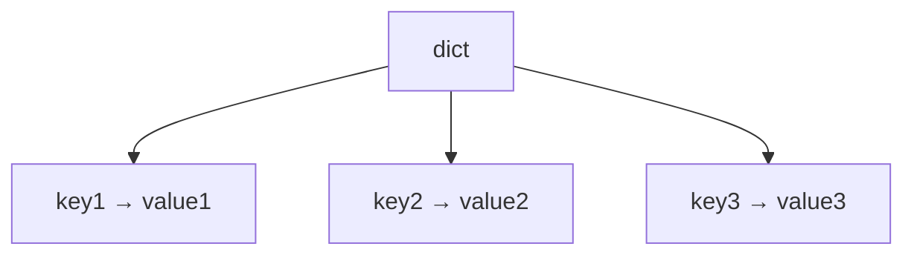

# Dictionaries

A `dict` is a **mapping** from keys to values.

Unlike sequences, dictionaries are organized by keys rather than by numeric positions. Each key maps to a corresponding value.

```python
student = {
    "name": "Alice",
    "age": 25,
    "major": "math"
}
```

Since Python 3.7, dictionaries maintain insertion order.



!!! tip "Mental Model"
    A dictionary is a lookup table: you provide a key and instantly get the associated value, like finding a word in a dictionary to read its definition. Keys must be unique and hashable, but values can be anything. When you need to associate one piece of data with another, a dict is almost always the right choice.

---

## 1. Accessing Values

Dictionary values are accessed by key.

```python
student = {"name": "Alice", "age": 25}

print(student["name"])
print(student["age"])
```

Output:

```text
Alice
25
```

Accessing a missing key raises `KeyError`.

```python
user = {"name": "Alice"}
user["email"]
```

Output:

```text
KeyError: 'email'
```

Use `get()` when absence is possible. The two-argument form provides a default value.

```python
user = {"name": "Alice"}

print(user.get("email"))
print(user.get("email", "not provided"))
```

Output:

```text
None
not provided
```

---

## 2. Adding and Updating Entries

Dictionaries are mutable.

```python
student = {"name": "Alice"}
student["age"] = 25
student["name"] = "Bob"

print(student)
```

Output:

```text
{'name': 'Bob', 'age': 25}
```

The `update()` method merges entries from another dictionary.

```python
defaults = {"theme": "light", "volume": 50}
overrides = {"volume": 80, "lang": "en"}
defaults.update(overrides)

print(defaults)
```

Output:

```text
{'theme': 'light', 'volume': 80, 'lang': 'en'}
```

---

## 3. Dictionary Methods

Common dictionary methods include:

| Method          | Purpose                 |
| --------------- | ----------------------- |
| `keys()`        | view keys               |
| `values()`      | view values             |
| `items()`       | view key-value pairs    |
| `get(key)`      | safe lookup             |
| `pop(key)`      | remove and return value |
| `update(other)` | merge entries           |

Example:

```python
data = {"a": 1, "b": 2}

print(data.keys())
print(data.values())
```

Output:

```text
dict_keys(['a', 'b'])
dict_values([1, 2])
```

Note that `keys()` and `values()` return view objects, not lists. Wrap with `list()` if a list is needed.

---

## 4. Key Hashability Requirement

Like [set](sets.md) members, dictionary keys must be hashable. Strings, integers, and tuples can be keys; lists cannot.

```python
d = {}
d[[1, 2]] = "value"
```

Output:

```text
TypeError: unhashable type: 'list'
```

Hashing is covered in more detail in a later chapter.

---

## 5. Why Dictionaries Are Fast: O(1) Lookup

Dictionaries are one of Python's most important data structures because they support
**O(1) key lookup** — finding a value takes the same time whether the dictionary has
10 entries or 10 million.

To understand why, it helps to compare three approaches to finding something by name.

### Approach 1: scanning a list — O(n)

The simplest approach is a list of pairs searched from the start:
```python
phonebook = [("Alice", "010-1234"), ("Bob", "010-5678"), ("Charlie", "010-9999")]

def find(phonebook, name):
    for entry in phonebook:
        if entry[0] == name:
            return entry[1]

print(find(phonebook, "Charlie"))
```

Output:
```text
010-9999
```

To find "Charlie", Python checks Alice, then Bob, then Charlie. With a million entries,
finding the last one requires a million comparisons. Cost grows linearly with size: **O(n)**.

### Approach 2: binary search on a sorted list — O(log n)

If the list is sorted, Python can use binary search — repeatedly cutting the search
space in half:
```
["Alice", "Bob", "Charlie", "Diana", "Eve"]
  search "Diana": check middle ("Charlie") → too early → check right half
                  check middle ("Diana") → found
```

Much faster, but still *searching* — cost grows with size, just slowly: **O(log n)**.
A list of one million entries requires at most 20 comparisons.

### Approach 3: direct addressing — O(1)

The fastest possible lookup requires no searching at all. Consider a simple array
where position *is* the address:
```python
data = [None] * 5
data[2] = "Alice"

print(data[2])   # instant — no search, goes directly to position 2
```

Output:
```text
Alice
```

Regardless of array size, `data[2]` is always one step. This is **O(1)** — constant time.

### How dictionaries achieve O(1)

A dictionary applies this direct-addressing idea to arbitrary keys like strings and
integers. Internally, Python converts each key into a position, then stores and retrieves
the value at that position directly — no scanning, no searching.
```python
phonebook = {"Alice": "010-1234", "Bob": "010-5678", "Charlie": "010-9999"}

print(phonebook["Charlie"])   # goes directly to Charlie's slot — no search
```

Output:
```text
010-9999
```

The conversion from key to position is fast and fixed-cost regardless of dictionary
size. This is why lookup stays O(1) whether the dictionary has 10 entries or 10 million.

| Structure     | Strategy              | Cost     |
| ------------- | --------------------- | -------- |
| list          | scan from start       | O(n)     |
| sorted list   | binary search         | O(log n) |
| dict          | direct addressing     | O(1)     |

How Python converts a key like `"Alice"` into a position is the job of the **hash
function** — covered in detail in
Hashing and hash tables are covered in a later chapter.

---

## 6. Iterating Through Dictionaries

```python
person = {"name": "Alice", "age": 25}

for key, value in person.items():
    print(key, value)
```

Output:

```text
name Alice
age 25
```

This is one of the most common ways to traverse dictionary contents.

---

## 7. Worked Examples

### Example 1: store settings

```python
settings = {
    "theme": "dark",
    "volume": 80
}
print(settings["theme"])
```

Output:

```text
dark
```

### Example 2: safe lookup

```python
user = {"name": "Alice"}
print(user.get("email", "not provided"))
```

Output:

```text
not provided
```

### Example 3: update a value

```python
scores = {"math": 90}
scores["math"] = 95
print(scores)
```

Output:

```text
{'math': 95}
```

---

## 8. Common Pitfalls

### Accessing a missing key directly

As shown in Section 1, bracket access on a missing key raises `KeyError`. Use `get()` for safe access.

### Assuming numeric indexing works

Dictionaries are mappings, not position-based containers. `student[0]` does not return the first value — it looks for the key `0`.

```python
student = {"name": "Alice", "age": 25}
student[0]
```

Output:

```text
KeyError: 0
```

---


## 9. When to Use a Dictionary

Use a dictionary when:

- you need to associate **keys with values** (name → score, id → record)
- **fast lookup by key** is important --- O(1) average case
- the data is naturally structured as **key-value pairs** rather than a flat sequence

Use a list instead when data is accessed by position. Use a set when you only need membership testing without associated values.

---

## 10. Summary

Key ideas:

- dictionaries map keys to values
- values are accessed by keys, not positions
- dictionaries are mutable and maintain insertion order
- keys must be hashable --- lists cannot be keys
- dictionaries are designed for O(1) lookup

Dictionaries are one of Python's most powerful tools for representing structured information. Dictionary values can themselves be dictionaries — nested structures are covered in a later chapter. Dictionaries can also be built concisely using comprehensions — see [Comprehensions](comprehensions.md). This page follows [Sets](sets.md) in the composite data types section.


## Exercises

**Exercise 1.**
Lists cannot be used as dictionary keys, but tuples can. Explain *why* in terms of mutability and hashability. What would go wrong if Python allowed mutable objects as dictionary keys? Give a concrete scenario showing how a mutable key could "break" a dictionary.

??? success "Solution to Exercise 1"
    Dictionary keys must be **hashable** -- they must have a hash value that never changes during their lifetime. This is because dictionaries use a **hash table** internally: the key's hash determines where the key-value pair is stored.

    Mutable objects like lists cannot be hashable because their contents (and therefore their hash) could change after being used as a key. Consider:

    ```python
    # Hypothetical -- this would fail in Python
    key = [1, 2]
    d = {key: "value"}  # hash computed from [1, 2], stored at some position
    key.append(3)       # key is now [1, 2, 3] -- different hash!
    d[key]              # Python looks at the NEW hash position -- key not found!
    ```

    The key-value pair would be stored at a position determined by the hash of `[1, 2]`, but after mutation, looking up `[1, 2, 3]` computes a different hash, pointing to a different position. The entry becomes unreachable -- it is in the dictionary but can never be found. This would silently corrupt the dictionary.

    Tuples are immutable, so their hash never changes, making them safe keys.

---

**Exercise 2.**
Predict the output:

```python
d = {"a": 1, "b": 2, "c": 3}
print(d["a"])
print(d.get("z", 0))
print(d["z"])
```

What is the fundamental difference between bracket access and `.get()`? When should you use each?

??? success "Solution to Exercise 2"
    Output:

    ```text
    1
    0
    ```

    Then `d["z"]` raises a `KeyError` because `"z"` is not a key in `d`.

    - `d["a"]` uses **bracket access**: returns the value if the key exists, raises `KeyError` if it does not.
    - `d.get("z", 0)` uses **`.get()`**: returns the value if the key exists, returns the default value (`0`) if it does not. Never raises `KeyError`.

    Use bracket access when you are certain the key exists (or when a missing key indicates a bug that should raise an error). Use `.get()` when a missing key is a normal possibility and you want a default value. The choice communicates intent: bracket access says "this key must exist"; `.get()` says "this key might be absent."

---

**Exercise 3.**
Dictionaries provide O(1) average-case lookup. Explain *why* dictionaries are so much faster than searching a list for a value. What data structure does a dictionary use internally? Why does this require keys to be hashable?

??? success "Solution to Exercise 3"
    Searching a list for a value requires checking each element one by one -- **O(n)** time on average, where n is the length.

    A dictionary uses a **hash table**. When you access `d[key]`, Python:

    1. Computes `hash(key)` -- a constant-time operation
    2. Uses the hash to compute an index into an internal array
    3. Looks at that array position -- if the key matches, returns the value

    This is **O(1)** average time because the hash directly tells Python *where* to look, rather than scanning every entry.

    Keys must be hashable because the entire mechanism depends on computing a stable hash value. The hash must be deterministic (same key always gives the same hash) and consistent with equality (objects that are `==` must have the same hash). Mutable objects cannot guarantee this because their state (and thus their hash) could change.
