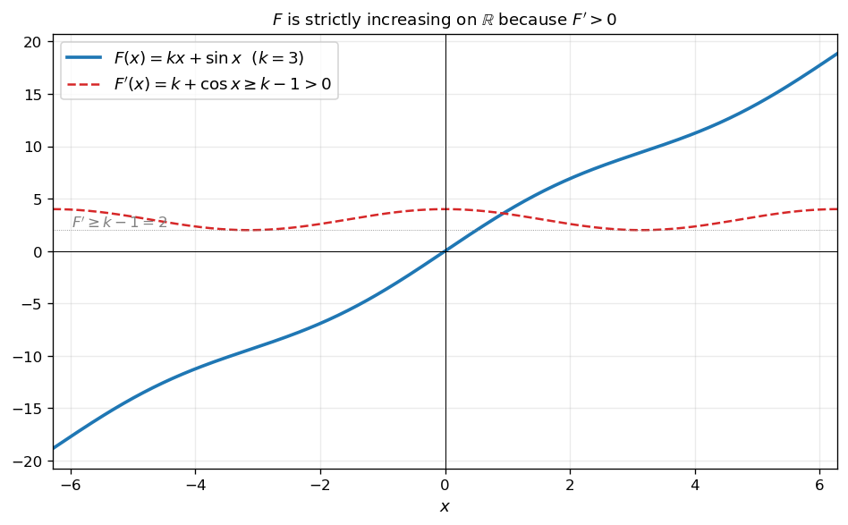
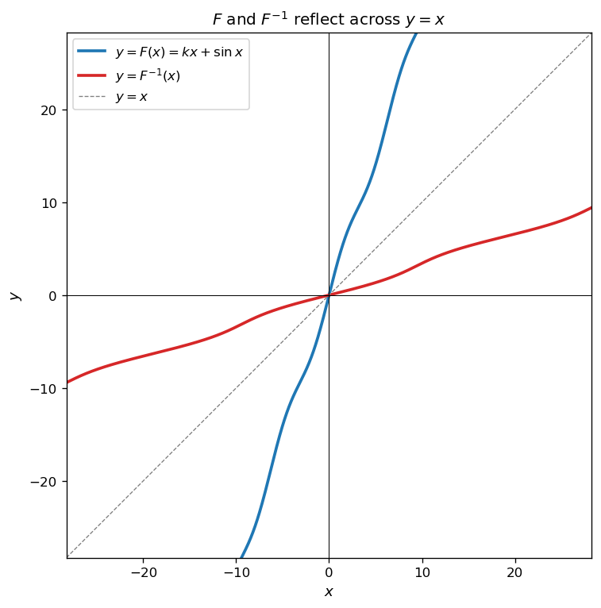
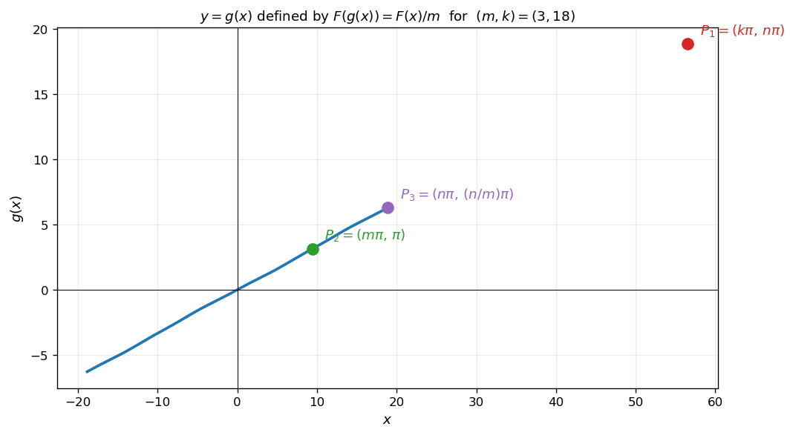
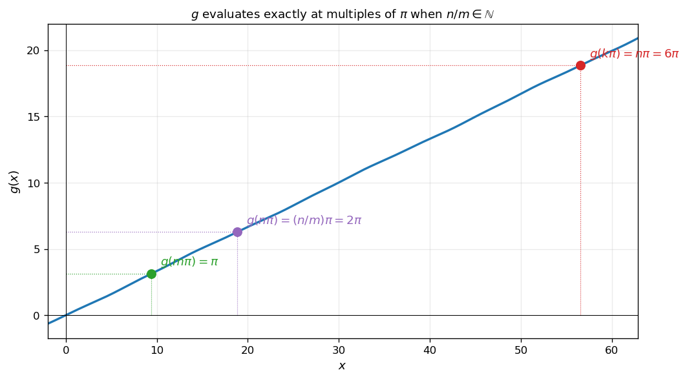
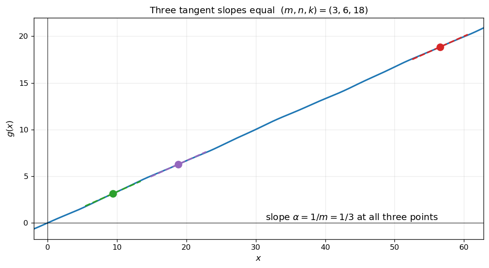
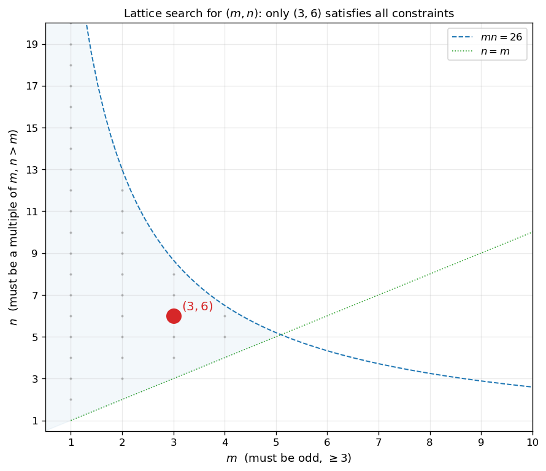

# 함수방정식과 접선

함수방정식 $F(g(x)) = \dfrac{F(x)}{m}$ 의 형태로 정의된 함수 $g(x)$ 의 접선의 기울기를 구하는 문제는 **음함수의 미분법**과 **모듈러스/홀짝성 분석**을 결합한다. 이 절에서는 $F$ 가 부정적분으로 주어진 정적분 함수일 때를 다룬다.

!!! note "사용 도구"
    1. **미적분학의 기본정리**: $F(x) = \displaystyle\int_0^x (k + \cos t)\,dt = kx + \sin x$ 이므로 $F'(x) = k + \cos x$.
    2. **음함수의 미분법**: $F(g(x)) = \dfrac{F(x)}{m}$ 의 양변을 $x$ 에 대하여 미분하면

        $$
        F'(g(x))\,g'(x) = \frac{F'(x)}{m}
        \quad\Longrightarrow\quad
        g'(x) = \frac{F'(x)}{m\,F'(g(x))}
        $$

    3. **삼각함수의 주기와 홀짝성**: 자연수 $j$ 에 대하여 $\sin(j\pi) = 0$ 그리고 $\cos(j\pi) = (-1)^j$.

---

## 보기 1: $F(x) = kx + \sin x$ 의 일대일성

자연수 $k \geq 1$ 에 대하여 $F(x) = kx + \sin x$ 는 어떤 함수인지 살펴보자. 미분하면

$$
F'(x) = k + \cos x \geq k - 1
$$

이고 $k \geq 2$ 이면 $F'(x) \geq 1 > 0$, $k = 1$ 이면 $F'(x) \geq 0$ 이며 등호는 $\cos x = -1$ 인 고립된 점들에서만 성립. 모두 **단조증가**하며, $\lim_{x \to \pm\infty} F(x) = \pm\infty$ 이므로 **$F$ 는 실수 전체 집합 위의 일대일대응**이다.

따라서 역함수 $F^{-1}$ 이 존재한다.

<figure markdown>
  { width=640 }
  <figcaption markdown>$k = 3$ 인 경우 $F$ (파란색) 와 $F'$ (빨간 점선). $F' \geq k - 1 = 2 > 0$ 이므로 $F$ 는 엄밀히 증가한다. 자연수 $k \geq 2$ 면 같은 결론이 성립.</figcaption>
</figure>

<figure markdown>
  { width=460 }
  <figcaption markdown>$F$ 와 그 역함수 $F^{-1}$ 는 $y = x$ 직선에 대하여 대칭. $F$ 가 단조증가이므로 어떤 실수도 $F(x)$ 의 값으로 정확히 한 번 등장하며, $F^{-1}$ 은 그 대응의 역방향을 준다.</figcaption>
</figure>

---

## 보기 2: 함수방정식 $F(g(x)) = F(x)/m$ 의 의미

위의 $F$ 와 자연수 $m$ 에 대하여 다음 함수방정식을 생각하자.

$$
F(g(x)) = \frac{F(x)}{m}
$$

$F$ 가 일대일대응이므로 $g(x) = F^{-1}\!\bigl(F(x)/m\bigr)$ 로 유일하게 결정되며, **$g$ 는 실수 전체 집합에서 정의되는 미분가능한 함수**이다.

특히 자연수 $j$ 에 대하여 $F(j\pi) = kj\pi + \sin(j\pi) = kj\pi$ 이므로

$$
F(g(j\pi)) = \frac{kj\pi}{m}
$$

**$j/m$ 이 자연수이면** 우변이 $k \cdot (j/m)\pi$ 가 되어 $g(j\pi) = (j/m)\pi$ 의 형태로 깔끔하게 떨어진다.

<figure markdown>
  { width=720 }
  <figcaption markdown>$(m, k) = (3, 18)$, $n = 6$ 일 때 함수방정식 $F(g(x)) = F(x)/m$ 의 해 $g(x)$. 세 표시점은 $P_1 = (k\pi, n\pi)$, $P_2 = (m\pi, \pi)$, $P_3 = (n\pi, (n/m)\pi)$. 모두 $\pi$ 의 정수배 격자점 위에 정확히 자리잡는다.</figcaption>
</figure>

!!! info "핵심 아이디어"
    **$F$ 의 일대일성 → $g$ 의 well-definedness → 미분으로 접선 기울기 추출.** $F$ 의 부정적분 구조에서 비롯되는 $F(j\pi) = kj\pi$ 라는 깔끔한 관계가, $\pi$ 의 정수배 격자점에서 $g$ 의 값을 명시적으로 구할 수 있게 해 준다.

---

## 연습문제

이 절의 연습문제는 자연수 $k, m, n$ 에 대하여 $F(x) = \displaystyle\int_0^x (k + \cos t)\,dt$ 와 함수방정식 $F(g(x)) = \dfrac{F(x)}{m}$ 로 정의된 연속함수 $g(x)$ 를 사용한다.

---

**연습문제 1.** $F$ 가 실수 전체 집합 위의 일대일대응임을 증명하고, 함수방정식 $F(g(x)) = F(x)/m$ 의 해 $g$ 가 모든 실수에 대하여 유일하게 존재하며 미분가능함을 보이시오. (단, $k \geq 1$, $m \geq 1$.)

??? success "연습문제 1 풀이"

    **단조증가성.** $F'(x) = k + \cos x$. $-1 \leq \cos x \leq 1$ 이므로 $F'(x) \geq k - 1 \geq 0$. $k \geq 2$ 면 $F' \geq 1 > 0$ 이므로 엄밀히 증가. $k = 1$ 이면 $F'(x) = 0$ 의 해는 $x = (2j+1)\pi$ ($j$ 정수) 인 고립점들이지만, 그 사이에서는 $F' > 0$ 이므로 여전히 엄밀히 증가.

    **치역.** $\lim_{x \to \infty} F(x) = \infty$, $\lim_{x \to -\infty} F(x) = -\infty$ 이며 연속이므로 중간값 정리에 의해 $F$ 의 치역은 $\mathbb{R}$ 전체. 단조증가 + 치역 $\mathbb{R}$ = **일대일대응**.

    **$g$ 의 유일성과 미분가능성.** $g(x) = F^{-1}(F(x)/m)$ 로 정의하면 $F$ 가 일대일대응이므로 우변은 $x$ 에 대하여 유일하게 결정된다. 또한 $F'(g(x)) > 0$ 이므로 역함수 정리에 의해 $F^{-1}$ 은 미분가능이고, 합성함수 미분으로 $g$ 도 미분가능 $\quad\square$

---

**연습문제 2.** [$g$ 의 값 계산] 자연수 $k, m, n$ 에 대하여 $k = mn$ 이고 $m < n$ 이라 하자. 다음을 보이시오.

(a) $g(k\pi) = n\pi$

(b) $g(m\pi) = \pi$

(c) $n/m$ 이 자연수이면 $g(n\pi) = (n/m)\pi$.

??? success "연습문제 2 풀이"

    임의의 자연수 $j$ 에 대하여 $F(j\pi) = k \cdot j\pi + \sin(j\pi) = kj\pi$.

    **(a)** $F(g(k\pi)) = F(k\pi)/m = k^2\pi/m = kn\pi$ (∵ $k = mn$, $k^2/m = kn$). 한편 $F(n\pi) = kn\pi$. $F$ 가 일대일대응이므로 $g(k\pi) = n\pi$.

    **(b)** $F(g(m\pi)) = F(m\pi)/m = km\pi/m = k\pi = F(\pi)$. 따라서 $g(m\pi) = \pi$.

    **(c)** $q = n/m$ 이 자연수일 때 $F(g(n\pi)) = F(n\pi)/m = kn\pi/m = kq\pi = F(q\pi)$. 따라서 $g(n\pi) = q\pi = (n/m)\pi$ $\quad\square$

    <figure markdown>
      { width=720 }
      <figcaption markdown>$(m, n, k) = (3, 6, 18)$ 인 경우 $g(x)$ 의 그래프. 세 색 점 $(m\pi, \pi)$, $(n\pi, 2\pi)$, $(k\pi, 6\pi)$ 모두 $\pi$ 의 정수배 격자점 위에 정확히 자리잡는다.</figcaption>
    </figure>

---

**연습문제 3.** [세 점에서의 접선 기울기가 모두 같을 조건] 자연수 $k, m, n$ 이

$$
k = m \times n,\quad m < n < k \leq 26
$$

일 때, 실수 전체의 집합에서 정의되는 함수 $g(x)$ 가 다음 조건을 만족시킨다.

!!! quote "조건"
    $F(x) = \displaystyle\int_0^x (k + \cos t)\,dt$ 일 때, 모든 실수 $x$ 에 대하여
    
    $$
    F(g(x)) = \frac{1}{m} F(x)
    $$

곡선 $y = g(x)$ 위의 점 $\mathrm{P}_1(k\pi, g(k\pi))$, $\mathrm{P}_2(m\pi, g(m\pi))$, $\mathrm{P}_3(n\pi, g(n\pi))$ 에서의 접선의 기울기가 모두 $\alpha$ 일 때, 실수 $\alpha$ 와 $k$ 의 값을 구하시오.

??? success "연습문제 3 풀이"

    **1단계 — $g'$ 의 일반식.** 함수방정식의 양변을 $x$ 에 대해 미분하면

    $$
    F'(g(x))\,g'(x) = \frac{F'(x)}{m}
    \quad\Longrightarrow\quad
    g'(x) = \frac{k + \cos x}{m\bigl(k + \cos g(x)\bigr)}
    $$

    **2단계 — 세 점에서의 기울기.** 연습문제 2로부터 $g(k\pi) = n\pi$, $g(m\pi) = \pi$, 그리고 $n/m$ 이 자연수이면 $g(n\pi) = (n/m)\pi$. $\cos(j\pi) = (-1)^j$ 를 사용하여

    $$
    g'(k\pi) = \frac{k + (-1)^k}{m\bigl(k + (-1)^n\bigr)},\qquad
    g'(m\pi) = \frac{k + (-1)^m}{m(k - 1)}
    $$

    $g'(n\pi)$ 의 표현은 $g(n\pi)$ 가 $\pi$ 의 정수배인지에 따라 달라지므로 잠시 분기.

    **3단계 — 홀짝성 분석.** 세 기울기를 모두 $\alpha$ 로 두면 $g'(k\pi) = g'(m\pi)$ 라는 한 등식이 먼저 성립해야 한다. 양변에 $m(k - 1)\bigl(k + (-1)^n\bigr)$ 을 곱하면

    $$
    (k + (-1)^k)(k - 1) = (k + (-1)^m)(k + (-1)^n)
    $$

    $k = mn$ 이므로 $k$ 의 홀짝성은 $m, n$ 의 홀짝성으로 결정된다. **$m$ 이 짝수**이면 $k$ 도 짝수, 따라서 $(-1)^k = 1, (-1)^m = 1$ 이므로 위 식은

    $$
    (k+1)(k-1) = (k+1)(k + (-1)^n)
    \quad\Longrightarrow\quad
    k - 1 = k + (-1)^n
    \quad\Longrightarrow\quad
    (-1)^n = -1
    $$

    즉 $n$ 홀수. 그런데 다음 단계에서 보이듯이 이 조합 (짝수 $m$, 홀수 $n$) 은 $g'(n\pi) = \alpha$ 라는 조건과 양립하지 않는다 (부록 참고).

    따라서 **$m$ 은 홀수**여야 한다.

    **4단계 — $m$ 홀수일 때 $\alpha = 1/m$.** 다음 두 경우 모두 동일한 결과가 나온다.

    - $n$ 짝수 ($k$ 짝수): $(-1)^k = 1, (-1)^m = -1, (-1)^n = 1$. $g'(k\pi) = (k+1)/(m(k+1)) = 1/m$, $g'(m\pi) = (k-1)/(m(k-1)) = 1/m$.
    - $n$ 홀수 ($k$ 홀수): $(-1)^k = -1, (-1)^m = -1, (-1)^n = -1$. $g'(k\pi) = (k-1)/(m(k-1)) = 1/m$, $g'(m\pi) = (k-1)/(m(k-1)) = 1/m$.

    어느 경우든 $\alpha = 1/m$.

    **5단계 — $g'(n\pi) = 1/m$ 는 $n/m$ 이 자연수일 것을 강요한다.** $g'(n\pi) = (k + (-1)^n)/\bigl(m(k + \cos g(n\pi))\bigr) = 1/m$ 가 되려면

    $$
    k + \cos g(n\pi) = k + (-1)^n
    \quad\Longrightarrow\quad
    \cos g(n\pi) = (-1)^n
    \quad\Longrightarrow\quad
    g(n\pi) = j\pi
    $$

    인 정수 $j$ 가 존재하고 (cosine = ±1), $j$ 의 홀짝성이 $n$ 의 홀짝성과 같아야 한다. $F(j\pi) = kj\pi$ 와 $F(g(n\pi)) = kn\pi/m$ 으로부터 $j = n/m$. **즉 $n/m$ 은 자연수.** 이를 $q = n/m$ 으로 놓으면 $j = q$ 이고, $q$ 의 홀짝성이 $n$ 의 홀짝성과 일치해야 한다. $m$ 홀수이므로 $n = mq$ 의 홀짝성은 $q$ 의 홀짝성과 같다. 따라서 자동 일치 ✓

    **6단계 — 정수해 탐색.** 조건을 정리하면

    - $m$ 자연수, $m$ 홀수, $m \geq 3$ (∵ $m = 1$ 이면 $n < k = mn = n$ 모순)
    - $n$ 자연수, $m \mid n$, $n > m$
    - $k = mn \leq 26$, $n < k$ 는 $m \geq 2$ 로 이미 함의됨

    $m = 3$: $n = 6, 9, 12, \ldots$ 중 $mn \leq 26$ 인 것은 $n = 6$ ($k = 18$) 뿐. $n = 9$ 면 $k = 27 > 26$.

    $m = 5$: 최소 $n = 10$ 이면 $k = 50 > 26$.

    $m \geq 7$: 더욱 불가능.

    **따라서 $(m, n, k) = (3, 6, 18)$ 가 유일한 해이며 $\alpha = 1/m = 1/3$, $k = 18\quad\square$**

    <figure markdown>
      { width=720 }
      <figcaption markdown>$(m, n, k) = (3, 6, 18)$ 일 때 $g(x)$ 의 그래프와 세 점 $P_1, P_2, P_3$ 에서 그어진 접선 (점선). 세 접선의 기울기는 모두 $\alpha = 1/3$ 으로 같다.</figcaption>
    </figure>

    <figure markdown>
      { width=560 }
      <figcaption markdown>탐색 영역의 격자점 $(m, n)$ 시각화. 회색 점선 $mn = 26$ 아래 + $n > m$ + $m$ 홀수 ($\geq 3$) + $m \mid n$ 의 모든 조건을 만족시키는 격자점은 오직 $(3, 6)$ 뿐.</figcaption>
    </figure>

    !!! tip "큰 그림"
        이 문제는 단순한 미분 계산처럼 보이지만, 실제로는 **세 층의 조합론적/대수적 제약**을 동시에 만족시키는 정수해를 찾는 문제이다.

        1. **층 1 (미분 계산)**: 음함수의 미분으로 $g'(x) = (k + \cos x)/(m(k + \cos g(x)))$ 라는 일반식 도출.
        2. **층 2 (홀짝성 분석)**: 세 점에서의 기울기가 모두 같으려면 $k, m, n$ 의 홀짝성 사이에 정밀한 관계가 강제된다 → $m$ 홀수, $m \mid n$ 필연.
        3. **층 3 (정수 탐색)**: 좁은 후보 범위 안에서 유일한 해 $(3, 6, 18)$ 결정.

        세 층이 모두 통과하여 $\alpha = 1/m = 1/3$ 이라는 매우 간단한 답으로 귀결되는 것이 이 문제의 우아함이다.
