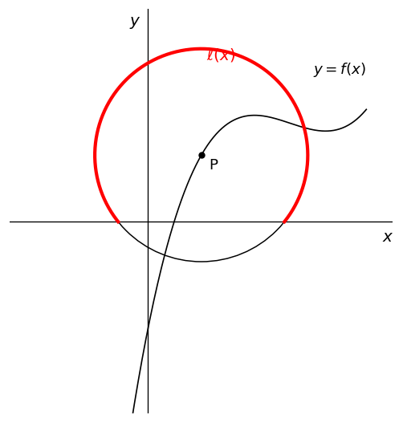
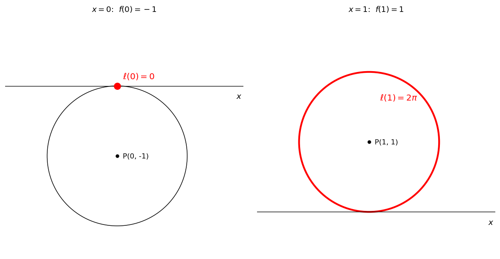
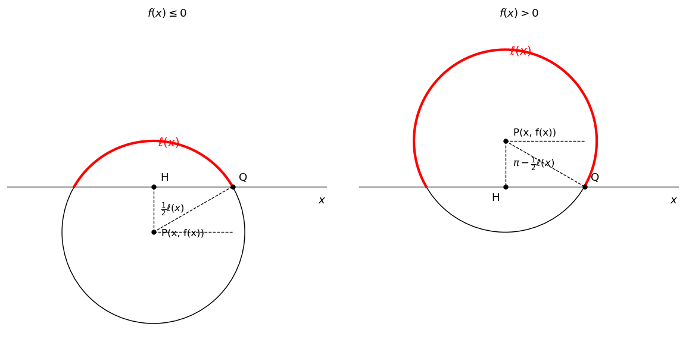

# 부분적분

부분적분법은 두 함수의 곱으로 이루어진 식의 적분을 다룰 때 사용하는 핵심 기법이다. 곱의 미분 법칙 $(uv)' = u'v + uv'$ 의 양변을 적분하면 다음 공식을 얻는다.

!!! note "부분적분 공식"
    함수 $u(x)$, $v(x)$ 가 닫힌 구간 $[\alpha, \beta]$ 에서 미분 가능하면

    $$
    \int_\alpha^\beta u(x)\,v'(x)\,dx = \bigl[\,u(x)\,v(x)\,\bigr]_\alpha^\beta - \int_\alpha^\beta u'(x)\,v(x)\,dx
    $$

    이 성립한다.

미분하면 단순해지는 함수를 $u$ 로, 적분하기 쉬운 함수를 $v'$ 으로 두는 것이 핵심이다.

---

## 보기 1: 부분적분의 기본 아이디어

다음 정적분을 생각해 보자.

$$
\int_0^1 x\,e^x\,dx
$$

피적분함수 $x\,e^x$ 는 그대로 적분하기 어렵다. 그러나 만약 $x$ 가 없다면 $\int_0^1 e^x\,dx$ 는 즉시 계산할 수 있는 식이 된다. 다시 말해 **$x$ 가 적분을 어렵게 만드는 골칫거리**이다.

그러면 이 골칫거리 $x$ 를 어떻게 없앨 수 있을까? $x$ 를 한 번 미분하면 $1$ 이 되어 사라진다. 즉 $x$ 에 강제로 미분이 걸리도록 식을 변형할 수만 있다면 적분은 손쉬워진다.

부분적분법이 바로 이 역할을 한다. 공식

$$
\int u\,v'\,dx = \bigl[\,u\,v\,\bigr] - \int u'\,v\,dx
$$

를 살펴보면, 좌변에서 미분 기호가 붙어 있던 $v'$ 은 우변에서 $v$ 로 적분되어 있고, 대신 미분 기호가 없던 $u$ 는 우변에서 $u'$ 으로 미분되어 있다. 즉 **부분적분은 미분 기호를 한쪽 함수에서 반대쪽 함수로 이전시키는 도구**이다.

따라서 골칫거리 $x$ 에 미분이 걸리도록 하려면 $x$ 를 $u$ 자리에 놓으면 된다. $u = x$, $v' = e^x$ 로 두면 $v = e^x$ 가 자연스럽게 따라오고, 우변의 적분에서 $x$ 는 $u' = 1$ 로 미분되어 사라지며 남는 적분 $\int e^x\,dx$ 는 자명하게 풀린다.

??? success "보기 1 풀이"

    $$\begin{array}{lll}
    \int_0^1 x\,e^x\,dx 
    &=&\displaystyle \int_0^1 x\,\left(e^x\right)'\,dx \\
    &=&\displaystyle \bigl[\,x\,e^x\,\bigr]_0^1 - \int_0^1 \left(x\right)'\,e^x\,dx \\
    &=&\displaystyle \bigl[\,x\,e^x\,\bigr]_0^1 - \int_0^1 e^x\,dx \\
    &=&\displaystyle 1\quad\square
    \end{array}$$

!!! info "핵심 아이디어"
    **미분을 통하여 골칫거리를 제거한다.** 부분적분은 적분하기 어려운 함수에 미분을 강제로 걸리게 하여 단순화 또는 제거하는 기법이다. 미분으로 단순해질 함수를 $u$ 자리에, 적분하기 쉬운 함수를 $v'$ 자리에 놓는 것이 일반적인 전략이다.

---

## 연습문제

**연습문제 1.** 다음 정적분을 부분적분법으로 계산하시오.

$$
\int_0^{\pi} x\,\sin x\,dx
$$

??? success "연습문제 1 풀이"

    $$\begin{array}{lll}
    \int_0^{\pi} x\,\sin x\,dx 
    &=&\displaystyle \int_0^{\pi} x\,\left(- \cos x\right)'\,dx \\
    &=&\displaystyle \bigl[\,-x\cos x\,\bigr]_0^{\pi} - \int_0^{\pi} \left(x\right)'\,\left(- \cos x\right)\,dx \\
    &=&\displaystyle \bigl[\,-x\cos x\,\bigr]_0^{\pi} + \int_0^{\pi} \cos x\,dx\\
    &=&\displaystyle \pi\quad\square
    \end{array}$$

---

**연습문제 2.** 다음 정적분을 부분적분법으로 계산하시오.

$$
\int_1^{e} \ln x\,dx
$$

??? success "연습문제 2 풀이"

    $$\begin{array}{lll}
    \int_1^{e} \ln x\,dx 
    &=&\displaystyle \int_1^{e} \left(x\right)'\,\ln x\,dx \\
    &=&\displaystyle \bigl[\,x\ln x\,\bigr]_1^{e} - \int_1^{e} x\,\left(\ln x\right)'\,dx \\
    &=&\displaystyle \bigl[\,x\ln x\,\bigr]_1^{e} - \int_1^{e} 1\,dx \\
    &=&\displaystyle 1\quad\square
    \end{array}$$

---

**연습문제 3.** 다음 정적분을 부분적분법을 두 번 적용하여 계산하시오.

$$
\int_0^{1} x^2\,e^x\,dx
$$

??? success "연습문제 3 풀이"

    $$\begin{array}{lll}
    \int_0^{1} x^2\,e^x\,dx 
    &=& \int_0^{1} x^2\,\left(e^x\right)'\,dx \\
    &=& \bigl[\,x^2\,e^x\,\bigr]_0^{1} - \int_0^{1} \left(x^2\right)'\,e^x\,dx \\
    &=& \bigl[\,x^2\,e^x\,\bigr]_0^{1} - \int_0^{1} 2x\,e^x\,dx \\
    &=& e - 2\int_0^{1} x\,e^x\,dx
    \end{array}$$

    보기 1에서 $\int_0^{1} x\,e^x\,dx = 1$ 이었으므로

    $$
    \int_0^{1} x^2\,e^x\,dx = e - 2\quad\square
    $$

---

**연습문제 4.** 자연수 $n$ 에 대하여 $\displaystyle I_n = \int_0^1 x^n\,e^x\,dx$ 로 놓을 때, 부분적분법을 이용하여 다음 점화식이 성립함을 보이시오.

$$
I_n = e - n\,I_{n-1} \quad (n \geq 1)
$$

??? success "연습문제 4 풀이"

    $$\begin{array}{lll}
    I_n 
    &=&\displaystyle \int_0^1 x^n\,e^x\,dx \\
    &=&\displaystyle \int_0^1 x^n\,\left(e^x\right)'\,dx \\
    &=&\displaystyle \bigl[\,x^n\,e^x\,\bigr]_0^1 - \int_0^1 \left(x^n\right)'\,e^x\,dx \\
    &=&\displaystyle \bigl[\,x^n\,e^x\,\bigr]_0^1 - \int_0^1 n\,x^{n-1}\,e^x\,dx\\
    &=&\displaystyle e - n\,I_{n-1}\quad\square
    \end{array}$$

    !!! tip "활용"
        이 점화식과 $I_0 = \int_0^1 e^x\,dx = e - 1$ 로부터 $I_1 = e - 1 \cdot I_0 = e - (e-1) = 1$ (보기 1), $I_2 = e - 2\,I_1 = e - 2$ (연습문제 3)를 차례로 얻을 수 있다.

---

**연습문제 5.** $a$ 가 자연수이고 $ab = 1$ 일 때, 부분적분법을 이용하여 다음 등식을 증명하시오.

$$
\int_0^1 (1+x^a)^b\,dx = 2^b - \int_0^1 x^a(1+x^a)^{b-1}\,dx
$$

??? success "연습문제 5 풀이"

    $$\begin{array}{lll}
    \int_0^1 (1+x^a)^b\,dx 
    &=&\displaystyle \int_0^1 \left(x\right)'\,(1+x^a)^b\,dx \\
    &=&\displaystyle \bigl[\,x(1+x^a)^b\,\bigr]_0^1 - \int_0^1 x\,\left((1+x^a)^b\right)'\,dx \\
    &=&\displaystyle \bigl[\,x(1+x^a)^b\,\bigr]_0^1 - \int_0^1 ab\,x^a(1+x^a)^{b-1}\,dx
    \end{array}$$

    $\bigl[\,x(1+x^a)^b\,\bigr]_0^1 = 2^b$ 이고 조건 $ab = 1$ 에 의하여

    $$
    \int_0^1 (1+x^a)^b\,dx = 2^b - \int_0^1 x^a(1+x^a)^{b-1}\,dx\quad\square
    $$

---

**연습문제 6.** 다음 등식을 만족시키는 $b$ 의 값을 구하시오. (단, $a$ 는 자연수이고 $ab = 1$ 이다.)

$$
\int_0^1 (1+x^a)^{b-1}(1+2x^a)\,dx = 2
$$

??? success "연습문제 6 풀이"

    $$\begin{array}{lll}
    \int_0^1 (1+x^a)^{b-1}(1+2x^a)\,dx 
    &=&\displaystyle \int_0^1 (1+x^a)^{b-1}\left(2(1 + x^a) - 1\right)\,dx \\
    &=&\displaystyle 2\int_0^1 (1+x^a)^b\,dx - \int_0^1 (1+x^a)^{b-1}\,dx \tag{1}
    \end{array}$$

    이제 우변의 첫 번째 적분에 연습문제 5의 결과를 적용하면

    $$\begin{array}{lll}
    \int_0^1 (1+x^a)^b\,dx 
    &=&\displaystyle 2^b - \int_0^1 x^a(1+x^a)^{b-1}\,dx\\
    &=&\displaystyle 2^b - \int_0^1 \left((1+x^a) - 1\right)(1+x^a)^{b-1}\,dx\\
    &=&\displaystyle 2^b - \int_0^1 (1+x^a)^b\,dx + \int_0^1 (1+x^a)^{b-1}\,dx
    \end{array}$$

    적분 항을 한 쪽으로 모으면

    $$
    2^b = 2\int_0^1 (1+x^a)^b\,dx - \int_0^1 (1+x^a)^{b-1}\,dx \tag{2}
    $$

    (1) 의 우변과 (2)의 우변이 일치하므로, (1) 의 좌변과 (2)의 좌변이 일치한다.
    따라서, 문제의 조건에 의하여 

    $$
    2^b = \int_0^1 (1+x^a)^{b-1}(1+2x^a)\,dx = 2
    $$

    그러므로 $b = 1$ $\square$

    !!! tip "아이디어"

        이 문제의 풀이는 다음 세 가지 기법을 결합한다.

        1. **대수적 분해**: $1 + 2x^a = 2(1+x^a) - 1$ 로 분해하여 피적분함수를 두 부분으로 나눈다.
        2. **부분적분**: $u = (1+x^a)^b$, $v' = 1$ 로 두어 거듭제곱의 차수를 한 단계 낮춘다.
        3. **순환 관계**: 부분적분 후 등장하는 $\int_0^1 x^a(1+x^a)^{b-1}\,dx$ 를 $(1+x^a)^b$ 와 $(1+x^a)^{b-1}$ 의 차로 표현하면 원래의 적분이 다시 나타난다. 이 순환 구조 덕분에 적분을 직접 계산하지 않고도 $2^b$ 의 값을 결정할 수 있다.

        조건 $ab = 1$ 은 부분적분 과정에서 발생하는 계수 $ab$ 를 정확히 $1$ 로 만들어 식을 단순화하는 역할을 한다.

---

**연습문제 7.** 실수 전체의 집합에서 연속인 두 함수 $\ell(x)$ 와 $f(x)$ 가 다음 조건을 만족시킨다.

!!! quote "조건"
    $f(x) > -1$ 인 $x$ 에 대하여, 중심이 $\mathrm{P}(x,\,f(x))$ 이고 반지름의 길이가 $1$ 인 원이 좌표평면에서 $y \geq 0$ 인 부분과 만나서 생기는 호의 길이가 $\ell(x)$ 이다.

<figure markdown>
  { width=420 }
  <figcaption markdown>곡선 $y = f(x)$ 위의 점 $\mathrm{P}(x, f(x))$ 를 중심으로 하는 반지름 $1$ 인 원, 그 원이 $y \geq 0$ 인 부분과 만나서 생기는 호 $\ell(x)$ (빨간색).</figcaption>
</figure>

$f(x) = x^3 - 4x^2 + 5x - 1$ 일 때, 다음 정적분의 값을 구하시오.

$$
\int_0^1 f'(x)\,\ell(x)\,dx
$$

??? success "연습문제 7 풀이"
    **준비 — 적분 구간에서 $f$ 의 치역 확인.** $f'(x) = 3x^2 - 8x + 5 = (3x - 5)(x - 1)$ 의 두 인수가 $[0, 1]$ 에서 모두 $\leq 0$ 이므로 $f'(x) \geq 0$, 즉 $f$ 는 단조증가한다. $f(0) = -1$, $f(1) = 1$ 이므로 적분 구간 전체에서

    $$
    -1 \leq f(x) \leq 1
    $$

    이는 단위원이 $x$ 축과 (접하거나) 만나는 범위이므로 아래의 직각삼각형 $\triangle\mathrm{PHQ}$ 논의가 적용 가능하다. 이 범위를 벗어나면 항등식 $\cos(\ell(x)/2) = -f(x)$ 가 양쪽 모두에서 깨진다.

    - $f(x) > 1$: 원이 $x$ 축 위로 완전히 떠서 $\ell(x) \equiv 2\pi$ 가 되어 좌변은 $\cos\pi = -1$ 이지만 우변은 $-f(x) < -1$.
    - $f(x) < -1$: 원이 $x$ 축 아래로 완전히 잠겨 $\ell(x) \equiv 0$ (문제 조건이 $f(x) > -1$ 에서만 정의이지만 연속 확장하면 $0$) 이 되어 좌변은 $\cos 0 = 1$ 이지만 우변은 $-f(x) > 1$.

    따라서 적분 구간에서 $-1 \leq f(x) \leq 1$ 임을 확인하는 단계는 필수이다.

    적분 구간의 양 끝점에서 단위원의 모습은 다음과 같다.

    <figure markdown>
      { width=620 }
      <figcaption markdown>왼쪽: $x = 0$ 에서 $f(0) = -1$ 이므로 원이 원점에서 $x$ 축 아래로 접하고 $\ell(0) = 0$. 오른쪽: $x = 1$ 에서 $f(1) = 1$ 이므로 원이 $(1, 0)$ 에서 $x$ 축 위로 접하고 $\ell(1) = 2\pi$ (원 전체가 호).</figcaption>
    </figure>

    $x$ 가 $0$ 에서 $1$ 로 움직일 때, $f(x)$ 와 $\ell(x)$ 의 관계는 위 왼쪽 그림 ($\ell = 0$) 에서 오른쪽 그림 ($\ell = 2\pi$) 으로 연속적으로 변한다. 이 끝점 정보가 곧 후속 치환 $t = \ell(x)$ 에서 적분 구간이 $[0, 2\pi]$ 가 되는 근거이다 (아래 그림 참조).

    **1단계 — 기하적 관계식 유도.** 중심이 $\mathrm{P}$ 이고 반지름의 길이가 $1$ 인 원을 $O$ 라 하자. 반지름이 $1$ 이므로 호의 길이 $\ell(x)$ 는 그 호의 중심각(라디안)의 크기와 같다. 점 $\mathrm{P}$ 에서 $x$ 축에 내린 수선의 발을 $\mathrm{H}$, 원 $O$ 와 $x$ 축의 교점 중 한 점을 $\mathrm{Q}$ 라 하면 $\triangle \mathrm{PHQ}$ 는 $\angle \mathrm{H} = \pi/2$, 빗변 $\overline{\mathrm{PQ}} = 1$ 인 직각삼각형이다.

    <figure markdown>
      { width=620 }
    </figure>

    이제 $\angle\mathrm{HPQ}$ 를 간단히 $\theta$ 로 두자. $y \geq 0$ 부분의 호의 중심각이 $\ell(x)$ 이고 $\overline{\mathrm{PH}}$ 가 이 호를 이등분하므로

    $$
    \ell(x) = \begin{cases} 2\theta & (f(x) \leq 0) \\[4pt] 2\pi - 2\theta & (f(x) > 0) \end{cases} 
    $$

    혹은

    $$
    \theta = \begin{cases} \dfrac{1}{2}\ell(x) & (f(x) \leq 0) \\[4pt] \pi - \dfrac{1}{2}\ell(x) & (f(x) > 0) \end{cases} \tag{1}
    $$

    한편 $\overline{\mathrm{PH}} = |f(x)|$ 이고 $\overline{\mathrm{PQ}} = 1$ 이므로 직각삼각형 $\triangle\mathrm{PHQ}$ 에서

    $$
    \cos(\theta) = |f(x)| \tag{2}
    $$

    (1) 을 (2) 에 대입하면, 두 경우의 중간 관계식은 약간씩 다르지만 다음 식 (3) 을 획득한다.

    $$
    \cos\!\left(\frac{1}{2}\ell(x)\right) = -f(x) \tag{3}
    $$

    **경우 1: $f(x) \leq 0$.** $\theta = \frac{1}{2}\ell(x)$ 이고 $|f(x)| = -f(x)$ 이므로, (3) 성립.

    **경우 2: $f(x) > 0$.** $\theta = \pi - \frac{1}{2}\ell(x)$ 이고 $|f(x)| = f(x)$ 이므로

    $$
    \cos\!\left(\pi - \frac{1}{2}\ell(x)\right) = f(x)
    $$

    여기에 항등식 $\cos(\pi - \alpha) = -\cos\alpha$ 를 적용하면 $-\cos(\ell(x)/2) = f(x)$, 즉 (3) 성립.

    **2단계 — 적분 구간과 치환.** $\ell(x) = t$ 로 치환하자. $x$ 가 구간 $[0,1]$ 에서 움직이면, $t$ 는 구간 $[0,2\pi]$ 에서 움직인다.  $(3)$ 의 양변을 $x$ 에 대하여 미분하면

    $$
    -\frac{1}{2}\sin\!\left(\frac{t}{2}\right) \frac{dt}{dx} = -f'(x), \qquad \text{즉} \qquad f'(x)\,dx = \frac{1}{2}\sin\!\left(\frac{t}{2}\right) dt
    $$

    **3단계 — 변수변환으로 연습문제 1 에 환원.** 위의 치환을 이용하면

    $$
    \int_0^1 f'(x)\,\ell(x)\,dx 
    = \int_0^{2\pi} t \cdot \frac{1}{2}\sin\!\left(\frac{t}{2}\right) dt 
    = \int_0^{2\pi} \frac{t}{2}\sin\!\left(\frac{t}{2}\right) dt
    $$

    $u = \dfrac{t}{2}$ 로 치환하면 $dt = 2\,du$, 적분 구간 $[0, 2\pi]$ 는 $[0, \pi]$ 로 바뀌므로, 연습문제 1에 의하여

    $$
    \int_0^1 f'(x)\,\ell(x)\,dx 
    = \int_0^{2\pi} \frac{t}{2}\sin\!\left(\frac{t}{2}\right) dt 
    = \int_0^{\pi} u\,\sin u \cdot 2\,du 
    = 2\int_0^{\pi} u\,\sin u\,du
    = 2\pi\quad\square
    $$

    !!! tip "큰 그림"
        기하 조건 $(\ast)$ 는 $f(x)$ 와 $\ell(x)$ 를 한 식으로 묶어주는 다리이다. 이를 미분하여 얻은 치환으로 원래의 적분은 $t$ 에 대한 표준적인 적분 $\int_0^{2\pi} \frac{t}{2}\sin(t/2)\,dt$ 로 환원되고, 한 번 더 치환 $u = t/2$ 를 거치면 **정확히 연습문제 1 의 $2$ 배**가 된다. 결국 이 복잡해 보이는 기하-적분 문제는 두 번의 치환을 거쳐 가장 기본적인 부분적분 문제 (연습문제 1) 로 귀결된다.

---

**연습문제 (보충).** [부분적분의 점화식과 베타함수형 적분]
$n = 1, 2, 3, \ldots, 100, 101$ 에 대하여

$$
a_n = \int_0^1 (2x)^n (1 - x)^{102 - n}\,dx
$$

라 하자.

(1) $\dfrac{a_{98}}{2^{98}} + 3 \cdot \dfrac{a_{99}}{2^{99}} + 3 \cdot \dfrac{a_{100}}{2^{100}} + \dfrac{a_{101}}{2^{101}} = \dfrac{q}{p}$ 일 때, 서로소인 자연수 $p, q$ 를 구하시오.

(2) $\dfrac{a_n}{a_{n+1}} \geq 1$ 을 만족하는 $n$ 을 모두 구하시오.

(3) $a_n$ 이 $n = m$ 에서 최솟값을 가질 때 $m$ 을 구하시오. 또한 ${}_{102}\mathrm{C}_m \times a_m = \dfrac{q}{p}$ 일 때 $p, q$ 를 구하시오.

??? success "연습문제 (보충) 풀이"

    **(1).** $\dfrac{a_n}{2^n} = \int_0^1 x^n (1-x)^{102-n}\,dx$ 으로 두면 (이항계수 인수 제외한 적분의 합):

    $$
    \frac{a_{98}}{2^{98}} + 3 \frac{a_{99}}{2^{99}} + 3 \frac{a_{100}}{2^{100}} + \frac{a_{101}}{2^{101}} = \int_0^1 x^{98}\bigl((1-x)^4 + 3 x (1-x)^3 + 3 x^2 (1-x)^2 + x^3 (1-x)\bigr)\,dx
    $$

    잠깐 — 이항 전개. 분자에서 $(1-x) + x = 1$ 의 거듭제곱을 활용:

    $$
    (1 - x)^4 + 3x(1-x)^3 + 3x^2(1-x)^2 + x^3(1-x) = (1-x)\bigl((1-x)^3 + 3x(1-x)^2 + 3x^2(1-x) + x^3\bigr) = (1-x)\cdot 1 = 1 - x
    $$

    (이항정리: $(1-x+x)^3 = 1$). 따라서

    $$
    \text{좌변} = \int_0^1 x^{98}(1 - x)\,dx = \frac{1}{99} - \frac{1}{100} = \frac{1}{9900}
    $$

    $p = 9900$, $q = 1$. $\quad\square$

    **(2)·(3) 풀이의 핵심 — 점화식.** 부분적분으로

    $$
    a_n = \int_0^1 (2x)^n (1-x)^{102-n}\,dx
    $$

    에서 $u = (1-x)^{102-n}$, $dv = (2x)^n\,dx$ ($v = (2x)^{n+1}/(2(n+1))$) 로 부분적분하면 (또는 더 단순하게 $u = (2x)^n$, $dv = (1-x)^{102-n}dx$):

    $$
    a_n = \frac{102 - n}{2(n + 1)}\,a_{n+1}
    $$

    이 점화식이 핵심. $a_n / a_{n+1} = (102 - n)/(2(n+1))$.

    **(2).** $(102 - n)/(2(n + 1)) \geq 1 \Leftrightarrow 102 - n \geq 2n + 2 \Leftrightarrow n \leq 100/3 \approx 33.33$. 자연수 $n = 1, 2, \ldots, 33$.

    **(3).** $a_n$ 이 최솟값을 갖는 $n = m$: $a_n$ 의 감소는 $n \leq 33$ 까지, $n \geq 34$ 부터는 $a_n / a_{n+1} < 1$ 즉 $a_n$ 이 증가로 전환되기 직전에 $a_{34}$ 가 최솟값. 정확히 $m = 34$.

    $$
    {}_{102}\mathrm{C}_{34}\times a_{34} = {}_{102}\mathrm{C}_{34}\cdot 2^{34}\int_0^1 x^{34}(1-x)^{68}\,dx = 2^{34}\cdot{}_{102}\mathrm{C}_{34}\cdot \mathrm{B}(35, 69)
    $$

    여기서 $\mathrm{B}(35, 69) = \dfrac{34! \cdot 68!}{102!}$ 이고 ${}_{102}\mathrm{C}_{34} = \dfrac{102!}{34! \cdot 68!}$ 이므로

    $$
    {}_{102}\mathrm{C}_{34}\times a_{34} = 2^{34}\cdot\dfrac{1}{1}\cdot\dfrac{1}{34 + 68 + 1} = \dfrac{2^{34}}{103}
    $$

    잠깐 — 정확한 베타-감마 관계: $\int_0^1 x^{a-1}(1-x)^{b-1}dx = \mathrm{B}(a, b) = \dfrac{(a-1)!(b-1)!}{(a+b-1)!}$. 여기서 $a-1 = 34$, $b-1 = 68$ 이므로 $a + b - 1 = 103$. 따라서

    $$
    \int_0^1 x^{34}(1-x)^{68}dx = \dfrac{34!\,68!}{103!}
    $$

    그리고 ${}_{102}\mathrm{C}_{34} = \dfrac{102!}{34!\,68!}$. 곱:

    $$
    {}_{102}\mathrm{C}_{34}\cdot\int_0^1 x^{34}(1-x)^{68}dx = \dfrac{102!}{103!} = \dfrac{1}{103}
    $$

    따라서 ${}_{102}\mathrm{C}_{34}\times a_{34} = \dfrac{2^{34}}{103}$. $p = 103$, $q = 2^{34} \quad\square$

    !!! info "교훈"
        - 부분적분으로 베타함수형 적분의 **점화식**이 도출되고, 그 점화식의 비율이 $1$ 이 되는 $n$ 이 단조성의 전환점.
        - $\int_0^1 x^a(1-x)^b\,dx$ 와 이항계수의 결합으로 결과가 매우 단순해진다 — "**감마-베타 관계의 입문**".

---

**연습문제 (보충 2).** [sin kx 의 접선 + 최댓값-최솟값의 적분]
자연수 $k$ 에 대하여 $f(x) = \sin kx$. 실수 $t$ 와 직선 $x = 4\pi$, 곡선 $y = f(x)$ 위의 점 $(t, f(t))$ 에서의 접선이 만나는 점의 $y$ 좌표를 $g(t)$ 라 하자. $x < 4\pi$ 인 실수 $x$ 와 $g(t)$ 에 대하여 닫힌구간 $[x, 4\pi]$ 에서의 $g$ 의 최댓값과 최솟값의 차를 $h(x)$ 라 하자. $a = 4\pi - \dfrac{5\pi}{2k}$, $b = 4\pi - \dfrac{3\pi}{2k}$, $C = \displaystyle\int_a^b h(x)\,dx$ 일 때 $2kC$ 를 구하시오.

??? success "연습문제 (보충 2) 풀이 (요약)"

    접선: $y = f'(t)(x - t) + f(t)$ 에 $x = 4\pi$ 대입: $g(t) = k(4\pi - t)\cos kt + \sin kt$.

    $g'(t) = -k^2(4\pi - t)\sin kt$. $g'(t) = 0$ 의 해 $\sin kt = 0$ 또는 $t = 4\pi$. $k$ 가 자연수, $\sin kt = 0$ 의 해 $t = 4\pi - n\pi/k$ ($n = 0, 1, 2, \ldots$).

    $t = 4\pi - \pi/k$ 에서 극소 ($g = -\pi$), $t = 4\pi - 2\pi/k$ 에서 극대 ($g = 2\pi$), $t = 4\pi - 3\pi/k$ 에서 극소·극대 교차, $t = 4\pi - 5\pi/(2k)$ 에서 $g = -1$.

    $[x, 4\pi]$ 에서 $g$ 의 최솟값은 항상 $-\pi$, 최댓값은 $x$ 의 위치에 따라 분기:

    $$
    h(x) = \begin{cases} 3\pi & \left(4\pi - \dfrac{5\pi}{2k} \le x \le 4\pi - \dfrac{2\pi}{k}\right) \\ g(x) + \pi & \left(4\pi - \dfrac{2\pi}{k} \le x \le 4\pi - \dfrac{3\pi}{2k}\right)\end{cases}
    $$

    $\int_a^b h dx = 3\pi \cdot \dfrac{\pi}{2k} + \pi \cdot \dfrac{\pi}{2k} + \int_{4\pi-2\pi/k}^{4\pi-3\pi/(2k)} g(x) dx = \dfrac{2\pi^2}{k} + \int g$. 부분적분으로 $\int(k(4\pi-x)\cos kx + \sin kx)dx = (4\pi - x)\sin kx - \dfrac{2}{k}\cos kx$. 평가:

    $$
    \int_a^b h(x)\,dx = \dfrac{2\pi^2}{k} + \dfrac{3\pi/(2k) + 2/k}{1} = \dfrac{2\pi^2}{k} + \dfrac{3\pi + 4}{2k} = \dfrac{4\pi^2 + 3\pi + 4}{2k}
    $$

    $\boxed{2kC = 4\pi^2 + 3\pi + 4}\quad\square$
