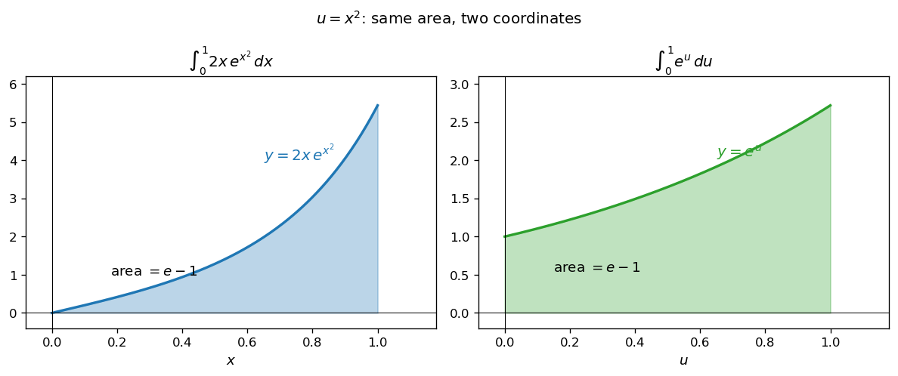
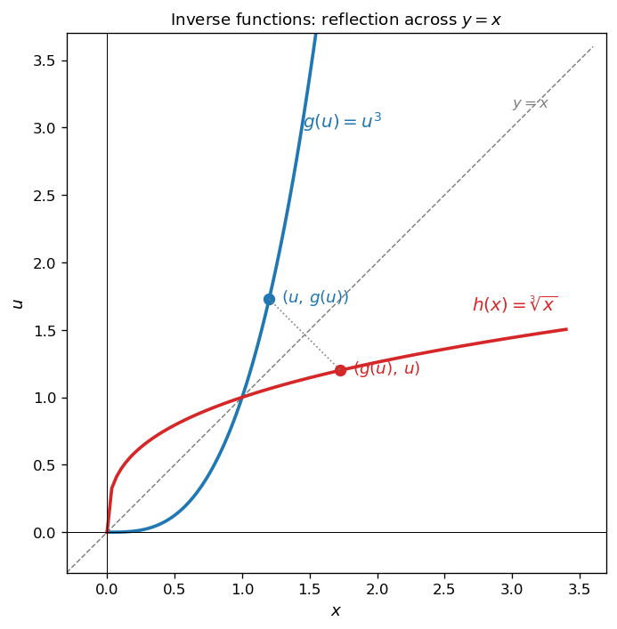
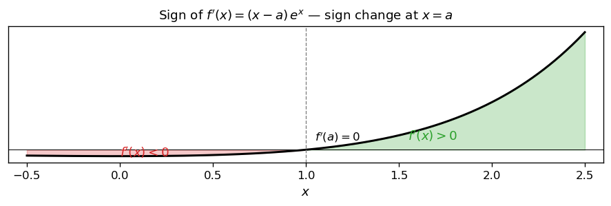
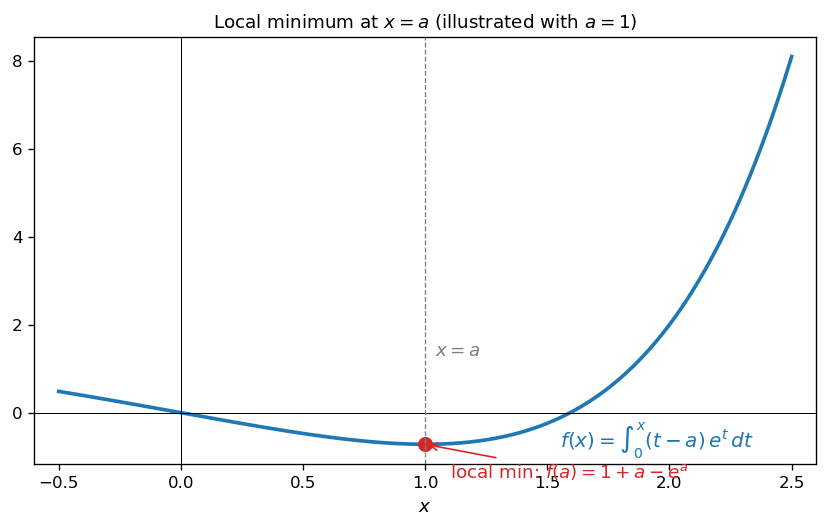
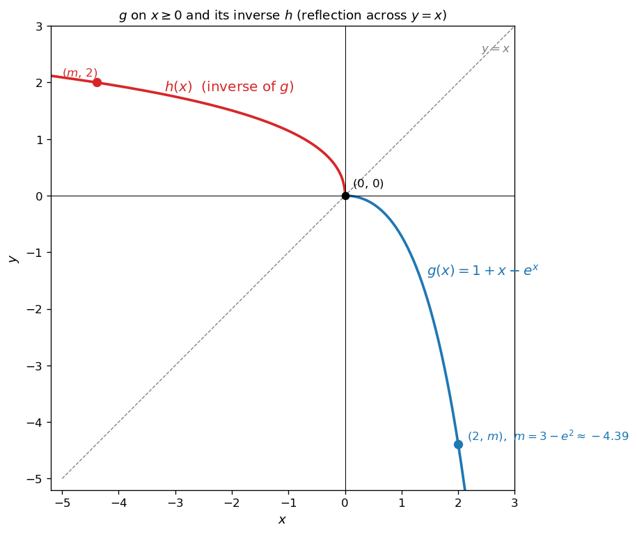
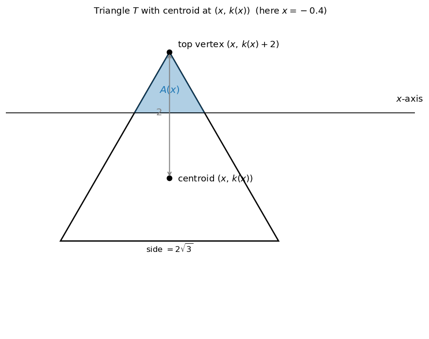
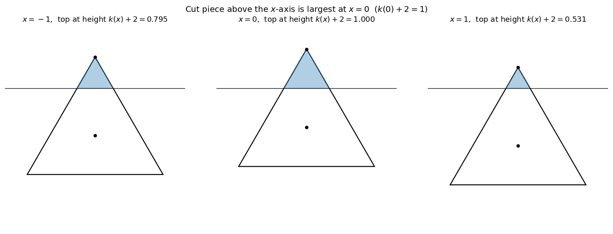
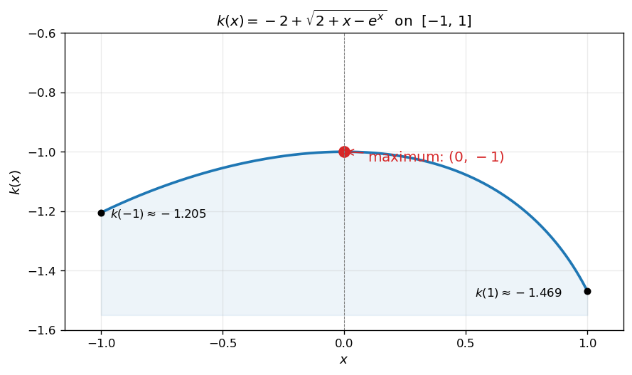

# 치환적분

치환적분법은 적분 변수를 새로운 변수로 바꾸어 피적분함수를 단순한 형태로 만드는 기법이다. 합성함수의 미분 법칙 $\{F(g(t))\}' = F'(g(t))\,g'(t)$ 의 양변을 적분하면 다음 공식을 얻는다.

!!! note "치환적분 공식"
    미분가능한 함수 $g(t)$ 에 대하여 $x = g(t)$ 로 놓으면

    $$
    \int f(x)\,dx = \int f(g(t))\,g'(t)\,dt
    $$

    가 성립한다. 정적분의 경우, $g$ 가 적분 구간에서 일대일대응이고 $g(\alpha) = a$, $g(\beta) = b$ 이면

    $$
    \int_a^b f(x)\,dx = \int_\alpha^\beta f(g(t))\,g'(t)\,dt
    $$

치환적분의 핵심은 **피적분함수 안에 미분 형태로 숨어 있는 표현을 새 변수로 묶어 식을 정리하는 것**이다.

---

## 보기 1: 미분된 형태가 함께 등장하는 치환

다음 정적분을 생각해 보자.

$$
\int_0^1 2x\,e^{x^2}\,dx
$$

피적분함수 $2x\,e^{x^2}$ 에서 지수 $x^2$ 의 도함수 $2x$ 가 자연스럽게 함께 등장한다. 그래서 $u = x^2$ 로 두면 $du = 2x\,dx$ 가 되어 두 부분이 한꺼번에 사라지고, 남는 식은 자명하게 풀린다. 즉 **치환적분은 적분 안에 짝지어 들어 있는 $g(x)$ 와 $g'(x)$ 를 발견하여 $u = g(x)$ 로 묶는 도구**이다.

<figure markdown>
  { width=720 }
  <figcaption markdown>왼쪽: 원래 변수 $x$ 에서의 곡선 $y = 2x\,e^{x^2}$ 와 그 아래 넓이. 오른쪽: 치환 $u = x^2$ 후 새 변수 $u$ 에서의 곡선 $y = e^u$ 와 그 아래 넓이. 두 넓이는 모두 $e - 1$ 로 같지만, 오른쪽이 훨씬 다루기 쉬운 형태이다.</figcaption>
</figure>

??? success "보기 1 풀이"

    $u = x^2$ 로 두면 $du = 2x\,dx$ 이고, $x = 0$ 일 때 $u = 0$, $x = 1$ 일 때 $u = 1$ 이므로

    $$\begin{array}{lll}
    \int_0^1 2x\,e^{x^2}\,dx 
    &=&\displaystyle \int_0^1 e^u\,du \\
    &=&\displaystyle \bigl[\,e^u\,\bigr]_0^1 \\
    &=&\displaystyle e - 1\quad\square
    \end{array}$$

!!! info "핵심 아이디어"
    **미분된 형태가 함께 등장하면 그 부분을 새 변수로 묶는다.** 피적분함수 안에 숨어 있는 $g(x)$ 와 $g'(x)$ 짝을 발견하여 $u = g(x)$ 로 두는 것이 일반적인 전략이다.

---

## 보기 2: 역함수를 제거하는 치환

피적분함수 안에 알려진 함수의 **역함수**가 들어 있을 때도 치환적분이 강력하다.

함수 $g$ 가 일대일대응이고 그 역함수를 $h$ 라 할 때, 다음 형태의 정적분

$$
\int_a^b F'(h(x))\,dx
$$

를 생각하자. 여기에 $x = g(u)$ 로 치환하면 역함수의 정의에 의하여 $h(x) = u$ 가 된다. 또한 $dx = g'(u)\,du$ 이고, 적분 구간은 $x = a$ 일 때 $u = h(a)$, $x = b$ 일 때 $u = h(b)$ 로 바뀐다. 따라서

$$
\int_a^b F'(h(x))\,dx = \int_{h(a)}^{h(b)} F'(u)\,g'(u)\,du
$$

이렇게 치환하면 **역함수 $h$ 가 사라지고** 대신 $g'(u)$ 가 등장한다. $h$ 의 구체적인 표현을 알 수 없더라도, 적분 구간의 양 끝값 $h(a)$, $h(b)$ 만 파악하면 적분을 계산할 수 있다는 점이 핵심이다.

<figure markdown>
  { width=460 }
  <figcaption markdown>$g(u) = u^3$ (파란색) 과 그 역함수 $h(x) = \sqrt[3]{x}$ (빨간색) 는 $y = x$ 직선 (회색 점선) 에 대하여 대칭이다. $g$ 위의 점 $(u, g(u))$ 는 $h$ 위의 점 $(g(u), u)$ 에 대응되며, 치환 $x = g(u)$ 는 정확히 이 대응을 이용한다.</figcaption>
</figure>

??? success "보기 2 풀이 — 간단한 예"

    $g(u) = u^3$ ($u \geq 0$) 의 역함수는 $h(x) = \sqrt[3]{x}$ 이다. $F(x) = \dfrac{x^2}{2}$ 라 하면 $F'(x) = x$ 이므로 $F'(h(x)) = h(x) = \sqrt[3]{x}$ 이다. 이제

    $$
    \int_0^8 \sqrt[3]{x}\,dx
    $$

    를 $x = g(u) = u^3$ 으로 치환하면 $dx = 3u^2\,du$ 이고, $x = 0$ 일 때 $u = 0$, $x = 8$ 일 때 $u = 2$ 이므로

    $$\begin{array}{lll}
    \int_0^8 \sqrt[3]{x}\,dx 
    &=&\displaystyle \int_0^2 u \cdot 3u^2\,du \\
    &=&\displaystyle \int_0^2 3u^3\,du \\
    &=&\displaystyle \bigl[\,\tfrac{3}{4}u^4\,\bigr]_0^2 = 12\quad\square
    \end{array}$$

!!! info "핵심 아이디어"
    **역함수가 피적분함수에 등장하면 $x = g(u)$ 치환으로 역함수를 제거한다.** 이때 적분 구간을 $u$ 의 구간으로 정확히 환산하는 것이 필수이며, 역함수의 구체적인 식이 없더라도 계산이 가능하다.

---

## 연습문제

**연습문제 1.** 다음 정적분을 치환적분법으로 계산하시오.

$$
\int_0^1 x\,(1 + x^2)^{10}\,dx
$$

??? success "연습문제 1 풀이"

    $u = 1 + x^2$ 로 두면 $du = 2x\,dx$, 즉 $x\,dx = \dfrac{1}{2}\,du$ 이고, $x = 0$ 일 때 $u = 1$, $x = 1$ 일 때 $u = 2$ 이므로

    $$\begin{array}{lll}
    \int_0^1 x\,(1+x^2)^{10}\,dx 
    &=&\displaystyle \int_1^2 \tfrac{1}{2}\,u^{10}\,du \\
    &=&\displaystyle \tfrac{1}{22}\bigl[\,u^{11}\,\bigr]_1^2 \\
    &=&\displaystyle \tfrac{2^{11} - 1}{22} = \tfrac{2047}{22}\quad\square
    \end{array}$$

---

**연습문제 2.** [정적분으로 정의된 함수의 극값] 실수 $a$ 에 대하여 함수

$$
f(x) = \int_0^x (t - a)\,e^t\,dt
$$

가 극솟값을 가지는 점과 그 극솟값을 구하시오.

??? success "연습문제 2 풀이"

    미적분학의 기본정리에 의하여

    $$
    f'(x) = (x - a)\,e^x
    $$

    이다. $e^x > 0$ 이므로 $f'(x) = 0$ 의 해는 $x = a$ 뿐이고, $f'$ 는 $x = a$ 의 좌우에서 음에서 양으로 부호가 바뀌므로 $f$ 는 $x = a$ 에서 **극소**이다.

    <figure markdown>
      { width=620 }
      <figcaption markdown>$f'(x) = (x-a)\,e^x$ 의 부호 분석. $e^x > 0$ 이므로 부호는 $x - a$ 가 결정한다. $x < a$ 에서 $f'(x) < 0$ ($f$ 감소), $x > a$ 에서 $f'(x) > 0$ ($f$ 증가) 이므로 $x = a$ 에서 극소.</figcaption>
    </figure>

    극솟값 $f(a)$ 를 부분적분으로 계산하자. $u = t - a$, $v' = e^t$ 로 두면 $u' = 1$, $v = e^t$ 이므로

    $$\begin{array}{lll}
    f(a) 
    &=&\displaystyle \int_0^a (t-a)\,e^t\,dt \\
    &=&\displaystyle \bigl[\,(t-a)\,e^t\,\bigr]_0^a - \int_0^a e^t\,dt \\
    &=&\displaystyle \bigl(0 - (-a)\bigr) - (e^a - 1) \\
    &=&\displaystyle 1 + a - e^a
    \end{array}$$

    따라서 $f$ 는 $x = a$ 에서 극솟값 $1 + a - e^a$ 를 가진다 $\square$

    <figure markdown>
      { width=560 }
      <figcaption markdown>구체적인 예: $a = 1$ 일 때 $f(x) = (x-2)\,e^x + 2$. 빨간 점은 극솟값 $f(1) = 2 - e$ 의 위치이다. 일반적으로 $x = a$ 에서 $f(x)$ 의 극솟값은 $1 + a - e^a$ 이다.</figcaption>
    </figure>

---

**연습문제 3.** 연습문제 2의 함수 $f(x)$ 가 극솟값 $m = 3 - e^a$ 를 가질 때, 상수 $a$ 의 값을 구하시오.

??? success "연습문제 3 풀이"

    연습문제 2에서 극솟값은 $1 + a - e^a$ 이다. 이 값이 $3 - e^a$ 와 같다는 조건으로부터

    $$
    1 + a - e^a = 3 - e^a \quad\Longrightarrow\quad a = 2\quad\square
    $$

    이때 $m = 3 - e^2$ 이다.

---

**연습문제 4.** [역함수와 치환적분] 연습문제 2의 극솟값을 $a$ 의 함수로 보아

$$
g(x) = 1 + x - e^x
$$

라 하자. 구간 $x \geq 0$ 에서 $g$ 의 역함수를 $h$ 라 하고, $F(x) = \displaystyle\int_0^x t\,e^t\,dt$ 라 하자. 연습문제 3에서 구한 $a = 2$ 에 대하여 $m = g(2) = 3 - e^2$ 이다. 다음 정적분의 값을 구하시오.

$$
\int_0^m F'(h(x))\,dx
$$

??? success "연습문제 4 풀이"

    먼저 미적분학의 기본정리에 의하여 $F'(x) = x\,e^x$ 이다.

    <figure markdown>
      { width=560 }
      <figcaption markdown>$g(x) = 1 + x - e^x$ ($x \geq 0$) 는 단조감소하며 $g(0) = 0$, $g(2) = m = 3 - e^2$ 이다. 역함수 $h$ 는 $g$ 를 $y = x$ 직선에 대하여 대칭시킨 곡선이며, $h(0) = 0$, $h(m) = 2$ 이다. 적분 구간 $[0, m]$ 의 환산 ($x = 0 \to u = 0$, $x = m \to u = 2$) 은 이 그래프로부터 직접 읽을 수 있다.</figcaption>
    </figure>

    **치환.** $x = g(u)$ 로 두면 역함수의 정의에 의하여 $h(x) = u$ 이고, $dx = g'(u)\,du = (1 - e^u)\,du$ 이다. 적분 구간은

    - $x = 0$ 일 때 $g(u) = 0$, 즉 $u = 0$ (∵ $g(0) = 0$)
    - $x = m$ 일 때 $g(u) = g(2)$, 즉 $u = 2$ (∵ $g$ 는 $x \geq 0$ 에서 일대일대응)

    이므로

    $$
    \int_0^m F'(h(x))\,dx = \int_0^2 F'(u)\,g'(u)\,du = \int_0^2 u\,e^u\,(1 - e^u)\,du
    $$

    이를 두 개의 부분적분으로 나누어 계산한다.

    **첫 번째 적분.** 부분적분 [보기 1](../integration_by_parts/integration_by_parts.md#1) 과 동일한 방법으로

    $$
    \int_0^2 u\,e^u\,du = \bigl[\,(u-1)\,e^u\,\bigr]_0^2 = e^2 + 1
    $$

    **두 번째 적분.** $u\,e^{2u}$ 에 부분적분을 적용한다. $\bar{u} = u$, $\bar{v}' = e^{2u}$ 로 두면 $\bar{v} = \tfrac{1}{2}e^{2u}$ 이므로

    $$\begin{array}{lll}
    \int_0^2 u\,e^{2u}\,du 
    &=&\displaystyle \bigl[\,\tfrac{u}{2}\,e^{2u}\,\bigr]_0^2 - \int_0^2 \tfrac{1}{2}\,e^{2u}\,du \\
    &=&\displaystyle e^4 - \tfrac{1}{4}\bigl[\,e^{2u}\,\bigr]_0^2 \\
    &=&\displaystyle e^4 - \tfrac{1}{4}(e^4 - 1) = \tfrac{3}{4}e^4 + \tfrac{1}{4}
    \end{array}$$

    **두 적분을 합치면**

    $$
    \int_0^m F'(h(x))\,dx = (e^2 + 1) - \left(\tfrac{3}{4}e^4 + \tfrac{1}{4}\right) = \tfrac{3}{4} + e^2 - \tfrac{3}{4}e^4\quad\square
    $$

    !!! tip "큰 그림"
        역함수 $h$ 의 구체적인 식은 알 수 없지만, $x = g(u)$ 치환으로 $h$ 가 사라지고 적분이 익숙한 형태($u\,e^u$, $u\,e^{2u}$) 로 환원된다. 적분 구간의 끝점만 정확히 환산하면 ($x = 0 \to u = 0$, $x = m \to u = 2$) 나머지는 모두 부분적분으로 계산 가능하다. 이 문제는 **치환적분으로 역함수를 제거 → 부분적분으로 마무리** 하는 두 단계 구조의 전형이다.

---

**연습문제 5.** [정삼각형의 무게중심과 함수] 연습문제 4의 $g(x) = 1 + x - e^x$ 를 사용하자. $-1 \leq x \leq 1$ 일 때 다음 조건을 만족시키는 함수 $k(x)$ 와 $k(x)$ 의 최댓값을 구하시오.

!!! quote "조건"
    한 변의 길이가 $2\sqrt{3}$ 인 정삼각형 $T$ 의 무게중심이 $(x, k(x))$ 일 때, 정삼각형 $T$ 의 $x$ 축 위쪽에 위치하는 부분의 넓이가

    $$
    \frac{\sqrt{3}}{3}\bigl(1 + g(x)\bigr)
    $$

    이다. (단, 정삼각형 $T$ 의 한 변은 $x$ 축에 평행하고, $x$ 축 위쪽에 위치하는 꼭짓점은 하나이다.)

??? success "연습문제 5 풀이"

    <figure markdown>
      { width=560 }
      <figcaption markdown>정삼각형 $T$ 의 기하: 한 변 $= 2\sqrt{3}$, 무게중심 $(x, k(x))$, 위쪽 꼭짓점 $(x, k(x) + 2)$. 무게중심에서 위쪽 꼭짓점까지의 거리는 항상 $2$ (높이 $3$ 의 $\tfrac{2}{3}$). $x$ 축 위쪽 부분 (파란색 음영) 은 원래 $T$ 와 닮은 작은 정삼각형이며 그 높이는 위쪽 꼭짓점의 $y$ 좌표 $k(x) + 2$ 와 같다.</figcaption>
    </figure>

    **준비 — 정삼각형의 기하.** 한 변의 길이가 $2\sqrt{3}$ 인 정삼각형의 높이는 $\dfrac{\sqrt{3}}{2} \cdot 2\sqrt{3} = 3$ 이다. 무게중심은 각 중선을 꼭짓점 쪽에서 $2:1$ 로 내분하므로 무게중심에서 위쪽 꼭짓점까지의 거리는 $\dfrac{2}{3} \cdot 3 = 2$ 이다.

    무게중심이 $(x, k(x))$ 이고 위쪽 꼭짓점은 그 바로 위 거리 $2$ 의 점이므로 위쪽 꼭짓점의 좌표는

    $$
    \bigl(x,\,k(x) + 2\bigr)
    $$

    이다. 이 꼭짓점이 $x$ 축 위에 있어야 하므로 $c(x) := k(x) + 2 \geq 0$ 이다.

    **1단계 — $x$ 축 위쪽 부분의 넓이.** 정삼각형 $T$ 의 한 변이 $x$ 축에 평행하고 위쪽 꼭짓점이 하나뿐이므로, $T$ 의 $x$ 축 위쪽 부분은 위쪽 꼭짓점 $\bigl(x, c(x)\bigr)$ 을 정점으로 하고 $x$ 축으로 잘린 작은 정삼각형이다. 이 작은 정삼각형은 원래의 $T$ 와 닮음이며, 높이의 비가 $c(x):3$ 이다.

    원래 $T$ 의 넓이는 $\dfrac{\sqrt{3}}{4}(2\sqrt{3})^2 = 3\sqrt{3}$ 이므로 닮음비의 제곱을 곱하여

    $$
    A(x) = 3\sqrt{3}\,\left(\frac{c(x)}{3}\right)^{\!2} = \frac{c(x)^2}{\sqrt{3}} = \frac{\bigl(k(x) + 2\bigr)^2}{\sqrt{3}}
    $$

    **2단계 — 조건식과 $k(x)$.** 문제의 조건과 위 식을 비교하면

    $$
    \frac{\bigl(k(x) + 2\bigr)^2}{\sqrt{3}} = \frac{\sqrt{3}}{3}\bigl(1 + g(x)\bigr) = \frac{\sqrt{3}}{3}\,(2 + x - e^x)
    $$

    양변에 $\sqrt{3}$ 을 곱하면

    $$
    \bigl(k(x) + 2\bigr)^2 = 2 + x - e^x
    $$

    $k(x) + 2 \geq 0$ 이므로 양변에 제곱근을 취하면

    $$
    k(x) = -2 + \sqrt{2 + x - e^x}\quad (-1 \leq x \leq 1)
    $$

    (이때 $q(x) = 2 + x - e^x$ 가 $[-1, 1]$ 에서 양수임은 $q'(x) = 1 - e^x$ 의 부호로부터 $q$ 가 $x = 0$ 에서 최댓값 $1$ 을 가지고, $q(-1) = 1 - 1/e > 0$, $q(1) = 3 - e > 0$ 임으로 확인된다.)

    **3단계 — $k(x)$ 의 최댓값.** 미분하면

    $$
    k'(x) = \frac{1 - e^x}{2\sqrt{2 + x - e^x}}
    $$

    분모는 항상 양수이고, 분자 $1 - e^x$ 는 $x < 0$ 에서 양, $x = 0$ 에서 $0$, $x > 0$ 에서 음이다. 따라서 $k$ 는 $x = 0$ 에서 최댓값을 가지며

    $$
    k(0) = -2 + \sqrt{2 + 0 - 1} = -2 + 1 = -1
    $$

    그러므로 $k(x)$ 의 최댓값은 $-1\quad\square$

    <figure markdown>
      { width=720 }
      <figcaption markdown>$x = -1$, $x = 0$, $x = 1$ 에서의 정삼각형 $T$ 와 $x$ 축 위쪽 잘리는 부분 (파란색 음영). 위쪽 꼭짓점의 높이는 각각 $\approx 0.795$, $1.000$, $\approx 0.531$ 로, $x = 0$ 에서 최댓값 $1$ 을 가진다. 즉 $k(x)$ 도 $x = 0$ 에서 최대.</figcaption>
    </figure>

    <figure markdown>
      { width=560 }
      <figcaption markdown>$k(x) = -2 + \sqrt{2 + x - e^x}$ 의 그래프 ($-1 \leq x \leq 1$). $k'(x) = (1 - e^x) / \bigl(2\sqrt{2 + x - e^x}\bigr)$ 의 분자가 $x = 0$ 에서 부호를 바꾸므로 $x = 0$ 에서 최댓값 $k(0) = -1$ 을 가진다. 양 끝값은 $k(-1) \approx -1.205$, $k(1) \approx -1.469$.</figcaption>
    </figure>

    !!! tip "큰 그림"
        이 문제는 표면적으로는 기하 문제처럼 보이지만, **무게중심의 위치($2:1$ 내분점)와 닮음의 넓이비**라는 두 도형 사실을 사용하여 $k(x)$ 의 식을 $g(x)$ 로부터 직접 유도하는 것이 핵심이다.

        1. **기하적 환산**: 무게중심 $(x, k(x))$ → 위쪽 꼭짓점 $(x, k(x)+2)$ → $x$ 축 위쪽 작은 정삼각형의 높이 $k(x)+2$.
        2. **닮음의 넓이비**: 넓이는 (높이)$^2$ 에 비례하므로 $A(x) = (k(x)+2)^2/\sqrt{3}$.
        3. **조건식 대입**: $g(x)$ 를 통해 정의된 우변과 같다는 등식에서 $k(x)$ 를 분리.

        세 단계가 모두 막혔던 적분 문제 (연습문제 4) 와는 다른 사고를 요구한다. 하지만 같은 함수 $g(x) = 1 + x - e^x$ 가 등장하여 연습문제 2–4 와 한 문항으로 묶여 있음에 주목하자.

---

**연습문제 6.** [삼각함수 정적분 + 치환의 대칭성 + 미분계수의 정의]

(1) $0 < a < \pi/2$ 인 실수 $a$ 에 대하여 다음 정적분의 값을 구하시오.

$$
\int_0^a \frac{1}{1 + \sin t}\,dt
$$

(2) $0 < a < \pi/2$ 인 실수 $a$ 에 대하여 다음 정적분의 값을 구하시오.

$$
\int_0^a \frac{t \sin t}{1 + \sin t}\,dt + \int_{\pi - a}^{\pi} \frac{t \sin t}{1 + \sin t}\,dt
$$

(3) $0 \leq x \leq \pi$ 인 실수 $x$ 에 대하여 $f(x) = \displaystyle\int_0^x \dfrac{t \sin t}{1 + \sin t}\,dt$ 라 할 때, 극한

$$
\lim_{h \to 0^+} \frac{1}{2h}\Bigl(f(\pi/2 + h) - f(\pi/2 - h)\Bigr)
$$

의 값을 구한 후, $f(\pi)$ 의 값을 구하시오.

??? success "연습문제 6 풀이"

    **(1).** 분모·분자에 $1 - \sin t$ 를 곱하면

    $$
    \frac{1}{1 + \sin t} = \frac{1 - \sin t}{1 - \sin^2 t} = \frac{1 - \sin t}{\cos^2 t} = \sec^2 t - \sec t \tan t
    $$

    $(\tan t)' = \sec^2 t$, $(\sec t)' = \sec t \tan t$ 이므로

    $$
    \int_0^a \frac{1}{1 + \sin t}\,dt = \bigl[\tan t - \sec t\bigr]_0^a = \tan a - \sec a + 1
    $$

    **(2).** 두 번째 적분에서 $t = \pi - u$ 로 치환하면 $dt = -du$, $\sin t = \sin u$, $t : \pi - a \to \pi$ 일 때 $u : a \to 0$ 이므로

    $$
    \int_{\pi - a}^{\pi} \frac{t \sin t}{1 + \sin t}\,dt = \int_0^a \frac{(\pi - u)\sin u}{1 + \sin u}\,du
    $$

    두 적분을 더하면 분자에서 $t$ 와 $\pi - t$ 가 합쳐져 $\pi$ 만 남는다.

    $$
    \int_0^a \frac{t \sin t + (\pi - t)\sin t}{1 + \sin t}\,dt = \pi \int_0^a \frac{\sin t}{1 + \sin t}\,dt
    $$

    $\dfrac{\sin t}{1 + \sin t} = 1 - \dfrac{1}{1 + \sin t}$ 이므로 (1) 의 결과를 사용하여

    $$
    \pi \int_0^a \left(1 - \frac{1}{1 + \sin t}\right) dt = \pi\bigl(a - (\tan a - \sec a + 1)\bigr) = \pi(a - \tan a + \sec a - 1)
    $$

    **(3).** 미적분학의 기본정리에 의하여 $f'(x) = \dfrac{x \sin x}{1 + \sin x}$. 극한은 **대칭 차분몫**이며 미분계수 정의의 변형이다.

    $$
    \lim_{h \to 0^+} \frac{f(\pi/2 + h) - f(\pi/2 - h)}{2h} = f'(\pi/2) = \frac{(\pi/2) \cdot 1}{1 + 1} = \frac{\pi}{4}
    $$

    $f(\pi)$ 는 (2) 에서 $a \to \pi/2^-$ 의 극한으로 얻는다. 적분 구간은

    $$
    f(\pi) = \int_0^{\pi/2} \frac{t \sin t}{1 + \sin t}\,dt + \int_{\pi/2}^{\pi} \frac{t \sin t}{1 + \sin t}\,dt
    $$

    이고 $a = \pi/2$ 를 (2) 에 형식적으로 대입하면 $\pi - a = \pi/2$ 가 되어 정확히 위 형태가 된다. $\sec a - \tan a$ 의 극한을 다음과 같이 정리한다.

    $$
    \sec a - \tan a = \frac{1 - \sin a}{\cos a} = \frac{1 - \sin a}{\cos a} \cdot \frac{1 + \sin a}{1 + \sin a} = \frac{\cos a}{1 + \sin a} \xrightarrow{a \to \pi/2^-} 0
    $$

    따라서

    $$
    f(\pi) = \lim_{a \to \pi/2^-} \pi(a - \tan a + \sec a - 1) = \pi\left(\frac{\pi}{2} + 0 - 1\right) = \frac{\pi^2}{2} - \pi\quad\square
    $$

    !!! tip "큰 그림"
        - **(1) 표준 기법**: 분모에 $1 \pm \sin$ / $1 \pm \cos$ 형이 들어가면 켤레 곱으로 $\cos^2$ / $\sin^2$ 분모로 바꾸어 $\sec^2$, $\sec \tan$ 같은 기본 적분으로 환원한다.
        - **(2) 대칭 치환**: $[0, a]$ 와 $[\pi - a, \pi]$ 의 두 구간은 $t \leftrightarrow \pi - t$ 의 대칭으로 묶이고 $t$ 가 $\pi$ 로 합쳐진다. 비대칭이던 피적분함수가 (1) 의 형태로 환원된다.
        - **(3) 대칭 차분몫**: $\dfrac{f(c + h) - f(c - h)}{2h} \to f'(c)$ 는 미분계수의 표준 변형. (2) 의 결과는 $a = \pi/2$ 에서 특이점($\tan a$) 을 가지지만 $\sec - \tan$ 의 켤레 트릭으로 유한 극한 $f(\pi) = \pi^2/2 - \pi$ 를 얻는다.
