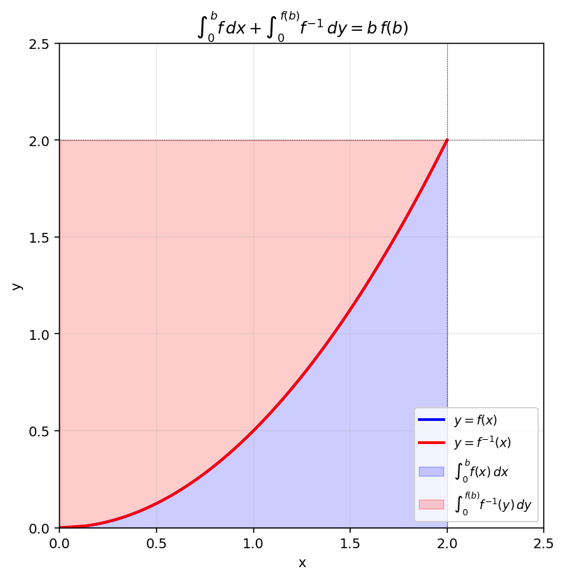

# 역함수의 적분과 룔의 정리

증가함수 $f$ 와 그 역함수 $f^{-1}$ 사이에는 적분에 관한 **대칭 공식**이 성립한다. 이 절에서는 그 공식을 정확히 다루는 사고법과, 함수와 직선의 차에 대한 최댓값을 룔의 정리로 결정짓는 표준 패턴을 익힌다.

!!! note "핵심 도구"
    1. **역함수의 미분법**: $f$ 가 미분가능한 증가함수이면 $(f^{-1})'(x) = \dfrac{1}{f'(f^{-1}(x))}$.
    2. **역함수 적분의 대칭 공식**: $f$ 가 단조이면

        $$
        \int_a^b f(x)\,dx + \int_{f(a)}^{f(b)} f^{-1}(y)\,dy = b\,f(b) - a\,f(a)
        $$

        (도형 관점: 좌표평면 위 $y = f(x)$ 와 $x$ 축·$y$ 축·두 수직선이 만드는 직사각형의 분할.)
    3. **룔의 정리**: 닫힌구간 $[a, b]$ 에서 연속, $(a, b)$ 에서 미분가능, $f(a) = f(b)$ 이면 $f'(c) = 0$ 인 $c \in (a, b)$ 가 존재.

---

## 보기: 적분조건으로 정의된 역함수

$x \geq 0$ 에서 정의된 증가하는 연속함수 $f(x)$ 의 역함수 $f^{-1}(x)$ 가 다음을 만족한다.

> (가) $x \geq 0$ 에서 $f^{-1}(x)$ 는 연속이다.
> (나) $x \geq 0$ 에서 $\displaystyle\int_0^x e^{-t}\,f^{-1}(t)\,dt = x^2$

이때 다음을 구해 보자.

(1) $f^{-1}(\ln 2),\;f^{-1}(1/2),\;f'(f^{-1}(1/2))$ 의 값.

(2) $\displaystyle\int_0^{\sqrt e} f(x)\,dx$ 의 값.

(3) $0 \leq x \leq 4\ln 2$ 에서 $g(x) = f(x) - \dfrac{x}{4}$. $g$ 가 $x = a$ 에서 최댓값을 가질 때 $g(a)$ 를 $a$ 의 유리식으로 나타내시오.

??? success "보기 풀이"

    **(1).** (나) 의 양변을 $x$ 로 미분: $e^{-x} f^{-1}(x) = 2x$. 즉

    $$
    f^{-1}(x) = 2 x e^{x}\quad (x \geq 0)
    $$

    - $f^{-1}(\ln 2) = 2 \cdot \ln 2 \cdot 2 = 4\ln 2$.
    - $f^{-1}(1/2) = 2 \cdot 1/2 \cdot e^{1/2} = \sqrt e$.
    - 역함수 미분법: $f'(f^{-1}(x)) = \dfrac{1}{(f^{-1})'(x)}$. $(f^{-1})'(x) = 2(1 + x)e^x$ 에 $x = 1/2$ 대입: $2 \cdot 3/2 \cdot \sqrt e = 3\sqrt e$. 따라서 $f'(\sqrt e) = \dfrac{1}{3\sqrt e}$.

    **(2).** $f(0) = 0$ ($x = 0$ 대입), $f(\sqrt e) = 1/2$. 대칭 공식

    $$
    \int_0^{\sqrt e} f(x)\,dx = \sqrt e \cdot f(\sqrt e) - \int_0^{f(\sqrt e)} f^{-1}(y)\,dy = \frac{\sqrt e}{2} - \int_0^{1/2} 2y e^y\,dy
    $$

    부분적분: $\int 2y e^y dy = 2(y - 1)e^y + C$. $\int_0^{1/2} = 2(-1/2)e^{1/2} - 2(-1) = -\sqrt e + 2$.

    $$
    \int_0^{\sqrt e} f(x)\,dx = \frac{\sqrt e}{2} - (-\sqrt e + 2) = \frac{3\sqrt e}{2} - 2
    $$

    **(3).** $g'(x) = f'(x) - 1/4$. $g'(a) = 0 \Leftrightarrow f'(a) = 1/4$. 룔의 정리로 $0 \leq x \leq 4\ln 2$ 구간에서 $f(0) - 0 = 0$, $f(4\ln 2) - \ln 2 = \ln 2 - \ln 2 = 0$ ($f^{-1}(\ln 2) = 4\ln 2 \Rightarrow f(4\ln 2) = \ln 2$). $g(0) = g(4\ln 2) = 0$ 이고 $g$ 가 연속·미분가능이므로 $g'(\alpha) = 0$ 인 $\alpha \in (0, 4\ln 2)$ 가 존재. 역함수 $(f^{-1})''(x) = 2(x+2)e^x > 0$ 이므로 $f^{-1}$ 가 아래로 볼록, 따라서 $f$ 는 위로 볼록. 그러므로 $g(x) = f(x) - x/4$ 도 위로 볼록 ($f''(x) < 0$), $\alpha$ 가 유일하고 거기서 최댓값.

    $f'(\alpha) = 1/4$ 와 $(f^{-1})'(2\alpha e^\alpha \cdot \cdots)$ 의 관계 ... 직접 계산. $(f^{-1})'(f(\alpha)) = 1/f'(\alpha) = 4$. 즉 $(f^{-1})'(y) = 4$ 인 $y = f(\alpha)$. $(f^{-1})'(y) = 2(1 + y)e^y$ 에서 $2(1 + y)e^y = 4 \Rightarrow (1 + y) e^y = 2$.

    한편 $f^{-1}(f(\alpha)) = \alpha$ 즉 $2 f(\alpha)\,e^{f(\alpha)} = \alpha$. $y = f(\alpha)$ 로 두면 $2 y e^y = \alpha$. 두 식 $2 y e^y = \alpha$ 와 $(1 + y) e^y = 2$ 에서 $y = \dfrac{\alpha}{4 - \alpha}$ (두번째 식에서 $e^y = 2/(1+y)$, 첫번째에 대입: $2y \cdot 2/(1+y) = \alpha \Rightarrow 4y = \alpha(1+y) \Rightarrow y(4-\alpha) = \alpha \Rightarrow y = \alpha/(4-\alpha)$).

    따라서 $f(\alpha) = \alpha/(4-\alpha)$ 이고

    $$
    g(\alpha) = f(\alpha) - \frac{\alpha}{4} = \frac{\alpha}{4 - \alpha} - \frac{\alpha}{4} = \frac{4\alpha - \alpha(4-\alpha)}{4(4-\alpha)} = \frac{\alpha^2}{4(4 - \alpha)}\quad\square
    $$

!!! info "교훈"
    - **적분조건의 양변 미분**으로 미지의 함수를 명시적으로 얻는다 — $f^{-1}(x) = 2xe^x$.
    - **대칭 공식**으로 $\int f$ 를 $\int f^{-1}$ 로 환원하면 부분적분이 훨씬 단순한 식을 다룬다.
    - **룔의 정리**가 극값의 존재를 보장하고, 그 위치는 미분조건 $f'(\alpha) = 1/4$ 로 결정.
