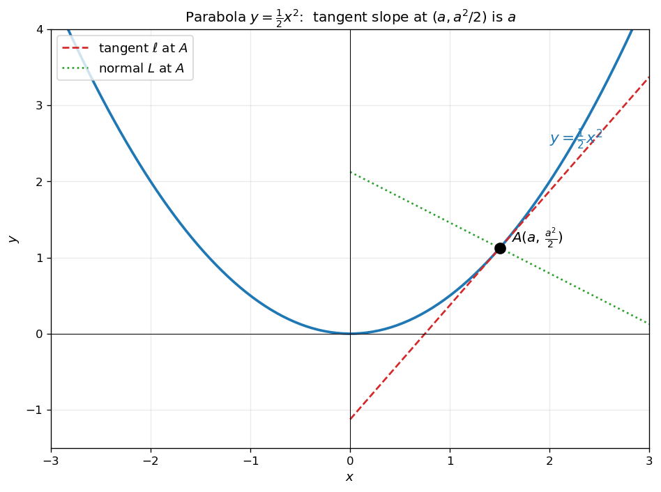
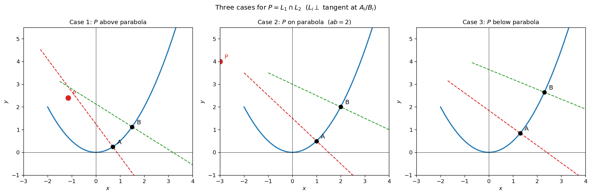
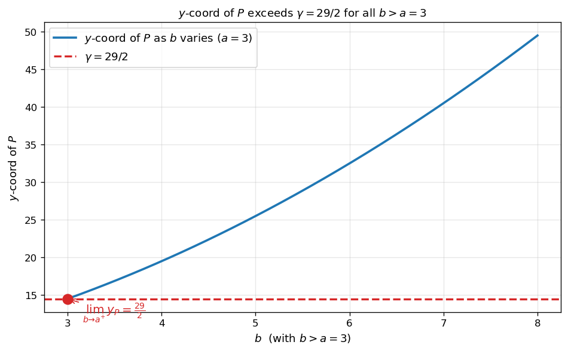
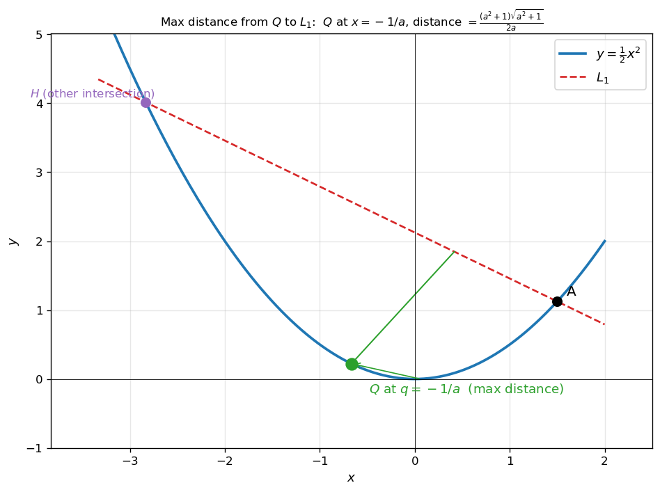
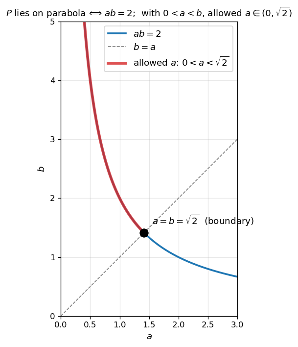
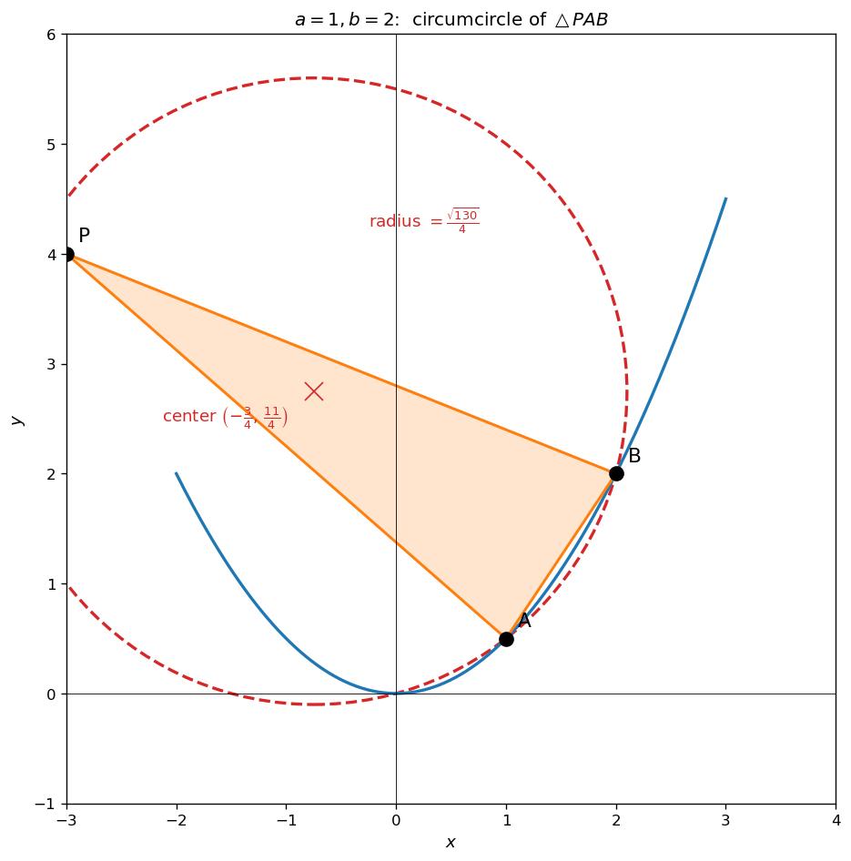
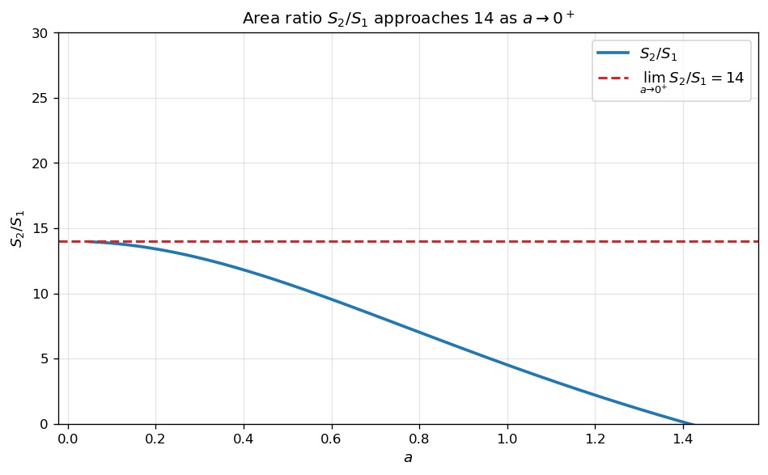

# 포물선 접선과 수직선

포물선 위의 두 점에서 접선의 **수직선** 의 교점이 어디에 있는지는 두 점의 위치에 따라 세 가지 경우로 나뉜다. 이 절에서는 그 중에서도 **교점이 다시 포물선 위에 있는 임계 조건** 을 분석하고, 그 조건 하에서 만들어지는 외접원과 도형의 넓이비의 극한을 다룬다.

!!! note "사용 도구"
    1. **포물선의 접선**: 포물선 $y = \dfrac{1}{2}x^2$ 위의 점 $(a, \dfrac{a^2}{2})$ 에서의 접선의 기울기는 $a$ 이고, 접선의 방정식은

        $$
        y - \dfrac{a^2}{2} = a(x - a) \quad\Longleftrightarrow\quad y = a x - \dfrac{a^2}{2}
        $$

    2. **수직선의 기울기**: 기울기 $m$ 인 직선에 수직인 직선의 기울기는 $-\dfrac{1}{m}$.

    3. **외접원**: 한 삼각형의 세 꼭짓점이 모두 한 원 위에 있는 그 원. 두 변의 수직이등분선의 교점이 외접원의 중심.

    4. **점과 직선 사이의 거리**: 점 $(x_0, y_0)$ 과 직선 $a x + b y + c = 0$ 사이의 거리는 $\dfrac{|a x_0 + b y_0 + c|}{\sqrt{a^2 + b^2}}$.

    5. **곡선과 직선으로 둘러싸인 도형의 넓이**: 정적분 $\int_a^b (위쪽 곡선 - 아래쪽 곡선)\,dx$.

---

## 보기 1: 포물선의 접선과 수직선

포물선 $y = \dfrac{1}{2}x^2$ 위의 점 $A(a, \tfrac{a^2}{2})$ 에서

- **접선** $\ell$: 기울기 $a$
- **수직선** $L$ (접선에 수직이고 $A$ 를 지나는 직선): 기울기 $-\dfrac{1}{a}$

수직선 $L$ 의 방정식

$$
y - \dfrac{a^2}{2} = -\dfrac{1}{a}(x - a) \quad\Longleftrightarrow\quad y = -\dfrac{x}{a} + 1 + \dfrac{a^2}{2}
$$

<figure markdown>
  { width=640 }
  <figcaption markdown>포물선 $y = \frac{1}{2}x^2$ 위의 점 $A$ 에서의 접선 (빨강 점선, 기울기 $a$) 과 그에 수직한 직선 (녹색 점선, 기울기 $-1/a$). 두 직선은 $A$ 에서 교차하며 직교한다.</figcaption>
</figure>

---

## 보기 2: 두 수직선의 교점 — 세 가지 경우

곡선 $y = \dfrac{1}{2}x^2$ 위의 두 점 $A(a, \tfrac{a^2}{2})$, $B(b, \tfrac{b^2}{2})$ (단 $0 < a < b$) 에서의 수직선을 각각 $L_1, L_2$ 라 하자. 두 수직선의 교점 $P = L_1 \cap L_2$ 의 위치는 $a, b$ 의 관계에 따라 세 가지 경우로 나뉜다.

- **Case 1**: $P$ 가 포물선 위쪽에 있음.
- **Case 2**: $P$ 가 포물선 위에 정확히 있음.
- **Case 3**: $P$ 가 포물선 아래쪽에 있음.

<figure markdown>
  { width=720 }
  <figcaption markdown>$P = L_1 \cap L_2$ 의 세 가지 경우. $a, b$ 의 관계에 따라 $P$ 가 포물선 위쪽 / 위에 / 아래쪽 에 있다. **Case 2 (교점이 포물선 위)** 가 가장 흥미로운 임계 케이스이다.</figcaption>
</figure>

!!! info "핵심 아이디어"
    포물선 위 두 점의 **수직선** (접선이 아니라) 의 교점이 어디 있는지는 $a, b$ 의 곱이 좌우한다. 임계 경우 — 교점이 다시 포물선 위에 있을 때 — 는 $a, b$ 사이에 명확한 대수적 관계 $ab = 2$ 가 생긴다 (연습문제 3 에서 확인).

---

## 연습문제

이 절의 모든 연습문제는 포물선 $y = \dfrac{1}{2}x^2$ 위의 두 점 $A(a, \tfrac{a^2}{2})$, $B(b, \tfrac{b^2}{2})$ ($0 < a < b$) 와 그에서의 수직선들의 교점 $P$ 를 사용한다.

---

**연습문제 1.** [$a = 3$ 일 때 $P$ 의 $y$ 좌표 하한] $a = 3$ 일 때, 점 $P$ 의 $y$ 좌표가 가질 수 있는 모든 값의 범위는 $y > \gamma$ 이다. $\gamma$ 의 값을 구하시오.

??? success "연습문제 1 풀이"

    **1단계 — $P$ 의 좌표.** $L_1$ 의 방정식 (점 $A = (3, \tfrac{9}{2})$, 기울기 $-\tfrac{1}{3}$):

    $$
    y = -\dfrac{x}{3} + \dfrac{11}{2}
    $$

    $L_2$ 의 방정식 (점 $B = (b, \tfrac{b^2}{2})$, 기울기 $-\dfrac{1}{b}$):

    $$
    y = -\dfrac{x}{b} + 1 + \dfrac{b^2}{2}
    $$

    두 직선의 교점을 구하면 ($x$ 에 대하여 풀이)

    $$
    x_P = -\dfrac{3b(b + 3)}{2}
    $$

    이를 $L_1$ 에 대입하여 $y_P$ 를 구하면

    $$
    y_P = \dfrac{11}{2} + \dfrac{b(b + 3)}{2} = \dfrac{11 + b^2 + 3b}{2}
    $$

    **2단계 — 최솟값.** $b > a = 3$ 범위에서 $y_P$ 는 $b$ 에 대한 단조증가 함수. $b \to 3^+$ 일 때

    $$
    \lim_{b \to 3^+} y_P = \dfrac{11 + 9 + 9}{2} = \dfrac{29}{2}
    $$

    그러나 $b = 3$ 은 두 점이 일치하는 경우로 제외되므로 $y_P > \dfrac{29}{2}$.

    따라서 $\gamma = \dfrac{29}{2}\quad\square$

    <figure markdown>
      { width=620 }
      <figcaption markdown>$a = 3$ 고정, $b$ 가 $3$ 보다 큰 범위에서 움직일 때 $P$ 의 $y$ 좌표. $b \to 3^+$ 의 극한값 $\dfrac{29}{2}$ 가 하한 $\gamma$. 단, 등호는 $b = a$ 인 perdu 경우만 도달하므로 $\gamma$ 는 포함되지 않는 하한.</figcaption>
    </figure>

---

**연습문제 2.** [수직선과 곡선 위 점 사이의 최대 거리] 곡선 $y = \dfrac{1}{2}x^2$ 과 직선 $L_1$ 의 교점 중 $A$ 가 아닌 점을 $H$ 라 하자. 곡선 위의 점 $Q$ (단, $Q$ 의 $x$ 좌표가 $H$ 의 $x$ 좌표보다 크고 $a$ 보다 작다) 와 직선 $L_1$ 사이의 거리의 최댓값을 $a$ 에 관한 식으로 나타내시오.

??? success "연습문제 2 풀이"

    **1단계 — $H$ 의 좌표.** $L_1$: $y = -\dfrac{x}{a} + 1 + \dfrac{a^2}{2}$ 와 $y = \dfrac{x^2}{2}$ 를 연립하면

    $$
    \dfrac{x^2}{2} = -\dfrac{x}{a} + 1 + \dfrac{a^2}{2}
    $$

    이를 정리하여 $x = a$ 가 한 해임을 확인한 후 나머지 해 $H$ 의 $x$ 좌표 $h$ 를 구하면

    $$
    h = -a - \dfrac{2}{a}
    $$

    **2단계 — 곡선 위의 점 $Q$ 와 $L_1$ 사이의 거리.** $Q = (q, \tfrac{q^2}{2})$, $-a - \tfrac{2}{a} < q < a$.

    직선 $L_1$ 을 $\dfrac{1}{a}x + y - 1 - \dfrac{a^2}{2} = 0$ 형태로 두면, 점-직선 거리 공식에 의해

    $$
    d = \dfrac{\left|\dfrac{q}{a} + \dfrac{q^2}{2} - 1 - \dfrac{a^2}{2}\right|}{\sqrt{\dfrac{1}{a^2} + 1}} = \dfrac{\left|\dfrac{a}{2}(q - a)\left(q + a + \dfrac{2}{a}\right)\right|}{\sqrt{a^2 + 1}/|a|} = \dfrac{-\dfrac{a}{2}(q - a)\left(q + a + \dfrac{2}{a}\right)}{\sqrt{a^2 + 1}/a}
    $$

    (구간 $-a - 2/a < q < a$ 에서 두 인수의 곱이 음수이므로 절댓값 안의 식이 음수, 분자에서 음의 부호를 빼냄.)

    **3단계 — $q$ 에 대한 최댓값.** 분자의 $q$ 에 대한 이차식

    $$
    f(q) = -\dfrac{a}{2}(q - a)\left(q + a + \dfrac{2}{a}\right)
    $$

    의 $f'(q) = -aq - 1 = 0$ 에서 $q = -\dfrac{1}{a}$. 이 점이 두 점 $H$ 와 $A$ 의 중간에 위치하므로 (구간 내부에 있음) 거리 $d$ 의 최댓값은 $q = -\dfrac{1}{a}$ 에서 발생한다.

    대입하여 정리하면

    $$
    d_{\max} = \dfrac{(a^2 + 1)\sqrt{a^2 + 1}}{2a}\quad\square
    $$

    <figure markdown>
      { width=620 }
      <figcaption markdown>곡선 $y = \tfrac{1}{2}x^2$ 위의 점 $Q$ 와 직선 $L_1$ 사이 거리의 최대값. $Q$ 의 $x$ 좌표가 $-\dfrac{1}{a}$ (구간의 중간) 일 때 최대.</figcaption>
    </figure>

---

**연습문제 3.** [$P$ 가 곡선 위에 있을 조건] 점 $P$ 가 곡선 $y = \dfrac{1}{2}x^2$ 위에 있도록 하는 $a$ 와 $b$ 사이의 관계식과 모든 $a$ 의 값의 범위를 구하시오.

??? success "연습문제 3 풀이"

    **1단계 — $P$ 의 좌표.** 연습문제 1 과 같은 방법으로 일반 $a, b$ 에 대하여

    $$
    x_P = -\dfrac{a b (a + b)}{2}
    $$

    그리고 $P$ 가 $L_1$ 위에 있으므로 $y_P = -\dfrac{x_P}{a} + 1 + \dfrac{a^2}{2}$.

    **2단계 — $P$ 가 곡선 위에 있을 조건.** $y_P = \dfrac{x_P^2}{2}$. 한편 $P$ 가 두 수직선의 교점이므로 $P$ 의 $x$ 좌표를 $t (< 0)$ 라 하면 $L_1$ 위에서 $A$ 의 $x$ 좌표는 $a$ 이고 $P$ 의 $x$ 좌표는 $t$ 이므로 $t = -a - \dfrac{2}{a}$ 와 비슷한 관계가 성립한다. 정확히는 $P$ 가 $L_1$ 위의 점 중 $A$ 가 아닌 곡선 위의 점이라는 조건이다 — 즉 $P = H$. 마찬가지로 $L_2$ 위에서도 $P$ 의 $x$ 좌표가 $-b - \dfrac{2}{b}$. 두 값이 같으므로

    $$
    -a - \dfrac{2}{a} = -b - \dfrac{2}{b} \quad\Longleftrightarrow\quad a - b = \dfrac{2}{a} - \dfrac{2}{b} = -\dfrac{2(a - b)}{ab}
    $$

    $a \neq b$ 이므로 양변을 $a - b$ 로 나누면

    $$
    1 = -\dfrac{2}{ab} \cdot (-1) \cdot ?
    $$

    좀 더 깔끔하게 정리:

    $$
    (a - b)\left(1 + \dfrac{2}{ab}\right) = 0
    $$

    실제로

    $$
    a - b + \dfrac{2}{a} - \dfrac{2}{b} = a - b + \dfrac{2(b - a)}{ab} = (a - b)\left(1 - \dfrac{2}{ab}\right) = 0
    $$

    $a \neq b$ 이므로

    $$
    1 - \dfrac{2}{ab} = 0 \quad\Longleftrightarrow\quad ab = 2
    $$

    **3단계 — $a$ 의 범위.** $0 < a < b$ 와 $ab = 2$ 를 함께 만족: $b = \dfrac{2}{a}$. $a < b$ ⟺ $a < \dfrac{2}{a}$ ⟺ $a^2 < 2$ ⟺ $0 < a < \sqrt{2}$.

    답: 관계식 $ab = 2$, 그리고 $0 < a < \sqrt{2}\quad\square$

    <figure markdown>
      { width=620 }
      <figcaption markdown>$P$ 가 곡선 위에 있을 조건은 쌍곡선 $ab = 2$ (파랑). 추가 조건 $0 < a < b$ 는 직선 $b = a$ 위쪽 영역. 두 조건의 교집합이 빨간 굵은 곡선, 그 $a$ 좌표는 $0 < a < \sqrt{2}$.</figcaption>
    </figure>

---

**연습문제 4.** [외접원의 방정식] $P$ 가 곡선 $y = \dfrac{1}{2}x^2$ 위에 있을 때 (즉 $ab = 2$), $a = 1$ 인 경우 (그러므로 $b = 2$) 삼각형 $PAB$ 의 외접원을 $C$ 라 하자. 원 $C$ 의 반지름의 길이와 원 $C$ 의 방정식을 구하시오.

??? success "연습문제 4 풀이"

    **1단계 — 세 꼭짓점.** $a = 1$, $b = 2$, 그러므로

    $$
    A = (1,\,\tfrac{1}{2}),\qquad B = (2,\,2),\qquad P = \left(-1 - 2,\,?\right)
    $$

    $P$ 의 $x$ 좌표: $-a - \dfrac{2}{a} = -1 - 2 = -3$. 곡선 위에 있으므로 $y_P = \dfrac{(-3)^2}{2} = \dfrac{9}{2}$. 즉

    $$
    P = \left(-3,\,\tfrac{9}{2}\right)
    $$

    **2단계 — 외접원의 중심.** $AB$ 의 중점 $\left(\tfrac{3}{2}, \tfrac{5}{4}\right)$, $AB$ 의 기울기 $\tfrac{2 - 1/2}{2 - 1} = \tfrac{3}{2}$. $AB$ 의 수직이등분선 $m_1$ 의 기울기는 $-\tfrac{2}{3}$, 방정식

    $$
    m_1:\quad y = -\tfrac{2}{3}x + \tfrac{9}{4}
    $$

    $AP$ 의 중점 $\left(-1, \tfrac{5}{2}\right)$, 기울기 $\tfrac{9/2 - 1/2}{-3 - 1} = -1$. $AP$ 의 수직이등분선 $m_2$ 의 기울기는 $1$, 방정식

    $$
    m_2:\quad y = x + \tfrac{7}{2}
    $$

    두 수직이등분선의 교점 = 외접원의 중심:

    $$
    -\tfrac{2}{3}x + \tfrac{9}{4} = x + \tfrac{7}{2}
    \quad\Longrightarrow\quad
    \tfrac{5}{3}x = -\tfrac{5}{4}
    \quad\Longrightarrow\quad
    x = -\tfrac{3}{4}
    $$

    $y = -\tfrac{3}{4} + \tfrac{7}{2} = \tfrac{11}{4}$. 즉 중심 $\left(-\tfrac{3}{4},\,\tfrac{11}{4}\right)$.

    **3단계 — 반지름.** 중심과 $B = (2, 2)$ 사이의 거리:

    $$
    r = \sqrt{\left(2 + \tfrac{3}{4}\right)^{\!2} + \left(2 - \tfrac{11}{4}\right)^{\!2}} = \sqrt{\tfrac{121}{16} + \tfrac{9}{16}} = \sqrt{\tfrac{130}{16}} = \dfrac{\sqrt{130}}{4}
    $$

    **결론**:

    $$
    \left(x + \tfrac{3}{4}\right)^{\!2} + \left(y - \tfrac{11}{4}\right)^{\!2} = \tfrac{65}{8}\quad\square
    $$

    <figure markdown>
      { width=640 }
      <figcaption markdown>$a = 1, b = 2$ 일 때 세 점 $P, A, B$ 와 외접원 $C$ (빨강 점선). 중심 $\left(-\tfrac{3}{4}, \tfrac{11}{4}\right)$, 반지름 $\dfrac{\sqrt{130}}{4}$.</figcaption>
    </figure>

---

**연습문제 5.** [넓이비의 극한] $P$ 가 곡선 $y = \dfrac{1}{2}x^2$ 위에 있을 때 (즉 $ab = 2$), 곡선 위의 점 $P$ 에서의 **접선** 과 $x$ 축의 교점을 $R$ 이라 하자. 두 점 $P$ 와 $R$ 을 지나는 직선과 $x$ 축 및 곡선 $y = \dfrac{1}{2}x^2$ 으로 둘러싸인 도형의 넓이를 $S_1$, 직선 $L_1, L_2$ 및 곡선 $y = \dfrac{1}{2}x^2$ 으로 둘러싸인 도형의 넓이를 $S_2$ 라 하자. $\displaystyle\lim_{a \to 0^+} \dfrac{S_2}{S_1}$ 의 값을 구하시오.

??? success "연습문제 5 풀이 (개요)"

    **1단계 — 분포 잡기.** $ab = 2$ 와 $0 < a < \sqrt{2}$ 에서 $b = \dfrac{2}{a}$. $P = (-a - \dfrac{2}{a}, \dfrac{1}{2}(a + \dfrac{2}{a})^2)$.

    $P$ 에서 접선: 곡선 위의 점에서 접선의 기울기는 $x$ 좌표와 같으므로 $-a - \dfrac{2}{a}$. 접선이 $x$ 축과 만나는 점 $R$ 의 $x$ 좌표는 (접선의 방정식 풀어서) $R = \left(-\dfrac{a + 2/a}{2},\,0\right) = \left(-\dfrac{1}{2}(a + \dfrac{2}{a}),\,0\right)$.

    **2단계 — $S_1$ 계산.** $P$ 에서의 접선과 $x$ 축, 그리고 곡선 $y = \tfrac{x^2}{2}$ 으로 둘러싸인 도형은 $R$ 의 $x$ 좌표부터 $0$ 까지의 영역 (접선이 위, $x$ 축이 아래) 빼고 그 다음 $0$ 부터 다시 좁아지는 부분 — 적분으로

    $$
    S_1 = \int_{-(a + 2/a)}^{-\frac{1}{2}(a + 2/a)} \left[\tfrac{1}{2}x^2 + (a + \tfrac{2}{a})x + \tfrac{1}{2}(a + \tfrac{2}{a})^2\right]\,dx + \int_{-\frac{1}{2}(a + 2/a)}^{0} \tfrac{1}{2}x^2\,dx
    $$

    계산 결과 (상세 생략):

    $$
    S_1 = \dfrac{1}{24}\!\left(a + \dfrac{2}{a}\right)^{\!3}
    $$

    **3단계 — $S_2$ 계산.** 직선 $L_2$ 와 곡선 사이 영역과 직선 $L_1$ 과 곡선 사이 영역의 차로 분해하여 적분. 계산 결과:

    $$
    S_2 = \dfrac{14}{3 a^3} - \dfrac{7}{12} a^3 - a + \dfrac{2}{a}
    $$

    **4단계 — 비의 극한.** $a \to 0^+$ 일 때 $a + \dfrac{2}{a} \to \infty$ 이지만 우세항만 비교하면

    $$
    S_1 \approx \dfrac{1}{24}\!\left(\dfrac{2}{a}\right)^{\!3} = \dfrac{1}{3 a^3},\qquad
    S_2 \approx \dfrac{14}{3 a^3}
    $$

    따라서

    $$
    \lim_{a \to 0^+} \dfrac{S_2}{S_1} = \dfrac{14/3a^3}{1/3a^3} = 14\quad\square
    $$

    <figure markdown>
      { width=620 }
      <figcaption markdown>$\dfrac{S_2}{S_1}$ 의 $a$ 에 따른 변화. $a \to 0^+$ 일 때 $14$ 로 수렴.</figcaption>
    </figure>

    !!! tip "큰 그림"
        - **포물선 위 두 점에서의 수직선 교점** 이라는 단순한 기하 구성에서, 두 점의 곱 $ab$ 가 교점의 위치를 결정한다.
        - **$ab = 2$ 임계 경우** 가 가장 흥미로운데, 이때 교점 $P$ 가 다시 포물선 위에 놓이며 동시에 $P$ 는 $L_1$ (혹은 $L_2$) 의 두 번째 곡선 교점 ($H$) 와 일치한다.
        - 이 조건 하에서 자연스럽게 형성되는 삼각형 $\triangle PAB$ 의 외접원, 그리고 분할 영역의 넓이 비는 모두 깔끔한 닫힌 형태로 표현된다.
        - 마지막 극한 $S_2 / S_1 \to 14$ 는 의외의 정수 값. 이는 $a$ 가 작을 때 두 영역이 모두 $1/a^3$ 의 차수로 발산하지만 그 계수의 비가 $14:1$ 임을 의미한다.
