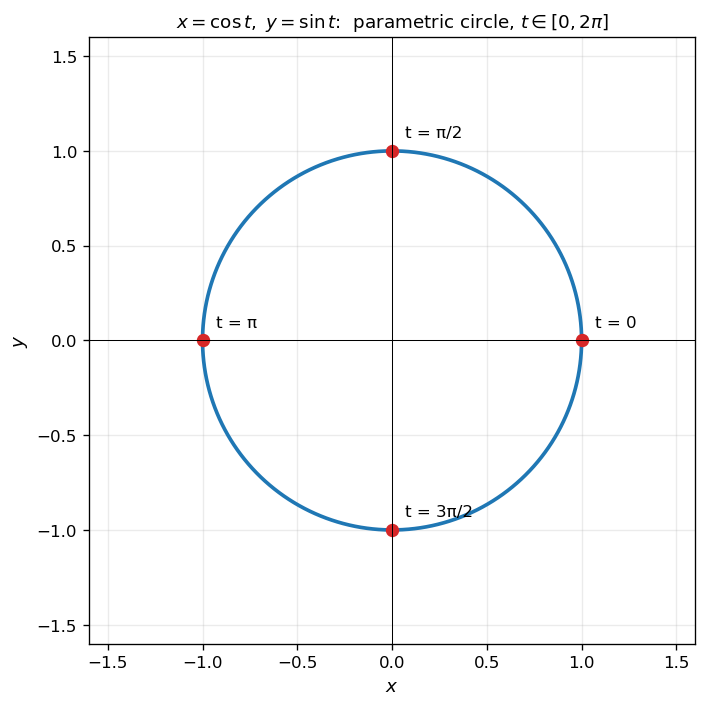
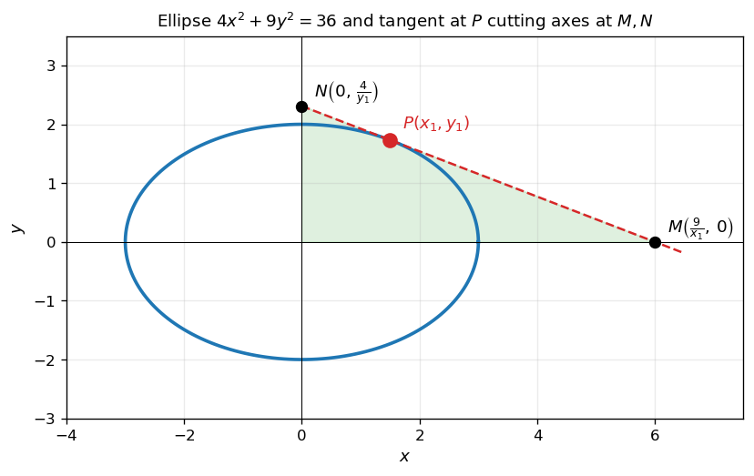
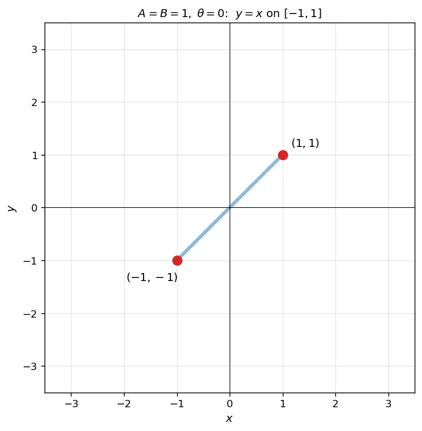
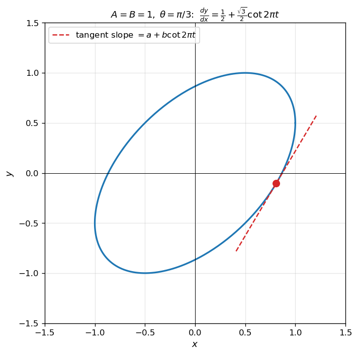
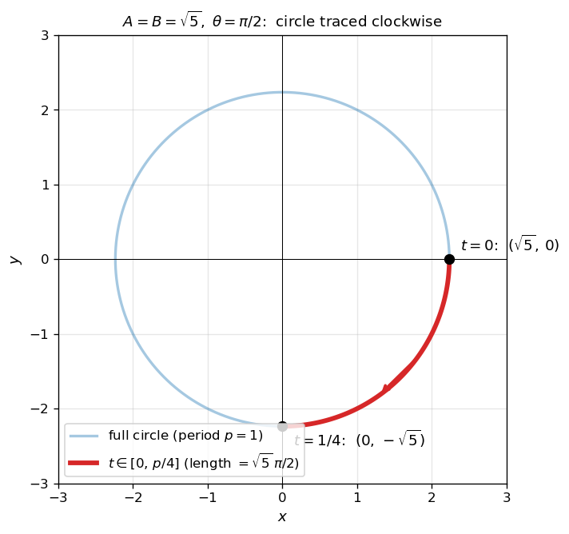
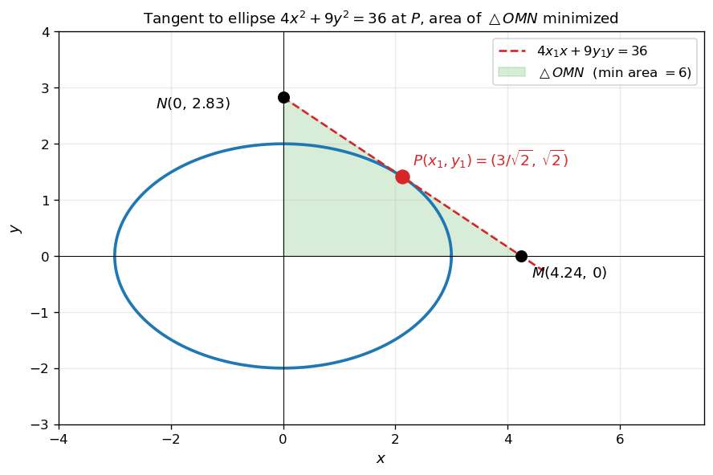
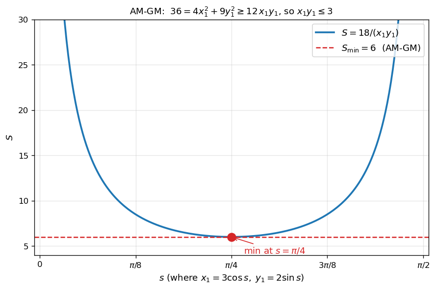

# 매개변수와 곡선의 길이

매개변수 $t$ 로 표현된 함수 $\bigl(x(t),\,y(t)\bigr)$ 의 미분과 적분은 단일 변수 함수의 그것과 약간 다른 도구를 요구한다. 이 절에서는 **매개변수 곡선의 접선 기울기**, **곡선의 길이**, 그리고 **이차곡선의 접선과 산술기하 평균** 을 결합한다.

!!! note "사용 도구"
    1. **매개변수 미분**: 미분가능한 함수 $x = x(t)$, $y = y(t)$ 에 대하여 $\dfrac{dx}{dt} \neq 0$ 인 곳에서

        $$
        \frac{dy}{dx} = \frac{dy/dt}{dx/dt}
        $$

    2. **삼각함수의 덧셈정리**:

        $$
        \cos(\alpha + \beta) = \cos\alpha\,\cos\beta - \sin\alpha\,\sin\beta
        $$

    3. **매개변수 곡선의 길이**: 매개변수 $t \in [\alpha, \beta]$ 에 대한 곡선의 길이는

        $$
        L = \int_\alpha^\beta \sqrt{\left(\dfrac{dx}{dt}\right)^{\!2} + \left(\dfrac{dy}{dt}\right)^{\!2}}\,dt
        $$

    4. **이차곡선 위의 점에서의 접선**: 타원 $\dfrac{x^2}{A^2} + \dfrac{y^2}{B^2} = 1$ 위의 점 $(x_1, y_1)$ 에서의 접선의 방정식은

        $$
        \frac{x_1 x}{A^2} + \frac{y_1 y}{B^2} = 1
        $$

    5. **산술·기하 평균 부등식 (AM-GM)**: 양수 $a, b$ 에 대하여 $a + b \geq 2\sqrt{ab}$, 등호는 $a = b$ 일 때만 성립.

---

## 보기 1: 매개변수 곡선이란

매개변수 $t$ 가 한 시간 변수처럼 흘러갈 때, $\bigl(x(t),\,y(t)\bigr)$ 라는 점이 평면 위에 자취를 남긴다. 가장 간단한 예가 단위원:

$$
x(t) = \cos t,\qquad y(t) = \sin t,\qquad t \in [0,\,2\pi]
$$

이 곡선은 한 변수 함수 $y = f(x)$ 의 형태로 한꺼번에 표현되지 않지만, $t$ 를 통해 부드럽게 그려진다.

<figure markdown>
  { width=460 }
  <figcaption markdown>매개변수 $t$ 가 $0$ 에서 $2\pi$ 까지 흐르면 점 $(\cos t, \sin t)$ 가 단위원을 한 바퀴 돈다. 매개변수 표현은 곡선이 다가 함수가 아닐 때 (한 $x$ 에 두 $y$ 가 대응) 도 자연스럽게 적용된다.</figcaption>
</figure>

---

## 보기 2: 타원의 접선과 좌표축 절편

타원 $\dfrac{x^2}{A^2} + \dfrac{y^2}{B^2} = 1$ 은 매개변수 $\bigl(A\cos s,\,B\sin s\bigr)$ 로 표현되며, 위의 점 $P(x_1, y_1)$ 에서의 접선은 $\dfrac{x_1 x}{A^2} + \dfrac{y_1 y}{B^2} = 1$. 이 접선은 $x$ 축과 $y$ 축을 각각

$$
M = \left(\frac{A^2}{x_1},\,0\right),\qquad N = \left(0,\,\frac{B^2}{y_1}\right)
$$

에서 만나므로, 좌표축과 접선으로 둘러싸인 삼각형 $\triangle OMN$ 의 넓이는

$$
S = \frac{1}{2}\,\overline{OM}\,\overline{ON} = \frac{A^2 B^2}{2\,x_1 y_1}
$$

<figure markdown>
  { width=620 }
  <figcaption markdown>타원 $4x^2 + 9y^2 = 36$ 위의 점 $P$ 에서의 접선이 좌표축과 만나는 점 $M, N$. 삼각형 $\triangle OMN$ 의 넓이는 $P$ 의 위치에 따라 달라진다. 산술·기하 평균을 이용하면 $P$ 가 어느 위치일 때 넓이가 최소가 되는지 알 수 있다.</figcaption>
</figure>

!!! info "핵심 아이디어"
    매개변수 곡선의 분석은 **각 좌표를 $t$ 에 대한 함수로 따로 다루는 것**이 핵심이다. 접선의 기울기는 $\dfrac{dy/dt}{dx/dt}$, 길이는 $\sqrt{(dx/dt)^2 + (dy/dt)^2}$ 의 적분, 이차곡선의 접선은 표준 공식. 마지막의 **최적화 문제는 산술·기하 평균** 으로 환원되는 경우가 많다.

---

## 연습문제

이 절의 모든 연습문제는 다음 매개변수 표현을 공유한다. 매 문제에서 매개변수 $A$, $B$, $\theta$ 값이 달라진다.

$$
x = A\cos 2\pi t,\qquad y = B\cos(2\pi t + \theta)
$$

여기서 $A$, $B$ 는 진폭, $\theta$ 는 위상차 (상수) 이다.

---

**연습문제 1.** [위상차가 없는 경우] $A = B = 1$, $\theta = 0$ 일 때, $x$ 와 $y$ 의 관계를 좌표평면 위에 그리시오.

??? success "연습문제 1 풀이"

    $\theta = 0$ 이면 $y = B\cos 2\pi t = \cos 2\pi t = x$ 이므로 $y = x$. 그리고 $x = \cos 2\pi t$ 는 $t$ 에 따라 $[-1, 1]$ 의 값을 취하므로 점 $(x, y)$ 는 직선 $y = x$ 의 $x \in [-1, 1]$ 부분 위에서 진동한다.

    <figure markdown>
      { width=460 }
      <figcaption markdown>$\theta = 0$ 이면 $x = y$ 이고, $x \in [-1, 1]$ 이므로 자취는 두 점 $(-1, -1)$ 과 $(1, 1)$ 을 잇는 선분이다 $\quad\square$</figcaption>
    </figure>

---

**연습문제 2.** [매개변수 미분 + 덧셈정리] $A = B = 1$, $\theta = \dfrac{\pi}{3}$ 일 때

$$
\frac{dy}{dx} = a + b\cot 2\pi t
$$

이다. 이때, 상수 $a$, $b$ 를 구하시오. (단, $2\pi t$ 는 $\pi$ 의 정수배가 아니다.)

??? success "연습문제 2 풀이"

    $x = \cos 2\pi t$, $\dfrac{dx}{dt} = -2\pi \sin 2\pi t$.

    삼각함수 덧셈정리로 $y$ 를 전개하면

    $$\begin{array}{lll}
    y 
    &=&\displaystyle \cos\!\left(2\pi t + \tfrac{\pi}{3}\right) \\
    &=&\displaystyle \cos 2\pi t \cdot \cos\tfrac{\pi}{3} - \sin 2\pi t \cdot \sin\tfrac{\pi}{3} \\
    &=&\displaystyle \tfrac{1}{2}\cos 2\pi t - \tfrac{\sqrt{3}}{2}\sin 2\pi t
    \end{array}$$

    $t$ 에 대해 미분하면

    $$
    \frac{dy}{dt} = -\tfrac{1}{2} \cdot 2\pi \sin 2\pi t - \tfrac{\sqrt{3}}{2} \cdot 2\pi \cos 2\pi t = -\pi \sin 2\pi t - \sqrt{3}\,\pi \cos 2\pi t
    $$

    따라서

    $$
    \frac{dy}{dx} = \frac{dy/dt}{dx/dt} = \frac{-\pi \sin 2\pi t - \sqrt{3}\,\pi \cos 2\pi t}{-2\pi \sin 2\pi t} = \tfrac{1}{2} + \tfrac{\sqrt{3}}{2}\cot 2\pi t
    $$

    그러므로 $a = \dfrac{1}{2}$, $b = \dfrac{\sqrt{3}}{2}\quad\square$

    <figure markdown>
      { width=460 }
      <figcaption markdown>$A = B = 1, \theta = \pi/3$ 일 때 자취. 빨간 점선은 $\dfrac{dy}{dx} = \dfrac{1}{2} + \dfrac{\sqrt{3}}{2}\cot 2\pi t$ 로 주어지는 접선의 한 예이다.</figcaption>
    </figure>

---

**연습문제 3.** [매개변수 곡선의 길이] $A = B = \sqrt{5}$, $\theta = \dfrac{\pi}{2}$ 일 때의 주기를 $p$ 라 하자. 시각 $t = 0$ 에서 $t = \dfrac{p}{4}$ 까지 자취에 그려진 곡선의 길이를 구하시오. 또한, 곡선이 시계 방향인지 반시계 방향인지 판단하시오.

??? success "연습문제 3 풀이"

    **1단계 — 식의 단순화.** $\cos(2\pi t + \pi/2) = -\sin 2\pi t$ 이므로

    $$
    x = \sqrt{5}\cos 2\pi t,\qquad y = -\sqrt{5}\sin 2\pi t
    $$

    이때 $x^2 + y^2 = 5$ 이므로 자취는 반지름 $\sqrt{5}$ 인 원. 주기는 $p = 1$.

    **2단계 — 곡선의 길이 ($t \in [0, 1/4]$).** $\dfrac{dx}{dt} = -2\sqrt{5}\,\pi \sin 2\pi t$, $\dfrac{dy}{dt} = -2\sqrt{5}\,\pi \cos 2\pi t$ 이므로

    $$
    \left(\frac{dx}{dt}\right)^{\!2} + \left(\frac{dy}{dt}\right)^{\!2} = 4 \cdot 5 \cdot \pi^2\,(\sin^2 2\pi t + \cos^2 2\pi t) = 20\pi^2
    $$

    따라서

    $$
    L = \int_0^{1/4} \sqrt{20\pi^2}\,dt = 2\sqrt{5}\,\pi \cdot \tfrac{1}{4} = \dfrac{\sqrt{5}\,\pi}{2}
    $$

    또는 반지름 $\sqrt{5}$ 원주의 $1/4$ 로부터 $2\sqrt{5}\,\pi / 4 = \sqrt{5}\,\pi / 2$.

    **3단계 — 진행 방향.** $t = 0$ 에서 $(\sqrt{5}, 0)$, $t = 1/4$ 에서 $(0, -\sqrt{5})$. 즉 $x$ 축 양의 방향에서 시작해 $y$ 축 음의 방향으로 이동 — 좌표평면에서 시계 방향. 문제의 검출기 화면 좌표계 기준으로는 **좌원편광** 에 해당한다.

    <figure markdown>
      { width=460 }
      <figcaption markdown>$A = B = \sqrt{5}, \theta = \pi/2$ 일 때 자취는 반지름 $\sqrt{5}$ 인 원. $t \in [0, p/4]$ 구간 (빨강) 의 길이는 $\dfrac{\sqrt{5}\,\pi}{2}$. 진행 방향은 $(\sqrt{5}, 0) \to (0, -\sqrt{5})$ 이므로 좌표평면에서 시계 방향.</figcaption>
    </figure>

    답: 곡선의 길이 $= \dfrac{\sqrt{5}\,\pi}{2}$, **좌원편광** $\quad\square$

---

**연습문제 4.** [타원의 접선과 산술기하 평균] $A = 3$, $B = 2$, $\theta = \dfrac{\pi}{2}$ 일 때, 자취에 그려진 곡선에서 1사분면에 위치한 임의의 점 $P(x_1, y_1)$ 에서의 접선이 $x$ 축, $y$ 축과 만나는 점을 각각 $M$, $N$ 이라 하자. 점 $P$ 에서의 접선의 방정식을 구하고, 삼각형 $\triangle OMN$ 의 넓이의 최솟값을 구하시오. (단, $O$ 는 원점이다.)

??? success "연습문제 4 풀이"

    **1단계 — 자취가 타원임을 확인.** $x = 3\cos 2\pi t$, $y = 2\cos(2\pi t + \pi/2) = -2\sin 2\pi t$ 이므로

    $$
    \left(\frac{x}{3}\right)^{\!2} + \left(\frac{y}{2}\right)^{\!2} = \cos^2 2\pi t + \sin^2 2\pi t = 1
    $$

    즉 자취는 $\dfrac{x^2}{9} + \dfrac{y^2}{4} = 1$, 또는 $4x^2 + 9y^2 = 36$.

    **2단계 — 점 $P(x_1, y_1)$ 에서의 접선.** 타원 위의 점 $(x_1, y_1)$ 에서의 접선의 방정식은

    $$
    \frac{x_1 x}{9} + \frac{y_1 y}{4} = 1
    \quad\Longleftrightarrow\quad
    4 x_1 x + 9 y_1 y = 36
    $$

    **3단계 — $M, N$ 의 좌표.** 접선이 $x$ 축과 만나는 점 ($y = 0$): $4x_1 x = 36$ ⟹ $x = \dfrac{9}{x_1}$, 즉 $M = \left(\dfrac{9}{x_1},\,0\right)$. 마찬가지로 $N = \left(0,\,\dfrac{4}{y_1}\right)$.

    **4단계 — 삼각형 $\triangle OMN$ 의 넓이.** $P$ 가 1사분면이므로 $x_1, y_1 > 0$, 따라서 $M, N$ 도 양의 좌표:

    $$
    S = \frac{1}{2} \cdot \frac{9}{x_1} \cdot \frac{4}{y_1} = \frac{18}{x_1 y_1}
    $$

    <figure markdown>
      { width=640 }
      <figcaption markdown>타원 $4x^2 + 9y^2 = 36$ 위의 점 $P$ 에서의 접선이 $x$ 축, $y$ 축과 만나는 점 $M, N$. 삼각형 $\triangle OMN$ 의 넓이는 $\dfrac{18}{x_1 y_1}$ 으로 $P$ 의 위치에 따라 달라진다. (그림은 최솟값을 주는 $P = (3/\sqrt{2}, \sqrt{2})$ 의 경우.)</figcaption>
    </figure>

    **5단계 — AM-GM 으로 최솟값.** $P$ 가 타원 위에 있으므로 $4x_1^2 + 9y_1^2 = 36$. 산술·기하 평균 부등식에 의해

    $$
    4x_1^2 + 9y_1^2 \geq 2\sqrt{4x_1^2 \cdot 9y_1^2} = 2 \cdot 6\,x_1 y_1 = 12\,x_1 y_1
    $$

    등호는 $4x_1^2 = 9y_1^2$, 즉 $2x_1 = 3y_1$ (양수이므로) 일 때 성립. 이를 $36$ 과 대조하면

    $$
    36 \geq 12\,x_1 y_1 \quad\Longrightarrow\quad x_1 y_1 \leq 3
    $$

    따라서

    $$
    S = \frac{18}{x_1 y_1} \geq \frac{18}{3} = 6
    $$

    등호가 성립하는 점: $2x_1 = 3y_1$ 과 $4x_1^2 + 9y_1^2 = 36$ 을 함께 풀면 $x_1 = \dfrac{3}{\sqrt{2}}$, $y_1 = \sqrt{2}$. 이때 $S = 6$.

    <figure markdown>
      { width=620 }
      <figcaption markdown>$P$ 를 타원 위에서 $s = $ 매개각으로 움직일 때 $S$ 의 변화. AM-GM 부등식이 $S \geq 6$ 의 하한을 주며, 등호는 $s = \pi/4$ (즉 $P = (3/\sqrt{2},\,\sqrt{2})$) 일 때 성립.</figcaption>
    </figure>

    답:
    
    - 접선의 방정식: $4 x_1 x + 9 y_1 y = 36$
    - $\triangle OMN$ 의 넓이의 최솟값: $\boxed{6}\quad\square$

    !!! tip "큰 그림"
        이 문제는 **매개변수 표현 → 타원의 표준형 → 접선의 표준 공식 → AM-GM** 의 네 단계로 깔끔하게 분해된다.

        1. **매개변수 → 표준형**: $\cos$ 과 $\sin$ 의 항을 분리하여 $\cos^2 + \sin^2 = 1$ 관계를 활용 → 자취가 타원임이 드러난다.
        2. **이차곡선의 접선**: 타원의 표준 접선 공식 $\dfrac{x_1 x}{A^2} + \dfrac{y_1 y}{B^2} = 1$ 을 직접 적용. 매개변수 미분으로 구할 수도 있지만 표준 공식이 압도적으로 빠르다.
        3. **AM-GM**: $4x_1^2 + 9y_1^2 = 36$ 의 양변에 AM-GM 을 적용하면 $x_1 y_1$ 의 상한이 나오고, 이것이 $S = \dfrac{18}{x_1 y_1}$ 의 하한으로 변환된다.

        만약 직접 미분으로 최솟값을 찾는다면 $y_1$ 을 $x_1$ 의 함수로 표현하고 $S(x_1)$ 을 미분해 0이 되는 점을 찾아야 한다 — AM-GM 한 줄과 비교하면 훨씬 번거롭다. **고전 부등식을 적절한 곳에 한 번 잘 끼워 넣는 것** 이 문제의 우아함이다.

---

**연습문제 (보충).** [매개변수 미분 + 수열 극한 + 운동거리] 자연수 $n$ 에 대하여 좌표평면 위를 움직이는 점 $\mathrm{P}$ 의 시각 $t \geq 1$ 에서의 위치 $(x, y)$ 가

$$
x = \frac{4}{2n+1}\,t^{(2n+1)/2} - \frac{4}{2n+1},\qquad y = \frac{1}{2n+1}\,t^{2n+1} - \ln t - \frac{1}{2n+1}
$$

이다. 다음에 답하시오.

(1) $\dfrac{dy}{dx} = n$ 이 되는 점 $\mathrm{P}$ 의 $x$ 좌표를 $a_n$ 이라 할 때 $\displaystyle\lim_{n\to\infty} a_n$ 을 구하시오.

(2) 시각 $t = 1$ 에서 $t = e^{1/(2n+1)}$ 까지 점 $\mathrm{P}$ 가 움직인 거리를 $\ell$, 이때 점 $\mathrm{P}$ 의 $y$ 좌표를 $m$ 이라 하자. $\dfrac{\ell}{m}$ 의 값을 구하시오.

??? success "연습문제 (보충) 풀이"

    **(1).** 양변을 $t$ 로 미분하면

    $$
    x'(t) = 2\,t^{(2n-1)/2},\qquad y'(t) = t^{2n} - \frac{1}{t}
    $$

    매개변수 미분 공식으로

    $$
    \frac{dy}{dx} = \frac{y'(t)}{x'(t)} = \frac{t^{2n} - 1/t}{2\,t^{(2n-1)/2}} = \frac{1}{2}\!\left(t^{(2n+1)/2} - t^{-(2n+1)/2}\right)
    $$

    $u = t^{(2n+1)/2}$ 으로 치환하면 $\dfrac{dy}{dx} = \dfrac{1}{2}\bigl(u - 1/u\bigr)$. 이것이 $n$ 과 같다는 조건에서 $u^2 - 2n u - 1 = 0$, 즉 $u = n + \sqrt{n^2 + 1}$ ($u > 0$). 이때

    $$
    a_n = x = \frac{4}{2n+1}\bigl(n - 1 + \sqrt{n^2 + 1}\bigr)
    $$

    $n \to \infty$ 일 때

    $$
    \lim_{n\to\infty} a_n = \lim_{n\to\infty}\frac{4(n-1)}{2n+1} + \lim_{n\to\infty}\frac{4\sqrt{n^2+1}}{2n+1} = 2 + 2 = 4\quad\square
    $$

    **(2).** 속력은

    $$
    \sqrt{x'(t)^2 + y'(t)^2} = \sqrt{4\,t^{2n-1} + t^{4n} - 2\,t^{2n-1} + \tfrac{1}{t^2}} = \sqrt{\bigl(t^{2n} + \tfrac{1}{t}\bigr)^2} = t^{2n} + \frac{1}{t}
    $$

    $b = e^{1/(2n+1)}$ 일 때 $b^{2n+1} = e$. 운동거리

    $$\begin{array}{lll}
    \ell &=&\displaystyle \int_1^b \!\left(t^{2n} + \frac{1}{t}\right)dt
        \;=\; \frac{1}{2n+1}\,b^{2n+1} + \ln b - \frac{1}{2n+1} \\
    &=&\displaystyle \frac{e}{2n+1} + \frac{1}{2n+1} - \frac{1}{2n+1}
        \;=\; \frac{e}{2n+1}
    \end{array}$$

    $y$ 좌표는 $m = \dfrac{e}{2n+1} - \dfrac{1}{2n+1} - \dfrac{1}{2n+1} = \dfrac{e - 2}{2n+1}$. 따라서

    $$
    \frac{\ell}{m} = \frac{e}{e - 2}\quad\square
    $$

    !!! info "교훈"
        - **속력 $\sqrt{(x')^2 + (y')^2}$ 이 완전제곱으로 정리** 되는 매개변수 표현은 자주 출제된다 — $t^{2n} + 1/t$ 와 같이 두 항의 곱이 $1$ 이 되도록 설계된 경우.
        - $b^{2n+1} = e$ 라는 끝점 선택으로 분모의 $2n+1$ 이 깔끔하게 상쇄되어 결과가 $n$ 에 무관한 상수가 된다 ($\ell/m = e/(e-2)$). 이런 우아한 결과는 문제 설계의 의도.
