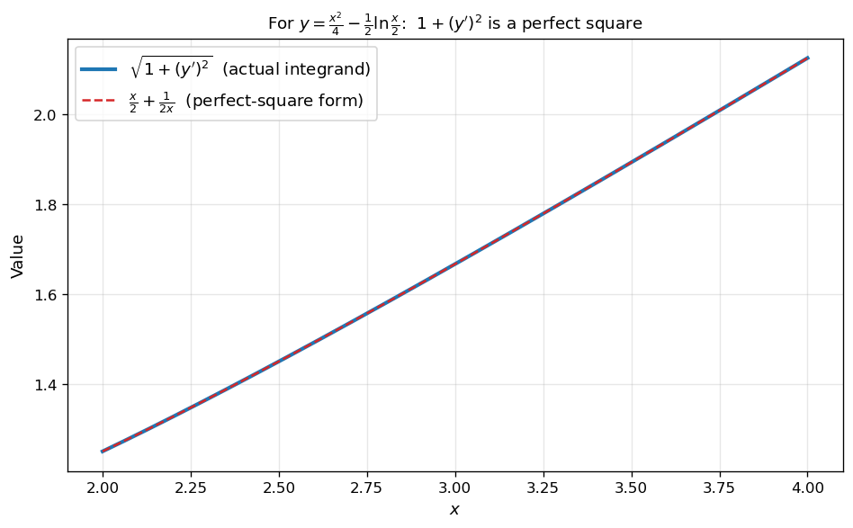
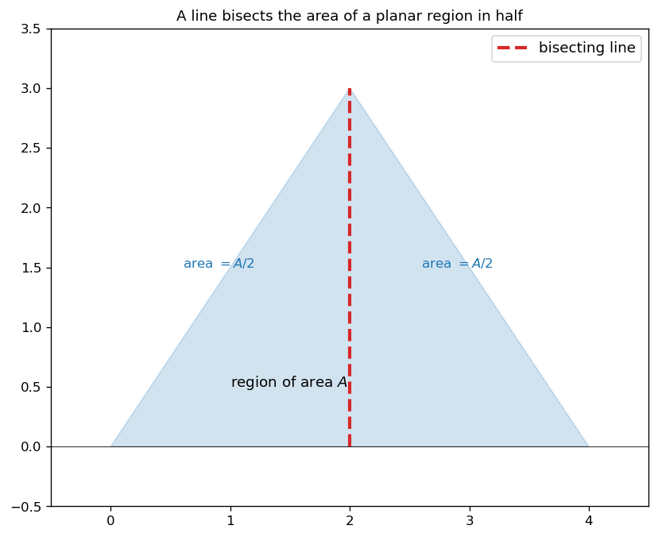
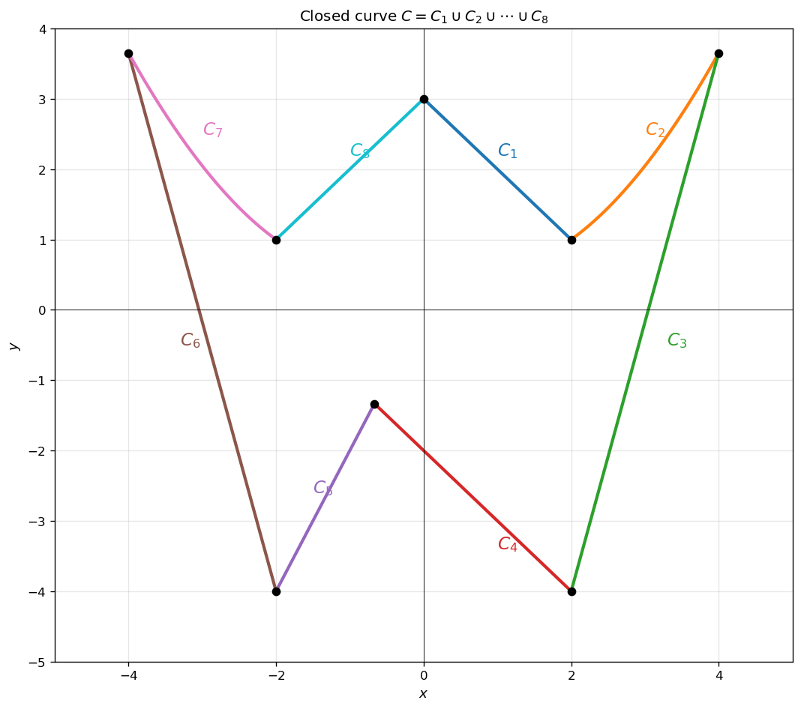
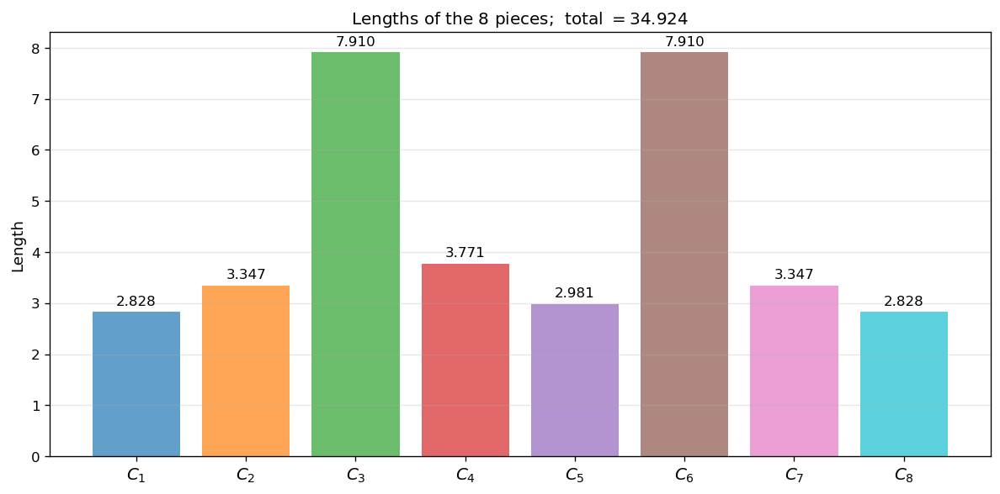
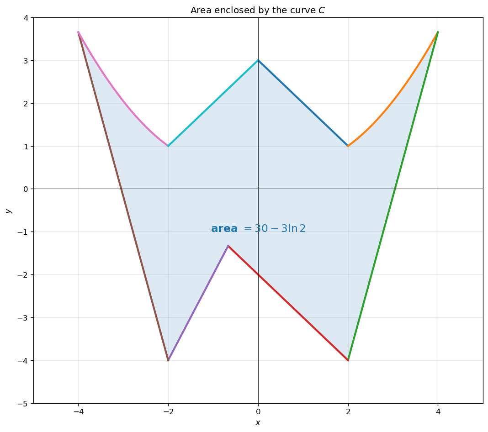
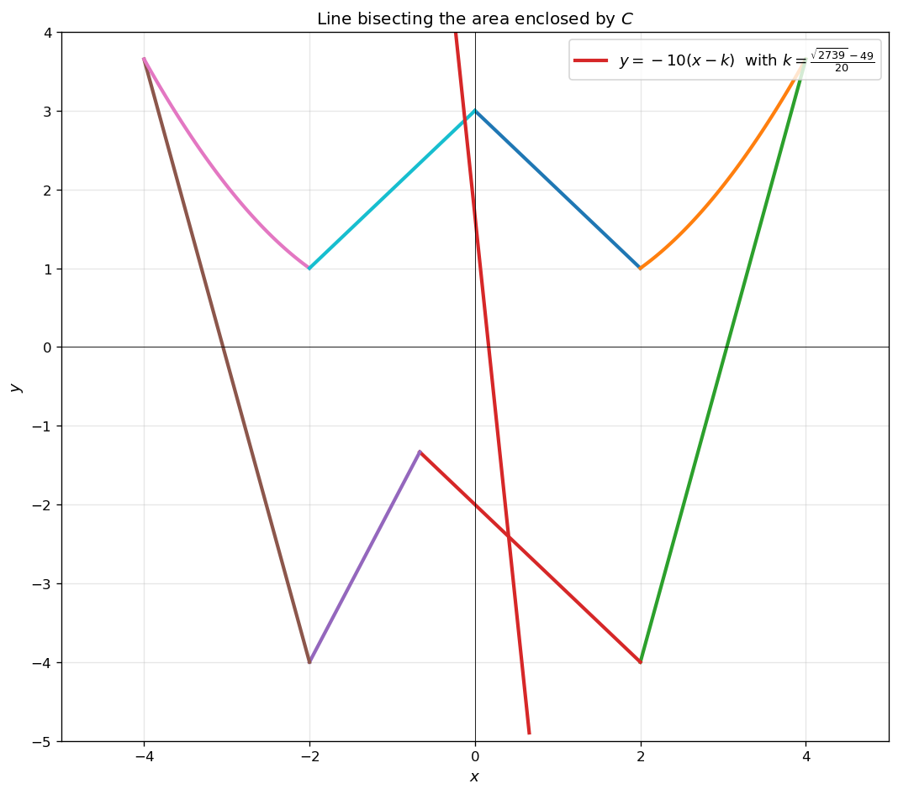
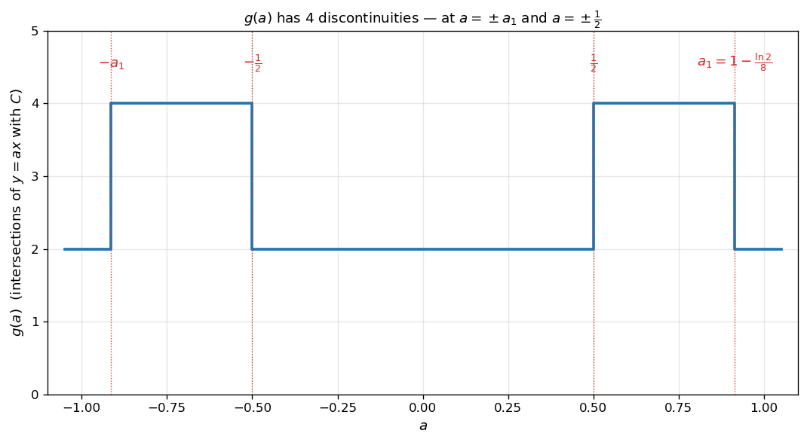
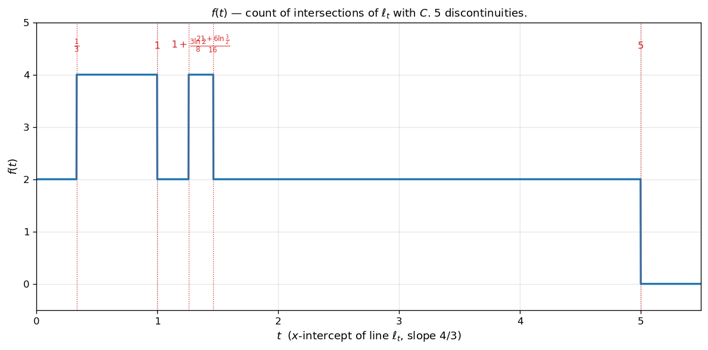

# 조각 곡선의 길이와 넓이

평면 위의 복잡한 닫힌 곡선이 여러 개의 단순한 조각 (선분·로그곡선·이차곡선 등) 으로 이어져 있을 때, 그 **길이**, **둘러싸인 도형의 넓이**, **직선과의 교점 개수** 를 분석하는 문제는 미적분학의 종합 도구를 요구한다. 이 절에서는 8 개의 조각으로 구성된 닫힌 곡선 $C$ 를 분석한다.

!!! note "사용 도구"
    1. **곡선의 길이**: 미분가능한 함수 $y = f(x)$ 의 닫힌구간 $[\alpha, \beta]$ 위의 곡선 길이는

        $$
        L = \int_\alpha^\beta \sqrt{1 + (f'(x))^2}\,dx
        $$

    2. **곡선과 곡선 사이의 넓이**: $f(x) \geq g(x)$ 인 닫힌구간 $[\alpha, \beta]$ 에서 두 곡선과 $x = \alpha, x = \beta$ 로 둘러싸인 도형의 넓이는

        $$
        S = \int_\alpha^\beta (f(x) - g(x))\,dx
        $$

    3. **직선과 곡선의 교점 개수의 연속성**: 매개변수 $a$ 에 따라 변하는 직선이 곡선 $C$ 와 만나는 점의 개수 $g(a)$ 는, 직선이 $C$ 의 **꼭짓점을 통과하거나 곡선과 접하는** 임계 $a$ 값에서 점프 (불연속) 한다.

    4. **다항함수의 인수 — 연속 보정**: 함수 $g(a)$ 가 점 $a_0$ 에서 점프 불연속을 가질 때 $p(a) = (a - a_0)^k$ 와 같이 그 점을 영점으로 갖는 다항식을 곱하면 $p(a)g(a)$ 의 연속성이 회복될 수 있다.

---

## 보기 1: $1 + (y')^2$ 이 완전제곱이 되는 곡선

특정 형태의 곡선은 곡선의 길이 공식에서 적분이 깔끔하게 풀린다. 예를 들어 $y = \dfrac{x^2}{4} - \dfrac{1}{2}\ln\dfrac{x}{2}$ ($x > 0$) 의 도함수는

$$
\frac{dy}{dx} = \frac{x}{2} - \frac{1}{2x}
$$

이고

$$
1 + \left(\frac{dy}{dx}\right)^{\!2} = 1 + \frac{x^2}{4} - \frac{1}{2} + \frac{1}{4x^2} = \frac{x^2}{4} + \frac{1}{2} + \frac{1}{4x^2} = \left(\frac{x}{2} + \frac{1}{2x}\right)^{\!2}
$$

따라서 적분 안의 제곱근이 단번에 사라지고 $x > 0$ 에서 $\sqrt{1 + (y')^2} = \dfrac{x}{2} + \dfrac{1}{2x}$ 가 된다.

<figure markdown>
  { width=640 }
  <figcaption markdown>$y = \tfrac{x^2}{4} - \tfrac{1}{2}\ln\tfrac{x}{2}$ 의 경우 $\sqrt{1 + (y')^2}$ (실선) 와 단순화된 표현 $\tfrac{x}{2} + \tfrac{1}{2x}$ (점선) 가 정확히 일치. 곡선의 길이 적분이 초등함수로 깔끔하게 닫힌다.</figcaption>
</figure>

---

## 보기 2: 직선으로 도형의 넓이를 이등분하기

평면 위의 어떤 영역의 넓이가 $A$ 일 때, 영역을 두 부분으로 나누는 직선이 양쪽 넓이를 모두 $\dfrac{A}{2}$ 로 만든다면 그 직선은 **이등분 직선**이다.

<figure markdown>
  { width=440 }
  <figcaption markdown>직선이 영역을 두 부분으로 나누고 양쪽 넓이가 같을 때, 그 직선은 영역의 넓이를 이등분한다. 일반적으로 직선의 자유도 (예: $y$ 절편) 가 하나 있으므로 등식 한 개 (양쪽 넓이가 같음) 가 그 값을 유일하게 결정한다.</figcaption>
</figure>

!!! info "핵심 아이디어"
    조각 곡선 문제는 **각 조각을 따로 처리한 뒤 결과를 모으는** 패턴이 핵심이다. 길이는 조각별 길이의 합. 넓이는 영역의 대칭성과 적분 구간 분할. 교점 개수는 곡선의 꼭짓점·접선 위치를 임계값으로 본다.

---

## 연습문제

이 절의 모든 연습문제는 다음 곡선 $C$ 를 사용한다.

!!! quote "곡선 $C$ 의 정의"
    8 개의 조각 곡선 (선분 또는 로그/이차 곡선) 으로 이루어진 닫힌 곡선:

    $$\begin{array}{lll}
    C_1 &:& y = -x + 3 \qquad (0 \leq x \leq 2) \\
    C_2 &:& y = \dfrac{x^2}{4} - \dfrac{1}{2}\ln\dfrac{x}{2} \qquad (2 \leq x \leq 4) \\
    C_3 &:& y = \dfrac{16 - \ln 2}{4}(x - 2) - 4 \qquad (2 \leq x \leq 4) \\
    C_4 &:& y = -x - 2 \qquad (-\tfrac{2}{3} \leq x \leq 2) \\
    C_5 &:& y = 2x \qquad (-2 \leq x \leq -\tfrac{2}{3}) \\
    C_6 &:& y = \dfrac{\ln 2 - 16}{4}(x + 2) - 4 \qquad (-4 \leq x \leq -2) \\
    C_7 &:& y = \dfrac{x^2}{4} - \dfrac{1}{2}\ln\!\left(-\dfrac{x}{2}\right) \qquad (-4 \leq x \leq -2) \\
    C_8 &:& y = x + 3 \qquad (-2 \leq x \leq 0)
    \end{array}$$

<figure markdown>
  { width=720 }
  <figcaption markdown>닫힌 곡선 $C = C_1 \cup C_2 \cup \cdots \cup C_8$. 8 개의 조각이 차례로 이어져 닫힌 영역을 만든다. $y$ 축에 대하여 대칭 ($C_k$ 와 $C_{9-k}$ 가 대칭쌍).</figcaption>
</figure>

---

**연습문제 1.** [곡선의 길이] 곡선 $C$ 의 길이를 구하시오.

??? success "연습문제 1 풀이"

    **1단계 — 선분 조각.**

    - $C_1$: $(0, 3) \to (2, 1)$. 길이 $= \sqrt{2^2 + 2^2} = 2\sqrt{2}$. $C_8$ 도 대칭으로 $2\sqrt{2}$.
    - $C_4$: $\left(-\tfrac{2}{3}, -\tfrac{4}{3}\right) \to (2, -4)$. $\Delta x = \tfrac{8}{3}$, $\Delta y = -\tfrac{8}{3}$. 길이 $= \tfrac{8}{3}\sqrt{2}$.
    - $C_5$: $(-2, -4) \to \left(-\tfrac{2}{3}, -\tfrac{4}{3}\right)$. $\Delta x = \tfrac{4}{3}$, $\Delta y = \tfrac{8}{3}$. 길이 $= \tfrac{4}{3}\sqrt{5}$.
    - $C_3, C_6$: 길이 $\tfrac{1}{2}\sqrt{16 + (16 - \ln 2)^2}$.

    **2단계 — 로그·이차 곡선 조각.** 보기 1 에서 본 것처럼 $C_2$ 에 대하여 $\sqrt{1 + (y')^2} = \tfrac{x}{2} + \tfrac{1}{2x}$ 이므로

    $$
    \text{길이}(C_2) = \int_2^4 \left(\dfrac{x}{2} + \dfrac{1}{2x}\right)dx = \left[\dfrac{x^2}{4} + \dfrac{1}{2}\ln x\right]_2^4 = 3 + \dfrac{1}{2}\ln 2
    $$

    대칭으로 $C_7$ 도 같음.

    **3단계 — 모두 합산.**

    $$\begin{array}{lll}
    \text{길이}(C) &=& 2 \cdot 2\sqrt{2} + 2 \cdot \left(3 + \dfrac{1}{2}\ln 2\right) + 2 \cdot \dfrac{1}{2}\sqrt{16 + (16 - \ln 2)^2} \\
    & & {}+ \dfrac{8}{3}\sqrt{2} + \dfrac{4}{3}\sqrt{5} \\[2pt]
    &=& 6 + \ln 2 + \left(4 + \dfrac{8}{3}\right)\sqrt{2} + \dfrac{4}{3}\sqrt{5} + \sqrt{16 + (16 - \ln 2)^2} \\[2pt]
    &=& 6 + \dfrac{20}{3}\sqrt{2} + \dfrac{4}{3}\sqrt{5} + \sqrt{16 + (16 - \ln 2)^2} + \ln 2\quad\square
    \end{array}$$

    <figure markdown>
      { width=720 }
      <figcaption markdown>8 개 조각 각각의 길이. 대칭쌍 ($C_1 \leftrightarrow C_8$ 등) 의 길이가 같음을 확인. $C_3, C_6$ 가 가장 김.</figcaption>
    </figure>

---

**연습문제 2.** [둘러싸인 도형의 넓이] 곡선 $C$ 로 둘러싸인 도형의 넓이를 구하시오.

??? success "연습문제 2 풀이"

    $y$ 축에 대한 대칭성으로 오른쪽 절반 (즉 $x \geq 0$ 부분) 의 넓이를 두 배하여 구한다.

    **오른쪽 절반의 넓이**: $C_1$ 위쪽 경계와 $C_4$ 아래쪽 경계, 그리고 $C_2$ 위쪽 경계와 $C_3$ 아래쪽 경계 사이의 영역 — 정확히는 $x \in [0, 2]$ 에서 $C_1$ ($y = -x + 3$, 위) 와 $C_4$ ($y = -x - 2$, 아래) 사이, $x \in [2, 4]$ 에서 $C_2$ (위) 와 $C_3$ (아래) 사이, 그리고 $x \in [-\tfrac{2}{3}, 0]$ 의 작은 영역을 따로 빼야 한다.

    적분으로 정리하면

    $$\begin{array}{lll}
    S &=& 2\!\left[\int_0^2 ((-x+3) - (-x-2))\,dx + \int_2^4 \left[\left(\dfrac{x^2}{4} - \dfrac{1}{2}\ln\dfrac{x}{2}\right) - \left(\dfrac{16-\ln 2}{4}(x-2) - 4\right)\right]dx\right] - \dfrac{4}{3} \\[3pt]
    &=& 2[10 - \dfrac{3}{2}\ln 2 + \dfrac{17}{3}] - \dfrac{4}{3} \\[2pt]
    &=& 30 - 3\ln 2\quad\square
    \end{array}$$

    (오른쪽에서 $-\dfrac{4}{3}$ 의 보정은 두 직선 $C_4, C_5$ 가 만나는 곳의 추가/제외 영역을 보정.)

    <figure markdown>
      { width=620 }
      <figcaption markdown>$C$ 로 둘러싸인 도형 (음영). 영역의 형태는 8 개의 조각으로 둘러싸인 닫힌 다각형 + 곡선 부분의 결합. 넓이는 $30 - 3\ln 2 \approx 27.92$.</figcaption>
    </figure>

---

**연습문제 3.** [넓이 이등분 직선] 직선 $y = -10(x - k)$ 가 곡선 $C$ 로 둘러싸인 도형의 넓이를 이등분할 때, 상수 $k$ 의 값을 구하시오.

??? success "연습문제 3 풀이 (개요)"

    **1단계 — 직선의 형태.** $y = -10(x - k)$ 는 기울기 $-10$ 인 매우 가파른 직선, $x$ 절편이 $k$.

    **2단계 — 직선이 어느 조각들과 만나는지 분석.** 기울기가 $-10$ 으로 가파르므로 직선은 거의 수직에 가깝게 영역을 자른다. 연습문제 2 의 답에 따라 영역의 좌·우 비대칭이 $y$ 축 기준으로 $\dfrac{4}{3}$ (오른쪽이 작음). 이등분 직선은 $y$ 축에서 약간 오른쪽으로 이동해야 좌·우 넓이가 같아진다.

    구체적으로, 직선이 $C_4$ 와 $C_8$ 을 지나는 경우 분석. $y = -10(x - k)$ 가 $C_8$: $y = x + 3$ 과 만나는 점: $-10(x-k) = x + 3 \Rightarrow x = \dfrac{10k - 3}{11}$. $C_4$: $y = -x - 2$ 와 만나는 점: $-10(x-k) = -x - 2 \Rightarrow x = \dfrac{10k+2}{9}$.

    **3단계 — 분할된 두 영역의 넓이가 같음.** 직선의 왼쪽 부분 넓이 $=$ 오른쪽 부분 넓이 $= \tfrac{1}{2}(30 - 3\ln 2)$. 이 등식을 풀면

    $$
    \dfrac{1}{2}(10k + 2) \cdot \dfrac{10k + 2}{9} - \dfrac{1}{2}(3 - 10k) \cdot \dfrac{3 - 10k}{11} = \dfrac{2}{3}
    $$

    이를 $k$ 에 대한 이차방정식으로 정리하여 양수 해를 구하면

    $$
    k = \dfrac{\sqrt{2739} - 49}{20}\quad\square
    $$

    <figure markdown>
      { width=620 }
      <figcaption markdown>$y = -10(x - k)$ 가 곡선 $C$ 의 도형 넓이를 이등분할 때 $k = \dfrac{\sqrt{2739} - 49}{20} \approx 0.166$. 영역의 좌·우 비대칭을 보정하기 위해 $y$ 축 기준으로 약간 오른쪽으로 직선이 위치한다.</figcaption>
    </figure>

---

**연습문제 4.** [교점 개수 $g(a)$ 와 다항함수] 실수 $a$ ($-1 \leq a \leq 1$) 에 대하여 직선 $y = ax$ 가 곡선 $C$ 와 만나는 점의 개수를 $g(a)$ 라 하자. 다음 조건을 만족시키는 가장 낮은 차수의 다항함수 $p(a)$ 에 대하여 $p(0)$ 의 값을 구하시오.

!!! quote "조건"
    ① $h(a) = p(a)g(a)$ 로 정의된 함수 $h(a)$ 가 $-1 \leq a \leq 1$ 에서 연속이다.

    ② $p(a)$ 는 일차 이상의 다항함수이다.

    ③ $p(a)$ 의 최고차항의 계수는 $1$ 이다.

??? success "연습문제 4 풀이"

    **1단계 — $g(a)$ 분석.** 원점을 지나는 직선 $y = ax$ 가 $C$ 와 만나는 점의 개수는 기울기 $a$ 에 따라 달라진다. $C$ 가 $y$ 축에 대해 대칭이므로 $g$ 도 우함수 ($g(-a) = g(a)$).

    임계 기울기:

    - $a = \pm \dfrac{1}{2}$: 직선이 곡선 $C_3$ (또는 $C_6$) 의 끝점 $(4, 4 - \tfrac{\ln 2}{2})$ 을 정확히 통과하지 않지만, $C_4$ ($y = -x - 2$ 와 직선 교점) 의 기하로 인해 교점 개수가 변화.
    - $a = \pm a_1$ where $a_1 = 1 - \dfrac{\ln 2}{8}$: 직선 $y = ax$ 가 원점과 $\left(4, 4 - \dfrac{\ln 2}{2}\right)$ 을 지나는 기울기. 직선이 곡선의 corner를 통과하면서 교점 개수가 변화.

    교점 개수표:

    | $a$ 의 범위 | $g(a)$ |
    |:---:|:---:|
    | $a_1 < |a| \leq 1$ | $2$ |
    | $|a| = a_1$ | $3$ |
    | $\dfrac{1}{2} < |a| < a_1$ | $4$ |
    | $|a| = \dfrac{1}{2}$ | $3$ |
    | $|a| < \dfrac{1}{2}$ | $2$ |

    $g(a)$ 는 $a = -a_1, -\dfrac{1}{2}, \dfrac{1}{2}, a_1$ 의 4 점에서 불연속.

    **2단계 — 연속화 다항식.** $h(a) = p(a)g(a)$ 가 모든 $a$ 에서 연속이려면, $g(a)$ 의 모든 불연속점에서 $p(a) = 0$ 이어야 한다 (불연속의 점프를 영으로 곱해 상쇄). 가장 낮은 차수의 다항식:

    $$
    p(a) = (a - a_1)(a + a_1)\!\left(a - \tfrac{1}{2}\right)\!\left(a + \tfrac{1}{2}\right) = \left(a^2 - a_1^2\right)\!\left(a^2 - \tfrac{1}{4}\right)
    $$

    (4 점에서 영, 최고차항 계수 $1$, 일차 이상 ✓.)

    **3단계 — $p(0)$.**

    $$
    p(0) = (0 - a_1^2)\!\left(0 - \tfrac{1}{4}\right) = \tfrac{a_1^2}{4} = \tfrac{1}{4}\!\left(1 - \tfrac{\ln 2}{8}\right)^{\!2}\quad\square
    $$

    <figure markdown>
      { width=720 }
      <figcaption markdown>$g(a)$ 의 그래프 — 우함수 (좌우대칭), $a = \pm a_1, \pm \tfrac{1}{2}$ 에서 점프. 이 4 점을 모두 영점으로 갖는 가장 낮은 차수의 monic 다항식 $p(a) = (a^2 - a_1^2)(a^2 - \tfrac{1}{4})$ 가 답.</figcaption>
    </figure>

---

**연습문제 5.** [직선 $\ell$ 의 불연속점] 양의 실수 $t$ 에 대하여 기울기가 $\dfrac{4}{3}$ 이고 $x$ 절편이 $t$ 인 직선을 $\ell_t$ 라 하자. 직선 $\ell_t$ 가 곡선 $C$ 와 만나는 점의 개수를 $f(t)$ 라 할 때, $f(t)$ 가 불연속인 양의 실수 $t$ 의 값을 모두 구하시오.

??? success "연습문제 5 풀이 (개요)"

    **1단계 — 임계 $t$ 값들.** 직선 $\ell_t : y = \tfrac{4}{3}(x - t)$ 가 곡선의 corner 를 통과하거나 곡선과 접할 때 교점 개수가 변화. 주요 임계값:

    | $t$ | $\ell_t$ 가 지나는 점 |
    |:---:|:---|
    | $\tfrac{1}{3}$ | corner $\left(-\tfrac{2}{3},\,-\tfrac{4}{3}\right)$ |
    | $1$ | corner $(-2,\,-4)$ |
    | $\tfrac{5}{4}$ | corner $(2,\,1)$ |
    | $1 + \tfrac{3\ln 2}{8}$ | corner $\left(4,\,4 - \tfrac{\ln 2}{2}\right)$ |
    | $\tfrac{21 + 6\ln(3/2)}{16}$ | $C_2$ 에 접 (접점 $\left(3,\,\tfrac{9}{4} - \tfrac{1}{2}\ln\tfrac{3}{2}\right)$) |
    | $5$ | corner $(2,\,-4)$ |

    ($C_2$ 의 접선 기울기: $\tfrac{dy}{dx} = \tfrac{x}{2} - \tfrac{1}{2x}$. $x = 3$ 에서 $\tfrac{3}{2} - \tfrac{1}{6} = \tfrac{4}{3}$ ✓.)

    **2단계 — 각 $t$ 값에서 $f$ 의 변화.** $t$ 가 임계값을 지날 때마다 교점 개수가 변화하는지 또는 일시적 변화 (점프 후 즉시 회복) 인지 분석.

    | $t$ 의 범위 | $f(t)$ |
    |:---:|:---:|
    | $0 < t < \tfrac{1}{3}$ | $2$ |
    | $t = \tfrac{1}{3}$ | $3$ |
    | $\tfrac{1}{3} < t < 1$ | $4$ |
    | $t = 1$ | $3$ |
    | $1 < t < \tfrac{5}{4}$ | $2$ |
    | $t = \tfrac{5}{4}$ | $2$ ← *연속* |
    | $\tfrac{5}{4} < t < 1 + \tfrac{3\ln 2}{8}$ | $2$ |
    | $t = 1 + \tfrac{3\ln 2}{8}$ | $3$ |
    | ... | ... |
    | $t = 5$ | $1$ |
    | $t > 5$ | $0$ |

    $t = \tfrac{5}{4}$ 의 경우 $\ell_t$ 가 $(2, 1)$ corner 를 지나지만 좌우극한이 모두 $2$ 로 같아 $f$ 가 그 점에서 연속 (점프 없음).

    **3단계 — 불연속점.** $f(t)$ 가 좌우극한과 함숫값이 다른 곳:

    $$
    t = \dfrac{1}{3},\;\; 1,\;\; 1 + \dfrac{3\ln 2}{8},\;\; \dfrac{21 + 6\ln(3/2)}{16},\;\; 5\quad\square
    $$

    <figure markdown>
      { width=720 }
      <figcaption markdown>$f(t)$ 의 그래프 — $t = \dfrac{1}{3}, 1, 1 + \dfrac{3\ln 2}{8}, \dfrac{21 + 6\ln(3/2)}{16}, 5$ 의 5 점에서 점프 불연속. $t = \dfrac{5}{4}$ 는 $\ell$ 이 corner $(2, 1)$ 를 지나지만 좌우극한이 모두 $2$ 로 같으므로 $f$ 는 연속.</figcaption>
    </figure>

    !!! tip "큰 그림"
        이 절의 5 개 연습문제는 **하나의 복잡한 닫힌 곡선** 을 둘러싸고 점차 다양한 분석 도구를 적용한다.

        1. **길이 (연습문제 1)**: 각 조각의 길이를 따로 계산해 합산. $y = \tfrac{x^2}{4} - \tfrac{1}{2}\ln\tfrac{x}{2}$ 의 특수한 형태 덕분에 적분이 완전제곱 → 초등함수로 닫힘.
        2. **넓이 (연습문제 2)**: 대칭성과 $x$ 적분 구간 분할.
        3. **이등분 (연습문제 3)**: 좌·우 대칭이 깨진 영역에서, 직선의 자유도 한 개 ($k$) 가 이등분 조건 (두 부분 넓이 같음, 등식 한 개) 으로 유일하게 결정.
        4. **교점 개수의 연속성 (연습문제 4)**: 매개변수 $a$ 가 임계값을 지날 때 $g(a)$ 의 점프 → 다항식 곱으로 상쇄.
        5. **접선과 corner의 분류 (연습문제 5)**: 직선이 곡선과 만나는 점의 개수가 변화하는 임계값을 모두 찾고, 좌우극한과 함숫값의 차이로 불연속 점을 식별.

        본 절의 문제는 **하나의 닫힌 곡선** 을 매개로 미적분의 모든 핵심 도구 (적분으로 길이·넓이 계산, 매개변수의 임계 분석, 다항식과 연속성, 접선의 기울기) 가 어우러지는 종합 문제이다.
