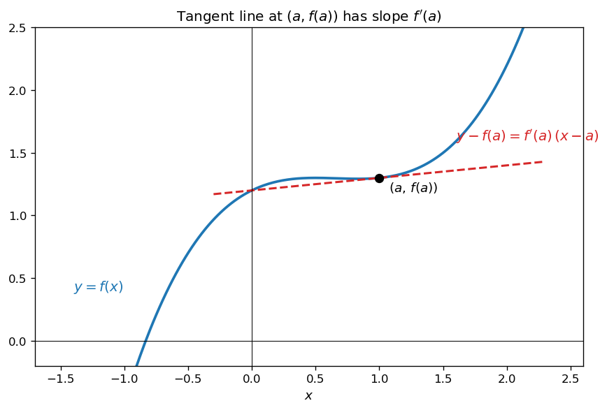
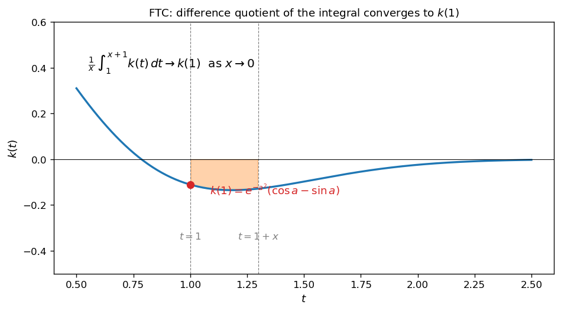
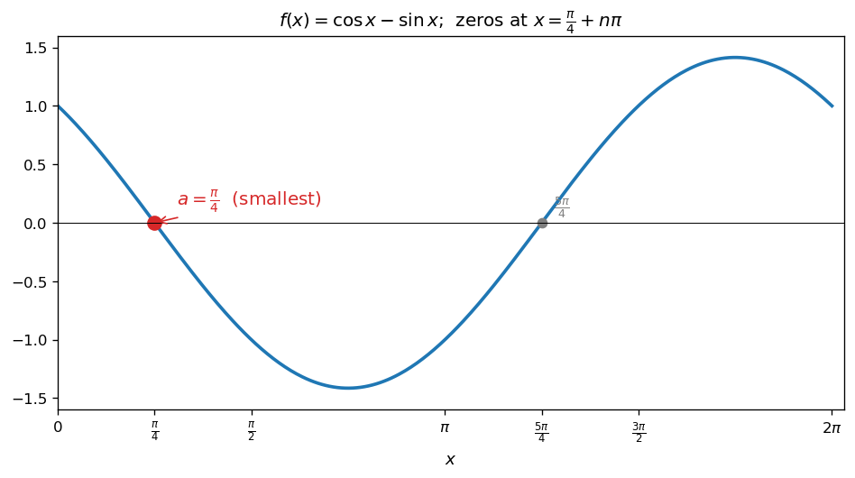
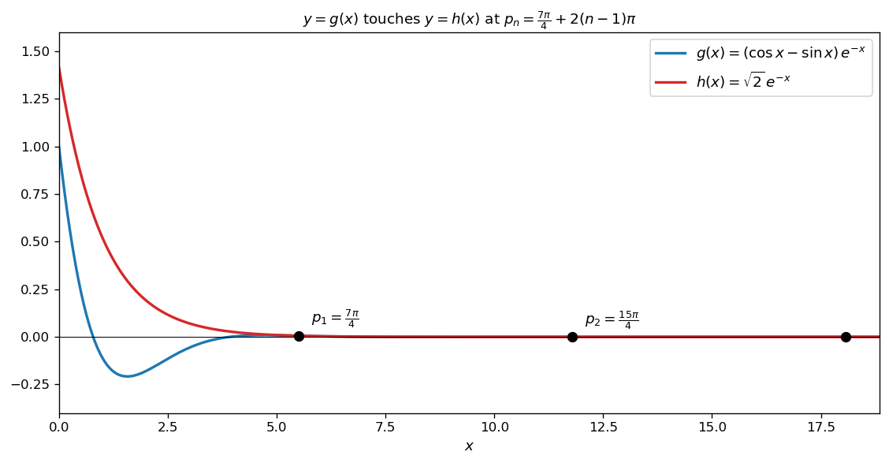
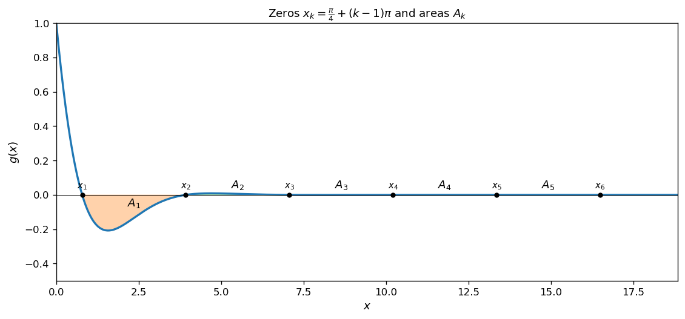
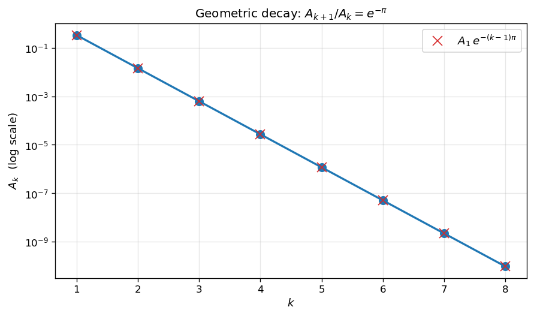

# 접선과 도형의 넓이

미분계수와 접선, 그리고 정적분으로 표현되는 도형의 넓이는 미적분의 두 축이다. 이 절에서는 세 가지 핵심 도구를 결합한다.

!!! note "사용 도구"
    1. **미분계수의 정의**: 함수 $K(x)$ 에 대하여

        $$
        K'(x_0) = \lim_{x \to x_0} \frac{K(x) - K(x_0)}{x - x_0}
        $$

        특히 $K(x) = \displaystyle\int_a^x k(t)\,dt$ 이면 미적분학의 기본정리에 의해 $K'(x) = k(x)$ 이다.

    2. **접선의 방정식**: 함수 $f(x)$ 가 $x = a$ 에서 미분가능할 때, 곡선 $y = f(x)$ 위의 점 $(a, f(a))$ 에서의 접선의 방정식은

        $$
        y - f(a) = f'(a)(x - a)
        $$

    3. **도형의 넓이**: 함수 $f(x)$ 가 닫힌구간 $[a, b]$ 에서 연속일 때, 곡선 $y = f(x)$ 와 $x$ 축 및 두 직선 $x = a$, $x = b$ 로 둘러싸인 도형의 넓이 $S$ 는

        $$
        S = \int_a^b |f(x)|\,dx
        $$

---

## 보기 1: 미분계수는 접선의 기울기

곡선 $y = f(x)$ 위의 점 $(a, f(a))$ 에서의 접선의 기울기는 미분계수 $f'(a)$ 이다.

<figure markdown>
  { width=580 }
  <figcaption markdown>곡선 $y = f(x)$ (파란색) 위의 점 $(a, f(a))$ 에서 접선 (빨간 점선) 의 기울기는 $f'(a)$ 이다. 접선의 방정식은 $y - f(a) = f'(a)(x - a)$.</figcaption>
</figure>

---

## 보기 2: 미적분학의 기본정리와 차분몫

다음 극한을 생각해 보자.

$$
\lim_{x \to 0} \frac{1}{x} \int_1^{x+1} k(t)\,dt
$$

$\displaystyle K(x) = \int_1^x k(t)\,dt$ 로 두면 $K(1) = 0$ 이고, 위 식의 분자는 $K(x + 1) - K(1) = K(x+1)$ 이므로 극한은

$$
\lim_{x \to 0} \frac{K(x + 1) - K(1)}{x} = K'(1) = k(1)
$$

이다. **즉, 적분의 차분몫은 적분 변수의 위쪽 끝점에서의 피적분함수 값에 수렴**한다.

<figure markdown>
  { width=620 }
  <figcaption markdown>$\dfrac{1}{x}\displaystyle\int_1^{x+1} k(t)\,dt$ 는 너비 $x$ 의 좁은 띠 (오렌지색) 의 넓이를 너비로 나눈 평균값. $x \to 0$ 으로 좁아질수록 이 평균값은 $t = 1$ 에서의 값 $k(1)$ 에 수렴한다.</figcaption>
</figure>

!!! info "핵심 아이디어"
    **정적분의 미분계수는 피적분함수의 값.** 이 등식은 단순한 차분몫이지만, 적분으로 정의된 양을 미분 한 단계로 회수할 수 있다는 강력한 도구이다.

---

## 연습문제

이 절의 연습문제는 모두 닫힌구간 $[0, 10\pi]$ 위에서 정의된 함수 $f(x) = \cos x - \sin x$ 와 $g(x) = f(x)e^{-x}$ 를 사용한다.

---

**연습문제 1.** [미분계수의 정의 활용] 다음 등식을 만족시키는 양수 $a$ 의 최솟값을 구하시오.

$$
\lim_{x \to 0} \frac{1}{x} \int_1^{x+1} e^{-(at)^2} f(at)\,dt = 0
$$

??? success "연습문제 1 풀이"

    $k(t) = e^{-(at)^2} f(at)$, $K(x) = \displaystyle\int_1^x k(t)\,dt$ 로 두면 보기 2와 같은 방식으로

    $$
    \lim_{x \to 0} \frac{1}{x}\int_1^{x+1} k(t)\,dt = K'(1) = k(1) = e^{-a^2} f(a)
    $$

    이 값이 $0$ 이 되려면 $e^{-a^2} > 0$ 이므로 $f(a) = \cos a - \sin a = 0$, 즉 $\cos a = \sin a$, 즉 $\tan a = 1$ 이어야 한다.

    양수 해 $a = \dfrac{\pi}{4} + n\pi$ ($n = 0, 1, 2, \ldots$) 중 최솟값은 $a = \dfrac{\pi}{4}\quad\square$

    <figure markdown>
      { width=620 }
      <figcaption markdown>$f(x) = \cos x - \sin x$ 의 그래프. $f(a) = 0$ ⟺ $\tan a = 1$ ⟺ $a = \pi/4 + n\pi$. 양수 중 최솟값은 $\pi/4$ (빨간 점).</figcaption>
    </figure>

---

**연습문제 2.** [공통접선 조건] 닫힌구간 $[0, 10\pi]$ 에서 정의된 두 함수 $g(x) = f(x)\,e^{-x}$ 와 $h(x) = b\,e^{-x}$ 는 다음 조건을 만족시킨다. (단, $b$ 는 양수.)

!!! quote "조건"
    두 곡선 $y = g(x)$ 와 $y = h(x)$ 가 만나고, 만나는 모든 점에서 곡선 $y = g(x)$ 에 접하는 직선과 곡선 $y = h(x)$ 에 접하는 직선이 일치한다.

두 곡선 $y = g(x)$ 와 $y = h(x)$ 가 만나는 점의 $x$ 좌표를 작은 수부터 크기순으로 나열할 때 두 번째 수를 $p_2$ 라 하자. $b + p_2$ 의 값을 구하시오.

??? success "연습문제 2 풀이"

    **1단계 — 만나는 점에서의 두 조건.** 교점 $x = p$ 에서

    - 함숫값이 같다: $g(p) = h(p)$ ⟹ $(\cos p - \sin p)e^{-p} = b\,e^{-p}$ ⟹

        $$
        \cos p - \sin p = b \tag{i}
        $$

    - 접선이 같다 (즉 미분계수가 같다): $g'(p) = h'(p)$.

        $g'(x) = e^{-x}\bigl(f'(x) - f(x)\bigr) = e^{-x}\bigl((-\sin x - \cos x) - (\cos x - \sin x)\bigr) = -2\cos x \cdot e^{-x}$

        $h'(x) = -b\,e^{-x}$

        따라서 $-2\cos p \cdot e^{-p} = -b\,e^{-p}$ ⟹

        $$
        2\cos p = b \tag{ii}
        $$

    **2단계 — 두 조건의 결합.** (i), (ii) 로부터 $\cos p - \sin p = 2\cos p$ ⟹ $\cos p = -\sin p$ ⟹ $\tan p = -1$. 양수 해는 $p = \dfrac{3\pi}{4} + n\pi$ ($n = 0, 1, 2, \ldots$).

    그런데 $b > 0$ 이고 (ii) 에 의해 $b = 2\cos p > 0$ 이려면 $\cos p > 0$ 이 필요하다. $\tan p = -1$ 과 $\cos p > 0$ 을 동시에 만족시키는 $p$ 는 $p = \dfrac{7\pi}{4} + 2k\pi$ ($k = 0, 1, 2, \ldots$).

    이때 $\cos\left(\dfrac{7\pi}{4}\right) = \dfrac{\sqrt{2}}{2}$ 이므로 $b = 2 \cdot \dfrac{\sqrt{2}}{2} = \sqrt{2}$.

    **3단계 — 교점의 나열과 $p_2$.** $[0, 10\pi]$ 위의 교점은

    $$
    p_1 = \frac{7\pi}{4},\quad p_2 = \frac{15\pi}{4},\quad p_3 = \frac{23\pi}{4},\quad \ldots
    $$

    이므로 $p_2 = \dfrac{15\pi}{4}$. 따라서

    $$
    b + p_2 = \sqrt{2} + \frac{15\pi}{4}\quad\square
    $$

    <figure markdown>
      { width=720 }
      <figcaption markdown>$g(x) = (\cos x - \sin x)e^{-x}$ (파란색) 와 $h(x) = \sqrt{2}\,e^{-x}$ (빨간색). 두 곡선은 $p_n = \dfrac{7\pi}{4} + 2(n-1)\pi$ 에서 접한다.</figcaption>
    </figure>

    !!! tip "큰 그림"
        만나는 점에서 접선의 기울기가 일치한다는 조건은 **두 곡선이 그 점에서 단순히 만나는 것이 아니라 접하고 있음**을 의미한다. 이는 함숫값 일치 (i) 와 함께 두 미지수 ($p$ 와 $b$) 에 대한 두 방정식을 제공하므로 시스템이 닫힌다.

---

**연습문제 3.** [도형의 넓이와 등비수열] 자연수 $k$ 에 대하여, 방정식 $g(x) = 0$ 을 만족시키는 양수 $x$ 를 작은 수부터 크기순으로 나열할 때 $k$ 번째 수를 $x_k$ 라 하자. $x_k \leq x \leq x_{k+1}$ 에서 곡선 $y = g(x)$ 와 $x$ 축으로 둘러싸인 도형의 넓이를 $A_k$ 라 하자. $A_1 + \dfrac{A_6}{A_3}$ 의 값을 구하시오.

??? success "연습문제 3 풀이"

    **1단계 — 영점.** $g(x) = (\cos x - \sin x)\,e^{-x} = 0$ ⟺ $\cos x = \sin x$ ⟺ $\tan x = 1$ ⟺ $x = \dfrac{\pi}{4} + n\pi$. 양수 해를 정렬하면

    $$
    x_k = \frac{\pi}{4} + (k - 1)\pi \quad (k = 1, 2, 3, \ldots)
    $$

    **2단계 — $g$ 의 부정적분.** 곱의 미분 법칙으로

    $$
    \frac{d}{dx}\!\bigl[e^{-x} \sin x\bigr] = -e^{-x} \sin x + e^{-x} \cos x = (\cos x - \sin x)\,e^{-x} = g(x)
    $$

    따라서 $\displaystyle\int g(x)\,dx = e^{-x} \sin x + C$ (별도의 부분적분 없이 위 관계식으로부터 즉시 얻는다).

    **3단계 — $A_k$ 의 표현.** $[x_k, x_{k+1}]$ 위에서 $g$ 는 부호를 한 번만 바꾸지 않는다 (영점은 양 끝점뿐). 따라서

    $$
    A_k = \left|\int_{x_k}^{x_{k+1}} g(x)\,dx\right| = \bigl|\,[e^{-x} \sin x]_{x_k}^{x_{k+1}}\,\bigr|
    $$

    **4단계 — $A_1$ 계산.** $x_1 = \dfrac{\pi}{4}$, $x_2 = \dfrac{5\pi}{4}$ 이므로

    $$\begin{array}{lll}
    A_1 
    &=& \bigl|\,e^{-5\pi/4} \sin(5\pi/4) - e^{-\pi/4} \sin(\pi/4)\,\bigr| \\[2pt]
    &=& \Bigl|\, e^{-5\pi/4} \cdot \Bigl(-\tfrac{\sqrt{2}}{2}\Bigr) - e^{-\pi/4} \cdot \tfrac{\sqrt{2}}{2}\,\Bigr| \\[2pt]
    &=& \tfrac{\sqrt{2}}{2}\bigl(e^{-5\pi/4} + e^{-\pi/4}\bigr)
    \end{array}$$

    **5단계 — $A_k$ 의 등비 구조.** $x_{k+1} = x_k + \pi$ 이고, $\sin$ 은 주기 $2\pi$ 이므로 $A_{k+1}$ 의 식에서 두 점이 각각 $\pi$ 만큼 이동한다. 직접 계산하면

    $$
    A_{k+1} = \tfrac{\sqrt{2}}{2}\bigl(e^{-(k+1)\pi - \pi/4} \cdot |{-}1|^{k+1} + e^{-k\pi - \pi/4} \cdot |{-}1|^k\bigr) \cdot \ldots
    $$

    오히려 직접 비를 살피는 편이 깔끔하다. $A_k = e^{-(k-1)\pi}\,A_1$ 임을 보이자. $x_{k} = x_1 + (k-1)\pi$, $x_{k+1} = x_2 + (k-1)\pi$ 이고 $\sin(\theta + n\pi) = (-1)^n \sin\theta$ 이므로

    $$\begin{array}{lll}
    A_k 
    &=& \bigl|\,e^{-x_2 - (k-1)\pi}(-1)^{k-1}\sin x_2 - e^{-x_1 - (k-1)\pi}(-1)^{k-1}\sin x_1\,\bigr| \\[2pt]
    &=& e^{-(k-1)\pi}\,\bigl|\,e^{-x_2}\sin x_2 - e^{-x_1}\sin x_1\,\bigr| \\[2pt]
    &=& e^{-(k-1)\pi}\,A_1
    \end{array}$$

    즉 $\{A_k\}$ 는 공비 $e^{-\pi}$ 의 등비수열이다.

    **6단계 — 최종 답.**

    $$
    \frac{A_6}{A_3} = \frac{e^{-5\pi}\,A_1}{e^{-2\pi}\,A_1} = e^{-3\pi}
    $$

    따라서

    $$
    A_1 + \frac{A_6}{A_3} = \tfrac{\sqrt{2}}{2}\bigl(e^{-5\pi/4} + e^{-\pi/4}\bigr) + e^{-3\pi}\quad\square
    $$

    <figure markdown>
      { width=720 }
      <figcaption markdown>$g(x) = (\cos x - \sin x)\,e^{-x}$ 의 영점 $x_k = \pi/4 + (k-1)\pi$ 와 인접한 영점 사이의 도형 넓이 $A_k$. 봉우리/골의 크기는 $e^{-\pi}$ 의 비율로 줄어든다.</figcaption>
    </figure>

    <figure markdown>
      { width=560 }
      <figcaption markdown>$A_k$ 를 로그 척도로 그리면 직선이 된다. 기울기는 $-\pi$. 따라서 $A_{k+1}/A_k = e^{-\pi}$ 의 등비수열이다.</figcaption>
    </figure>

    !!! tip "큰 그림"
        - **인접 영점 사이의 거리는 $\pi$** (일정). 그 사이의 넓이 $A_k$ 가 등비수열을 이루는 본질적 이유는 $g(x) = e^{-x} \cdot ($주기 $2\pi$ 함수$)$ 의 구조에 있다. 한 칸 옮기면 (즉 $x \to x + \pi$) 주기 부분은 부호만 뒤집히고, 지수 부분은 $e^{-\pi}$ 배가 된다. 부호는 절댓값으로 사라지므로 $A_k$ 자체는 등비.
        - **부분적분 없이도 적분이 풀린다**: 이 문제는 $g(x)$ 가 우연히 $\dfrac{d}{dx}\bigl[e^{-x} \sin x\bigr]$ 의 형태라는 관찰만으로 부정적분을 즉시 얻을 수 있다. 부분적분을 두 번 적용하여 $\int e^{-x}\cos x\,dx$, $\int e^{-x}\sin x\,dx$ 를 각각 풀어도 같은 결과를 얻지만, 위처럼 미분 관계를 먼저 알아채는 것이 훨씬 효율적이다.

---

**연습문제 (보충).** [기하조건으로 도출된 포물선 + 접선과 도형의 넓이]
좌표평면에서 $x$ 축 위에 점 $\mathrm{A}(4, 0)$ 이 있다. 제1사분면 위의 점 $\mathrm{P}$ 와 $y$ 축 사이의 거리를 $d$ 라 할 때, $d = \overline{\mathrm{AP}} - 4$ 를 만족하는 점 $\mathrm{P}$ 가 이루는 곡선을 $C$ 라 하자. $\angle\mathrm{OAP} = \theta\;(0 < \theta < \pi/2)$ 로 둔다.

(1) 곡선 $C$ 위의 점 중 $\sin\theta = \dfrac{4}{5}$ 인 점을 $\mathrm{P}_1$, $\sin\theta = \dfrac{2\sqrt 2}{3}$ 인 점을 $\mathrm{P}_2$ 라 하자. 두 선분 $\overline{\mathrm{AP}_1}$, $\overline{\mathrm{AP}_2}$ 와 곡선 $C$ 로 둘러싸인 도형의 넓이를 구하시오.

(2) 곡선 $C$ 위의 한 점 $\mathrm{P}(a, b)$ 에서의 접선을 $\ell$ 이라 할 때, 접선 $\ell$, 곡선 $C$, 직선 $x = 4$ 와 $y$ 축으로 둘러싸인 도형 $S$ 의 넓이의 최솟값을 구하시오.

??? success "연습문제 (보충) 풀이"

    **곡선 $C$ 의 방정식.** $\mathrm{P}(x, y)$, $x$ 축 수선의 발 $\mathrm{Q}(x, 0)$. 조건 $d = x = \overline{\mathrm{AP}} - 4$ 이므로 $\overline{\mathrm{AP}} = 4 + x$, $\overline{\mathrm{AQ}} = 4 - x$. 직각삼각형 $\triangle \mathrm{APQ}$ 에서

    $$
    \cos\theta = \frac{4 - x}{4 + x},\qquad \sin\theta = \frac{y}{4 + x}
    $$

    $\sin^2\theta + \cos^2\theta = 1$ 에 대입하면 $y^2 = (4+x)^2 - (4-x)^2 = 16 x$, 즉

    $$
    \boxed{y = 4\sqrt x\quad (0 < x < 4)}
    $$

    또한 $x = \dfrac{4(1 - \cos\theta)}{1 + \cos\theta}$.

    **(1) 도형의 넓이.**

    $\sin\alpha = 4/5 \Rightarrow \cos\alpha = 3/5$, $\sin\beta = 2\sqrt 2/3 \Rightarrow \cos\beta = 1/3$.

    $\mathrm{P}_1$ 의 $x$ 좌표 $= \dfrac{4(1 - 3/5)}{1 + 3/5} = 1$, 따라서 $\mathrm{P}_1(1, 4)$.

    $\mathrm{P}_2$ 의 $x$ 좌표 $= \dfrac{4(1 - 1/3)}{1 + 1/3} = 2$, 따라서 $\mathrm{P}_2(2, 4\sqrt 2)$.

    $\mathrm{Q}_1 = (1, 0)$, $\mathrm{Q}_2 = (2, 0)$ 으로 두면 구하는 영역의 넓이 $B$ 는

    $$
    B = (\text{곡선 아래 } \mathrm{P}_1 \mathrm{P}_2 \mathrm{Q}_2 \mathrm{Q}_1 \text{ 넓이}) + \triangle \mathrm{AP}_2\mathrm{Q}_2 - \triangle \mathrm{AP}_1\mathrm{Q}_1
    $$

    - 곡선 아래: $\displaystyle\int_1^2 4\sqrt x\,dx = 4\cdot\dfrac{2}{3}\bigl[x^{3/2}\bigr]_1^2 = \dfrac{8}{3}(2\sqrt 2 - 1)$
    - $\triangle \mathrm{AP}_2\mathrm{Q}_2$: 밑변 $\overline{\mathrm{AQ}_2} = 2$, 높이 $4\sqrt 2$, 넓이 $= 4\sqrt 2$
    - $\triangle \mathrm{AP}_1\mathrm{Q}_1$: 밑변 $\overline{\mathrm{AQ}_1} = 3$, 높이 $4$, 넓이 $= 6$

    따라서

    $$
    B = \frac{8}{3}(2\sqrt 2 - 1) + 4\sqrt 2 - 6 = \frac{16\sqrt 2 - 8 + 12\sqrt 2 - 18}{3} = \frac{2(14\sqrt 2 - 13)}{3}\quad\square
    $$

    **(2) 도형 $S$ 의 넓이의 최솟값.**

    $y = 4\sqrt x$, $y' = \dfrac{2}{\sqrt x}$. 점 $\mathrm{P}(a, 4\sqrt a)$ 에서의 접선

    $$
    \ell : y = \frac{2}{\sqrt a}\,x + 2\sqrt a
    $$

    $\ell$ 이 $y$ 축과 만나는 점 $\mathrm{L}(0, 2\sqrt a)$, $x = 4$ 와 만나는 점 $\mathrm{M}\!\left(4,\,\dfrac{8}{\sqrt a} + 2\sqrt a\right)$. 곡선 $C$ 가 $x = 4$ 와 만나는 점 $\mathrm{N}(4, 8)$.

    도형 $S$ 는 사다리꼴 $\mathrm{LOAM}$ 에서 곡선 $\mathrm{OAN}$ 의 영역을 뺀 부분이므로

    $$
    g(a) = \int_0^4 \!\!\left(\frac{2}{\sqrt a}x + 2\sqrt a\right)dx - \int_0^4 4\sqrt x\,dx = \frac{16}{\sqrt a} + 8\sqrt a - \frac{64}{3}
    $$

    $g'(a) = -\dfrac{8}{a^{3/2}} + \dfrac{4}{\sqrt a} = \dfrac{4}{a^{3/2}}(a - 2)$.

    $a < 2$ 에서 $g' < 0$, $a > 2$ 에서 $g' > 0$. 따라서 $a = 2$ 에서 최솟값:

    $$
    g(2) = \frac{16}{\sqrt 2} + 8\sqrt 2 - \frac{64}{3} = 16\sqrt 2 - \frac{64}{3} = 16\!\left(\sqrt 2 - \frac{4}{3}\right)\quad\square
    $$

    !!! info "교훈"
        - **기하 조건만으로 시작**해서 $\sin^2 + \cos^2 = 1$ 항등식으로 곡선의 방정식을 끌어낸다 → 포물선 $y = 4\sqrt x$.
        - **무리함수의 미분** $\dfrac{d}{dx}\sqrt x = \dfrac{1}{2\sqrt x}$ 로 접선의 기울기를 표현.
        - 도형 넓이를 매개변수 $a$ 의 함수로 두고 미분으로 최솟값. 형태 $\dfrac{16}{\sqrt a} + 8\sqrt a$ 는 AM-GM 으로도 가능: $\dfrac{16}{\sqrt a} + 8\sqrt a \geq 2\sqrt{128} = 16\sqrt 2$, 등호 $a = 2$. 같은 결과.

---

**연습문제 (보충 2).** [원과 평행한 두 직선이 만드는 영역의 넓이의 극한]
원 $x^2 + y^2 = 1$ 과 직선 $y = a(x - 1)$ ($a > 1$) 이 서로 다른 두 점 $\mathrm{P}, \mathrm{Q}$ 에서 만나고, 원 $x^2 + y^2 = 1$ 과 직선 $y = a(x - 1) + k$ ($k$ 양수) 가 서로 다른 두 점 $\mathrm{R}, \mathrm{S}$ 에서 만난다. 두 선분 $\overline{\mathrm{PQ}}, \overline{\mathrm{RS}}$ 와 길이가 $\pi$ 보다 작은 두 호 $\widehat{\mathrm{PR}}, \widehat{\mathrm{QS}}$ 로 둘러싸인 부분의 넓이를 $S(k)$ 라 하자. 극한 $\displaystyle\lim_{k \to 0+}\dfrac{S(k)}{k}$ 를 구하시오.

??? success "연습문제 (보충 2) 풀이"

    직선 $L: y = a(x-1)$, $L': y = a(x-1) + k$.

    점 $\mathrm{P, Q}$ 의 직선 $L'$ 위로의 수선의 발 $\mathrm{B, C}$, 점 $\mathrm{R, S}$ 의 $L$ 위로의 수선의 발 $\mathrm{A, D}$.

    점 $\mathrm{P}$ 와 $L'$ 사이의 거리 = $\dfrac{k}{\sqrt{a^2 + 1}}$. 따라서 직사각형 $\mathrm{PBCQ}$ 의 넓이는 $\dfrac{k}{\sqrt{a^2 + 1}}\cdot\overline{\mathrm{PQ}} = \dfrac{2k}{a^2 + 1}$ (원의 현 $\overline{\mathrm{PQ}} = 2\sqrt{1 - d^2/(a^2+1)}$, 그러나 $L$ 이 $(1,0)$ 을 지나므로 더 직접).

    두 점 $\mathrm{R, S}$ 의 $x$ 좌표의 차 $d = \dfrac{2\sqrt{1 + a^2 - (a - k)^2}}{1 + a^2}$.

    $\overline{\mathrm{RS}} = d\sqrt{1 + a^2} = \dfrac{2\sqrt{1 + a^2 - (a - k)^2}}{\sqrt{1 + a^2}}$. 직사각형 $\mathrm{ARSD}$ 의 넓이는

    $$
    \frac{k}{\sqrt{a^2+1}}\cdot\overline{\mathrm{RS}} = k\cdot\frac{2\sqrt{1 + a^2 - (a-k)^2}}{1 + a^2}
    $$

    실수 $0 < k \le a$ 에 대하여 둘러싸인 영역은 직사각형 $\mathrm{ARSD}$ 의 내부이고 직사각형 $\mathrm{PBCQ}$ 를 포함하므로

    $$
    \frac{2k}{a^2 + 1} \le S(k) \le k\cdot\frac{2\sqrt{1 + a^2 - (a-k)^2}}{1 + a^2}
    $$

    양변을 $k$ 로 나누고 $k \to 0+$:

    $$
    \frac{2}{a^2 + 1} \le \lim_{k\to 0+}\frac{S(k)}{k} \le \lim_{k \to 0+}\frac{2\sqrt{1 + a^2 - (a-k)^2}}{1 + a^2} = \frac{2\sqrt{1}}{1 + a^2} = \frac{2}{a^2 + 1}
    $$

    조임정리에 의하여

    $$
    \lim_{k\to 0+}\frac{S(k)}{k} = \frac{2}{a^2 + 1}\quad\square
    $$

    !!! info "교훈"
        - **두 직사각형으로 영역을 끼워 넣고** $k \to 0+$ 의 극한에서 두 경계가 같은 값으로 수렴하는 **조임정리** 의 전형적 활용.
        - 원과 직선의 현 길이는 직선의 기울기에 의존하며, 평행이동 후의 차이는 $O(k)$ 의 1차 항만 남고 호의 곡률 효과는 $O(k^2)$ 로 무시된다.

---

**연습문제 (보충 3).** [삼각형 안에 내접하는 정사각형의 넓이의 최대]
그림과 같이 삼각형 $\mathrm{ABC}$ 의 변 $\overline{\mathrm{AB}}, \overline{\mathrm{AC}}$ 위에 점 $\mathrm{P, Q}$, 변 $\overline{\mathrm{BC}}$ 위에 두 점 $\mathrm{R, S}$ 가 있고 사각형 $\mathrm{PQRS}$ 가 정사각형이다 (단, 각 $\mathrm{B}$ 와 $\mathrm{C}$ 는 예각).

(1) 양의 실수 $a, b, c$ 에 대하여 삼각형 $\mathrm{ABC}$ 의 세 꼭짓점이 $\mathrm{A}(0, a), \mathrm{B}(-b, 0), \mathrm{C}(c, 0)$ 일 때, 정사각형 $\mathrm{PQRS}$ 의 넓이를 $a, b, c$ 의 식으로 나타내시오.

(2) 삼각형 $\mathrm{ABC}$ 의 넓이가 $1$ 이다. 정사각형 $\mathrm{PQRS}$ 의 넓이가 최대일 때 변 $\overline{\mathrm{BC}}$ 의 길이를 구하시오.

??? success "연습문제 (보충 3) 풀이"

    **(1).** 직선 $\overline{\mathrm{AB}}$ 의 방정식: $\dfrac{x}{-b} + \dfrac{y}{a} = 1$, 즉 $a x - b y + ab = 0$... 정확하게는 $y = \dfrac{a}{b}(x + b)$. $\overline{\mathrm{AC}}$ : $y = -\dfrac{a}{c}(x - c)$.

    정사각형의 한 변 길이를 $s$ 로 두면, 정사각형의 위쪽 꼭짓점 $\mathrm{P}, \mathrm{Q}$ 의 $y$ 좌표 = $s$, 아래쪽 $\mathrm{R, S}$ 의 $y$ 좌표 = $0$.

    $\mathrm{P}$ 가 $\overline{\mathrm{AB}}$ 위에 있고 $y = s$: $s = \dfrac{a}{b}(x_\mathrm{P} + b) \Rightarrow x_\mathrm{P} = \dfrac{sb}{a} - b$. $\mathrm{Q}$ 의 $x$ 좌표: $s = -\dfrac{a}{c}(x_\mathrm{Q} - c) \Rightarrow x_\mathrm{Q} = c - \dfrac{sc}{a}$.

    $\overline{\mathrm{PQ}} = x_\mathrm{Q} - x_\mathrm{P} = (b + c) - \dfrac{s(b + c)}{a} = (b+c)\bigl(1 - s/a\bigr)$.

    정사각형이므로 $\overline{\mathrm{PQ}} = s$:

    $$
    s = (b + c)\bigl(1 - s/a\bigr) \Rightarrow s\bigl(1 + (b+c)/a\bigr) = b+c \Rightarrow s = \frac{a(b+c)}{a + b + c}
    $$

    정사각형의 넓이 $= s^2 = \dfrac{a^2(b+c)^2}{(a + b + c)^2}$. $\quad\square$

    **(2).** 삼각형 넓이 $= \dfrac{1}{2}\cdot(b+c)\cdot a = 1 \Rightarrow a(b+c) = 2$. 두 변수 $a, (b+c)$ 가 곱이 $2$ 인 양수.

    $s = \dfrac{a(b+c)}{a + b + c} = \dfrac{2}{a + b + c}$. 분모 $a + b + c$ 를 최소화. $b + c \ge 2\sqrt{bc}$ 인데 $b, c$ 는 독립. 단순화: $a + (b+c)$ 의 최소 — $a(b+c) = 2$ 고정, AM-GM: $a + (b+c) \ge 2\sqrt{2}$, 등호 $a = b + c = \sqrt 2$.

    $s_{\max} = \dfrac{2}{\sqrt 2 + \sqrt 2} = \dfrac{2}{2\sqrt 2} = \dfrac{\sqrt 2}{2}$. 정사각형의 최대 넓이 $= 1/2$.

    이때 $b + c = \sqrt 2$, 즉 $\overline{\mathrm{BC}} = b + c = \sqrt 2 \quad\square$

---

**연습문제 (보충 4).** [내접 정사각형 안에 또 한 정사각형 — 넓이 차의 극값]

(보충 3) 의 도형을 그대로 사용한다. 삼각형 $\mathrm{ABC}$ 의 넓이가 $1$ 이다. 선분 $\overline{\mathrm{AP}}$ 위의 점 $\mathrm{X}$ 에서 선분 $\overline{\mathrm{PQ}}$ 위에 내린 수선의 발을 $\mathrm{W}$, 선분 $\overline{\mathrm{AQ}}$ 위의 점 $\mathrm{Y}$ 에서 선분 $\overline{\mathrm{PQ}}$ 위에 내린 수선의 발을 $\mathrm{Z}$ 라 할 때, 사각형 $\mathrm{XYZW}$ 가 정사각형을 이룬다. 정사각형 $\mathrm{PQRS}$ 와 $\mathrm{XYZW}$ 의 넓이의 차가 최대일 때 변 $\overline{\mathrm{BC}}$ 의 길이를 $d$ 라 하자. $d^2$ 의 값을 구하시오.

??? success "연습문제 (보충 4) 풀이"

    **1단계 — 좌표 환산.** (보충 3) 에서 $A(0, a)$, $B(-b, 0)$, $C(c, 0)$, 넓이 $= 1 \Rightarrow a(b+c) = 2$. 정사각형 $\mathrm{PQRS}$ 의 한 변 길이는

    $$
    s = \frac{a(b+c)}{a + b + c}
    $$

    이고 $\mathrm{P}, \mathrm{Q}$ 는 $y = s$ 위의 두 점이다.

    **2단계 — $\mathrm{XYZW}$ 의 변 길이.** 선분 $\overline{\mathrm{PQ}}$ 가 $x$ 축에 평행하므로 $\mathrm{PQ}$ 위로 내린 수선의 발은 **연직 방향**이다. $\mathrm{X} \in \overline{\mathrm{AP}}$ 를 매개변수 $r \in [0, 1]$ 로 두면 $\mathrm{X}$ 의 $y$ 좌표는 $a - r(a - s)$, $\mathrm{W}$ 의 $y$ 좌표는 $s$ 이므로 $\mathrm{XW}$ 의 길이는 $(1 - r)(a - s)$. 한편 $\mathrm{X}, \mathrm{Y}$ 의 $y$ 좌표가 같아야 $\mathrm{XYZW}$ 가 직사각형이 되며 ($\mathrm{XY} \parallel \mathrm{WZ}$), 그때 $\mathrm{XY}$ 의 길이는 닮음 비 $r$ 로 $rs$ ($\mathrm{PQ}$ 의 길이 $s$ 의 $r$ 배). 정사각형 조건 $\mathrm{XY} = \mathrm{XW}$:

    $$
    rs = (1 - r)(a - s)\quad\Longrightarrow\quad r = \frac{a - s}{a}
    $$

    따라서 $\mathrm{XYZW}$ 의 한 변 길이는 $rs = \dfrac{s(a - s)}{a}$, 그 넓이는 $\dfrac{s^2(a - s)^2}{a^2}$.

    **3단계 — 두 정사각형의 넓이 차.**

    $$
    D = s^2 - \frac{s^2(a - s)^2}{a^2} = \frac{s^2[a^2 - (a - s)^2]}{a^2} = \frac{s^2 \cdot s(2a - s)}{a^2} = \frac{s^3(2a - s)}{a^2}
    $$

    **4단계 — 한 변수로 환원.** $a(b+c) = 2$ 와 $s = \dfrac{a(b+c)}{a+b+c} = \dfrac{2}{a + b + c}$ 에서 $b + c = 2/a$ 이므로 $a + b + c = a + 2/a$ 이고

    $$
    s = \frac{2}{a + 2/a} = \frac{2a}{a^2 + 2},\qquad 2a - s = \frac{2a(a^2 + 1)}{a^2 + 2}
    $$

    이를 대입하면

    $$
    D = \frac{1}{a^2}\cdot\frac{8a^3}{(a^2 + 2)^3}\cdot\frac{2a(a^2 + 1)}{a^2 + 2} = \frac{16\,a^2(a^2 + 1)}{(a^2 + 2)^4}
    $$

    **5단계 — 최댓값 조건.** $u = a^2 > 0$ 로 두고 $D(u) = \dfrac{16\,u(u + 1)}{(u + 2)^4}$. $\log$ 미분:

    $$
    \frac{D'}{D} = \frac{1}{u} + \frac{1}{u + 1} - \frac{4}{u + 2}
    $$

    공통분모를 정리하면

    $$
    (u+1)(u+2) + u(u+2) - 4u(u+1) = -2u^2 + u + 2 = 0
    $$

    양의 해 $u = \dfrac{1 + \sqrt{17}}{4}$. (다른 한 해는 음수이므로 기각.)

    **6단계 — $d^2$ 계산.** $d = \overline{\mathrm{BC}} = b + c = 2/a$, 즉 $d^2 = \dfrac{4}{a^2} = \dfrac{4}{u} = \dfrac{16}{1 + \sqrt{17}}$. 분모 유리화:

    $$
    d^2 = \frac{16(\sqrt{17} - 1)}{(\sqrt{17})^2 - 1^2} = \frac{16(\sqrt{17} - 1)}{16} = \sqrt{17} - 1\quad\square
    $$

    !!! tip "큰 그림"
        - **수선의 발이 연직**: $\overline{\mathrm{PQ}}$ 가 $x$ 축에 평행이라 $\mathrm{X} \to \mathrm{W}$ 는 단순히 $y$ 좌표를 $s$ 로 내리는 사상. 그래서 $\mathrm{XW}$ 길이 $= y$ 좌표 차.
        - **닮음 비 $r$ 의 결정**: $\mathrm{AXY}$ 와 $\mathrm{APQ}$ 가 닮음이므로 $\mathrm{XY} = rs$. 정사각형 조건 $\mathrm{XW} = \mathrm{XY}$ 가 $r$ 을 일의적으로 결정한다.
        - **한 변수로 환원**: 넓이 조건 $a(b+c) = 2$ 가 $(a, b+c)$ 의 곱을 고정. 그러면 $s$ 는 $a$ 만의 함수가 되고, 차 $D$ 도 $a^2 = u$ 만의 함수 $\dfrac{16u(u+1)}{(u+2)^4}$ 로 환원.
        - **로그 미분의 위력**: $(u+2)^4$ 의 4 제곱을 $\log$ 로 풀면 $1$ 차 분수합으로 바뀌어 4 차 → 2 차 방정식으로 단순화.

---

**연습문제 (보충 5).** [삼차함수의 두 근의 세제곱 합과 접선 조건]

실수에서 정의된 함수 $f(x) = x^3 - 6 x^2$, $g(x) = \dfrac{3}{2}x - \dfrac{11}{2}$ 에 대하여 다음 두 상수를 구하시오.

(1) 방정식 $f(x) - g(x) = 0$ 의 유리수가 아닌 두 근을 $\alpha, \beta$ 라 할 때, $L = \alpha^3 + \beta^3$.

(2) 방정식 $f(x) - m x + m + 4 = 0$ 의 서로 다른 실근의 개수가 두 개일 때 상수 $m$.

??? success "연습문제 (보충 5) 풀이"

    **(1).** $f(-1) - g(-1) = -1 - 6 - (-3/2 - 11/2) = -7 - (-7) = 0$ 이므로 $(x + 1)$ 이 인수. 조립제법:

    $$
    f(x) - g(x) = x^3 - 6 x^2 - \tfrac{3}{2} x + \tfrac{11}{2} = (x + 1)\left(x^2 - 7 x + \tfrac{11}{2}\right)
    $$

    무리수 두 근 $\alpha, \beta = \dfrac{7 \pm 3\sqrt 3}{2}$. $\alpha + \beta = 7$, $\alpha\beta = 11/2$.

    $$
    L = (\alpha + \beta)\bigl((\alpha + \beta)^2 - 3\alpha\beta\bigr) = 7\left(49 - \tfrac{33}{2}\right) = 7 \cdot \tfrac{65}{2} = \boxed{\tfrac{455}{2}}\quad\square
    $$

    **(2).** $h(x) = m(x - 1) - 4$ 로 두면 $f(x) - h(x) = 0$ 의 서로 다른 실근이 두 개 ⇔ 곡선 $y = f(x)$ 와 직선 $y = h(x)$ 가 두 점에서 만남, 그중 한 점이 접점.

    접점의 $x$ 좌표를 $p$ 라 하면 접선 $y = 3(p^2 - 4p)(x - p) + p^3 - 6 p^2$. $h(1) = -4$ 이므로

    $$
    -4 = 3(p^2 - 4p)(1 - p) + p^3 - 6 p^2 = -2 p^3 + 9 p^2 - 12 p
    $$

    $2 p^3 - 9 p^2 + 12 p - 4 = 2(p - 2)^2 (p - 1/2) = 0$. 즉 $p = 2$ 또는 $p = 1/2$.

    - $p = 2$: $m = -12$, $f - h = (x - 2)^3$ — 단 한 실근이라 조건 불만족.
    - $p = 1/2$: $m = -21/4$, $f - h = (x - 1/2)^2 (x - 5)$ — 두 실근 $\{1/2, 5\}$ ✓.

    따라서 $m = \boxed{-\dfrac{21}{4}}\quad\square$

    !!! tip "핵심"
        - $\alpha^3 + \beta^3 = (\alpha + \beta)((\alpha + \beta)^2 - 3\alpha\beta)$ 공식으로 무리수 두 근의 세제곱합을 합·곱으로 환원.
        - "**두 점에서 만남 + 그중 하나가 접선**" 조건 ⇔ $f - h$ 가 $(x - p)^2$ 인수를 가지고 또 다른 단순근. $p = 2$ 의 삼중근 경우는 한 실근만 — 배제.

---

**연습문제 (보충 6).** [정적분으로 모형화한 의료 수용 능력 초과 감염자 + 사회적 비용]

정부가 방역 조치를 시행하지 않는 경우 신규 감염자 수 $y_1 = -3x(x - 6)$ ($0 \le x \le 6$), 시행하는 경우 $y_2 = -x(x - 7)$ ($0 \le x \le 7$). 의료체계 수용 능력 $= 15$.

(1) 방역 미시행 시, 수용 능력 초과 감염자 수와 그 기간을 구하시오.

(2) 방역 미시행은 수용 능력 초과 총 감염자 수만큼, 시행은 방역 기간의 $2$ 배만큼 사회적 비용이 발생한다고 할 때 두 경우의 사회적 비용을 비교하시오.

??? success "풀이"

    **(1).** $-3x(x - 6) = 15 \Leftrightarrow x^2 - 6x + 5 = 0 \Leftrightarrow x = 1, 5$. 초과 기간 $1 \le x \le 5$.

    초과 총 감염자 = $\int_1^5 (-3x^2 + 18 x - 15) dx = [-x^3 + 9 x^2 - 15 x]_1^5 = (-125 + 225 - 75) - (-1 + 9 - 15) = 25 - (-7) = \boxed{32}$.

    **(2).** 미시행 비용 $= 32$. 시행 비용 $= 7 \times 2 = 14$. 시행이 절반 이하 ⇒ 자생적 질서만으로는 위기 대응 불충분, 국가 개입이 사회적 비용을 감소시킴.

---

**연습문제 (보충 7).** [측면 포물선 $y = 4\sqrt x$ 의 접선과 도형 넓이의 최솟값]

좌표평면에서 $x$ 축 위 점 $\mathrm A(4, 0)$. 1사분면 위 점 $\mathrm P$ 와 $y$ 축 사이 거리를 $d$ 라 할 때 $d = \overline{\mathrm{AP}} - 4$ 를 만족하는 점 $\mathrm P$ 가 이루는 곡선을 $C$ 라 한다. 

(1) $\sin\theta = 4/5$ 인 점 $\mathrm{P_1}$, $\sin\theta = 2\sqrt 2/3$ 인 점 $\mathrm{P_2}$ 일 때 ($\theta = \angle \mathrm{OAP}$), 두 선분 $\overline{\mathrm{AP_1}}, \overline{\mathrm{AP_2}}$ 와 곡선 $C$ 로 둘러싸인 도형의 넓이.

(2) 곡선 $C$ 위 점 $\mathrm P(a, b)$ 의 접선 $l$, 곡선 $C$, 직선 $x = 4$, $y$ 축으로 둘러싸인 도형 $S$ 의 넓이의 최솟값.

??? success "풀이"

    **준비.** $\mathrm P(x, y)$ 에서 $\overline{\mathrm{AP}} - 4 = d = x$ 이고 $\overline{\mathrm{AP}} = \sqrt{(x - 4)^2 + y^2}$. 따라서

    $$
    \sqrt{(x - 4)^2 + y^2} = x + 4\quad\Longrightarrow\quad y^2 = 16 x\quad\Longrightarrow\quad y = 4\sqrt x\;(y > 0)
    $$

    **(1).** $\cos\theta = (4 - x)/(4 + x)$ (점에서 직각삼각형). $\sin\theta = 4/5 \Rightarrow \cos\theta = 3/5$, $(4 - x)/(4 + x) = 3/5$ ⇒ $x = 1$. $\sin\theta = 2\sqrt 2/3 \Rightarrow \cos\theta = 1/3$, $(4-x)/(4+x) = 1/3$ ⇒ $x = 2$.

    $\mathrm P_1(1, 4)$, $\mathrm P_2(2, 4\sqrt 2)$. $\overline{\mathrm{AQ_1}} = 3, \overline{\mathrm{AQ_2}} = 2$ ($Q_i = $ $x$ 축으로 내린 수선의 발). 삼각형 $\mathrm{AP_1 Q_1}$ 넓이 $= 6$, $\mathrm{AP_2 Q_2}$ 넓이 $= 4\sqrt 2$. 곡선 아래 $[1, 2]$ 영역 $\int_1^2 4\sqrt x \,dx = \frac{8}{3}(2\sqrt 2 - 1)$.

    구하는 넓이 $= \frac{8}{3}(2\sqrt 2 - 1) + 4\sqrt 2 - 6 = \boxed{\dfrac{2}{3}(14\sqrt 2 - 13)}$.

    **(2).** $f(x) = 4\sqrt x \Rightarrow f'(x) = 2/\sqrt x$. 점 $\mathrm P(a, 4\sqrt a)$ 의 접선:

    $$
    l: y = \frac{2}{\sqrt a}(x - a) + 4\sqrt a = \frac{2}{\sqrt a} x + 2\sqrt a
    $$

    $y$ 절편 $2\sqrt a$. 사다리꼴 LOAM (꼭짓점 $L(0, 2\sqrt a), O, A(4, 0), M(4, 8/\sqrt a + 2\sqrt a)$) 넓이 = $\int_0^4 l\,dx = 8\sqrt a + 16/\sqrt a$. 곡선 아래 $[0, 4]$ 영역 = $\int_0^4 4\sqrt x \,dx = 64/3$.

    $$
    g(a) = 8\sqrt a + \frac{16}{\sqrt a} - \frac{64}{3}
    $$

    $g'(a) = \dfrac{4}{\sqrt a} - \dfrac{8}{a\sqrt a} = \dfrac{4}{a\sqrt a}(a - 2) = 0$ ⇒ $a = 2$ (극소).

    $g(2) = 8\sqrt 2 + 16/\sqrt 2 - 64/3 = 8\sqrt 2 + 8\sqrt 2 - 64/3 = 16\sqrt 2 - 64/3 = \boxed{16\left(\sqrt 2 - \dfrac{4}{3}\right)}\quad\square$
