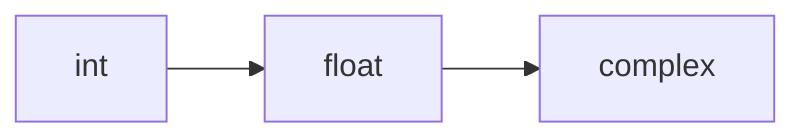

# Type Conversions

Python supports conversions between numeric types.

The most common numeric conversions are:

- `int()` for integers
- `float()` for floating-point numbers
- `complex()` for complex numbers

These conversions allow programs to move values between different numeric representations.

```mermaid
flowchart TD
    A[int]
    A --> B[float]
    A --> C[complex]
    B --> D[int]
    B --> C
````

!!! tip "Mental Model"
    Numeric conversions move values along the precision ladder: `int` to `float` adds a decimal point, `float` to `int` truncates it, and both can promote to `complex`. Going "up" the ladder (int to float to complex) is always safe; going "down" may lose information. Python handles mixed-type arithmetic automatically by promoting the less-precise operand.

---

## 1. Converting int to float

Converting an integer to a float preserves the numeric value while changing its representation.

```python
x = 5
y = float(x)

print(y)
print(type(y))
```

Output:

```text
5.0
<class 'float'>
```

---

## 2. Converting float to int

Converting a float to an integer truncates toward zero.

```python
x = 3.9
y = int(x)

print(y)
```

Output:

```text
3
```

For negative values:

```python
print(int(-3.9))
```

Output:

```text
-3
```

---

## 3. Converting int to complex

An integer can be converted directly to a complex number.

```python
x = 7
z = complex(x)

print(z)
```

Output:

```text
(7+0j)
```

---

## 4. Converting float to complex

A float can also be converted directly.

```python
x = 2.5
z = complex(x)

print(z)
```

Output:

```text
(2.5+0j)
```

---

## 5. Creating complex numbers from two parts

The `complex()` function can take two arguments:

```python
z = complex(2, 3)
print(z)
```

Output:

```text
(2+3j)
```

This means:

[
2 + 3j
]

---

## 6. Converting Strings

Strings can often be converted into numeric values.

```python
print(int("42"))
print(float("3.14"))
print(complex("2+3j"))
```

Output:

```text
42
3.14
(2+3j)
```

However, the string must be in valid format.

```python
# int("hello")      -> ValueError
# float("abc")      -> ValueError
```

---

## 7. Implicit Numeric Promotion

Python also performs automatic promotion during mixed arithmetic.

```python
print(type(3 + 2.5))
print(type(3 + 2j))
print(type(2.5 + 2j))
```

Output:

```text
<class 'float'>
<class 'complex'>
<class 'complex'>
```

This follows the general widening order:

```text
int -> float -> complex
```



---

## 8. Worked Examples

### Example 1: integer to float

```python
x = 10
print(float(x))
```

### Example 2: float to integer

```python
y = 8.99
print(int(y))
```

### Example 3: integer to complex

```python
n = 4
print(complex(n))
```

---

## 9. Common Pitfalls

### Assuming float-to-int rounds

```python
print(int(4.9))
```

This produces `4`, not `5`.

### Forgetting complex string syntax

```python
complex("2+3j")
```

works, but malformed strings do not.

### Ignoring promotion

Mixed arithmetic can produce wider numeric types than expected.

---


## 10. Summary

Key ideas:

* Python supports explicit conversion with `int()`, `float()`, and `complex()`
* float-to-int conversion truncates toward zero
* integers and floats can be converted into complex numbers
* strings may be converted when properly formatted
* mixed numeric arithmetic promotes values from `int` to `float` to `complex`

Type conversion is essential for writing programs that combine different numeric representations safely and clearly.


## Exercises

**Exercise 1.**
Python's `int()` truncates toward zero, not toward negative infinity. Predict the output and explain the difference between `int()`, `math.floor()`, and `round()`:

```python
import math

for x in [3.7, -3.7, 0.5, -0.5, 2.5]:
    print(f"{x:>5} -> int={int(x):>3}, floor={math.floor(x):>3}, round={round(x):>3}")
```

Why did Python's designers make `int()` truncate toward zero rather than round or floor? In what situation does the difference between truncation and flooring matter most?

??? success "Solution to Exercise 1"
    Output:

    ```text
      3.7 -> int=  3, floor=  3, round=  4
     -3.7 -> int= -3, floor= -4, round= -4
      0.5 -> int=  0, floor=  0, round=  0
     -0.5 -> int=  0, floor= -1, round=  0
      2.5 -> int=  2, floor=  2, round=  2
    ```

    - `int()` **truncates toward zero**: removes the fractional part, always moving toward 0. `int(3.7)` = `3`, `int(-3.7)` = `-3`.
    - `math.floor()` **rounds toward negative infinity**: always goes down. `floor(3.7)` = `3`, `floor(-3.7)` = `-4`.
    - `round()` uses **banker's rounding** (round half to even): `round(0.5)` = `0`, `round(2.5)` = `2`.

    The difference matters most for negative numbers: `int(-3.7)` gives `-3` (toward zero) but `math.floor(-3.7)` gives `-4` (toward negative infinity). Python chose truncation for `int()` because it matches most programmers' intuition of "removing the decimal part" and is consistent with C and other languages.

---

**Exercise 2.**
Python performs implicit numeric promotion in mixed arithmetic. Predict the type of each result:

```python
print(type(1 + 2))
print(type(1 + 2.0))
print(type(1 + 2j))
print(type(1.0 + 2j))
print(type(True + 1))
print(type(True + 1.0))
```

What is the promotion hierarchy? Why does Python promote implicitly for arithmetic but NOT implicitly convert `"3" + 4`?

??? success "Solution to Exercise 2"
    Output:

    ```text
    <class 'int'>
    <class 'float'>
    <class 'complex'>
    <class 'complex'>
    <class 'int'>
    <class 'float'>
    ```

    The promotion hierarchy is: `bool` -> `int` -> `float` -> `complex`. When two different numeric types appear in an arithmetic operation, the "narrower" type is promoted to the "wider" type before the operation.

    `True + 1` gives `int` (not `bool`) because `bool` is promoted to `int` for arithmetic, and `int + int` returns `int`.

    Python promotes implicitly within the numeric tower because the conversion is always lossless (an `int` can always be exactly represented as a `float` for reasonable sizes, and any real number is a valid complex number). But `"3" + 4` is NOT promoted because the conversion is ambiguous: should the result be `"34"` (string concatenation) or `7` (numeric addition)? Python's philosophy: "In the face of ambiguity, refuse the temptation to guess."

---

**Exercise 3.**
A programmer tries to convert a large float to an integer:

```python
print(int(1e20))
print(int(1e308))
print(int(float("inf")))
```

Predict which succeed and which raise errors. Then explain: why can `int(1e20)` work even though `1e20` is a float, but `int(float("inf"))` cannot? What does this reveal about the difference between Python's `int` and `float` types?

??? success "Solution to Exercise 3"
    ```text
    100000000000000000000     # int(1e20) succeeds
    100000000000...           # int(1e308) succeeds (huge integer)
    OverflowError             # int(float("inf")) fails
    ```

    `int(1e20)` works because `1e20` is a finite float, and Python can convert any finite float to an exact integer (by truncating). `int(1e308)` also works -- it produces a very large integer (Python's `int` has arbitrary precision).

    `int(float("inf"))` raises `OverflowError` because infinity is not a finite number -- there is no integer value that represents "infinity." Infinity is a special IEEE 754 value that means "larger than any finite number," and no integer can represent that concept.

    This reveals a fundamental difference: Python's `float` is fixed-precision (64-bit IEEE 754) and can represent special values like `inf` and `nan`, but has limited precision (~15-17 significant digits). Python's `int` is arbitrary-precision and can represent any finite integer exactly, but cannot represent infinity or "not a number." The two types model fundamentally different mathematical concepts.
