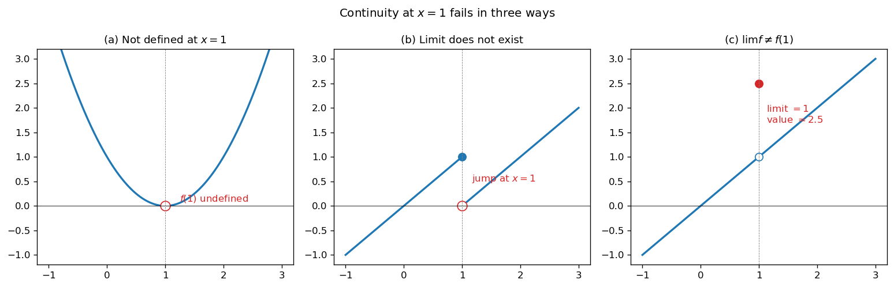
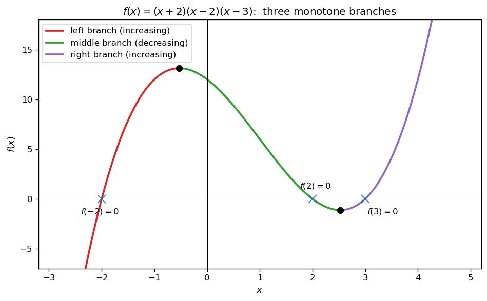
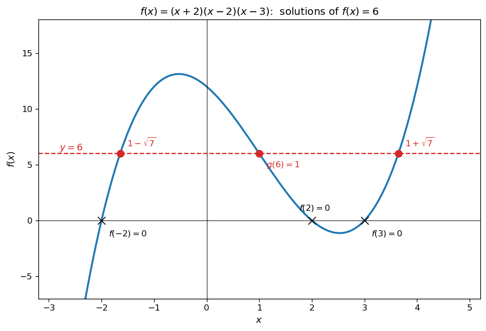
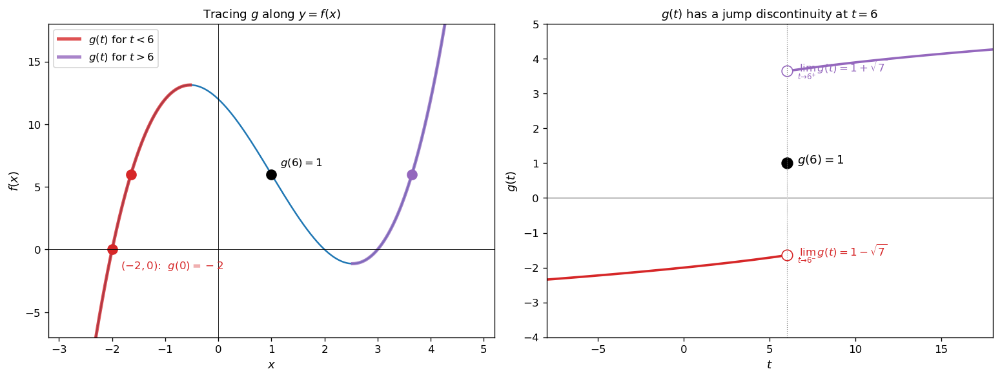
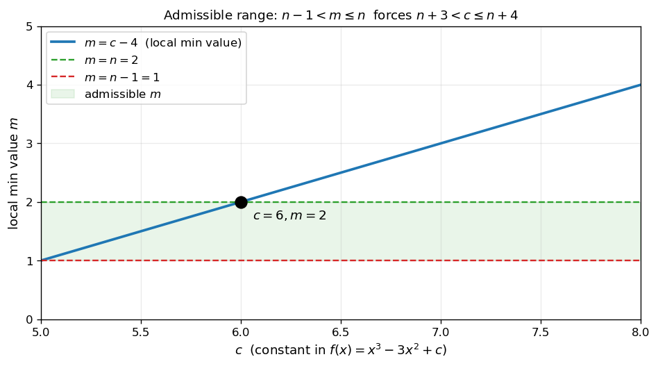
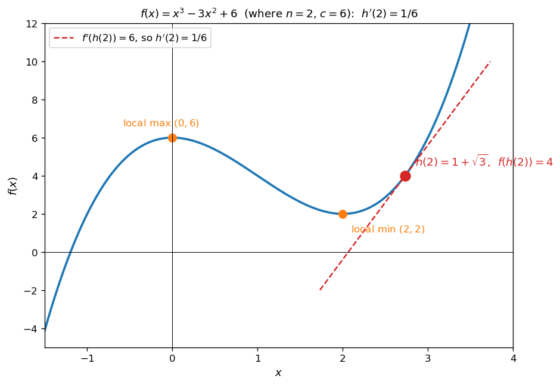

# 극한과 합성함수의 미분

함수의 연속성과 합성함수의 미분법은 미분의 두 기본 축이다. 이 절에서는 다항함수 $f(x)$ 와 그 "역함수 비슷한" 함수 $g(t)$ — 즉 $f(g(t)) = t$ 를 만족시키는 함수 — 의 연속성을 분석하고, 한쪽 극한과 합성함수의 미분법을 활용한다.

!!! note "사용 도구"
    1. **점에서의 연속성**: 함수 $f(x)$ 가 $x = a$ 에서 연속이려면 다음 세 조건이 모두 성립해야 한다.

        (i) $f(x)$ 가 $x = a$ 에서 정의되어 있다.

        (ii) 극한값 $\displaystyle\lim_{x \to a} f(x)$ 가 존재한다.

        (iii) $\displaystyle\lim_{x \to a} f(x) = f(a)$.

    2. **합성함수의 미분법**: 미분가능한 두 함수 $y = f(u)$, $u = g(x)$ 에 대하여

        $$
        \{f(g(x))\}' = f'(g(x))\,g'(x)
        $$

    3. **다항함수와 직선의 교점**: 다항함수 $f(x)$ 에 대하여 $g(t)$ 가 $f(g(t)) = t$ 를 만족시키면, $g(t)$ 는 곡선 $y = f(x)$ 와 직선 $y = t$ 의 교점의 $x$ 좌표 중 하나이다. 극한값 $\displaystyle\lim_{t \to t_0^{\pm}} g(t)$ 가 존재하면 그 값도 $y = f(x)$ 와 직선 $y = t_0$ 의 교점의 $x$ 좌표이다.

---

## 보기 1: 연속의 세 조건

연속성이 깨지는 세 가지 방식을 살펴보자.

<figure markdown>
  { width=720 }
  <figcaption markdown>연속의 세 조건이 깨지는 세 가지 사례. (a) $x = 1$ 에서 함숫값이 정의되지 않음. (b) 좌우극한이 다르므로 극한 자체가 존재하지 않음. (c) 극한값과 함숫값이 다름.</figcaption>
</figure>

---

## 보기 2: 삼차함수의 세 단조 가지

최고차항의 계수가 양수인 삼차함수 $f(x)$ 는 두 임계점 사이에서 부호가 바뀌어 **세 단조 구간** 으로 나뉜다. $f(g(t)) = t$ 를 만족시키는 연속함수 $g$ 는, **하나의 단조 가지를 따라 $t$ 의 변화에 따라 연속적으로 움직이는 점**으로 이해할 수 있다.

<figure markdown>
  { width=620 }
  <figcaption markdown>삼차함수 $f(x) = (x+2)(x-2)(x-3)$ 의 세 단조 가지: 좌측 가지 (빨강, 증가), 중간 가지 (녹색, 감소), 우측 가지 (보라, 증가). $f(g(t)) = t$ 인 연속함수 $g$ 는 하나의 가지 위를 부드럽게 움직인다.</figcaption>
</figure>

!!! info "핵심 아이디어"
    삼차함수는 두 극값 사이에서 **세 단조 가지**를 가진다. $f(g(t)) = t$ 인 연속함수 $g$ 는 그래프 위를 미끄러지는 점으로 시각화되며, 가지 사이를 옮기려면 **불연속점**이 생긴다.

---

## 연습문제

---

**연습문제 1.** [좌우극한 결정] 최고차항의 계수가 $1$ 인 삼차함수 $f(x)$ 와 실수 전체의 집합에서 정의된 함수 $g(t)$ 가 모든 실수 $t$ 에 대하여 $f(g(t)) = t$ 이고 다음을 만족시킨다.

!!! quote "조건"
    (1) $f(3) = 0$, $g(0) = -2$, $g(6) = 1$.

    (2) 함수 $g(t)$ 는 $t = 6$ 에서**만** 불연속이다.

$\displaystyle\lim_{t \to 6^-} g(t)$ 와 $\displaystyle\lim_{t \to 6^+} g(t)$ 의 값을 구하시오.

??? success "연습문제 1 풀이"

    **1단계 — $f$ 의 결정.** $g(0) = -2$ 이고 $f(g(0)) = 0$ 이므로 $f(-2) = 0$. 조건 (1)에 의해 $f(3) = 0$. 따라서 $f$ 는 $x = -2$ 와 $x = 3$ 을 근으로 가지므로

    $$
    f(x) = (x + 2)(x - 3)(x - a)
    $$

    인 실수 $a$ 가 존재한다. $g(6) = 1$ 이고 $f(g(6)) = 6$ 이므로 $f(1) = 6$:

    $$
    f(1) = (1 + 2)(1 - 3)(1 - a) = 3 \cdot (-2) \cdot (1 - a) = -6(1 - a) = 6
    $$

    이로부터 $1 - a = -1$, 즉 $a = 2$. 따라서

    $$
    f(x) = (x + 2)(x - 2)(x - 3) = x^3 - 3x^2 - 4x + 12
    $$

    <figure markdown>
      { width=620 }
      <figcaption markdown>$f(x) = (x+2)(x-2)(x-3)$ 의 그래프. 영점은 $-2, 2, 3$. 수평선 $y = 6$ 과 만나는 점의 $x$ 좌표는 $1 - \sqrt{7}, 1, 1 + \sqrt{7}$ 의 세 개 ($g(6)$ 은 그 중 가운데 값 $1$).</figcaption>
    </figure>

    **2단계 — $f(x) = 6$ 의 해.** $x^3 - 3x^2 - 4x + 12 = 6$ 즉 $x^3 - 3x^2 - 4x + 6 = 0$. $x = 1$ 이 근이므로 ($f(1) = 6$ 에서 확인됨) 인수분해하면

    $$
    x^3 - 3x^2 - 4x + 6 = (x - 1)(x^2 - 2x - 6) = 0
    $$

    이차식의 해는 $x = 1 \pm \sqrt{7}$. 따라서 $f(x) = 6$ 의 세 해는 $1 - \sqrt{7}$, $1$, $1 + \sqrt{7}$.

    **3단계 — 좌우극한.** $g$ 는 $t = 6$ 에서만 불연속이며, 좌우극한 $\displaystyle\lim_{t \to 6^\pm} g(t)$ 는 모두 존재 (조건상 단지 $g(6)$ 의 값과 다를 뿐). 제시문에 의하여 이 극한값들도 $f(x) = 6$ 의 해 중 하나이다.

    한편 $g$ 가 $t < 6$ 에서 연속이고 $g(0) = -2$ 이므로, $t$ 가 $0$ 에서 $6$ 으로 갈 때 $g(t)$ 는 $-2$ 에서 시작하여 좌측 단조 가지 ($f$ 가 증가하는 좌측 가지) 를 따라 움직인다. 이 가지는 좌측 임계점까지 이어지며, 가지 끝의 $x$ 좌표가 좌극한 후보. 따라서 좌극한은 $f(x) = 6$ 의 세 해 중 **가장 작은** $x$ 좌표여야 한다 (좌측 가지가 도달할 수 있는 가장 큰 $t$ 값이 좌측 극댓값이고, 그 직전까지 $x$ 가 증가). 결국

    $$
    \lim_{t \to 6^-} g(t) = 1 - \sqrt{7}
    $$

    마찬가지로 $t > 6$ 에서 $g$ 가 연속이며, $t \to \infty$ 일 때 $g(t) \to \infty$ 가 자연스러우려면 $g$ 는 우측 단조 가지 위에 있어야 한다. 따라서 우극한은 $f(x) = 6$ 의 세 해 중 **가장 큰** $x$ 좌표:

    $$
    \lim_{t \to 6^+} g(t) = 1 + \sqrt{7}
    $$

    (가운데 값 $1$ 은 $g(6)$ 자체이다.)

    <figure markdown>
      { width=720 }
      <figcaption markdown>왼쪽: $g$ 가 $y = f(x)$ 위의 어느 가지를 따라가는지의 시각화. 빨강 가지 ($t < 6$) → 검정 점 $(1, 6)$ ($t = 6$ 의 값) → 보라 가지 ($t > 6$). 오른쪽: $g(t)$ 의 그래프. $t = 6$ 에서 점프 불연속, 좌우극한은 빈 원으로 표시 ($1 \mp \sqrt{7}$).</figcaption>
    </figure>

    $\square$

---

**연습문제 2.** [합성함수의 미분과 $h'(n)$ 계산] 최고차항의 계수가 $1$ 인 삼차함수 $f(x)$ 가 $x = 0$, $x = 2$ 에서 극값을 가질 때, 함수 $f(x)$ 와 실수 전체 집합에서 연속인 함수 $h(t)$ 는 다음 조건을 만족시킨다. (단, $n$ 은 자연수.)

!!! quote "조건"
    (1) 모든 $t \geq 0$ 에 대하여 $f(h(t)) = t + n$.

    (2) 실수 전체 집합에서 정의되고 다음을 만족시키는 함수 $k(t)$ 는 연속이 **아니다**:
    
    "모든 $t \geq 0$ 에 대하여 $f(k(t)) = t + n - 1$."

    (3) $f(1) = f(h(n))$.

$h'(n)$ 의 값을 구하시오.

??? success "연습문제 2 풀이"

    **1단계 — $f$ 의 형태와 극값.** $f'(x) = 0$ 의 해가 $x = 0, 2$ 이므로 $f'(x) = 3x(x - 2)$. 그러므로 $f(x) = x^3 - 3x^2 + c$ 의 형태. $x = 0$ 에서 극대값 $f(0) = c$, $x = 2$ 에서 극솟값 $f(2) = 8 - 12 + c = c - 4$. 극솟값을 $m_{\min}$ 이라 두면 $m_{\min} = c - 4$.

    **2단계 — $h$ 가 어느 가지에 있어야 하는가.** $h$ 가 모든 $t \geq 0$ 에서 연속이고 $f(h(t)) = t + n$ 이려면, $h$ 는 어떤 단조 가지 위를 연속적으로 움직여야 한다. $t + n$ 은 $[n, \infty)$ 를 치역으로 가지므로, $h$ 가 움직이는 가지의 치역 (즉 그 가지 위 $f$ 의 치역) 이 $[n, \infty)$ 를 포함해야 한다.

    - 좌측 가지 ($x \leq 0$): $f$ 가 $(-\infty, c]$ 로 치역 → 위쪽이 막혀 있어 $[n, \infty)$ 를 모두 포함 못함. 불가.
    - 중간 가지 ($0 \leq x \leq 2$): $f$ 가 $[c-4, c]$ 로 치역 → 유한 구간. 불가.
    - **우측 가지 ($x \geq 2$)**: $f$ 가 $[c-4, \infty)$ 로 치역. $[n, \infty)$ 를 포함하려면 $c - 4 \leq n$, 즉 $m_{\min} \leq n$.

    따라서 $h(t)$ 는 **우측 가지** 위에 있고 $m_{\min} \leq n$.

    **3단계 — $k$ 가 연속이 아닐 조건.** 같은 논리로 $f(k(t)) = t + n - 1$ ($t \geq 0$) 인 연속 $k$ 가 우측 가지 위에 존재하려면 $m_{\min} \leq n - 1$ 이어야 한다. 조건 (2) 가 이를 부정 하므로

    $$
    m_{\min} > n - 1
    $$

    종합하면

    $$
    n - 1 < m_{\min} \leq n
    \quad\Longleftrightarrow\quad
    n - 1 < c - 4 \leq n
    \quad\Longleftrightarrow\quad
    n + 3 < c \leq n + 4
    $$

    <figure markdown>
      { width=620 }
      <figcaption markdown>$m = c - 4$ 의 그래프와 허용 영역 $n - 1 < m \leq n$ (녹색). $n = 2$ 일 때 $c = 6, m = 2$ (검정 점) 가 조건을 만족한다.</figcaption>
    </figure>

    **4단계 — 조건 (3) 으로부터 $c$ 결정.** $f(h(n)) = n + n = 2n$. 조건 (3) 의 $f(1) = f(h(n)) = 2n$ 에서

    $$
    f(1) = 1 - 3 + c = c - 2 = 2n \quad\Longrightarrow\quad c = 2n + 2
    $$

    이를 $n + 3 < c \leq n + 4$ 에 대입하면

    $$
    n + 3 < 2n + 2 \leq n + 4
    \quad\Longrightarrow\quad
    1 < n \leq 2
    \quad\Longrightarrow\quad
    n = 2
    $$

    따라서 $c = 6$, $f(x) = x^3 - 3x^2 + 6$.

    **5단계 — $h(2)$ 와 $h'(2)$.** $f(h(2)) = 2 + 2 = 4$, 즉 $x^3 - 3x^2 + 6 = 4$, $x^3 - 3x^2 + 2 = 0$. $x = 1$ 이 해이므로 인수분해

    $$
    x^3 - 3x^2 + 2 = (x - 1)(x^2 - 2x - 2) = 0
    $$

    이차식의 해는 $x = 1 \pm \sqrt{3}$. $h(2)$ 는 **우측 가지 ($\geq 2$)** 위의 해이므로 $h(2) = 1 + \sqrt{3}$.

    **6단계 — 합성함수의 미분으로 $h'(2)$.** $f(h(t)) = t + n$ 의 양변을 $t$ 에 대해 미분하면

    $$
    f'(h(t))\,h'(t) = 1
    \quad\Longrightarrow\quad
    h'(t) = \frac{1}{f'(h(t))}
    $$

    $f'(x) = 3x^2 - 6x = 3x(x - 2)$, $h(2) = 1 + \sqrt{3}$ 이므로

    $$
    f'(1 + \sqrt{3}) = 3(1 + \sqrt{3})\bigl((1 + \sqrt{3}) - 2\bigr) = 3(1 + \sqrt{3})(\sqrt{3} - 1) = 3(3 - 1) = 6
    $$

    따라서 $h'(2) = \dfrac{1}{6}\quad\square$

    <figure markdown>
      { width=620 }
      <figcaption markdown>$f(x) = x^3 - 3x^2 + 6$ ($n = 2$, $c = 6$). 극대점 $(0, 6)$ 과 극소점 $(2, 2)$ 가 표시되어 있다. $h(2) = 1 + \sqrt{3} \approx 2.732$ (빨간 점) 에서 $f$ 의 접선의 기울기는 $f'(1 + \sqrt{3}) = 6$. 합성함수 미분법으로부터 $h'(2) = 1/6$.</figcaption>
    </figure>

    !!! tip "큰 그림"
        이 문제는 **여러 단계의 조건이 시그마처럼 합쳐져 단 하나의 자연수 $n$ 만 가능하게 만드는** 정수해 결정 문제이다.

        1. **연속성 조건이 정의역을 제한**: $h$ 가 어느 가지에 있어야 하는지 (우측 가지) 가 정해진다.
        2. **불연속 조건이 부등식을 만듦**: $k$ 가 불연속이라는 조건이 $m_{\min} > n - 1$ 을 강요.
        3. **함숫값 조건이 등식을 줌**: $f(1) = f(h(n)) = 2n$ 에서 $c$ 와 $n$ 의 관계 결정.
        4. **세 조건의 교집합**: $n = 2$ 만 가능.

        마지막에 합성함수 미분법으로 $h'(t) = 1/f'(h(t))$ 라는 깔끔한 식이 도출되어, 단 한 번의 대입으로 $h'(n) = 1/6$ 이 결정된다.

---

**연습문제 (보충).** [합성함수 $g \circ f \circ g^{-1}$ 의 극값과 치역] 실수 전체의 집합에서 정의된 두 함수

$$
f(x) = x(x - 1)^2\,e^{2x},\qquad g(x) = -\frac{x}{\sqrt{1 + x^2}}
$$

가 있다. 다음에 답하시오.

(1) $g'(x)$ 를 구하고, $g$ 의 치역을 구하시오.

(2) $g$ 의 역함수 $g^{-1}(x)$ 를 구하고, $h(x) = (g \circ f \circ g^{-1})(x)$ 일 때 방정식 $h(x) = 0$ 의 해를 모두 구하시오.

(3) (2) 에서 정의된 $h(x)$ 의 극댓값과 극솟값을 각각 구하시오 (단, $\displaystyle\lim_{x \to -\infty} f(x) = 0$).

??? success "연습문제 (보충) 풀이"

    **(1) $g'(x)$ 와 $g$ 의 치역.**

    $g(x) = -x (1 + x^2)^{-1/2}$. 곱·합성 미분:

    $$
    g'(x) = -(1 + x^2)^{-1/2} - x \cdot \left(-\tfrac{1}{2}\right)(1 + x^2)^{-3/2}\cdot 2x = -\frac{1}{(1 + x^2)^{3/2}}
    $$

    $g'(x) < 0$ 이므로 $g$ 는 단조감소. $x \to \infty$ 에서 $g \to -1^+$, $x \to -\infty$ 에서 $g \to 1^-$. 따라서

    $$
    g \text{ 의 치역} = (-1,\,1)
    $$

    **(2) $g^{-1}$ 와 $h(x) = 0$ 의 해.**

    $y = -\dfrac{x}{\sqrt{1+x^2}}$ 를 $x$ 에 대해 풀자. $y^2 (1 + x^2) = x^2 \Rightarrow x^2 (1 - y^2) = y^2 \Rightarrow x = \pm \dfrac{y}{\sqrt{1 - y^2}}$. $g$ 가 감소이므로 $y$ 와 $x$ 의 부호가 반대, 즉

    $$
    g^{-1}(x) = -\frac{x}{\sqrt{1 - x^2}}\quad (-1 < x < 1)
    $$

    $h(x) = g(f(g^{-1}(x))) = 0 \Leftrightarrow f(g^{-1}(x)) = g^{-1}(0) = 0$ ($g$ 단조이고 $g(0) = 0$).

    $f(t) = t(t-1)^2 e^{2t} = 0 \Leftrightarrow t = 0$ 또는 $t = 1$.

    $g^{-1}(x) = 0 \Leftrightarrow x = 0$. $g^{-1}(x) = 1 \Leftrightarrow -\dfrac{x}{\sqrt{1-x^2}} = 1 \Leftrightarrow x = -\dfrac{\sqrt 2}{2}$.

    따라서 $h(x) = 0$ 의 해는 $x = 0,\;-\dfrac{\sqrt 2}{2}$.

    **(3) 극값과 치역.**

    합성함수 미분법: $h'(x) = g'(f(g^{-1}(x)))\cdot f'(g^{-1}(x))\cdot (g^{-1})'(x)$.

    $g'$ 과 $(g^{-1})'$ 은 항상 부호가 일정하다 ($g' < 0$, $(g^{-1})' = -1/(1-x^2)^{3/2} < 0$ — 합성도 음수). 따라서 $h'(x) = 0$ 의 부호는 $f'(g^{-1}(x))$ 의 부호와 같다.

    $f(x) = x(x-1)^2 e^{2x}$ 의 도함수를 전개하면 $f'(x) = (x + 1)(2x - 1)(x - 1) e^{2x}$. 따라서 $f'(t) = 0$ 의 해 $t = -1, \dfrac{1}{2}, 1$.

    $g^{-1}(x) = -1 \Leftrightarrow x = \dfrac{\sqrt 2}{2}$. $g^{-1}(x) = \dfrac{1}{2} \Leftrightarrow x = -\dfrac{1}{\sqrt 5} = -\dfrac{\sqrt 5}{5}$. $g^{-1}(x) = 1 \Leftrightarrow x = -\dfrac{\sqrt 2}{2}$.

    $f'(x) > 0$ 의 해는 $x > 1$ 또는 $-1 < x < \dfrac{1}{2}$. $g^{-1}$ 이 감소이므로 $h'(x) > 0$ 인 $x$ 의 범위는 $x < g(1) = -\dfrac{\sqrt 2}{2}$ 또는 $g(1/2) = -\dfrac{\sqrt 5}{5} < x < g(-1) = \dfrac{\sqrt 2}{2}$.

    증감표를 그리면 $h$ 는 $x = -\dfrac{\sqrt 2}{2}$ 에서 극댓값, $x = -\dfrac{\sqrt 5}{5}$ 에서 극솟값, $x = \dfrac{\sqrt 2}{2}$ 에서 다시 극댓값을 가진다.

    극값 계산:

    - $h\!\left(-\dfrac{\sqrt 2}{2}\right) = g(f(1)) = g(0) = 0$
    - $h\!\left(-\dfrac{\sqrt 5}{5}\right) = g\!\left(f\!\left(\dfrac{1}{2}\right)\right) = g\!\left(\dfrac{e}{8}\right) = -\dfrac{e/8}{\sqrt{1 + e^2/64}} = -\dfrac{e}{\sqrt{e^2 + 64}}$
    - $h\!\left(\dfrac{\sqrt 2}{2}\right) = g(f(-1)) = g(-4 e^{-2}) = \dfrac{4 e^{-2}}{\sqrt{1 + 16 e^{-4}}} = \dfrac{4}{\sqrt{e^4 + 16}}$

    또한 $\displaystyle\lim_{x \to 1^-} h(x) = \lim_{x \to -\infty} g(f(x)) = g(0) = 0$, $\displaystyle\lim_{x \to -1^+} h(x) = \lim_{x \to \infty} g(f(x))$ ($x \to \infty$ 에서 $f \to \infty$, $g \to -1$). 즉 $h$ 의 치역은 두 극댓값 중 큰 값과 $-1$ 사이.

    !!! info "교훈"
        - **합성함수의 극값**: $h = g \circ f \circ g^{-1}$ 의 극값은 단순히 $f$ 의 임계점 $t$ 에 대해 $h(g(t)) = g(f(t))$ 로 구한다. $g$ 가 단조이므로 $g$ 와 $g^{-1}$ 이 극의 위치를 보존한다.
        - 큰 그림: **켤레 (conjugation) $h = g \circ f \circ g^{-1}$ 는 $f$ 의 임계점·임계값을 $g$ 좌표계로 옮긴 것**과 같다.
