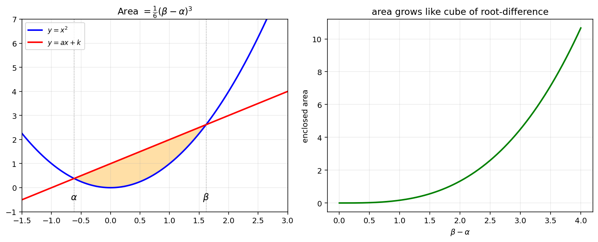
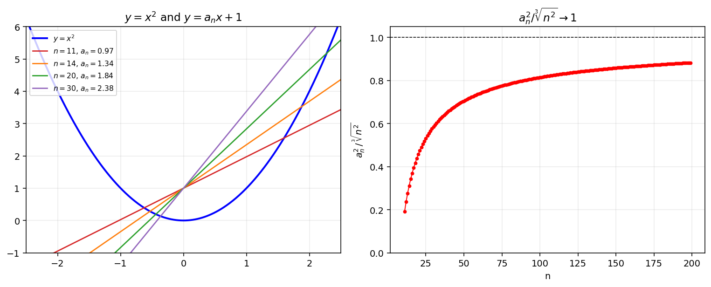
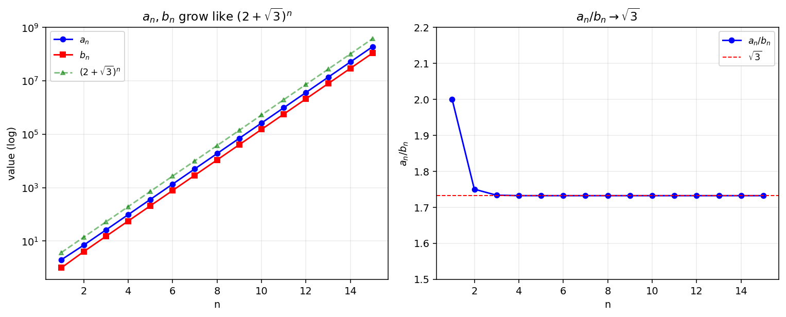

# 수열의 극한

수열 $\{a_n\}$ 의 항을 식으로 명시할 수 없고 **조건만 주어진 경우**, 일반항을 닫힌형으로 구하기 어려운 일이 자주 있다. 그러나 극한값 $\displaystyle\lim_{n\to\infty} a_n$ 만 알아내고자 한다면, 일반항 전체를 구하지 않고도 다음 두 도구의 결합으로 충분히 다룰 수 있다.

- **근과 계수의 관계**: 이차방정식 $x^2 - p\,x + q = 0$ 의 두 근 $\alpha,\beta$ 에 대하여 $\alpha+\beta = p$, $\alpha\beta = q$, $(\beta-\alpha)^2 = p^2 - 4q$
- **인수분해형 차분**: $b^3 - a^3 = (b-a)(b^2 + ab + a^2)$ 와 같은 항등식으로 분모유리화·분자유리화

이 절에서는 이차곡선이 만드는 도형의 조건이 수열을 정의하는 상황을 통해, 일반항의 명시 없이도 극한을 정확하게 잡아내는 사고법을 익힌다.

!!! note "핵심 도구 — 두 곡선이 둘러싼 영역의 넓이"
    포물선 $y = x^2$ 과 직선 $y = m\,x + k$ 의 두 교점의 $x$ 좌표를 $\alpha, \beta$ $(\alpha < \beta)$ 라 하면, 둘러싸인 영역의 넓이는

    $$
    \int_\alpha^\beta \bigl( m\,x + k - x^2 \bigr)\,dx = \frac{1}{6}\,(\beta - \alpha)^3
    $$

    이다. 이때 $\beta - \alpha = \sqrt{(\alpha+\beta)^2 - 4\,\alpha\,\beta}$ 로 근과 계수의 관계만으로 표현된다.

---

## 보기 1: 둘러싼 영역의 넓이가 정의하는 수열

$10$ 보다 큰 자연수 $n$ 에 대하여 양수 $a_n$ 이 다음 조건을 만족한다고 하자.

> $y = x^2$ 과 $y = a_n\,x + 1$ 로 둘러싸인 영역의 넓이는 $\dfrac{n}{6}$ 이다.

이때 $\displaystyle\lim_{n\to\infty} \frac{a_n^{\,2}}{\sqrt[3]{n^{2}}}$ 의 값을 구해 보자.

두 곡선의 교점의 $x$ 좌표 $\alpha_n, \beta_n$ 은 이차방정식 $x^2 - a_n x - 1 = 0$ 의 두 근이므로

$$
\alpha_n + \beta_n = a_n,\qquad \alpha_n\,\beta_n = -1
$$

핵심 도구의 1/6 공식을 적용하면

$$
\frac{n}{6} \;=\; \frac{1}{6}\,(\beta_n - \alpha_n)^3 \;\Longrightarrow\; (\beta_n - \alpha_n)^3 = n
$$

이고, $(\beta_n - \alpha_n)^2 = a_n^{\,2} + 4$ 이므로

$$
\bigl(a_n^{\,2} + 4\bigr)^3 = n^{2} \;\Longrightarrow\; a_n^{\,2} + 4 = \sqrt[3]{n^{2}}
$$

를 얻는다. 따라서

$$
\frac{a_n^{\,2}}{\sqrt[3]{n^{2}}} \;=\; \frac{\sqrt[3]{n^{2}} - 4}{\sqrt[3]{n^{2}}} \;=\; 1 - \frac{4}{\sqrt[3]{n^{2}}}
$$

$n \to \infty$ 이면 $\sqrt[3]{n^2} \to \infty$ 이므로

$$
\lim_{n\to\infty} \frac{a_n^{\,2}}{\sqrt[3]{n^{2}}} \;=\; 1\quad\square
$$

!!! info "보기 1의 교훈"
    $a_n$ 의 닫힌형 ($\sqrt[3]{\sqrt[3]{n^2}-4}$ 같은 식) 을 명시적으로 구하지 않더라도, $a_n^{\,2} + 4 = \sqrt[3]{n^2}$ 이라는 **간접적 관계식**만으로 극한이 결정된다. 이것이 근과 계수의 관계의 위력이다.

---

## 보기 2: 거듭제곱이 만드는 두 수열

수열 $\{a_n\}, \{b_n\}$ 이 모든 자연수 $n$ 에 대하여 다음 두 조건을 만족한다고 하자.

> $a_n + b_n\sqrt{3} = (2 + \sqrt{3})^{\,n},\qquad a_n - b_n\sqrt{3} = (2 - \sqrt{3})^{\,n}$

두 식을 더하고 빼면

$$
a_n = \frac{(2+\sqrt 3)^n + (2-\sqrt 3)^n}{2},\quad b_n = \frac{(2+\sqrt 3)^n - (2-\sqrt 3)^n}{2\sqrt 3}
$$

이를 곱하면 $(2+\sqrt 3)(2-\sqrt 3) = 1$ 이므로

$$
a_n^{\,2} - 3\,b_n^{\,2} = (a_n + b_n\sqrt 3)(a_n - b_n\sqrt 3) = (2+\sqrt 3)^n\,(2-\sqrt 3)^n = 1
$$

따라서 $a_n^{\,2} - 3b_n^{\,2} = 1$ 이라는 **항등 관계**가 모든 $n$ 에서 성립한다. 이를 이용하면

$$
\frac{b_n\,\bigl(a_n^{\,2} - 3\,b_n^{\,2}\bigr)}{a_n} \;=\; \frac{b_n}{a_n}
$$

이다. 이제 $\dfrac{b_n}{a_n}$ 의 극한을 보자.

$$
\frac{b_n}{a_n} = \frac{1}{\sqrt 3}\cdot\frac{(2+\sqrt 3)^n - (2-\sqrt 3)^n}{(2+\sqrt 3)^n + (2-\sqrt 3)^n} = \frac{1}{\sqrt 3}\cdot\frac{1 - r^n}{1 + r^n},\quad r = \frac{2-\sqrt 3}{2+\sqrt 3}
$$

$|r| < 1$ 이므로 $r^n \to 0$. 따라서

$$
\lim_{n\to\infty} \frac{b_n\,(a_n^{\,2} - 3\,b_n^{\,2})}{a_n} \;=\; \frac{1}{\sqrt 3} \;=\; \frac{\sqrt 3}{3}\quad\square
$$

!!! info "보기 2의 교훈"
    $a_n, b_n$ 자체는 지수적으로 폭발하지만, 두 수열 사이의 **불변량** $a_n^2 - 3b_n^2 = 1$ 이 깨지지 않는다. 극한 계산에서는 항을 직접 다루는 대신 이러한 불변량을 찾아 식을 단순화하는 것이 효율적이다.

---

## 연습문제

**연습문제 1.** $20$ 이상의 자연수 $n$ 에 대하여 이차함수 $y = a\,x^2 + b\,x + c$ 가 다음 세 조건을 만족한다.

- $0 < a < 1$
- 두 점 $(-1,\,1),\,(0,\,1)$ 을 지난다.
- 두 곡선 $y = a\,x^2 + b\,x + c$ 와 $y = x^2$ 으로 둘러싸인 영역의 넓이는 $n$ 이다.

이때 꼭짓점의 $y$ 좌표를 $y_n$ 이라 할 때 $\displaystyle\lim_{n\to\infty} y_n$ 의 값을 구하시오.

??? success "연습문제 1 풀이"

    두 점 $(-1,1),(0,1)$ 을 지나므로 $c = 1$, $a - b + c = 1 \Rightarrow b = a$. 따라서 이차함수는

    $$
    y = a\,x^2 + a\,x + 1
    $$

    두 곡선의 교점은 $a x^2 + a x + 1 = x^2 \Leftrightarrow (1-a)x^2 - a x - 1 = 0$. 두 근을 $\alpha, \beta$ 라 하면

    $$
    \alpha + \beta = \frac{a}{1-a},\quad \alpha\beta = \frac{-1}{1-a}
    $$

    $(\beta - \alpha)^2 = \dfrac{a^2 + 4(1-a)}{(1-a)^2} = \dfrac{a^2 - 4a + 4}{(1-a)^2} = \dfrac{(a-2)^2}{(1-a)^2}$. $0 < a < 1$ 이므로

    $$
    \beta - \alpha = \frac{2-a}{1-a}
    $$

    1/6 공식 (계수가 $1-a$ 이므로 $(1-a) \cdot \frac{1}{6}(\beta-\alpha)^3 = n$):

    $$
    \frac{1-a}{6}\cdot\frac{(2-a)^3}{(1-a)^3} = n \;\Longrightarrow\; (2-a)^3 = 6n\,(1-a)^2
    $$

    $n \to \infty$ 일 때 좌변이 유한하려면 $1 - a \to 0$, 즉 $a \to 1^-$ 여야 한다. 이때 $(2-a)^3 \to 1$ 이고 $(1-a)^2 \to 0$ 이므로

    $$
    (1-a)^2 = \frac{(2-a)^3}{6n} \;\Longrightarrow\; 1 - a \approx \frac{1}{\sqrt{6n}}\;(n\to\infty)
    $$

    꼭짓점의 $y$ 좌표는 $y_n = 1 - \dfrac{a^2}{4a} = 1 - \dfrac{a}{4}$. $a \to 1$ 이므로

    $$
    \lim_{n\to\infty} y_n = 1 - \frac{1}{4} = \frac{3}{4}\quad\square
    $$

---

**연습문제 2.** 연습문제 1과 같은 조건의 수열 $\{a_n\}$ (단, $a$ 를 $a_n$ 으로 표기) 에 대하여, 두 곡선의 교점 중 $(-1, 1)$ 이 아닌 점을 $(d_n,\,d_n^{\,2})$ 이라 하자. $\displaystyle\lim_{n\to\infty} \frac{d_n^{\,2}}{n}$ 의 값을 구하시오.

??? success "연습문제 2 풀이"

    교점의 $x$ 좌표는 $(1-a_n) x^2 - a_n x - 1 = 0$ 의 두 근이다. 한 근이 $-1$ 이고 다른 근이 $d_n$ 이므로 근과 계수의 관계로

    $$
    -1 + d_n = \frac{a_n}{1-a_n},\quad (-1)\cdot d_n = \frac{-1}{1-a_n} \;\Longrightarrow\; d_n = \frac{1}{1-a_n}
    $$

    연습문제 1에서 $(1 - a_n)^2 \approx \dfrac{1}{6n}$ 이므로 $d_n^{\,2} = \dfrac{1}{(1-a_n)^2} \approx 6n$. 따라서

    $$
    \lim_{n\to\infty} \frac{d_n^{\,2}}{n} = 6\quad\square
    $$

---

**연습문제 3.** 보기 1의 수열 $\{a_n\}$ 에 대하여 $\displaystyle\lim_{n\to\infty} \sqrt[3]{n}\,\bigl(a_{n+1}^{\,2} - a_n^{\,2}\bigr)$ 의 값을 구하시오.

??? success "연습문제 3 풀이"

    보기 1에서 $a_n^{\,2} + 4 = \sqrt[3]{n^2}$, 즉 $a_n^{\,2} = \sqrt[3]{n^2} - 4$ 이므로

    $$
    a_{n+1}^{\,2} - a_n^{\,2} = \sqrt[3]{(n+1)^2} - \sqrt[3]{n^2}
    $$

    분자유리화를 위해 $b^3 - a^3 = (b-a)(b^2+ab+a^2)$ 를 $b = \sqrt[3]{(n+1)^2}$, $a = \sqrt[3]{n^2}$ 에 적용하면

    $$
    \sqrt[3]{(n+1)^2} - \sqrt[3]{n^2} \;=\; \frac{(n+1)^2 - n^2}{(n+1)^{4/3} + \bigl(n(n+1)\bigr)^{2/3} + n^{4/3}} \;=\; \frac{2n+1}{(n+1)^{4/3} + (n(n+1))^{2/3} + n^{4/3}}
    $$

    따라서

    $$
    \sqrt[3]{n}\,\bigl(a_{n+1}^{\,2} - a_n^{\,2}\bigr) \;=\; \frac{\sqrt[3]{n}\,(2n+1)}{(n+1)^{4/3} + (n(n+1))^{2/3} + n^{4/3}}
    $$

    분자·분모를 $n^{4/3}$ 으로 나누면

    $$
    = \frac{2 + 1/n}{(1+1/n)^{4/3} + (1+1/n)^{2/3} + 1}
    $$

    $n \to \infty$ 일 때 분자는 $2$, 분모는 $1 + 1 + 1 = 3$. 따라서

    $$
    \lim_{n\to\infty} \sqrt[3]{n}\,\bigl(a_{n+1}^{\,2} - a_n^{\,2}\bigr) = \frac{2}{3}\quad\square
    $$

---

**연습문제 4.** 양수 수열 $\{b_n\}$ 이 다음 조건을 만족한다.

> $10$ 보다 큰 자연수 $n$ 에 대하여 $y = x^2$ 과 $y = b_n\,x + 1$ 의 두 교점 사이의 거리는 $n$ 이다.

이때 $\displaystyle\lim_{n\to\infty} \frac{b_n^{\,2}}{n}$ 의 값을 구하시오.

??? success "연습문제 4 풀이"

    교점의 $x$ 좌표를 $\alpha_n, \beta_n$ 이라 하면 $\alpha_n + \beta_n = b_n$, $\alpha_n\beta_n = -1$, $y_i = x_i^2$ 이므로 두 교점은 $(\alpha_n, \alpha_n^2),\,(\beta_n, \beta_n^2)$.

    두 점 사이 거리의 제곱은

    $$
    (\beta_n - \alpha_n)^2 + (\beta_n^{\,2} - \alpha_n^{\,2})^2 = (\beta_n - \alpha_n)^2 \,\bigl(1 + (\beta_n+\alpha_n)^2\bigr) = (b_n^{\,2} + 4)(1 + b_n^{\,2}) = n^2
    $$

    좌변을 $u = b_n^{\,2}$ 로 두고 전개하면 $u^2 + 5u + 4 = n^2$, 즉

    $$
    (b_n^{\,2})^2 + 5\,b_n^{\,2} + 4 = n^2
    $$

    $n \to \infty$ 일 때 좌변의 leading term 은 $(b_n^{\,2})^2$ 이고 이는 $n^2$ 과 같아야 하므로 $b_n^{\,2} \approx n$. 정확히

    $$
    \frac{b_n^{\,2}}{n} \;=\; \frac{n}{b_n^{\,2}}\cdot\frac{(b_n^{\,2})^2}{n^2} \;=\; \frac{n}{b_n^{\,2}} \cdot \frac{n^2 - 5b_n^{\,2} - 4}{n^2}
    $$

    이고 $b_n^{\,2}/n \to L$ 이라 두면 $L = \dfrac{1}{L}\cdot(1 - 0 - 0) = \dfrac{1}{L}$, 즉 $L^2 = 1$, $L = 1$. 따라서

    $$
    \lim_{n\to\infty} \frac{b_n^{\,2}}{n} = 1\quad\square
    $$

---

**연습문제 5.** 보기 2의 두 수열 $\{a_n\}, \{b_n\}$ 에 대하여 $\displaystyle\lim_{n\to\infty} \frac{a_n}{b_n}$ 의 값을 구하시오.

??? success "연습문제 5 풀이"

    $a_n = \dfrac{(2+\sqrt 3)^n + (2-\sqrt 3)^n}{2}$, $b_n\sqrt 3 = \dfrac{(2+\sqrt 3)^n - (2-\sqrt 3)^n}{2}$ 이므로

    $$
    \frac{a_n}{b_n} = \sqrt 3 \cdot \frac{1 + r^n}{1 - r^n},\quad r = \frac{2-\sqrt 3}{2+\sqrt 3},\; |r|<1
    $$

    $n \to \infty$ 일 때 $r^n \to 0$ 이므로

    $$
    \lim_{n\to\infty} \frac{a_n}{b_n} = \sqrt 3\quad\square
    $$

---

**연습문제 6.** 보기 2의 수열 $\{a_n\}, \{b_n\}$ 에 대하여 $a_n^{\,2} - 3\,b_n^{\,2} = 1$ 이 모든 자연수 $n$ 에서 성립함을 수학적 귀납법으로 직접 증명하시오.

??? success "연습문제 6 풀이"

    **(i) $n = 1$**: $a_1 + b_1\sqrt 3 = 2 + \sqrt 3$ 이므로 $a_1 = 2$, $b_1 = 1$. $a_1^{\,2} - 3\,b_1^{\,2} = 4 - 3 = 1$. 성립.

    **(ii) $n = k$ 에서 성립한다고 가정**: $a_k^{\,2} - 3\,b_k^{\,2} = 1$.

    $n = k+1$ 일 때 $a_{k+1} + b_{k+1}\sqrt 3 = (2+\sqrt 3)(a_k + b_k\sqrt 3) = (2a_k + 3b_k) + (a_k + 2b_k)\sqrt 3$ 이므로

    $$
    a_{k+1} = 2a_k + 3b_k,\quad b_{k+1} = a_k + 2b_k
    $$

    이때

    $$
    a_{k+1}^{\,2} - 3\,b_{k+1}^{\,2} = (2a_k + 3b_k)^2 - 3(a_k + 2b_k)^2 = a_k^{\,2} - 3\,b_k^{\,2} = 1
    $$

    가정에 의하여 성립. 귀납법에 의하여 모든 $n$ 에 대하여 $a_n^{\,2} - 3\,b_n^{\,2} = 1$ $\quad\square$

---

**연습문제 7.** $20$ 이상의 자연수 $n$ 에 대하여 이차함수 $y_n = a_n x^2 + a_n x + 1$ (단, $0 < a_n < 1$) 과 $y = x^2$ 으로 둘러싸인 영역의 넓이가 $n$ 이다. 두 곡선의 교점 중 $(-1,\,1)$ 이 아닌 점을 $(d_n,\,d_n^{\,2})$ 이라 할 때, $\displaystyle\lim_{n\to\infty} d_{n+1}\bigl(d_{n+1} - d_n\bigr)$ 의 값을 구하시오.

??? success "연습문제 7 풀이"

    연습문제 2에서 $d_n = \dfrac{1}{1-a_n}$ 이고 $(1-a_n)^2 \approx \dfrac{1}{6n}$ 이므로 $d_n \approx \sqrt{6n}$.

    더 정확하게, $(2 - a_n)^3 = 6n\,(1-a_n)^2$ 에서 $a_n \to 1$ 이므로 $(2-a_n)^3 \to 1$, 즉

    $$
    (1 - a_n)^2 = \frac{(2-a_n)^3}{6n}
    $$

    $d_n = \dfrac{1}{1-a_n}$ 이므로 $d_n^{\,2} = \dfrac{6n}{(2-a_n)^3}$. $a_n \to 1$ 일 때 $\dfrac{d_n^{\,2}}{n} \to 6$ (연습문제 2와 같음).

    이제

    $$
    d_{n+1}(d_{n+1} - d_n) = d_{n+1}^{\,2} - d_{n+1} d_n = d_{n+1}^{\,2}\left(1 - \frac{d_n}{d_{n+1}}\right)
    $$

    $d_n \sim \sqrt{6n}$ 이므로 $\dfrac{d_n}{d_{n+1}} \to \sqrt{\dfrac{n}{n+1}} \to 1$. 좀 더 정밀하게

    $$
    d_{n+1} - d_n \;\approx\; \sqrt{6(n+1)} - \sqrt{6n} \;=\; \frac{6}{\sqrt{6(n+1)} + \sqrt{6n}} \;\approx\; \frac{6}{2\sqrt{6n}} \;=\; \sqrt{\frac{3}{2n}}
    $$

    이고 $d_{n+1} \approx \sqrt{6(n+1)} \approx \sqrt{6n}$ 이므로

    $$
    d_{n+1}(d_{n+1} - d_n) \;\approx\; \sqrt{6n}\cdot\sqrt{\frac{3}{2n}} = \sqrt{9} = 3
    $$

    따라서 $\displaystyle\lim_{n\to\infty} d_{n+1}(d_{n+1} - d_n) = 3\quad\square$

---

**연습문제 8.** 보기 2의 수열에서 $a_{n+1}$, $b_{n+1}$ 을 $a_n$, $b_n$ 으로 표현하는 점화식을 구하고, $\displaystyle\lim_{n\to\infty} \frac{a_{n+1}}{a_n}$ 의 값을 구하시오.

??? success "연습문제 8 풀이"

    연습문제 6 풀이에서

    $$
    a_{n+1} = 2\,a_n + 3\,b_n,\qquad b_{n+1} = a_n + 2\,b_n
    $$

    이때 $\dfrac{a_{n+1}}{a_n} = 2 + 3\,\dfrac{b_n}{a_n}$. 연습문제 5에서 $\dfrac{a_n}{b_n} \to \sqrt 3$, 즉 $\dfrac{b_n}{a_n} \to \dfrac{1}{\sqrt 3}$ 이므로

    $$
    \lim_{n\to\infty} \frac{a_{n+1}}{a_n} = 2 + 3\cdot\frac{1}{\sqrt 3} = 2 + \sqrt 3\quad\square
    $$

    (직관: $(2+\sqrt 3)^n$ 이 지배항이므로 비율은 $2 + \sqrt 3$ 으로 수렴한다.)

---

**연습문제 9.** [이항식 비의 최대·최소]
자연수 $n\,(n \ge 3)$ 에 대하여 닫힌구간 $[0, 1]$ 에서 정의된 함수

$$
f(x) = \frac{(1 + x)^n + (1 - x)^n}{1 + x^n}
$$

의 최댓값과 최솟값을 구하시오.

??? success "연습문제 9 풀이 (요약)"

    이항정리: $(1+x)^n + (1-x)^n = 2\sum_{k \text{ 짝수}}\binom{n}{k}x^k = 2(1 + \binom{n}{2}x^2 + \binom{n}{4}x^4 + \cdots)$. 분자는 $x^2$ 의 다항식 (짝수 차수만), $0 \le x \le 1$ 에서 단조증가.

    분모 $1 + x^n$ 도 단조증가.

    분자와 분모 둘 다 $x$ 에 대해 단조이므로 비의 단조성을 따져 보아야. $x = 0$ 에서 $f(0) = 2$. $x = 1$ 에서 $f(1) = (2^n + 0)/2 = 2^{n-1}$.

    적당한 분석으로 $f(x)$ 는 $[0, 1]$ 에서 증가함수 (분자가 분모보다 빠르게 증가). 따라서

    - **최솟값**: $f(0) = 2$
    - **최댓값**: $f(1) = 2^{n-1}$

    $\quad\square$

---

**연습문제 10.** [지수함수 위 점 수열과 점화식]
곡선 $y = 2^x$ 위의 $x$ 좌표가 $6$ 이상인 점 $\mathrm{A}_1$ 이 있다. 자연수 $n$ 에 대하여 점 $\mathrm{A}_{n+1}$ 을 다음과 같이 정의한다.

- $n$ 이 홀수이면: 점 $\mathrm{A}_n$ 에서 $x$ 축에 내린 수선과 곡선 $y = 2^{x-3} + 35$ 가 만나는 점.
- $n$ 이 짝수이면: 점 $\mathrm{A}_n$ 에서 $y$ 축에 내린 수선과 곡선 $y = 2^x$ 이 만나는 점.

자연수 $k$ 에 대하여 점 $\mathrm{A}_{2k-1}$ 의 $y$ 좌표를 $y_k$ 라 하자.

(1) $\overline{\mathrm{A}_2\mathrm{A}_3} = 1$ 일 때 두 선분 $\mathrm{A}_1\mathrm{A}_2, \mathrm{A}_2\mathrm{A}_3$ 과 곡선 $y = 2^x$ 으로 둘러싸인 도형의 넓이를 구하시오.

(2) $y_5 = \dfrac{10725}{256}$ 일 때 $y_1$ 의 값을 구하시오.

??? success "연습문제 10 풀이"

    **(1).** $\mathrm{A}_1$ 의 $x$ 좌표를 $s_1$, $\mathrm{A}_3$ 의 $x$ 좌표를 $s_2$ 라 하면 $\overline{\mathrm{A}_2\mathrm{A}_3} = s_1 - s_2 = 1$ (가로 거리).

    $\mathrm{A}_2$ 의 $y$ 좌표 $= 2^{s_1 - 3} + 35$, $\mathrm{A}_3$ 의 $y$ 좌표 $= 2^{s_2}$. $\mathrm{A}_2, \mathrm{A}_3$ 의 $y$ 좌표가 같으므로

    $$
    2^{s_2} = 2^{s_1 - 3} + 35 \Rightarrow 2^{s_1 - 1} = 2^{s_1 - 3} + 35
    $$

    $2^{s_1 - 3}(4 - 1) = 35 \Rightarrow 2^{s_1 - 3} = 35/3$, $2^{s_1} = 280/3$, $s_1 = \log_2(280/3)$.

    $\mathrm{A}_3$ 의 좌표 $s_2 = s_1 - 1 = \log_2(140/3)$.

    영역의 넓이 = $\displaystyle\int_{s_2}^{s_1} 2^x dx - $ (직사각형 넓이). 정확한 계산:

    $$
    \int_{s_2}^{s_1} 2^x dx = \frac{1}{\ln 2}\left(\frac{280}{3} - \frac{140}{3}\right) = \frac{140}{3\ln 2}
    $$

    영역의 넓이 (선분 $\mathrm{BC}$ 와 $\mathrm{CA}_3$ 으로 닫힌 영역에서 직사각형 부분 제외) = $\dfrac{140}{3\ln 2} - \dfrac{140}{3} = \dfrac{140}{3}\!\left(\dfrac{1}{\ln 2} - 1\right)$.

    **(2).** $\mathrm{A}_{2k-1}$ 의 $y$ 좌표 $y_k$ ⇒ $x$ 좌표 $\log_2 y_k$. $\mathrm{A}_{2k+1}$ 의 $y$ 좌표

    $$
    y_{k+1} = 2^{\log_2 y_k - 3} + 35 = \frac{1}{8}y_k + 35
    $$

    점화식. $y_2 = y_1/8 + 35$, ... 반복하면

    $$
    y_5 = \frac{1}{8^4}y_1 + 35\left(1 + \frac{1}{8} + \frac{1}{8^2} + \frac{1}{8^3}\right) = \frac{1}{4096}y_1 + 35 \cdot \frac{1 - 1/8^4}{1 - 1/8}
    $$

    $35 \cdot \dfrac{1 - 1/4096}{7/8} = 35 \cdot \dfrac{8(4096 - 1)}{7 \cdot 4096} = \dfrac{40 \cdot 4095}{4096} = \dfrac{163800}{4096}$.

    $y_5 = \dfrac{10725}{256} = \dfrac{171600}{4096}$ 이므로 $y_1/4096 = (171600 - 163800)/4096 = 7800/4096$, 즉

    $$
    y_1 = 7800\quad\square
    $$

    !!! info "교훈"
        - **점 수열의 두 좌표 사이의 관계**가 곡선의 방정식과 정확히 연결되어 점화식을 만든다.
        - 등비 + 등차의 결합 점화식 $y_{k+1} = r y_k + c$ 의 해는 부동점 $y^* = c/(1 - r)$ 을 빼면 등비수열.

---

**연습문제 11.** [위치벡터와 8제곱 부등식의 최댓값]
$k > 1$ 인 실수 $k$ 에 대하여 함수 $f(x) = -x^3 + \left(\dfrac{1}{k} + 1\right)x^2 - \left(\dfrac{1}{k} + 1\right)x$ 가 있고, $0 \le s \le 1$ 인 실수 $s$ 에 대하여 두 점

$$
\mathrm{A}\bigl(\sqrt[8]{1 - s^8},\;s\bigr),\quad \mathrm{B}\bigl(\sqrt[8]{1 - (f(s))^8},\;f(s)\bigr)
$$

이 있다. $\overrightarrow{\mathrm{OM}} = \dfrac{1}{2}\bigl(\overrightarrow{\mathrm{OA}} + \overrightarrow{\mathrm{OB}}\bigr)$ 인 점 $\mathrm{M}(g(s), h(s))$ 가 $(g(s))^8 + (h(s))^8 \ge 1 - \dfrac{1}{k^8}$ 을 만족시킬 때

$$
\left\{\sqrt[8]{1 - s^8} - \sqrt[8]{1 - (f(s))^8}\right\}^8 + (s - f(s))^8
$$

의 최댓값을 구하시오 (단, $\mathrm{O}$ 는 원점).

??? success "연습문제 11 풀이 (요약)"

    $a = \sqrt[8]{1 - s^8}$, $b = \sqrt[8]{1 - (f(s))^8}$ 로 놓으면 $\mathrm{M}\!\left(\dfrac{a + b}{2},\;\dfrac{s + f(s)}{2}\right)$.

    조건: $\left(\dfrac{a+b}{2}\right)^8 + \left(\dfrac{s+f(s)}{2}\right)^8 \ge 1 - \dfrac{1}{k^8}$.

    핵심 항등식 (양수 $a, b$ 에 대한 8제곱의 산술-기하 부등식):

    $$
    (a + b)^8 + (a - b)^8 \ge 2\,(a^8 + b^8)
    $$

    적용:

    $$
    \left(\frac{a+b}{2}\right)^8 + \left(\frac{a-b}{2}\right)^8 \le \frac{a^8 + b^8}{2} \cdot 2^{1-?}
    $$

    정확한 변형 (출제 풀이): $F(x) = (1+x)^8 + (1-x)^8$ 의 최댓값 $2^7$ 을 이용하여 $(a+b)^8 + (a-b)^8 \le 2^7(a^8 + b^8)$ (정밀한 부등식). 양수 $a, b$ 에 대해 $u = (a+b)/2$, $v = (a-b)/2$, $u \ge v > 0$. $F(v/u) \le 2^7$ 에서 $(a+b)^8 + (a-b)^8 \ge 2(a^8 + b^8)$ — 잠깐, 두 변형 결합.

    조건과 결합하여

    $$
    \left\{\sqrt[8]{1 - s^8} - \sqrt[8]{1 - f^8}\right\}^8 + (s - f)^8 \le \frac{256}{k^8}
    $$

    의 상한이 나옴. **최댓값** $= \dfrac{256}{k^8}$.

    등호 성립: $s = f(s) = -f(s)$ 등 특수한 경우. 출제 풀이는 $s = 1/k$ 에서 등호가 성립하며 $f(1/k) = -1/k$ 임을 보인다.

    $$
    \boxed{\frac{256}{k^8}}\quad\square
    $$

    !!! info "교훈"
        - **8제곱 부등식**: $(a+b)^n + (a-b)^n$ 와 $a^n + b^n$ 사이의 관계는 Hardy-Littlewood 형 부등식의 한 사례.
        - 위치벡터의 중점 $\mathrm{M}$ 에 대한 조건이 두 좌표의 8제곱 합에 부과하는 제약을, 다른 좌표 차분의 8제곱 합으로 환원하는 것이 핵심 아이디어.
