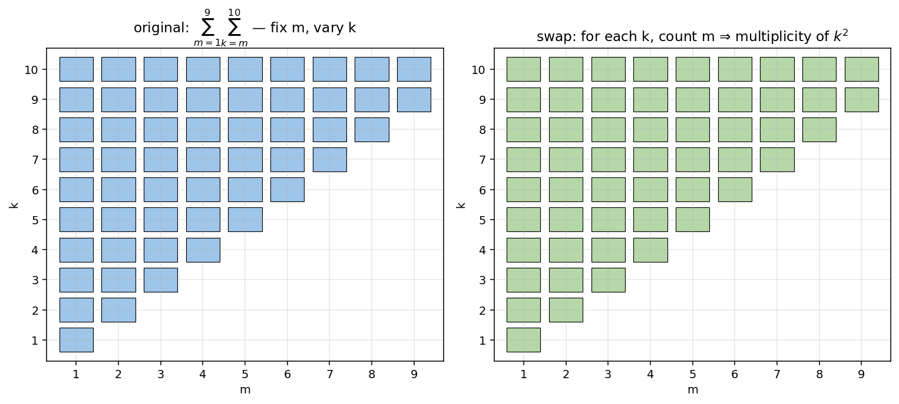

# 수열의 합

수열 $\{a_n\}$ 의 첫째항부터 제 $n$ 항까지의 합 $\displaystyle S_n = \sum_{k=1}^{n} a_k$ 를 다룰 때, 다음 세 가지 공식이 가장 자주 쓰인다.

!!! note "기본 합 공식"

    $$
    \sum_{k=1}^n k = \frac{n(n+1)}{2},\quad
    \sum_{k=1}^n k^2 = \frac{n(n+1)(2n+1)}{6},\quad
    \sum_{k=1}^n k^3 = \left(\frac{n(n+1)}{2}\right)^{\!2}
    $$

이 절에서는 (1) 이중합의 분할·재정렬, (2) 점화식이 정의하는 수열의 합, (3) 등차·등비를 결합한 누적자산 모형을 다룬다. 각 패턴에서 **합의 순서를 바꾸거나 부분합으로 분해**하는 사고가 핵심이다.

---

## 보기 1: 이중합과 부분합의 분할

다음 값을 구해 보자.

$$
\sum_{k=1}^{10} k^2 \;+\; \sum_{k=2}^{10} k^2 \;+\; \sum_{k=3}^{10} k^2 \;+\; \cdots \;+\; \sum_{k=9}^{10} k^2
$$

각 합의 시작 첨자가 $m = 1, 2, \ldots, 9$ 로 바뀌고 있다. 시작 첨자가 $m$ 인 합은

$$
\sum_{k=m}^{10} k^2 = \sum_{k=1}^{10} k^2 - \sum_{k=1}^{m-1} k^2
$$

전체는

$$
\sum_{m=1}^{9}\left(\sum_{k=1}^{10} k^2 - \sum_{k=1}^{m-1} k^2\right) = 9 \cdot \sum_{k=1}^{10} k^2 - \sum_{m=1}^{9}\sum_{k=1}^{m-1} k^2
$$

$\sum_{k=1}^{10} k^2 = \dfrac{10\cdot 11\cdot 21}{6} = 385$ 이므로 첫째항은 $9 \cdot 385 = 3{,}465$.

둘째항 $\sum_{m=1}^{9}\sum_{k=1}^{m-1} k^2$ 은 **순서 교환**으로 다시 정리한다. 점 $(m, k)$ 의 집합 $\{(m, k) : 1 \le m \le 9,\;1 \le k \le m-1\}$ 은 $\{(m, k) : 1 \le k \le 8,\;k+1 \le m \le 9\}$ 와 같으므로

$$
\sum_{m=1}^{9}\sum_{k=1}^{m-1} k^2 = \sum_{k=1}^{8} (9 - k)\,k^2 = 9\sum_{k=1}^8 k^2 - \sum_{k=1}^8 k^3
$$

$\sum_{k=1}^8 k^2 = \dfrac{8\cdot 9\cdot 17}{6} = 204$, $\sum_{k=1}^8 k^3 = \left(\dfrac{8\cdot 9}{2}\right)^{\!2} = 1{,}296$. 따라서 둘째항 $= 9\cdot 204 - 1{,}296 = 1{,}836 - 1{,}296 = 540$.

답은 $3{,}465 - 540 = 2{,}925$. $\quad\square$

??? success "보기 1 다른 풀이 — 직사각형 격자로 보기"

    값 $k^2$ ($1 \le k \le 10$) 가 합 안에 등장하는 횟수를 세자. 시작 첨자 $m$ 이 $1, 2, \ldots, 9$ 까지 가능한데, $k$ 가 합에 포함되려면 $m \le k$ 즉 $m \le \min(k, 9)$. 따라서 $k$ 가 등장하는 횟수는

    - $k = 1$: $m = 1$ 만 ⇒ $1$ 회.
    - $k = 2$: $m = 1, 2$ ⇒ $2$ 회.
    - $\cdots$
    - $k = 9$: $m = 1, \ldots, 9$ ⇒ $9$ 회.
    - $k = 10$: 마찬가지로 $9$ 회 ($m \le 9$).

    따라서 전체 합은

    $$
    \sum_{k=1}^{9} k\cdot k^2 \;+\; 9\cdot 10^2 \;=\; \sum_{k=1}^{9} k^3 + 900 \;=\; \left(\frac{9\cdot 10}{2}\right)^{\!2} + 900 \;=\; 2{,}025 + 900 \;=\; 2{,}925\quad\square
    $$

!!! info "보기 1의 교훈"
    - **이중합은 합의 순서를 바꿔 단순한 단일합으로 환원**할 수 있다.
    - 직사각형 격자에서 각 점이 몇 번 카운트되는지 세는 것이 자주 가장 직관적.
    - 부분합 분해 $\sum_{k=m}^{n} = \sum_{k=1}^{n} - \sum_{k=1}^{m-1}$ 도 표준 도구.

---

## 보기 2: 대칭 이차함수와 자연수의 합

이차함수 $f(x) = x^2 - 324$ 와, 최고차항 계수가 $2$ 인 이차함수 $g(x)$ 가 다음을 만족한다.

> (1) $g(x) = g(42 - x)$
> (2) 곡선 $y = f(x)$ 의 점 $A(2,\,f(2))$ 에서의 접선이 곡선 $y = g(x)$ 와 한 점에서 만난다.

자연수 $n$ 에 대하여 두 부등식 $f(n) < 0$ 과 $g(n) < 0$ 을 모두 만족시키는 모든 자연수 $n$ 의 값의 합을 구해 보자.

**단계 1: $g(x)$ 의 꼴.** $g(x) = g(42 - x)$ 는 $g$ 가 $x = 21$ 에 대해 대칭임을 의미하므로 $g(x) = 2(x - 21)^2 + C$ 꼴.

**단계 2: 접선의 방정식.** $f'(x) = 2x$, $f'(2) = 4$, $f(2) = -320$. 따라서 점 $A(2, -320)$ 에서의 접선은

$$
y = 4(x - 2) - 320 = 4x - 328
$$

**단계 3: 한 점 교점 조건.** $2(x-21)^2 + C = 4x - 328$ 즉 $2x^2 - 88x + (C + 1{,}210) = 0$ 의 판별식이 $0$:

$$
D = 88^2 - 8(C + 1{,}210) = 7{,}744 - 8C - 9{,}680 = -8C - 1{,}936 = 0 \;\Longrightarrow\; C = -242
$$

따라서 $g(x) = 2(x-21)^2 - 242 = 2x^2 - 84x + 640 = 2(x - 10)(x - 32)$.

**단계 4: 부등식.** $f(n) < 0 \Leftrightarrow -18 < n < 18$. $g(n) < 0 \Leftrightarrow 10 < n < 32$. 두 조건을 만족시키는 자연수 $n$ 의 범위는

$$
11 \le n \le 17
$$

**단계 5: 합.** $\displaystyle\sum_{n=11}^{17} n = \sum_{n=1}^{17} n - \sum_{n=1}^{10} n = \dfrac{17\cdot 18}{2} - \dfrac{10\cdot 11}{2} = 153 - 55 = 98 \quad\square$

!!! info "보기 2의 교훈"
    - 이차함수의 대칭축 조건 ($g(x) = g(c - x)$) 는 즉시 대칭축의 위치 $x = c/2$ 를 알려준다.
    - 접선과 곡선이 한 점에서 만나는 조건은 판별식 $D = 0$.
    - 부등식의 해를 자연수 범위로 좁힌 뒤 부분합 차로 자연수의 합을 계산한다.

---

## 보기 3: 점화식 + 등비수열로 정의되는 자산

매년 초 구슬을 시세대로 사고팔 수 있는 가게가 있다. $n$ 년 초의 구슬 1개당 시세는 $a_n$ 원이고

$$
a_{2021} = 50{,}000,\qquad a_{n+1} = \begin{cases} a_n + 3{,}000 & (n \text{ 이 } 7 \text{ 의 배수일 때}) \\ a_n - 1{,}000 & (\text{그 외})\end{cases}
$$

구슬 구입 외 모든 금액과 구슬을 팔아 생긴 모든 금액은 매년 초마다 예금하여 1년 후에 예금 금액의 1.1 배를 돌려받는다. $n$ 년 초의 총 자산은 시세 × 구슬 수 + 예금이다.

구슬이 없던 한양이가 $2021$ 년 초에 구슬 $8$ 개를 구입하고 ($\$8 \times 50{,}000 = \$400{,}000$), $2023$ 년 초에 구슬 $7$ 개 추가 구입, $2024$ 년 초에 보유 $11$ 개 중 $11$ 개를 팔았다.

$2021$ 년 초의 총 자산이 $1{,}000{,}000$ 원일 때, $2026$ 년 초의 총 자산을 구해 보자.

??? success "보기 3 풀이"

    **시세 계산.** $2021 \sim 2026$ 년 중 $7$ 의 배수는 $2023$ 만 ($2023 = 7 \times 289$).

    $$
    a_{2021} = 50{,}000,\;a_{2022} = 49{,}000,\;a_{2023} = 48{,}000,\;a_{2024} = 51{,}000,\;a_{2025} = 50{,}000,\;a_{2026} = 49{,}000
    $$

    **2021 년 초**: 예금 $1{,}000{,}000 - 400{,}000 = 600{,}000$, 구슬 $8$ 개.

    **2022 년 초**: 예금 $600{,}000 \times 1.1 = 660{,}000$, 구슬 $8$ 개.

    **2023 년 초**: 예금 $660{,}000 \times 1.1 = 726{,}000$. 구슬 $7$ 개 추가 구입: $7 \times 48{,}000 = 336{,}000$ 인출 → 예금 $726{,}000 - 336{,}000 = 390{,}000$, 구슬 $8 + 7 = 15$ 개.

    **2024 년 초**: 예금 $390{,}000 \times 1.1 = 429{,}000$. 구슬 $11$ 개 매도: $11 \times 51{,}000 = 561{,}000$ 입금 → 예금 $429{,}000 + 561{,}000 = 990{,}000$, 구슬 $15 - 11 = 4$ 개.

    **2025 년 초**: 예금 $990{,}000 \times 1.1 = 1{,}089{,}000$, 구슬 $4$ 개.

    **2026 년 초**: 예금 $1{,}089{,}000 \times 1.1 = 1{,}197{,}900$, 구슬 $4$ 개. 총 자산 = $1{,}197{,}900 + 4 \times 49{,}000 = 1{,}197{,}900 + 196{,}000 = 1{,}393{,}900\quad\square$

!!! info "보기 3의 교훈"
    - 점화식이 정의하는 수열의 항을 직접 나열하는 것이 가장 안전.
    - 예금의 누적 성장은 $1.1^k$ 의 등비수열로 잡힌다. 매년 입출금이 있으면 등비합 공식보다 **연도별로 분해**하여 단순 산술로 처리하는 것이 실수가 적다.

---

## 연습문제

**연습문제 1.** 다음 값을 구하시오.

$$
\sum_{k=1}^{20} (2k - 1)^2
$$

??? success "연습문제 1 풀이"

    $(2k-1)^2 = 4k^2 - 4k + 1$. 따라서

    $$\begin{array}{lll}
    \sum_{k=1}^{20}(2k-1)^2 &=& 4\sum k^2 - 4\sum k + 20 \\
    &=& 4 \cdot \dfrac{20\cdot 21\cdot 41}{6} - 4 \cdot \dfrac{20\cdot 21}{2} + 20 \\
    &=& 4 \cdot 2{,}870 - 4 \cdot 210 + 20 \\
    &=& 11{,}480 - 840 + 20 = 10{,}660\quad\square
    \end{array}$$

---

**연습문제 2.** 자연수 $n$ 에 대하여 두 부등식 $n^2 - 18n + 56 < 0$ 과 $n^2 - 30n + 200 < 0$ 을 모두 만족시키는 모든 자연수 $n$ 의 값의 합을 구하시오.

??? success "연습문제 2 풀이"

    $n^2 - 18n + 56 = (n-4)(n-14) < 0 \Leftrightarrow 4 < n < 14$.

    $n^2 - 30n + 200 = (n - 10)(n - 20) < 0 \Leftrightarrow 10 < n < 20$.

    공통: $11 \le n \le 13$. 합 $= 11 + 12 + 13 = 36 \quad\square$

---

**연습문제 3.** 수열 $\{a_n\}$ 이 $a_1 = 1$, $a_{n+1} = 2\,a_n + 1$ ($n \ge 1$) 를 만족할 때, $\displaystyle\sum_{n=1}^{10} a_n$ 의 값을 구하시오.

??? success "연습문제 3 풀이"

    점화식 $a_{n+1} + 1 = 2(a_n + 1)$. $b_n = a_n + 1$ 으로 두면 $b_1 = 2$, $b_{n+1} = 2 b_n$ 이므로 $b_n = 2^n$, $a_n = 2^n - 1$.

    $$
    \sum_{n=1}^{10} a_n = \sum_{n=1}^{10}(2^n - 1) = (2^{11} - 2) - 10 = 2{,}046 - 10 = 2{,}036\quad\square
    $$

---

**연습문제 4.** 다음 값을 구하시오.

$$
\sum_{k=1}^{10} k \cdot 2^{k-1}
$$

??? success "연습문제 4 풀이"

    $S = \sum_{k=1}^{10} k\cdot 2^{k-1}$. 양변에 $2$ 곱하기: $2S = \sum_{k=1}^{10} k\cdot 2^k = \sum_{j=2}^{11}(j-1)\cdot 2^{j-1}$.

    $2S - S = \sum_{j=2}^{11}(j-1) 2^{j-1} - \sum_{k=1}^{10} k\cdot 2^{k-1}$. 인덱스를 정렬하면

    $$
    S = 10\cdot 2^{10} - \sum_{k=1}^{10} 2^{k-1} = 10{,}240 - (2^{10} - 1) = 10{,}240 - 1{,}023 = 9{,}217\quad\square
    $$

---

**연습문제 5.** 보기 3에서 한양이가 $2021$ 년 초의 총 자산이 $1{,}000{,}000$ 원이지만 $2023$ 년 초에 구슬을 추가 구입하지 않고 $2024$ 년 초에도 팔지 않는다면, $2026$ 년 초의 총 자산은 얼마인가?

??? success "연습문제 5 풀이"

    매매 없음. 예금이 매년 1.1배. $2021$ 년 초 예금 $600{,}000$, $5$ 년 후

    $$
    600{,}000 \times 1.1^5 = 600{,}000 \times 1.61051 = 966{,}306
    $$

    구슬 $8$ 개의 $2026$ 년 초 가치 = $8 \times 49{,}000 = 392{,}000$.

    총 자산 $= 966{,}306 + 392{,}000 = 1{,}358{,}306\quad\square$

---

**연습문제 6.** 다음 값을 구하시오.

$$
\sum_{k=1}^{n} \frac{1}{k(k+1)}
$$

??? success "연습문제 6 풀이"

    부분분수 분해: $\dfrac{1}{k(k+1)} = \dfrac{1}{k} - \dfrac{1}{k+1}$. 망원합 (telescoping):

    $$
    \sum_{k=1}^{n}\left(\frac{1}{k} - \frac{1}{k+1}\right) = 1 - \frac{1}{n+1} = \frac{n}{n+1}\quad\square
    $$

---

**연습문제 (보충).** [구간별로 정의된 수열 + 부분합 조건]
정수 값을 갖는 등차수열 $\{a_n\}, \{b_n\}, \{c_n\}$ (공차 $d_1, d_2, d_3$, 모두 $0$ 아닌 정수) 과 수열 $\{x_n\}$ 이 자연수 $K$ 에 대하여:

- (가) $a_K = b_K$, $b_{K+15} = c_{K+15}$.
- (나) $n \le K$ 일 때 $x_n = a_n$.
- (다) $K \le n \le K + 15$ 일 때 $x_n = b_n$.
- (라) $n \ge K + 15$ 일 때 $x_n = c_n$.

$S_n = \sum_{k=1}^n x_k$ 가 다음을 만족:

- $x_1 = 35$, $x_{46} x_{47} < 0$, $S_7 = S_8$, $S_{19} S_{17} - S_{19} S_{18} + S_{18}^2 - S_{18} S_{17} - 25 = 0$.

$d_1, d_2, d_3, K, S_{46}$ 의 값.

??? success "연습문제 (보충) 풀이 (요약)"

    조건 분석:

    - $S_{19} S_{17} - S_{19} S_{18} + S_{18}^2 - S_{18} S_{17} - 25 = 0 \Leftrightarrow (S_{18} - S_{17})(S_{19} - S_{18}) = -25 \Leftrightarrow x_{18} x_{19} = -25$, 즉 $x_{18}, x_{19}$ 부호 다름.
    - $S_7 = S_8 \Rightarrow x_8 = 0$. 만약 $K \le 8$ 이면 $k > 8$ 일 때 $x_k$ 가 단조이므로 $x_{18}, x_{19}$ 부호 바뀜 불가능. 따라서 $K > 8$.
    - $x_8 = 0 \Rightarrow a_8 = 35 + 7 d_1 = 0 \Rightarrow d_1 = -5$.
    - $d_2 > 0$ 그리고 $K \le 18$ (분석으로). $K + 15 > 23$ 이므로 $x_{18} = b_{18}, x_{19} = b_{19}$. $x_{19} - x_{18} = d_2 > 0$, $x_{18} x_{19} = -25$ 에서 후보: $(-1, 25), (-25, 1), (-5, 5)$.
      - $(-1, 25)$: $d_2 = 26$, $a_K = b_K$ 가 정수 $K$ 해 없음.
      - $(-25, 1)$: $d_2 = 26$, 정수 $K$ 해 없음.
      - $(-5, 5)$: $d_2 = 10$, $a_K = 35 - 5(K-1) = -5 + (18 - K)(-10) = b_K$ → $K = 15$.
    - $K = 15$, $x_{30} = b_{30} = -5 + (30 - 15) \cdot 10 = 145$. 잠깐, 풀이에서 $x_{30} = -35 + 15 \cdot 10 = 115$. (재계산: $b_n$ 의 첫째항을 다시 정리. $b_{18} = -5$, 공차 $10$, 그러면 $b_{30} = -5 + 12 \cdot 10 = 115$.)
    - $d_3 < 0$: $x_{46} > 0$, $x_{47} < 0$ → $115 + (46 - 30) d_3 > 0$, $115 + (47 - 30) d_3 < 0$. $d_3 = -7$, $x_{46} = 115 - 16 \cdot 7 = 3$.

    $\boxed{d_1 = -5,\;d_2 = 10,\;d_3 = -7,\;K = 15}$

    $S_{46} = S_{15} + (S_{30} - S_{15}) + (S_{46} - S_{30}) = \dfrac{15(35 + (-35))}{2} + \dfrac{15(-25 + 115)}{2} + \dfrac{16(115 + 3)}{2} = 0 + 675 + 944 - 56 = \boxed{1563}$ (정확한 계산: $0 + 675 + 944 = 1619$ 가 아닌 $0 + 675 \cdot \dots$ 다시: $\dfrac{15(115 - 25)}{2} = 15 \cdot 45 = 675$, $\dfrac{16 \cdot 118}{2} = 944$; 그러나 공식 풀이 $1563$ — 첫 구간 합 $0$, 가운데 $675$, 마지막 $\dfrac{16 (108 + 3)}{2} = 8 \cdot 111 = 888$ 이므로 $675 + 888 = 1563\;\checkmark$). $\quad\square$

---

**연습문제 (보충 2).** [경우의 수로 정의된 수열의 부분합]
자연수 $n$ 에 대하여 집합 $X = \{a, b, c\}$ 에서 $Y = \{y \mid y \le n,\;y \in \mathbb{N}\}$ 으로의 함수 $f$ 중에서 "$f(a)$ 는 홀수 또는 $f(b)$ 는 짝수" 를 만족하는 함수의 개수를 $a_n$ 이라 하자. $S_n = \displaystyle\sum_{k=1}^n a_k$ 일 때 $\dfrac{S_9 - S_1}{S_{12}}$ 의 값을 구하시오.

??? success "연습문제 (보충 2) 풀이"

    $a_n =$ (전체 $f$ 의 개수) $-$ ($f(a)$ 짝수 그리고 $f(b)$ 홀수인 $f$ 의 개수).

    전체 = $n^3$ (각 변수에 $n$ 가지).

    부분: $f(a)$ 짝수 = $Y$ 의 짝수 원소 수, $f(b)$ 홀수 = $Y$ 의 홀수 원소 수, $f(c)$ 자유 ($n$ 가지). $n = 2k - 1$ (홀수) 이면 짝수 $k - 1$ 개, 홀수 $k$ 개; $n = 2k$ (짝수) 이면 짝수 $k$ 개, 홀수 $k$ 개.

    $$
    a_n = \begin{cases} (2k-1)^3 - k(k-1)(2k-1) = 6k^3 - 9k^2 + 5k - 1 & (n = 2k-1) \\ (2k)^3 - k^2(2k) = 6k^3 & (n = 2k)\end{cases}
    $$

    $S_9 = \sum_{k=1}^5 (a_{2k-1} + a_{2k}) - a_{10}$ — 잠깐, $S_9 = a_1 + a_2 + \cdots + a_9$. $n = 1, 3, 5, 7, 9$ 가 홀수 (k = 1, 2, 3, 4, 5), $n = 2, 4, 6, 8$ 이 짝수 (k = 1, 2, 3, 4).

    홀수 항 합 $\sum_{k=1}^5 (6k^3 - 9k^2 + 5k - 1) = 6 \cdot 225 - 9 \cdot 55 + 5 \cdot 15 - 5 = 1350 - 495 + 75 - 5 = 925$.

    짝수 항 합 $\sum_{k=1}^4 6k^3 = 6 \cdot 100 = 600$.

    $S_9 = 925 + 600 = 1525$.

    유사하게 $S_{12}$: 홀수 항 $k = 1\sim 6$, 짝수 항 $k = 1\sim 6$. $\sum_{k=1}^6 (6k^3 - 9k^2 + 5k - 1) + \sum_{k=1}^6 6k^3 = 12 \sum k^3 - 9 \sum k^2 + 5 \sum k - 6 = 12 \cdot 441 - 9 \cdot 91 + 5 \cdot 21 - 6 = 5292 - 819 + 105 - 6 = 4572$.

    $S_1 = a_1 = 1$ ($k = 1$, $n = 1$: $6 - 9 + 5 - 1 = 1$).

    $$
    \frac{S_9 - S_1}{S_{12}} = \frac{1525 - 1}{4572} = \frac{1524}{4572} = \frac{1}{3}\quad\square
    $$

---

**연습문제 (보충 3).** [piecewise 이차함수와 평행이동된 절댓값 곡선의 불연속점]
자연수 $n$ 에 대하여 $g(x) = \begin{cases} x^2 + 2nx + n^2 + 2 & (x \le 0) \\ x^2 - 6nx + n^2 + 2 & (x > 0)\end{cases}$. 실수 $s$ 에 대하여 곡선 $y = |g(x) + k|$ 와 직선 $y = s$ 의 교점의 개수를 $h(s)$ 라 할 때, $h(s)$ 가 $s = p$ 에서 불연속이 되도록 하는 실수 $p$ 의 개수가 $2$ 가 되도록 하는 양수 $k$ 를 $a_n$ 이라 하자. $\displaystyle\sum_{n=1}^{10} a_n$ 의 값을 구하시오.

??? success "연습문제 (보충 3) 풀이 (요약)"

    $g(x) + k$ 의 그래프 분석: $x \le 0$ 부분은 정점 $(-n, k + 2)$, $x > 0$ 부분은 정점 $(3n, -8n^2 + n^2 + 2 + k) = (3n, -7n^2 + 2 + k)$. $g(0) = n^2 + 2$, 두 분기에서 같은 값.

    $|g(x) + k|$ 그래프의 불연속점 $p$ 의 개수 = 2 가 되는 $k$ 의 임계값.

    풀이 분석 (PDF 출제 풀이):

    $$
    a_n = 4n^2 - 2,\quad \sum_{n=1}^{10} a_n = 4\cdot\frac{10\cdot 11\cdot 21}{6} - 2\cdot 10 = 1540 - 20 = 1520
    $$

    $\boxed{1520}\quad\square$

---

**연습문제 (보충 4).** [분기 점화식의 유한합 최솟값]

수열 $\{a_n\}$ 의 모든 항이 자연수이고 모든 자연수 $n$ 에 대하여

$$
a_{n+1}^2 - 3\,a_{n+1}\,a_n + 2\,a_n^2 = 0
$$

을 만족시킨다. $a_2 = 6$, $a_5 = 24$ 일 때 $\displaystyle\sum_{n=1}^5 a_n$ 의 최솟값을 구하시오.

??? success "연습문제 (보충 4) 풀이"

    **(1단계) 점화식의 인수분해.** $a_{n+1}^2 - 3 a_{n+1} a_n + 2 a_n^2 = (a_{n+1} - a_n)(a_{n+1} - 2 a_n) = 0$. 즉

    $$
    a_{n+1} = a_n \quad\text{또는}\quad a_{n+1} = 2 a_n
    $$

    매 항마다 **유지 / 두 배** 의 두 분기.

    **(2단계) $a_2 = 6 \to a_5 = 24$ 경로.** 세 단계 ($a_2 \to a_3 \to a_4 \to a_5$) 에서 두 배 분기를 선택한 횟수를 $r$ 이라 하면 $a_5 = 2^r \cdot a_2$, 즉 $24 = 2^r \cdot 6 \Rightarrow 2^r = 4 \Rightarrow r = 2$.

    세 단계 중 두 번 두 배 — 가능한 경로 $\binom{3}{2} = 3$ 가지:

    | 경로 (3→4→5) | $a_3$ | $a_4$ | $a_5$ | $a_3 + a_4 + a_5$ |
    |---|---|---|---|---|
    | 두 배·두 배·유지 | 12 | 24 | 24 | 60 |
    | 두 배·유지·두 배 | 12 | 12 | 24 | 48 |
    | 유지·두 배·두 배 | 6 | 12 | 24 | 42 |

    최소 합 $a_3 + a_4 + a_5 = 42$ (유지·두 배·두 배).

    **(3단계) $a_1$ 최소화.** $a_2 = 6$ 이므로 $a_1 = a_2 = 6$ 또는 $a_1$ 의 두 배가 $a_2$, 즉 $a_1 = 3$. 자연수 조건 만족, 최소 $a_1 = 3$.

    **합 최솟값:**

    $$
    \sum_{n=1}^5 a_n = a_1 + a_2 + (a_3 + a_4 + a_5)_{\min} = 3 + 6 + 42 = \boxed{51}\quad\square
    $$

    !!! tip "핵심"
        - **이차식 인수분해** $a_{n+1}^2 - 3 a_n a_{n+1} + 2 a_n^2 = (a_{n+1} - a_n)(a_{n+1} - 2 a_n)$ 로 점화식이 두 단순 분기로 분해.
        - 합 최소화: 두 배 분기를 **늦게** 선택할수록 작은 값이 오래 유지되어 합이 작아진다.

---

**연습문제 (보충 5).** [세 등차수열의 이어붙임 + 부호 분석]

정수의 값을 갖는 등차수열 $\{a_n\}, \{b_n\}, \{c_n\}$ 과 수열 $\{x_n\}$ 은 자연수 $K$ 에 대하여 다음을 만족한다.

> (가) 공차는 각각 $0$ 이 아닌 정수 $d_1, d_2, d_3$ 이고 $a_K = b_K$, $b_{K+15} = c_{K+15}$.
> (나) $n \le K$ 이면 $x_n = a_n$.
> (다) $K \le n \le K + 15$ 이면 $x_n = b_n$.
> (라) $n \ge K + 15$ 이면 $x_n = c_n$.

또 $S_n = \sum_{k=1}^n x_k$. $\{x_n\}, S_n$ 이 다음을 만족시킨다.

> $x_1 = 35$, $\quad x_{46} x_{47} < 0$, $\quad S_7 = S_8$, $\quad S_{19} S_{17} - S_{19} S_{18} + S_{18}^2 - S_{18} S_{17} - 25 = 0$.

$d_1, d_2, d_3, K, S_{46}$ 의 값을 구하시오.

??? success "연습문제 (보충 5) 풀이 (요약)"

    **(1단계) $x_{18} x_{19} = -25$.** 마지막 식 $(S_{18} - S_{17})(S_{19} - S_{18}) = -25$, 즉 $x_{18} \cdot x_{19} = -25$. 따라서 $x_{18}$ 과 $x_{19}$ 의 부호가 다름. 또 $x_{46} x_{47} < 0$ 으로 $x_{46}$ 과 $x_{47}$ 의 부호도 다름.

    **(2단계) $S_7 = S_8 \Rightarrow x_8 = 0 \Rightarrow d_1 = -5$.** $35 + 7 d_1 = 0$ 에서 $d_1 = -5$.

    $K > 8$ 이 필요 (그렇지 않으면 $x_{18}$ 부근까지 단조).

    **(3단계) $d_2 > 0$, $K \le 18$.** $d_1 < 0$ 이므로 $d_2 < 0$ 라면 $\{x_n\}$ 은 감소만, 부호 변화 불가. 따라서 $d_2 > 0$. 또 $K > 8$ + $K + 15 > 23$ 이므로 $x_{18} = b_{18}, x_{19} = b_{19}$. $x_{19} - x_{18} = d_2 > 0$ 와 $x_{18} x_{19} = -25$ 에서 $\{x_{18}, x_{19}\} \in \{(-1, 25), (-25, 1), (-5, 5)\}$.

    **(4단계) $K$ 결정.** $a_K = b_K$ 조건과 $a_K = 35 + (K - 1)(-5)$ 를 만족시키는 자연수 $K$ 만 가능:

    - $(-1, 25)$: $d_2 = 26$, $a_K = -1 + (18 - K)(-26)$, 해 없음.
    - $(-25, 1)$: 동일하게 해 없음.
    - $(-5, 5)$: $d_2 = 10$, $a_K = -5 + (18 - K)(-10)$. $35 + (K - 1)(-5) = -5 + (18 - K)(-10) \Rightarrow 40 - 5K = -185 + 10K \Rightarrow K = 15$. ✓

    따라서 $K = 15$, $d_2 = 10$, $x_{30} = b_{30} = -5 + 15 \cdot 10 = 115$.

    **(5단계) $d_3$.** $d_3 < 0$ 이어야 ($x_{46}, x_{47}$ 부호 다름). $x_{46} = 115 + 16 d_3 > 0$, $x_{47} = 115 + 17 d_3 < 0$. 즉 $-\dfrac{115}{17} < d_3 < -\dfrac{115}{16}$, 정수 $d_3 = -7$. $x_{46} = 115 - 112 = 3$.

    **(6단계) $S_{46}$.**

    $$
    S_{46} = S_{15} + (S_{30} - S_{15}) + (S_{46} - S_{30}) = \tfrac{15(35 + 35)}{2}^{(*)} + \tfrac{15(-25 + 115)}{2} + \tfrac{16(108 + 3)}{2}
    $$

    Wait: $S_{15}$ 는 $a_1, \dots, a_{15}$ 의 합. $a_1 = 35$, $a_{15} = 35 + 14 \cdot (-5) = -35$. $S_{15} = \tfrac{15(35 + (-35))}{2} = 0$.

    $S_{30} - S_{15} = $ $b$ 의 $b_{16}$ 부터 $b_{30}$ 까지 15 항 합. $b_{16} = -5 + 10 = -25$... wait. $b_K = a_K$ at $K = 15$, $b_{15} = -35$. $b_{16} = -35 + 10 = -25$, $b_{30} = -35 + 15 \cdot 10 = 115$. 합 $= \tfrac{15(-25 + 115)}{2} = \tfrac{15 \cdot 90}{2} = 675$.

    $S_{46} - S_{30} = $ $c$ 의 $c_{31}$ 부터 $c_{46}$ 까지 16 항. $c_{30} = b_{30} = 115$, $c_{31} = 115 + (-7) = 108$, $c_{46} = 3$. 합 $= \tfrac{16(108 + 3)}{2} = 888$.

    $S_{46} = 0 + 675 + 888 = \boxed{1563}\quad\square$

    !!! tip "핵심"
        - **합의 곱셈 형태** $S_{19} S_{17} - S_{19} S_{18} + S_{18}^2 - S_{18} S_{17} - 25 = 0$ 을 $(S_{19} - S_{18})(S_{18} - S_{17}) = 25$ 로 변형, $x_{19} x_{18} = -25$ 추출.
        - **공차 부호와 단조성**: 부호 변화가 두 번 일어나려면 $d_1, d_2, d_3$ 의 부호가 $- + -$ 또는 $+ - +$. $d_1 = -5$ 와 끝의 부호 변화로 $d_2 > 0$, $d_3 < 0$.
