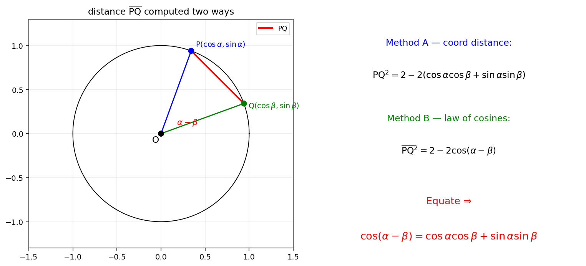
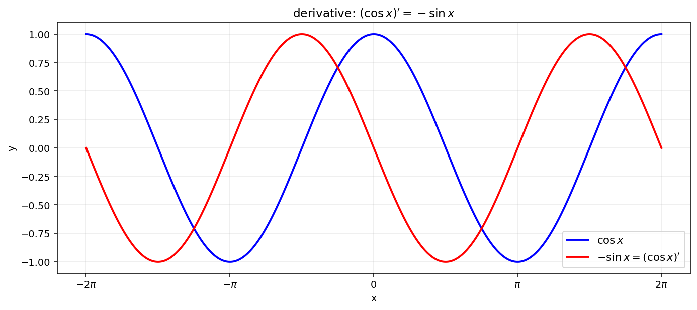

# 삼각함수의 덧셈정리와 미분

삼각함수의 미분법을 **유도**하는 일은 단순한 외움이 아니라 다음 세 조각의 결합으로 이루어진다.

!!! note "세 조각의 도구"
    1. **코사인법칙**: 삼각형 $\triangle \mathrm{ABC}$ 에서 $a^2 = b^2 + c^2 - 2bc\cos A$.
    2. **단위원과 두 점 사이의 거리**: $\mathrm{P}(\cos\alpha, \sin\alpha)$, $\mathrm{Q}(\cos\beta, \sin\beta)$ 의 거리 제곱은 $\overline{\mathrm{PQ}}^{\,2} = 2 - 2\cos(\alpha - \beta)$.
    3. **삼각함수의 극한**: $\displaystyle\lim_{x\to 0} \frac{\sin x}{x} = 1$ (단, $x$ 는 라디안).

이 세 도구를 결합하면

- 코사인 덧셈정리 $\cos(\alpha + \beta) = \cos\alpha\cos\beta - \sin\alpha\sin\beta$ 가 **증명**되고
- 그로부터 $(\cos x)' = -\sin x$ 가 **유도**된다.

---

## 보기 1: 코사인 덧셈정리의 증명

단위원 위의 두 점 $\mathrm{P}(\cos\alpha, \sin\alpha)$ 와 $\mathrm{Q}(\cos\beta, \sin\beta)$ 사이의 거리 $\overline{\mathrm{PQ}}$ 를 두 방법으로 계산하여 두 값을 같게 둔다.

**방법 A — 좌표공식.** 두 점 사이의 거리의 제곱

$$
\overline{\mathrm{PQ}}^{\,2} = (\cos\beta - \cos\alpha)^2 + (\sin\beta - \sin\alpha)^2 = 2 - 2(\cos\alpha\cos\beta + \sin\alpha\sin\beta)
$$

**방법 B — 코사인법칙.** $\triangle \mathrm{POQ}$ 에서 $\overline{\mathrm{OP}} = \overline{\mathrm{OQ}} = 1$, $\angle \mathrm{POQ} = \alpha - \beta$ 이므로

$$
\overline{\mathrm{PQ}}^{\,2} = 1 + 1 - 2\cdot 1\cdot 1\cdot\cos(\alpha - \beta) = 2 - 2\cos(\alpha - \beta)
$$

두 식이 같으므로

$$
\cos(\alpha - \beta) = \cos\alpha\cos\beta + \sin\alpha\sin\beta
$$

여기에 $\beta$ 대신 $-\beta$ 를 대입하면 ($\cos$ 은 우함수, $\sin$ 은 기함수)

$$
\cos(\alpha + \beta) = \cos\alpha\cos\beta - \sin\alpha\sin\beta\quad\square
$$

!!! info "보기 1의 교훈"
    - **같은 양을 두 방법으로 계산하여 등식을 얻는다** — 수학 증명의 가장 기본적 전략.
    - 단위원 + 코사인법칙은 모든 삼각함수 항등식의 출발점.

---

## 보기 2: $(\cos x)' = -\sin x$ 의 유도

미분의 정의로부터

$$
(\cos x)' = \lim_{h \to 0} \frac{\cos(x + h) - \cos x}{h}
$$

보기 1의 코사인 덧셈정리 $\cos(x + h) = \cos x\cos h - \sin x\sin h$ 를 대입하면

$$
(\cos x)' = \lim_{h \to 0} \frac{\cos x\cos h - \sin x\sin h - \cos x}{h} = \cos x \cdot \lim_{h \to 0}\frac{\cos h - 1}{h} - \sin x \cdot \lim_{h \to 0}\frac{\sin h}{h}
$$

두 극한을 따로 계산한다.

**극한 ①: $\displaystyle\lim_{h \to 0} \frac{\sin h}{h} = 1$** (제시 도구).

**극한 ②: $\displaystyle\lim_{h \to 0} \frac{\cos h - 1}{h}$.** 분자·분모에 $\cos h + 1$ 을 곱한다.

$$
\frac{\cos h - 1}{h} = \frac{(\cos h - 1)(\cos h + 1)}{h(\cos h + 1)} = \frac{\cos^2 h - 1}{h(\cos h + 1)} = -\frac{\sin^2 h}{h(\cos h + 1)} = -\frac{\sin h}{h}\cdot\frac{\sin h}{\cos h + 1}
$$

$h \to 0$ 일 때 $\dfrac{\sin h}{h} \to 1$ 이고 $\dfrac{\sin h}{\cos h + 1} \to \dfrac{0}{2} = 0$. 따라서 ② $= -1 \cdot 0 = 0$.

두 극한을 합쳐 보면

$$
(\cos x)' = \cos x \cdot 0 - \sin x \cdot 1 = -\sin x\quad\square
$$

!!! info "보기 2의 교훈"
    - **미분의 정의 + 덧셈정리 + 표준 극한** — 모든 기본 함수의 도함수를 유도하는 표준 절차.
    - 분자유리화 $\cos h - 1 \to \dfrac{-\sin^2 h}{\cos h + 1}$ 는 단골 트릭. $\sin$ 의 표준 극한으로 환원하기 위함이다.

---

## 연습문제

**연습문제 1.** 보기 1과 동일한 방법으로 $\sin(\alpha + \beta) = \sin\alpha\cos\beta + \cos\alpha\sin\beta$ 를 증명하시오. (힌트: $\sin\theta = \cos(\pi/2 - \theta)$.)

??? success "연습문제 1 풀이"

    $\sin(\alpha + \beta) = \cos\!\left(\dfrac{\pi}{2} - \alpha - \beta\right) = \cos\!\left(\!\!\left(\dfrac{\pi}{2} - \alpha\right) - \beta\right)$.

    코사인의 차 공식 (보기 1) 에 의하여

    $$\begin{array}{lll}
    \cos\!\left(\!\!\left(\dfrac{\pi}{2} - \alpha\right) - \beta\right)
    &=& \cos\!\left(\dfrac{\pi}{2} - \alpha\right)\cos\beta + \sin\!\left(\dfrac{\pi}{2} - \alpha\right)\sin\beta \\
    &=& \sin\alpha\cos\beta + \cos\alpha\sin\beta\quad\square
    \end{array}$$

---

**연습문제 2.** 보기 2와 동일한 방법으로 $(\sin x)' = \cos x$ 를 증명하시오.

??? success "연습문제 2 풀이"

    $$\begin{array}{lll}
    (\sin x)' &=& \displaystyle\lim_{h\to 0}\frac{\sin(x+h) - \sin x}{h} \\
    &=& \displaystyle\lim_{h\to 0}\frac{\sin x\cos h + \cos x\sin h - \sin x}{h} \\
    &=& \sin x \cdot \displaystyle\lim_{h\to 0}\frac{\cos h - 1}{h} + \cos x \cdot \displaystyle\lim_{h\to 0}\frac{\sin h}{h} \\
    &=& \sin x \cdot 0 + \cos x \cdot 1 = \cos x\quad\square
    \end{array}$$

---

**연습문제 3.** 연습문제 2와 보기 2를 이용하여 $(\tan x)' = \sec^2 x$ 를 증명하시오.

??? success "연습문제 3 풀이"

    $\tan x = \dfrac{\sin x}{\cos x}$. 몫의 미분법:

    $$
    (\tan x)' = \frac{(\sin x)'\cos x - \sin x(\cos x)'}{\cos^2 x} = \frac{\cos^2 x + \sin^2 x}{\cos^2 x} = \frac{1}{\cos^2 x} = \sec^2 x\quad\square
    $$

---

**연습문제 4.** $\displaystyle\lim_{x \to 0} \frac{1 - \cos(2x)}{x^2}$ 의 값을 구하시오.

??? success "연습문제 4 풀이"

    $1 - \cos(2x) = 2\sin^2 x$ 이므로

    $$
    \frac{1 - \cos(2x)}{x^2} = 2\cdot \frac{\sin^2 x}{x^2} = 2\cdot\left(\frac{\sin x}{x}\right)^{\!2}
    $$

    $x \to 0$ 일 때 $\dfrac{\sin x}{x} \to 1$ 이므로 극한 $= 2 \cdot 1^2 = 2 \quad\square$

---

**연습문제 5.** $\sin\!\left(\dfrac{\pi}{12}\right)$ 의 정확한 값을 덧셈정리를 이용하여 구하시오.

??? success "연습문제 5 풀이"

    $\dfrac{\pi}{12} = \dfrac{\pi}{3} - \dfrac{\pi}{4}$ 이므로

    $$\begin{array}{lll}
    \sin\!\left(\dfrac{\pi}{3} - \dfrac{\pi}{4}\right)
    &=& \sin\dfrac{\pi}{3}\cos\dfrac{\pi}{4} - \cos\dfrac{\pi}{3}\sin\dfrac{\pi}{4} \\
    &=& \dfrac{\sqrt 3}{2}\cdot\dfrac{\sqrt 2}{2} - \dfrac{1}{2}\cdot\dfrac{\sqrt 2}{2} \\
    &=& \dfrac{\sqrt 6 - \sqrt 2}{4}\quad\square
    \end{array}$$

---

**연습문제 6.** $\cos\!\left(\arcsin\dfrac{3}{5} + \arcsin\dfrac{5}{13}\right)$ 의 값을 구하시오.

??? success "연습문제 6 풀이"

    $\alpha = \arcsin\dfrac{3}{5}$, $\beta = \arcsin\dfrac{5}{13}$ 으로 두면 $\sin\alpha = 3/5$, $\sin\beta = 5/13$. 두 각이 일반적 $[0, \pi/2]$ 범위이므로 $\cos\alpha = 4/5$, $\cos\beta = 12/13$.

    $$
    \cos(\alpha + \beta) = \frac{4}{5}\cdot\frac{12}{13} - \frac{3}{5}\cdot\frac{5}{13} = \frac{48 - 15}{65} = \frac{33}{65}\quad\square
    $$

---

**연습문제 7.** 함수 $f(x) = \sin x \cos x$ 의 도함수를 두 방법으로 구하고 일치함을 확인하시오. (방법 A: 곱의 미분. 방법 B: 배각 공식 $\sin x\cos x = \frac{1}{2}\sin(2x)$ 후 합성함수 미분.)

??? success "연습문제 7 풀이"

    **방법 A.** $(uv)' = u'v + uv'$ 에서 $u = \sin x$, $v = \cos x$:

    $$
    f'(x) = \cos x \cdot \cos x + \sin x \cdot (-\sin x) = \cos^2 x - \sin^2 x
    $$

    **방법 B.** $f(x) = \tfrac{1}{2}\sin(2x)$ 의 도함수는 $\tfrac{1}{2}\cdot 2\cos(2x) = \cos(2x)$.

    배각 공식 $\cos(2x) = \cos^2 x - \sin^2 x$ 이므로 두 방법은 일치 $\quad\square$
