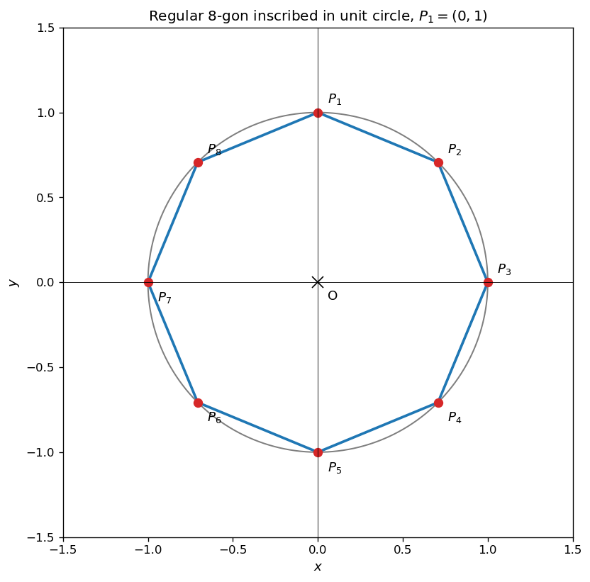
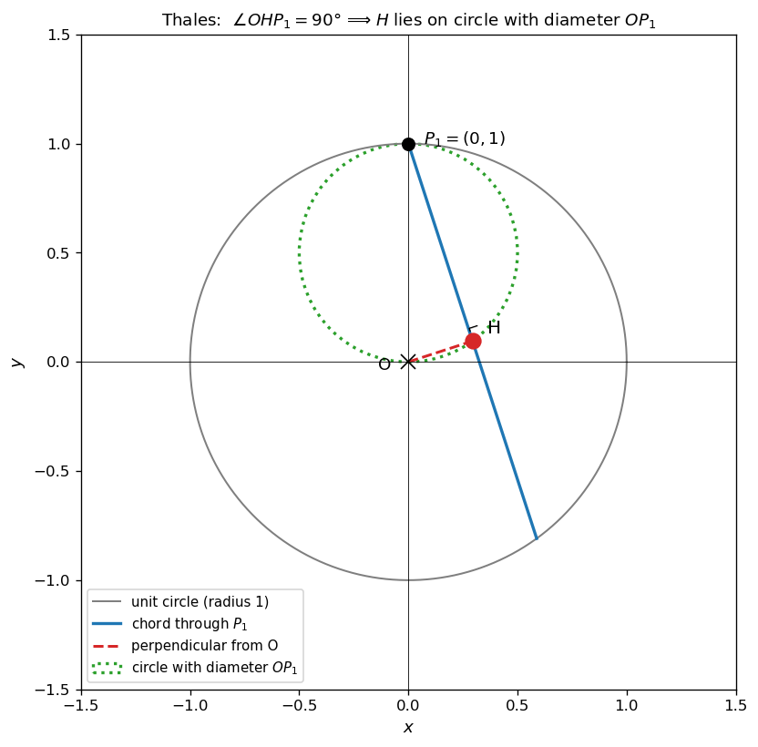
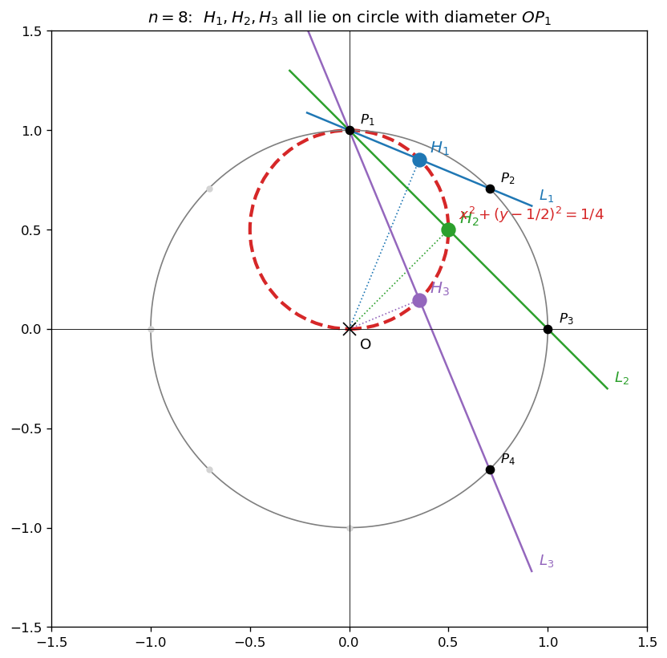
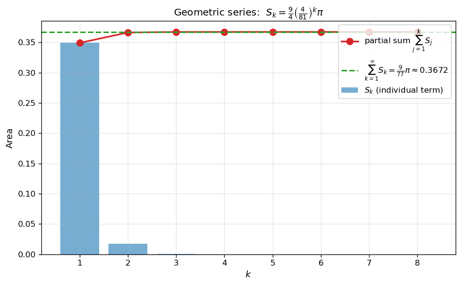
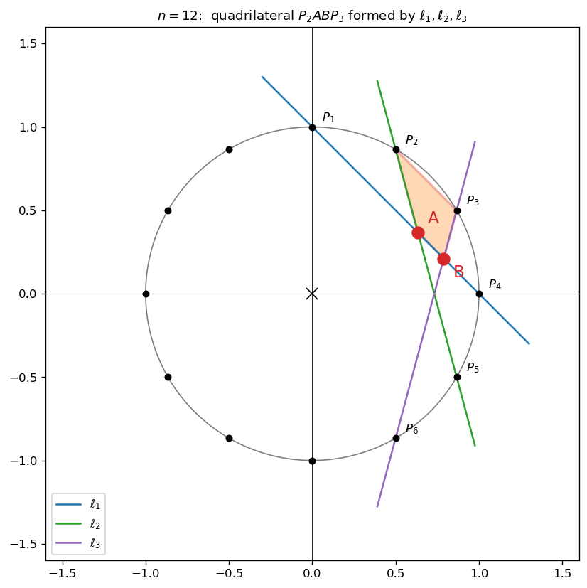
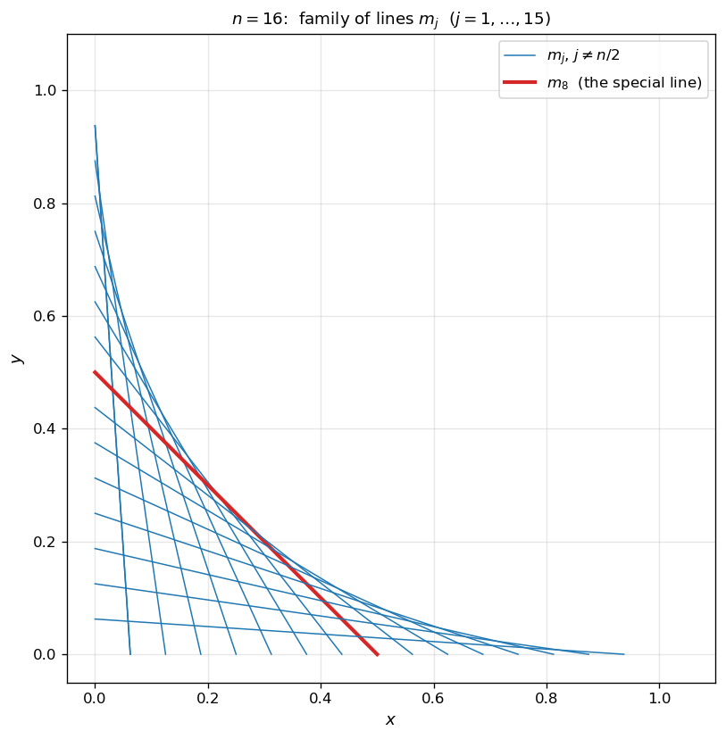
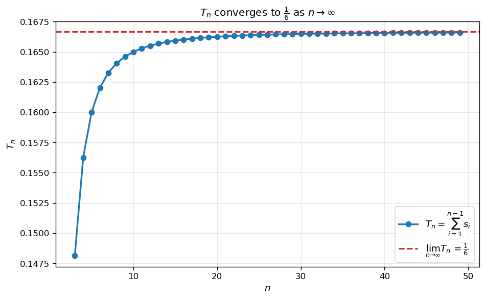

# 정n각형과 외접원

원에 내접한 정n각형의 꼭짓점들로부터 만들어지는 직선·교점·수선의 발은 풍부한 기하적 관계를 갖는다. 이 절에서는 **원의 중심 $O$ 에서 한 꼭짓점 $P_1$ 을 지나는 직선들에 내린 수선의 발들이 항상 한 원 위에 놓이는 사실** (탈레스 정리의 한 응용) 과, **n각형 분할로 생기는 도형의 넓이의 극한** 을 다룬다.

!!! note "사용 도구"
    1. **탈레스 정리**: 원의 지름 $\overline{AB}$ 에 대하여 원 위의 임의의 점 $P$ ($\neq A, B$) 에서 $\angle APB = 90°$. 역으로, $\angle APB = 90°$ 인 점 $P$ 는 지름 $\overline{AB}$ 를 갖는 원 위에 있다.

    2. **직선의 방정식**: 두 점 $(x_1, y_1)$, $(x_2, y_2)$ 를 지나는 직선의 방정식은 $\dfrac{x}{x_1} + \dfrac{y}{y_2} = 1$ (절편 형식) 이다 — 두 점이 각각 $x$ 축, $y$ 축 위에 있는 경우.

    3. **두 직선의 교점**: 두 직선의 방정식을 연립하여 푼다.

    4. **등비급수의 합**: 공비 $|r| < 1$ 인 등비수열의 무한합 $\displaystyle\sum_{k=1}^\infty a r^{k-1} = \dfrac{a}{1 - r}$.

    5. **수열의 합과 극한**: $\displaystyle\sum_{i=1}^{n-1} i^2 = \dfrac{(n-1)n(2n-1)}{6}$ 등의 표준 공식.

---

## 보기 1: 원에 내접한 정n각형

중심이 원점이고 반지름이 $1$ 인 원 $C$ 위의 $n$ 개의 점 $P_1, P_2, \ldots, P_n$ 이 정$n$각형을 이룬다. 첫 점 $P_1 = (0, 1)$ 이라 하면, 시계방향으로 $\dfrac{2\pi}{n}$ 씩 회전한 점들이 나머지 꼭짓점이다.

$$
P_k = \left(\sin\!\frac{2\pi(k-1)}{n},\;\cos\!\frac{2\pi(k-1)}{n}\right),\quad k = 1, 2, \ldots, n
$$

<figure markdown>
  { width=520 }
  <figcaption markdown>$n = 8$ 일 때 단위원에 내접한 정팔각형. 꼭짓점 $P_1 = (0, 1)$ 부터 시계방향으로 번호. 일반적인 $n$ 에 대해서도 같은 방식.</figcaption>
</figure>

---

## 보기 2: 한 점에서 시작하는 직선들에 원점에서 내린 수선의 발 — 탈레스의 결론

원 $C$ 위의 한 점 $P_1$ 을 통과하는 모든 직선 (원 안쪽으로 내려가는 chord) 에 대하여 원점 $O$ 에서 내린 수선의 발 $H$ 는 항상 **선분 $\overline{OP_1}$ 을 지름으로 하는 원** 위에 놓인다.

이유: 직각 $\angle OHP_1 = 90°$ 가 항상 성립하므로 탈레스 정리의 역.

<figure markdown>
  { width=520 }
  <figcaption markdown>$P_1$ 을 지나는 chord 에 원점 $O$ 에서 내린 수선의 발 $H$. $\angle OHP_1 = 90°$ 이므로 $H$ 는 선분 $\overline{OP_1}$ 을 지름으로 하는 작은 원 (녹색 점선) 위에 있다.</figcaption>
</figure>

!!! info "핵심 아이디어"
    한 점 $P_1$ 에서 출발하는 chord 들의 **수선의 발들이 한 원 위에 놓인다** 는 탈레스의 결론이 이 절의 모든 문제의 핵심이다. 이로부터 여러 수선의 발이 한 원 위에 있으므로, 그 원의 방정식 (중심·반지름) 만 알면 모든 수선의 발이 자동으로 잡힌다.

---

## 연습문제

이 절의 연습문제 1–3 은 모두 단위원에 내접한 정$n$각형을 사용한다. 연습문제 4–5 는 별개의 직선족 $m_j$ 를 다룬다.

---

**연습문제 1.** [$n = 8$ — 세 수선의 발이 지나는 원] $n = 8$ 일 때, 점 $P_1$ 과 $P_2$ 를 지나는 직선을 $L_1$, 점 $P_1$ 과 $P_3$ 을 지나는 직선을 $L_2$, 점 $P_1$ 과 $P_4$ 를 지나는 직선을 $L_3$ 이라 하자. 원점에서 $L_1, L_2, L_3$ 에 내린 수선의 발을 각각 $H_1, H_2, H_3$ 이라 할 때, 세 점 $H_1, H_2, H_3$ 을 지나는 원의 방정식을 구하시오.

??? success "연습문제 1 풀이"

    삼각형 $\triangle OH_1 P_1$, $\triangle OH_2 P_1$, $\triangle OH_3 P_1$ 은 모두 빗변이 $\overline{OP_1}$ 인 직각삼각형이다 (직각은 각 $H_i$ 에서). 따라서 **탈레스 정리** 의 역에 의해 세 점 $H_1, H_2, H_3$ 은 모두 지름이 $\overline{OP_1}$ 인 원 위에 있다.

    $\overline{OP_1}$ 의 양 끝은 $O = (0, 0)$, $P_1 = (0, 1)$. 중점은 $\left(0, \dfrac{1}{2}\right)$, 길이의 절반 ($=$ 반지름) 은 $\dfrac{1}{2}$. 그러므로 원의 방정식은

    $$
    x^2 + \left(y - \dfrac{1}{2}\right)^2 = \dfrac{1}{4}\quad\square
    $$

    <figure markdown>
      { width=560 }
      <figcaption markdown>$n = 8$ 일 때 세 직선 $L_1, L_2, L_3$ 에 원점 $O$ 에서 내린 수선의 발 $H_1, H_2, H_3$ 이 모두 한 원 (빨강 점선, 지름 $\overline{OP_1}$) 위에 놓인다. $L_3$ 가 정확히 $y$ 축이므로 $H_3 = O$ 가 되지만, 일반적인 $n$ 에서는 $L_3$ 의 수선의 발도 같은 작은 원 위에 있다.</figcaption>
    </figure>

---

**연습문제 2.** [$n = 10$ — 등비급수] $n = 10$ 일 때, 자연수 $k$ 에 대하여 점

$$
Q_k = \left(0,\; 1 - 3\!\left(\dfrac{2}{9}\right)^{\!k}\right)
$$

에서 세 직선 $L_1, L_2, L_3$ (위와 같은 정의) 에 내린 수선의 발을 모두 지나는 원의 넓이를 $S_k$ 라 할 때, $\displaystyle\sum_{k=1}^\infty S_k$ 를 구하시오.

??? success "연습문제 2 풀이"

    연습문제 1 과 같은 논리로, $Q_k$ 에서 $L_1, L_2, L_3$ 에 내린 수선의 발들도 모두 **지름이 $\overline{Q_k P_1}$ 인 원** 위에 있다 (각 수선의 발에서 $\angle Q_k H P_1 = 90°$, 탈레스 역).

    $P_1 = (0, 1)$, $Q_k = \left(0,\,1 - 3(2/9)^k\right)$ 이므로

    $$
    \overline{Q_k P_1} = 3\!\left(\dfrac{2}{9}\right)^{\!k}
    $$

    반지름 $r_k = \dfrac{1}{2}\overline{Q_k P_1} = \dfrac{3}{2}\!\left(\dfrac{2}{9}\right)^{\!k}$.

    원의 넓이

    $$
    S_k = \pi r_k^2 = \pi \cdot \left(\dfrac{3}{2}\right)^{\!2}\!\left(\dfrac{2}{9}\right)^{\!2k} = \dfrac{9}{4}\!\left(\dfrac{4}{81}\right)^{\!k}\pi
    $$

    $S_k$ 는 첫째항 $\dfrac{9}{4} \cdot \dfrac{4}{81}\pi = \dfrac{1}{9}\pi$, 공비 $\dfrac{4}{81}$ 의 등비수열. $|$공비$| < 1$ 이므로 등비급수 공식에 의해

    $$
    \sum_{k=1}^\infty S_k = \dfrac{\tfrac{1}{9}\pi}{1 - \tfrac{4}{81}} = \dfrac{\tfrac{1}{9}\pi}{\tfrac{77}{81}} = \dfrac{9}{77}\pi\quad\square
    $$

    <figure markdown>
      { width=620 }
      <figcaption markdown>$S_k$ 의 등비 감소와 부분합. 공비 $4/81$ 가 매우 작아 첫 몇 항만으로 극한값 $\dfrac{9}{77}\pi$ 의 거의 전부가 달성된다.</figcaption>
    </figure>

---

**연습문제 3.** [$n = 12$ — 사각형 넓이] $n = 12$ 일 때, 점 $P_1$ 과 $P_4$ 를 지나는 직선을 $\ell_1$, 점 $P_2$ 와 $P_5$ 를 지나는 직선을 $\ell_2$, 점 $P_3$ 과 $P_6$ 을 지나는 직선을 $\ell_3$ 이라 하자. 직선 $\ell_1$ 과 $\ell_2$ 의 교점을 A, $\ell_1$ 과 $\ell_3$ 의 교점을 B 라 할 때, 사각형 $P_2 A B P_3$ 의 넓이를 구하시오.

??? success "연습문제 3 풀이 (개요)"

    **1단계 — 좌표 계산.** $n = 12$ 이므로 정십이각형의 꼭짓점은

    $$
    P_k = \bigl(\sin\!\tfrac{(k-1)\pi}{6},\,\cos\!\tfrac{(k-1)\pi}{6}\bigr)
    $$

    필요한 점:

    - $P_1 = (0, 1)$, $P_4 = (1, 0)$
    - $P_2 = \bigl(\tfrac{1}{2},\tfrac{\sqrt{3}}{2}\bigr)$, $P_5 = \bigl(\tfrac{\sqrt{3}}{2}, -\tfrac{1}{2}\bigr)$
    - $P_3 = \bigl(\tfrac{\sqrt{3}}{2}, \tfrac{1}{2}\bigr)$, $P_6 = (1, -\sqrt{3})$... wait 가 아니라 $P_6 = (\sin\!\tfrac{5\pi}{6}, \cos\!\tfrac{5\pi}{6}) = (\tfrac{1}{2}, -\tfrac{\sqrt{3}}{2})$

    **2단계 — 교점 A, B 의 좌표.**

    - 직선 $\ell_1$: $P_1 = (0, 1)$ 과 $P_4 = (1, 0)$ → 방정식 $x + y = 1$.
    - 직선 $\ell_2$: $P_2 = (\tfrac{1}{2}, \tfrac{\sqrt{3}}{2})$ 와 $P_5 = (\tfrac{\sqrt{3}}{2}, -\tfrac{1}{2})$ → 기울기 $-\tfrac{\sqrt{3} + 1}{\sqrt{3} - 1} = -(2 + \sqrt{3})$.
    - 직선 $\ell_3$: $P_3 = (\tfrac{\sqrt{3}}{2}, \tfrac{1}{2})$ 와 $P_6 = (\tfrac{1}{2}, -\tfrac{\sqrt{3}}{2})$ → 기울기 $\tfrac{\sqrt{3} + 1}{\sqrt{3} - 1} = 2 + \sqrt{3}$.

    교점 $A = \ell_1 \cap \ell_2$ 와 $B = \ell_1 \cap \ell_3$ 의 좌표를 구하면 (계산 생략, 대칭 활용)

    $$
    A = \left(\dfrac{3 - \sqrt{3}}{2},\,\dfrac{\sqrt{3} - 1}{2}\right),\qquad
    B = \left(\dfrac{3 + \sqrt{3}}{6},\,\dfrac{3 - \sqrt{3}}{6}\right)
    $$

    **3단계 — 사각형의 넓이.** $\overline{OA} = \sqrt{3} - 1$, $\overline{OB} = \dfrac{\sqrt{6}}{3}$.

    삼각형 $\triangle P_2 A P_3$ 의 넓이를 $T_1$, $\triangle P_2 B P_3$ 의 넓이를 $T_2$ 로 두고 둘을 합하면 사각형 $P_2 A B P_3$ 의 넓이가 된다 (또는 적절한 부호로 차).

    계산하면

    $$
    \text{area}(P_2 A B P_3) = T_1 + T_2 = \dfrac{15 - 8\sqrt{3}}{12}\quad\square
    $$

    <figure markdown>
      { width=580 }
      <figcaption markdown>$n = 12$ 일 때 세 직선 $\ell_1, \ell_2, \ell_3$ 의 교점 $A, B$ 가 만드는 사각형 $P_2 A B P_3$ (주황 음영). 정십이각형의 대칭성과 $30°$ 각도가 좌표 계산을 깔끔하게 만든다.</figcaption>
    </figure>

---

**연습문제 4.** [직선족 $m_j$ — 교점 $x$ 좌표 합] $3$ 이상의 자연수 $n$ 에 대하여 점 $\left(\dfrac{j}{n}, 0\right)$ 과 점 $\left(0, \dfrac{n - j}{n}\right)$ 을 지나는 직선을 $m_j$ 라 하자 ($j = 1, \ldots, n-1$). $n = 16$ 일 때, 직선 $m_8$ 과 직선 $m_j$ ($j = 1, \ldots, 7, 9, \ldots, 15$) 의 교점의 $x$ 좌표를 각각 $p_j$ 라 하자. $\displaystyle\sum_{j=1}^7 p_j + \sum_{j=9}^{15} p_j$ 의 값을 구하시오.

??? success "연습문제 4 풀이"

    **1단계 — 직선 $m_j$ 의 방정식.** 절편 형식으로

    $$
    \dfrac{x}{j/n} + \dfrac{y}{(n-j)/n} = 1
    \quad\Longleftrightarrow\quad
    \dfrac{n\,x}{j} + \dfrac{n\,y}{n - j} = 1
    $$

    $n = 16$ 이므로 $m_j$: $\dfrac{x}{j} + \dfrac{y}{16 - j} = \dfrac{1}{16}$, 즉

    $$
    (16 - j)x + j y = \dfrac{j(16 - j)}{16}
    $$

    **2단계 — $m_8$ 의 방정식.** $j = 8$ 에서 $8 x + 8 y = \dfrac{64}{16} = 4$, 즉 $x + y = \dfrac{1}{2}$.

    **3단계 — $m_8$ 과 $m_{8 + k}$ 의 교점 ($k = 1, \ldots, 7$).** $m_{8+k}$: $(8 - k)x + (8 + k)y = \dfrac{(8+k)(8-k)}{16} = \dfrac{64 - k^2}{16}$. $m_8$: $y = \dfrac{1}{2} - x$. 대입하여 정리하면

    $$
    (8-k)x + (8+k)\left(\tfrac{1}{2} - x\right) = \dfrac{64 - k^2}{16}
    \quad\Longrightarrow\quad
    -2kx = \dfrac{64 - k^2}{16} - \dfrac{8+k}{2} = \dfrac{-k^2 - 8k}{16}
    $$

    $\therefore p_{8+k} = \dfrac{k(k + 8)}{32 k} = \dfrac{k + 8}{32} = \dfrac{8 + k}{32}$.

    같은 방식으로 $m_8$ 과 $m_{8 - k}$ 의 교점: $p_{8-k} = \dfrac{8 - k}{32}$.

    **4단계 — 합.** $p_{8-k} + p_{8+k} = \dfrac{(8 - k) + (8 + k)}{32} = \dfrac{16}{32} = \dfrac{1}{2}$.

    $k$ 가 $1$ 부터 $7$ 까지 움직이며 $14$ 개 교점 중 7 쌍이 짝지어지므로

    $$
    \sum_{j=1}^7 p_j + \sum_{j=9}^{15} p_j = 7 \cdot \dfrac{1}{2} = \dfrac{7}{2}\quad\square
    $$

    <figure markdown>
      { width=520 }
      <figcaption markdown>$n = 16$ 일 때 직선족 $m_j$ ($j = 1, \ldots, 15$). 중앙의 빨간 직선 $m_8$ ($x + y = \tfrac{1}{2}$) 과 나머지 $14$ 개 직선의 교점이 $7$ 쌍의 대칭 쌍을 이루어 $x$ 좌표 합이 $\tfrac{7}{2}$.</figcaption>
    </figure>

---

**연습문제 5.** [직선족 $m_j$ — 둘러싸인 도형 넓이의 극한] $3$ 이상의 자연수 $n$ 에 대하여 직선 $m_1$ 과 $x$ 축, $y$ 축으로 둘러싸인 도형의 넓이를 $s_1$, 직선 $m_{i-1}$ 과 $m_i$ 및 $x$ 축으로 둘러싸인 도형의 넓이를 $s_i$ ($i = 2, \ldots, n-1$) 라 하자. $T_n = \displaystyle\sum_{i=1}^{n-1} s_i$ 라 할 때, $\displaystyle\lim_{n\to\infty} T_n$ 을 구하시오.

??? success "연습문제 5 풀이 (개요)"

    **1단계 — $s_1$ 계산.** $m_1$ 은 $x = \dfrac{1}{n}$ 과 $y = \dfrac{n-1}{n}$ 의 절편을 가지므로 삼각형의 다리는 각각 $\dfrac{1}{n}$ 과 $\dfrac{n-1}{n}$.

    $$
    s_1 = \dfrac{1}{2} \cdot \dfrac{1}{n} \cdot \dfrac{n - 1}{n} = \dfrac{n - 1}{2 n^2}
    $$

    **2단계 — $s_i$ ($i \geq 2$) 계산.** 직선 $m_i$ 와 $m_{i-1}$ 의 교점의 $y$ 좌표가 $\dfrac{(n-i+1)(n-i)}{n^2}$ 이고, 삼각형의 밑변 $= \dfrac{1}{n}$ ($x$ 축 위 두 점 사이 거리), 높이 $= y$ 좌표이므로

    $$
    s_i = \dfrac{1}{2} \cdot \dfrac{1}{n} \cdot \dfrac{(n-i+1)(n-i)}{n^2} = \dfrac{(n-i+1)(n-i)}{2 n^3}
    $$

    **3단계 — 합 계산.**

    $$
    T_n = s_1 + \sum_{i=2}^{n-1} s_i = \dfrac{n - 1}{2 n^2} + \dfrac{1}{2n^3}\sum_{i=2}^{n-1} (n - i + 1)(n - i)
    $$

    $j = n - i$ 치환 ($i = 2 \Rightarrow j = n-2$, $i = n-1 \Rightarrow j = 1$):

    $$
    \sum_{i=2}^{n-1} (n - i + 1)(n - i) = \sum_{j=1}^{n-2} (j + 1) j = \sum_{j=1}^{n-2} (j^2 + j) = \dfrac{(n-2)(n-1)(2n-3)}{6} + \dfrac{(n-2)(n-1)}{2}
    $$

    정리하면 $\dfrac{(n-2)(n-1) n}{3}$. 따라서

    $$
    T_n = \dfrac{n - 1}{2 n^2} + \dfrac{n (n-1)(n-2)}{6 n^3} = \dfrac{n - 1}{2 n^2} + \dfrac{(n-1)(n-2)}{6 n^2}
    $$

    **4단계 — 극한.**

    $$
    \lim_{n \to \infty} T_n = \lim_{n \to \infty}\left[\dfrac{1}{2 n} + \dfrac{1}{6}\!\left(1 - \dfrac{3}{n} + \dfrac{2}{n^2}\right)\right] = 0 + \dfrac{1}{6} = \dfrac{1}{6}\quad\square
    $$

    <figure markdown>
      { width=620 }
      <figcaption markdown>$T_n = \sum_{i=1}^{n-1} s_i$ 는 $n$ 이 커짐에 따라 $\tfrac{1}{6}$ 으로 수렴. 이는 단위 정사각형 위 $y = 1 - x$ 아래 영역의 좁은 띠들이 합쳐져 만드는 면적이 $\int_0^1 (1-x)^2/2 \, dx \cdot ?$ 의 직관과 일치.</figcaption>
    </figure>

    !!! tip "큰 그림"
        이 절은 두 가지 다른 기하 도구를 묶어낸다.

        1. **탈레스 정리의 역**: 한 점 $P_1$ 에서 출발하는 chord 들에 원점에서 내린 수선의 발이 항상 한 작은 원 위에 놓인다. 직접 좌표 계산 없이도 결론이 나온다. 연습문제 1, 2 의 핵심.
        2. **절편 형식과 합산 trick**: 직선 $m_j$ 가 절편 형식으로 깔끔히 정의되면, 그 교점의 $x$ 좌표 합이나 둘러싸인 도형의 넓이 합이 **대칭/짝짓기** 와 **수열의 합 공식** 으로 환원된다. 연습문제 4, 5.

        같은 PDF 안에서도 한 문제는 기하 (수선의 발, 원의 방정식), 다른 한 문제는 대수 (직선의 합, 무한합) 라는 점이 흥미롭다.
