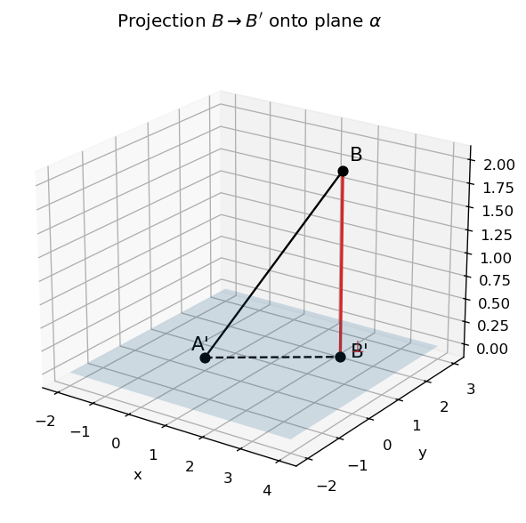
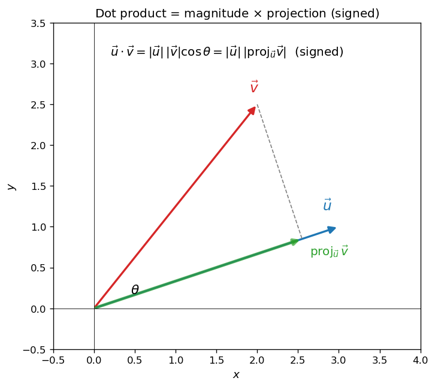
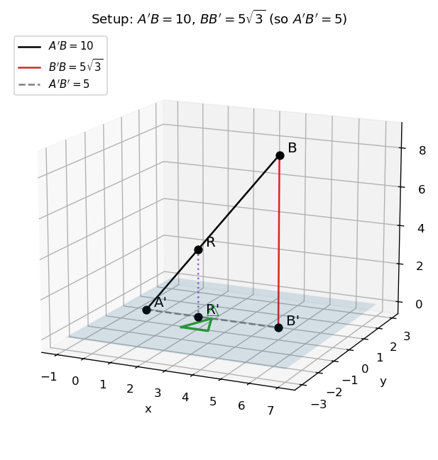
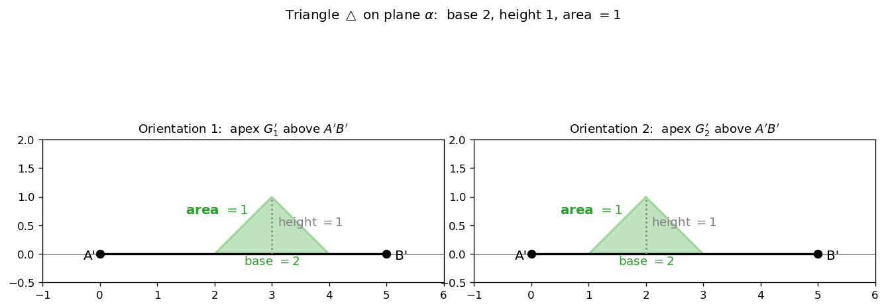
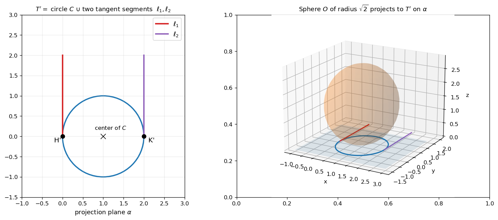
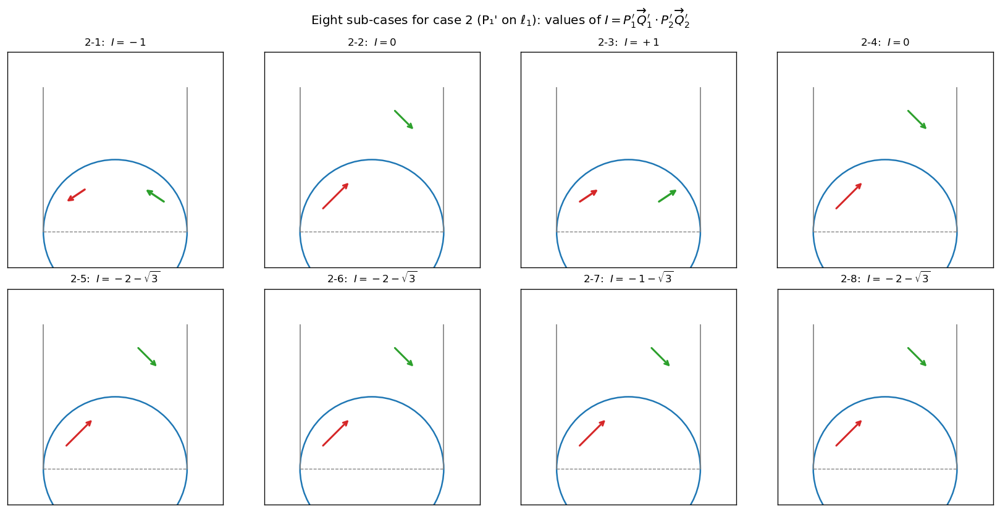

# 정사영과 내적

공간기하에서는 점·선·평면의 위치 관계를 좌표와 벡터를 통해 다룬다. 이 절에서는 **정사영** (한 점을 평면에 수직으로 내려뜨린 점) 과 **벡터의 내적** 의 활용을 결합한 문제를 다룬다.

!!! note "사용 도구"
    1. **정사영**: 점 $\mathrm{B}$ 의 평면 $\alpha$ 위로의 정사영 $\mathrm{B}'$ 은 $\mathrm{B}$ 에서 $\alpha$ 에 내린 수선의 발이다. 거리 $\overline{\mathrm{BB}'}$ 은 점 $\mathrm{B}$ 와 평면 $\alpha$ 사이의 (수직) 거리.
    2. **내분점**: 두 점 $\mathrm{A}$, $\mathrm{B}$ 를 $t : (1-t)$ 로 내분하는 점은 $(1-t)\mathrm{A} + t\,\mathrm{B}$. (또는 $t : s$ 로 내분하면 $\dfrac{s\mathrm{A} + t\mathrm{B}}{t + s}$.)
    3. **구의 방정식**: 중심 $\mathrm{C}$, 반지름 $r$ 인 구 위의 점 $\mathrm{P}$ 는 $|\mathrm{P} - \mathrm{C}| = r$ 즉 $(x - c_1)^2 + (y - c_2)^2 + (z - c_3)^2 = r^2$.
    4. **벡터의 내적**: 두 평면벡터 $\vec{u}, \vec{v}$ 의 내적은 $\vec{u} \cdot \vec{v} = |\vec{u}||\vec{v}|\cos\theta$. 좌표로는 $\vec{u} = (u_1, u_2)$, $\vec{v} = (v_1, v_2)$ 일 때 $\vec{u} \cdot \vec{v} = u_1 v_1 + u_2 v_2$.

---

## 보기 1: 정사영의 시각화

공간의 점 $\mathrm{B}$ 와 평면 $\alpha$ 가 있을 때, $\mathrm{B}$ 에서 $\alpha$ 에 내린 수선의 발 $\mathrm{B}'$ 이 $\mathrm{B}$ 의 **$\alpha$ 위로의 정사영**이다.

<figure markdown>
  { width=560 }
  <figcaption markdown>공간의 점 $\mathrm{B}$ 와 그 평면 $\alpha$ 위로의 정사영 $\mathrm{B}'$ . $\overline{\mathrm{BB}'} \perp \alpha$ 이며, 거리 $\overline{\mathrm{BB}'}$ 이 점에서 평면까지의 수직 거리이다.</figcaption>
</figure>

또한 평면 위의 점 $\mathrm{A}'$ 에 대하여 직각삼각형 $\triangle\mathrm{A}'\mathrm{B}'\mathrm{B}$ 가 형성되며 (직각은 $\mathrm{B}'$ 에서), 피타고라스 정리로부터

$$
\overline{\mathrm{A}'\mathrm{B}}^2 = \overline{\mathrm{A}'\mathrm{B}'}^2 + \overline{\mathrm{B}'\mathrm{B}}^2
$$

---

## 보기 2: 내적의 기하적 의미

두 벡터 $\vec{u}, \vec{v}$ 의 내적 $\vec{u} \cdot \vec{v}$ 는 **$\vec{v}$ 가 $\vec{u}$ 방향으로 가지는 "성분" 의 (부호 있는) 크기에 $|\vec{u}|$ 를 곱한 값**이다.

<figure markdown>
  { width=540 }
  <figcaption markdown>$\vec{u} \cdot \vec{v} = |\vec{u}||\vec{v}|\cos\theta = |\vec{u}| \cdot (\vec{v}\;\text{의}\;\vec{u}\;\text{방향 정사영 길이})$. 두 벡터가 평행하면 절댓값이 최대, 수직이면 $0$, 반대 방향이면 음수.</figcaption>
</figure>

---

## 연습문제

---

**연습문제 1.** [내분점과 구의 반지름] 평면 $\alpha$ 위에 삼각형 $\triangle$ 와 그 내부 $S$ 가 있다. 점 $\mathrm{A}'$ 은 $\alpha$ 위의 점이고, 점 $\mathrm{B}$ 는 $\alpha$ 위에 있지 않은 점이다. $\mathrm{B}$ 에서 $\alpha$ 에 내린 수선의 발을 $\mathrm{B}'$ 이라 하자. 두 점 $\mathrm{A}'$ 과 $\mathrm{B}$ 사이의 거리는 $10$ 이고, $\mathrm{B}$ 와 $\mathrm{B}'$ 사이의 거리는 $5\sqrt{3}$ 이다.

선분 $\mathrm{A}'\mathrm{B}$ 를 $t : (5 - t)$ 로 내분하는 점 $\mathrm{R}$ 이 중심이고 도형 $S$ 와 만나는 구 중에서 가장 크기가 작은 구의 반지름을 $r$ 이라 할 때, $r^2$ 의 값은 아래의 표와 같다 (단, $0 < t < 5$).

|       $t$ 의 범위        | $r^2$ 의 값                                                  |
| :----------------------: | :----------------------------------------------------------- |
|       $0 < t < 1$        | $4t^2 - 3t + \bigl(\tfrac{3}{2}\bigr)^2 + \bigl(\tfrac{1}{2}\bigr)^2$ |
|       $1 \leq t < 2$     | $3t^2 + \dfrac{(2 - t)^2}{2}$                                |
|       $2 \leq t < 3$     | $3t^2$                                                       |
|       $3 \leq t < 4$     | $3t^2 + \dfrac{(t - 3)^2}{2}$                                |
|       $4 \leq t < 5$     | $4t^2 - 7t + \bigl(\tfrac{7}{2}\bigr)^2 + \bigl(\tfrac{1}{2}\bigr)^2$ |

삼각형 $\triangle$ 의 넓이를 구하시오.

??? success "연습문제 1 풀이"

    **1단계 — $\overline{\mathrm{A}'\mathrm{B}'}$ 계산.** 직각삼각형 $\triangle\mathrm{A}'\mathrm{B}'\mathrm{B}$ 에서 피타고라스 정리에 의해

    $$
    \overline{\mathrm{A}'\mathrm{B}'} = \sqrt{\overline{\mathrm{A}'\mathrm{B}}^2 - \overline{\mathrm{B}\mathrm{B}'}^2} = \sqrt{100 - 75} = 5
    $$

    **2단계 — $\mathrm{R}$ 의 정사영 $\mathrm{R}'$.** $\mathrm{R}$ 이 $\mathrm{A}'\mathrm{B}$ 를 $t : (5 - t)$ 로 내분 (전체 길이 $5$ 가 아니라 비율의 합이 $5$) 하므로 $\mathrm{R} = \dfrac{(5 - t)\mathrm{A}' + t\mathrm{B}}{5}$. $\mathrm{R}$ 의 $\alpha$ 위로의 정사영 $\mathrm{R}'$ 은 $\mathrm{R}$ 의 $z$-좌표를 $0$ 으로 둔 점으로,

    $$
    \overline{\mathrm{R}\mathrm{R}'} = \frac{t}{5} \cdot \overline{\mathrm{B}\mathrm{B}'} = \frac{t}{5} \cdot 5\sqrt{3} = \sqrt{3}\,t
    $$

    선분 $\mathrm{A}'\mathrm{B}'$ 도 같은 비로 내분되어 $\overline{\mathrm{A}'\mathrm{R}'} = t$.

    <figure markdown>
      { width=620 }
      <figcaption markdown>공간 설정: $\mathrm{A}'\mathrm{B} = 10$, $\mathrm{BB}' = 5\sqrt{3}$ 이므로 $\mathrm{A}'\mathrm{B}' = 5$. 점 $\mathrm{R}$ 은 $\mathrm{A}'\mathrm{B}$ 를 $t:(5-t)$ 로 내분, 그 정사영 $\mathrm{R}'$ 은 평면 $\alpha$ 위.</figcaption>
    </figure>

    **3단계 — 구의 반지름과 $\overline{\mathrm{R}'\mathrm{G}'}$.** $\mathrm{R}$ 이 중심이고 $S$ 와 만나는 구의 반지름이 최소가 되려면, $\mathrm{R}$ 에서 $S$ 까지의 거리가 최소가 되어야 한다. $\mathrm{R}'$ 에서 $S$ 까지의 최단점을 $\mathrm{G}'$ 이라 하면 (평면 $\alpha$ 위의 점) 피타고라스 정리에 의해

    $$
    r^2 = \overline{\mathrm{R}\mathrm{R}'}^2 + \overline{\mathrm{R}'\mathrm{G}'}^2 = 3t^2 + \overline{\mathrm{R}'\mathrm{G}'}^2
    $$

    **4단계 — 표와의 대조로 삼각형 $\triangle$ 의 형태 결정.**

    - $2 \leq t < 3$: $r^2 = 3t^2$ 이므로 $\overline{\mathrm{R}'\mathrm{G}'} = 0$. 즉 이 범위에서는 $\mathrm{R}'$ 이 도형 $S$ **위에** 있다. $\mathrm{R}'$ 이 $\mathrm{A}'\mathrm{B}'$ 위에서 움직이므로, **$\triangle$ 는 $\mathrm{A}'\mathrm{B}'$ 의 $2 \leq t \leq 3$ 부분을 포함**해야 한다.
    - $1 \leq t < 2$: $r^2 = 3t^2 + \dfrac{(2 - t)^2}{2}$ 이므로 $\overline{\mathrm{R}'\mathrm{G}'} = \dfrac{2 - t}{\sqrt{2}}$. 이 거리가 $t$ 에 선형으로 감소하는 형태 $\to$ $\mathrm{R}'$ 에서 보았을 때 $S$ 의 경계가 **직선** (직각이등변삼각형의 한 변, 각이 $\pi/4$) 이다.
    - $3 \leq t < 4$: 대칭적으로 반대쪽 변 (또 다른 $\pi/4$ 의 각).
    - $0 < t < 1$ 과 $4 \leq t < 5$: 두 변의 외부에 있을 때이며, $\mathrm{R}'$ 에서 가장 가까운 점은 삼각형의 꼭짓점.

    이 정보로부터 $\triangle$ 의 한 변 $\mathrm{A}'\mathrm{B}'$ 의 $t \in [2, 3]$ 부분 (길이 $1$) 이 삼각형의 한 변에 포함되고, 양쪽으로 두 변이 $\pi/4$ 각도로 뻗어나가는 모양.

    구체적으로 (두 등변삼각형이 가능한 두 가지 배치 중 어느 쪽이든)

    $$
    \text{밑변} = 2,\quad \text{높이} = 1
    $$

    의 이등변삼각형 (또는 두 각이 $\pi/4$ 인 직각이등변삼각형이 합쳐진 형태) 가 결정된다.

    <figure markdown>
      { width=720 }
      <figcaption markdown>삼각형 $\triangle$ 의 두 가지 가능 배치 (선분 $\mathrm{A}'\mathrm{B}'$ 의 어느 쪽 위에 꼭짓점이 있는지에 따라). 두 경우 모두 밑변 $2$, 높이 $1$ 이므로 넓이는 $\dfrac{1}{2} \cdot 2 \cdot 1 = 1$.</figcaption>
    </figure>

    **5단계 — 넓이.** 밑변 $2$, 높이 $1$ 인 삼각형의 넓이는

    $$
    \text{area}(\triangle) = \tfrac{1}{2} \cdot 2 \cdot 1 = 1\quad\square
    $$

---

**연습문제 2.** [내적의 최댓값과 경로 개수] 구 $O$ 는 반지름의 길이가 $\sqrt{2}$ 이고, 평면 $\alpha$ 와 만나지 않는다. 점 $\mathrm{P}$ 가 $O$ 위의 한 점에서 출발하여 연속적으로 움직인 뒤, 다시 출발점에 도달하였다. 이 경로를 $T$ 라 하자. (출발점 또는 움직이는 방향이 바뀌면, 다른 경로로 간주한다.)

$T$ 가 그리는 도형의 평면 $\alpha$ 위로의 정사영 $T'$ 은 다음과 같이 원 $C$ 와 $C$ 의 지름의 양 끝점 $\mathrm{H}'$, $\mathrm{K}'$ 에서 $C$ 에 접하는 선분 $\ell_1$ 과 $\ell_2$ 로 이루어져 있다. 선분 $\ell_1$ 과 $\ell_2$ 의 길이는 원 $C$ 의 지름의 길이와 같다. 점 $\mathrm{P}$ 가 움직이면서, $\mathrm{H}'$, $\mathrm{K}'$ 에 정사영 되는 점을 제외하고, $T$ 가 그리는 도형 위의 점들을 한 번씩만 지난다. 또한, $\mathrm{P}$ 는 정사영 $T'$ 을 갖는 모든 이동 경로 중 길이가 가장 짧은 경로로 이동한다.

점 $\mathrm{P}$ 가 움직이기 시작한 위치를 $\mathrm{P}_1$, 전체 이동 거리의 중간 위치를 $\mathrm{P}_2$ 라 하자. 점 $\mathrm{P}$ 가 전체 이동 거리의 $\dfrac{1}{3}$ 만큼 이동했을 때의 위치를 $\mathrm{Q}_1$, $\dfrac{2}{3}$ 만큼 이동했을 때의 위치를 $\mathrm{Q}_2$ 라 하자. 네 점 $\mathrm{P}_1, \mathrm{P}_2, \mathrm{Q}_1, \mathrm{Q}_2$ 의 평면 $\alpha$ 위로의 정사영을 각각 $\mathrm{P}_1', \mathrm{P}_2', \mathrm{Q}_1', \mathrm{Q}_2'$ 이라 하자.

내적

$$
I = \overrightarrow{\mathrm{P}_1'\mathrm{Q}_1'} \cdot \overrightarrow{\mathrm{P}_2'\mathrm{Q}_2'}
$$

의 값이 최대가 되는 모든 경로 $T$ 의 개수를 구하고, 점 $\mathrm{P}_1'$ 에서 선분 $\mathrm{H}'\mathrm{K}'$ 까지의 거리가 $\dfrac{1}{2}$ 인 경우 내적 $I$ 의 값을 모두 구하시오.

??? success "연습문제 2 풀이 (요약)"

    **1단계 — $T$ 의 구조.** $T$ 가 구 $O$ (반지름 $\sqrt{2}$) 위의 폐곡선이고 그 정사영이 $T' = C \cup \ell_1 \cup \ell_2$ 라는 점에서, $T$ 는 구 위에 외접하는 **$3$ 개 또는 $4$ 개의 원**으로 구성된 도형이다. 최단 경로 조건으로부터 정확히 $3$ 개의 원만을 지난다.

    원 $C$ 의 반지름은 $1$ (∵ 선분 $\ell_1, \ell_2$ 의 길이가 $C$ 의 지름 $= 2$). 따라서 구의 반지름 $\sqrt{2}$ 와 정사영의 형태로부터 다른 두 원의 기하적 위치가 결정된다. 최단 거리는 세 원의 둘레의 합 $6\pi$ 이다.

    <figure markdown>
      { width=720 }
      <figcaption markdown>왼쪽: 정사영 $T' = C \cup \ell_1 \cup \ell_2$. 원 $C$ 의 반지름 $1$, 지름 $= 2 = $ 선분 $\ell_1, \ell_2$ 의 길이. 오른쪽: 구 $O$ 위의 경로 $T$ 와 그 정사영 $T'$ 의 3D 시각화.</figcaption>
    </figure>

    **2단계 — 핵심 관찰.** $\mathrm{H}'\mathrm{K}'$ 은 원 $C$ 의 지름이므로 그 중점이 $C$ 의 중심이다. 그리고 $\ell_1, \ell_2$ 의 중점도 자연스러운 좌표적 의미를 가진다.

    **3단계 — 경우 분류.** $\mathrm{P}_1$ 이 어디에서 시작하는지에 따라 다음과 같이 나눈다.

    - **경우 1**: $\mathrm{P}_1'$ 이 원 $C$ 위 (특히 $\mathrm{H}', \mathrm{K}'$ 을 제외한 점) 에 있는 경우.
    - **경우 2**: $\mathrm{P}_1'$ 이 선분 $\ell_1$ 위 (단 $\mathrm{H}'$ 이 아닌 점) 에 있는 경우.
    - **경우 3**: $\mathrm{P}_1'$ 이 선분 $\ell_2$ 위 (단 $\mathrm{K}'$ 이 아닌 점) 에 있는 경우. (경우 2 와 대칭으로 동일.)

    각 경우마다 $\mathrm{P}_1'$ 의 위치 (선분 $\mathrm{H}'\mathrm{K}'$ 으로부터의 거리 $a$) 와 경로의 방향에 따라 $8$ 개의 하위 경우가 발생한다. 모든 하위 경우의 내적 $I$ 를 계산하면

    - **경우 1 (8 하위 경우):** $I = -\sqrt{3} - \tfrac{11}{4}$, $-\sqrt{3} - \tfrac{7}{4}$, $\sqrt{3} - \tfrac{7}{4}$, $\sqrt{3} - \tfrac{11}{4}$ (각 두 번씩).
    - **경우 2 (8 하위 경우):** $I = -1$, $0$, $+1$, $0$, $-2 - \sqrt{3}$, $-2 - \sqrt{3}$, $-1 - \sqrt{3}$, $-2 - \sqrt{3}$.

    <figure markdown>
      { width=720 }
      <figcaption markdown>경우 2 ($\mathrm{P}_1'$ 가 선분 $\ell_1$ 위) 의 $8$ 개 하위 경우 모식도와 그에 대응하는 $I$ 의 값. 두 벡터 $\overrightarrow{\mathrm{P}_1'\mathrm{Q}_1'}$ (빨강) 와 $\overrightarrow{\mathrm{P}_2'\mathrm{Q}_2'}$ (녹색) 의 상대적 방향과 크기에 따라 내적이 다르게 결정된다.</figcaption>
    </figure>

    **4단계 — 최댓값과 경로 수.** 위의 모든 값들을 비교하면

    $$
    I_{\max} = +1
    $$

    이며, 이 값은 경우 2 의 하위 경우 (2-3) 에서 점 $\mathrm{P}_1'$ 이 선분 $\ell_1$ 의 양 끝에 있을 때 ($2$ 가지) 와, 경우 3 (선분 $\ell_2$ 의 양 끝, $2$ 가지) 에서 발생한다. 점 $\mathrm{P}_1'$ 의 위치마다 서로 다른 $2$ 가지 경로가 있으므로 (출발 방향) 총 $2 \times 2 \times 2 = 8$ 가지.

    $$
    \boxed{T \text{의 개수} = 8}
    $$

    **5단계 — $\overline{\mathrm{P}_1'\mathrm{H}'\mathrm{K}'} = \dfrac{1}{2}$ 일 때 $I$ 의 값.** $a = \dfrac{1}{2}$ 일 때 위의 모든 하위 경우를 다시 평가하면 가능한 $I$ 의 값은

    $$
    -2 - \sqrt{3},\quad -1 - \sqrt{3},\quad -\tfrac{11}{4} \pm \sqrt{3},\quad 0,\quad \pm 1,\quad -\tfrac{7}{4} \pm \sqrt{3}
    $$

    $\square$

    !!! tip "큰 그림"
        이 문제는 **3차원 곡면 (구) 위의 경로 → 평면 정사영 → 내적** 의 세 층을 거치는 복합 기하 문제이다.

        1. **3D 구조 파악**: 구 위의 폐곡선이 평면 정사영으로 "원 + 두 접선" 의 형태가 되려면, 그 곡선은 구 위 세 원의 합집합 (3개 또는 4개 중 최단 경로는 3개).
        2. **위치 매개변수화**: $\mathrm{P}_1$ 의 출발점과 방향이 자유 매개변수. 이를 사례별로 분해.
        3. **내적 계산**: 두 벡터의 길이와 사잇각으로부터 내적의 가능한 값 목록을 만들어 최댓값과 그에 도달하는 경로 수를 센다.

        고난도이지만, **공간 시각화 + 사례 분류** 가 핵심 도구이다.

---

**연습문제 (보충).** [공간 직선·구의 접점·삼수선] 좌표공간에서 점 $\mathrm{A}\!\left(0,\,0,\,\dfrac{11}{3}\right)$ 을 지나는 직선이 구 $S_1 : x^2 + y^2 + z^2 = 11$ 과 점 $\mathrm{P}(a, 0, b)$ 에서 접하고, 점 $\mathrm{B}(0, 0, 11)$ 을 지나는 직선이 구 $S_1$ 과 점 $\mathrm{Q}(0, c, d)$ 에서 접한다. 점 $\mathrm{P}$ 와 점 $\mathrm{Q}$ 에서 $xy$ 평면에 내린 수선의 발을 각각 $\mathrm{R, S}$ 라 하자. 또 점 $\mathrm{P}$ 와 점 $\mathrm{Q}$ 를 지나는 직선을 $\ell$, 점 $\mathrm{R}$ 과 점 $\mathrm{S}$ 를 지나는 직선을 $m$ 이라 한다. (단, $a, c$ 는 양수.)

(1) 선분 $\overline{\mathrm{RS}}$ 의 길이와 두 직선 $\ell, m$ 이 이루는 각을 구하시오.

(2) 구 $S_2 : (x - \sqrt{2})^2 + (y - 6)^2 + (z - \sqrt{10})^2 = 4$ 와 만나고 중심이 직선 $m$ 위에 있는 구의 부피의 최솟값을 구하시오.

??? success "연습문제 (보충) 풀이"

    **(1) 선분 RS 와 두 직선이 이루는 각.**

    원점 $\mathrm{O}$ 는 구 $S_1$ 의 중심, 반지름 $\sqrt{11}$.

    $xz$ 평면에서 직각삼각형 $\triangle \mathrm{AOP}$ 와 $\triangle \mathrm{OPR}$ 는 닮음 (직각삼각형 닮음). $\overline{\mathrm{OA}} = 11/3$, $\overline{\mathrm{OP}} = \sqrt{11}$ 이므로

    $$
    \frac{11/3}{\sqrt{11}} = \frac{\sqrt{11}}{b} \;\Longrightarrow\; b = 3
    $$

    그리고 $a^2 + b^2 = 11 \Rightarrow a = \sqrt{2}$. 따라서 $\mathrm{P}(\sqrt 2, 0, 3)$, $\mathrm{R}(\sqrt 2, 0, 0)$.

    $yz$ 평면 동일 절차: $11 : \sqrt{11} = \sqrt{11} : d \Rightarrow d = 1$, $c^2 + d^2 = 11 \Rightarrow c = \sqrt{10}$. 따라서 $\mathrm{Q}(0, \sqrt{10}, 1)$, $\mathrm{S}(0, \sqrt{10}, 0)$.

    $$
    \overline{\mathrm{RS}}^{\,2} = (\sqrt 2)^2 + (\sqrt{10})^2 = 12,\quad \overline{\mathrm{RS}} = 2\sqrt{3}
    $$

    선분 $\mathrm{PQ}$ 의 $xy$ 평면 위로의 정사영이 선분 $\mathrm{RS}$ 이다. $\overline{\mathrm{PQ}}^{\,2} = 2 + 10 + 4 = 16$, $\overline{\mathrm{PQ}} = 4$. 두 직선 $\ell, m$ 의 이루는 각을 $\theta$ 라 하면

    $$
    \cos\theta = \frac{\overline{\mathrm{RS}}}{\overline{\mathrm{PQ}}} = \frac{2\sqrt 3}{4} = \frac{\sqrt 3}{2} \;\Longrightarrow\; \theta = \frac{\pi}{6}
    $$

    $\boxed{\overline{\mathrm{RS}} = 2\sqrt 3,\quad \theta = \pi/6}$

    **(2) 직선 $m$ 위에 중심이 있는 구의 최소 부피.**

    $m$ 의 $xy$ 평면 방정식: $\mathrm{R}(\sqrt 2, 0)$, $\mathrm{S}(0, \sqrt{10})$ 을 지나는 직선의 방정식은 $\sqrt{5}\,x + y - \sqrt{10} = 0$.

    $S_2$ 의 중심 $\mathrm{O}_2(\sqrt 2, 6, \sqrt{10})$ 의 $xy$ 평면 정사영 $(\sqrt 2, 6, 0)$ 에서 $m$ 까지의 거리:

    $$
    \frac{|\sqrt 5 \cdot \sqrt 2 + 6 - \sqrt{10}|}{\sqrt{5 + 1}} = \frac{|\sqrt{10} + 6 - \sqrt{10}|}{\sqrt 6} = \frac{6}{\sqrt 6} = \sqrt 6
    $$

    삼수선의 정리에 의하여 $\mathrm{O}_2$ 에서 직선 $m$ 까지의 거리는

    $$
    \sqrt{(\sqrt 6)^2 + (\sqrt{10})^2} = \sqrt{6 + 10} = 4
    $$

    $S_2$ 의 반지름이 $2$ 이므로 직선 $m$ 에서 $S_2$ 까지의 최소거리는 $4 - 2 = 2$. 이 거리를 반지름으로 하는 구의 부피는

    $$
    \frac{4}{3}\pi\cdot 2^{3} = \frac{32}{3}\pi\quad\square
    $$

    !!! info "교훈"
        - **구의 접점은 중심-접점-외부점이 직각삼각형**을 이루므로 닮음을 통해 좌표가 즉시 결정된다.
        - **xy 평면 정사영과 원래 선분의 길이 비** 가 두 직선이 이루는 각의 코사인.
        - **삼수선의 정리**로 3차원 점-직선 거리를 평면 거리 + 수직 거리의 피타고라스로 환원.
