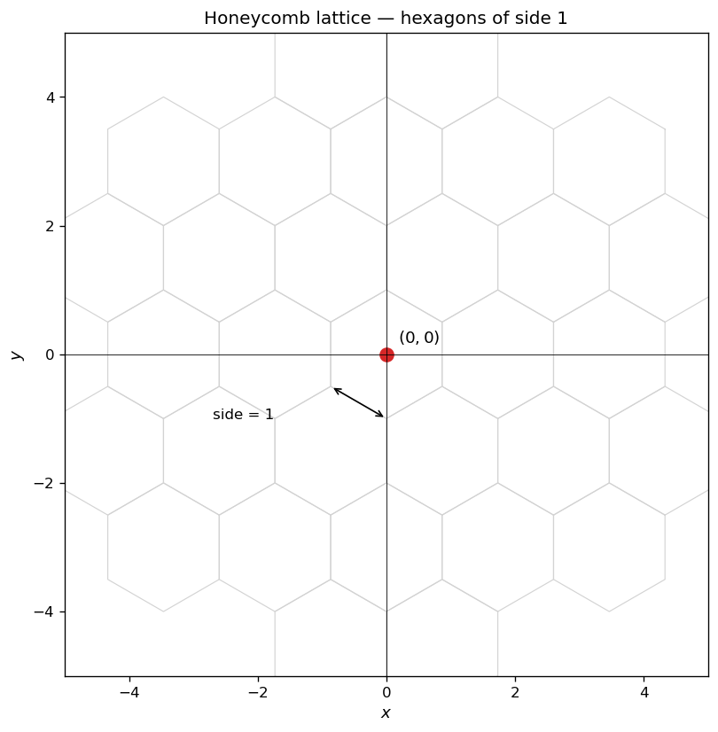
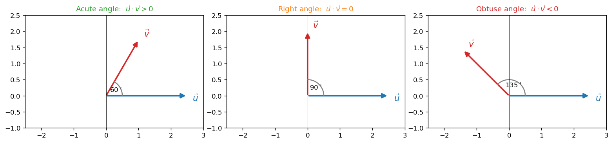
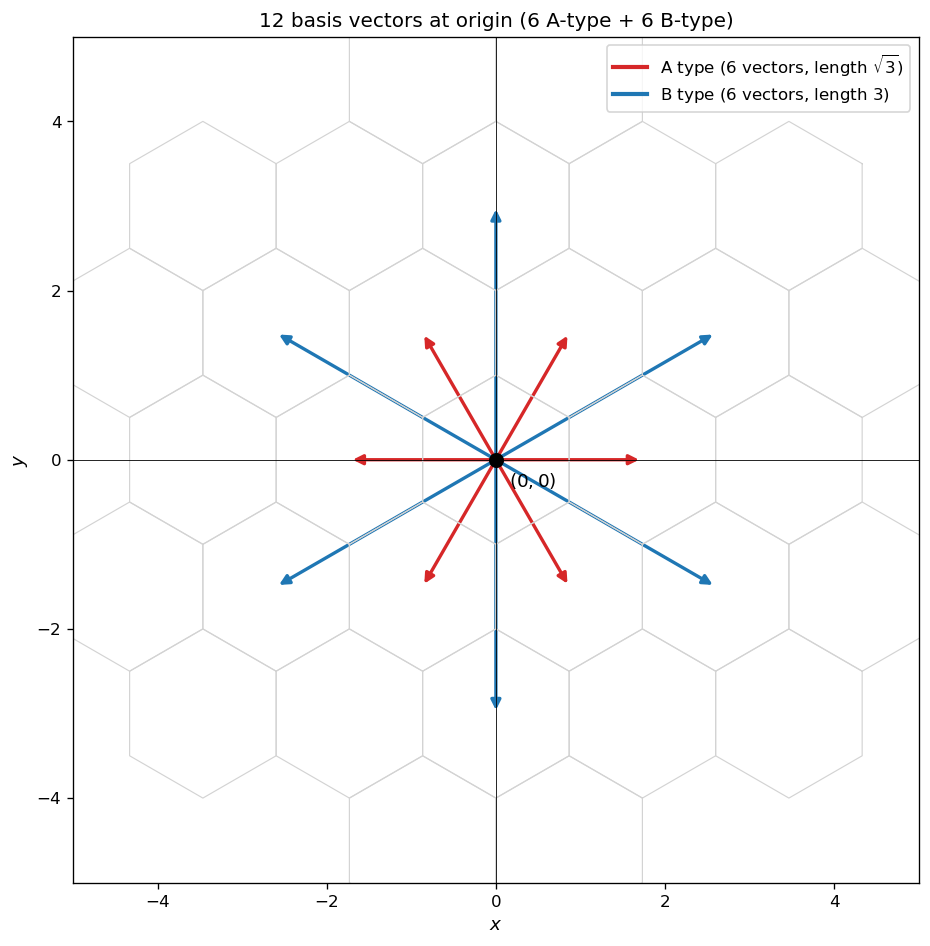
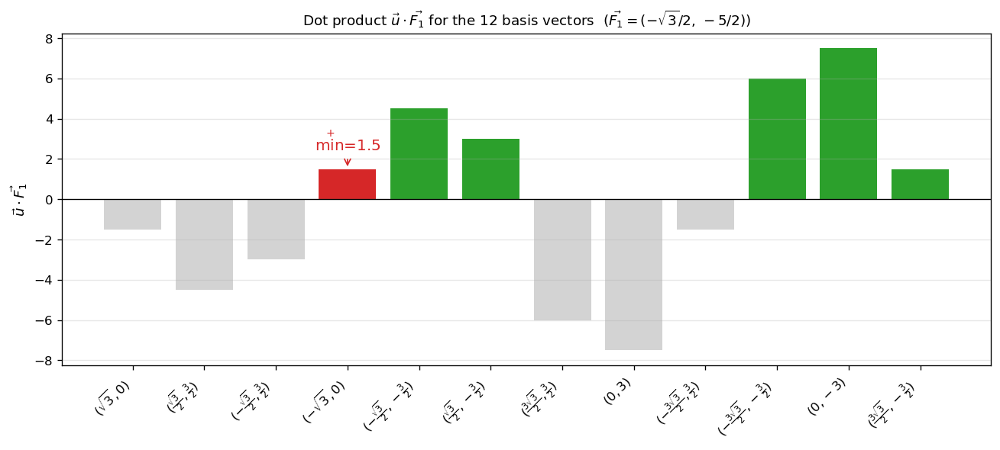
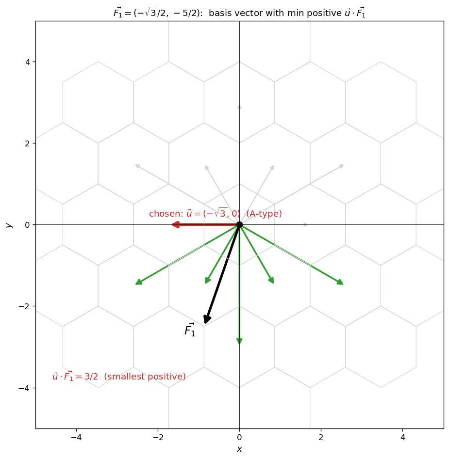
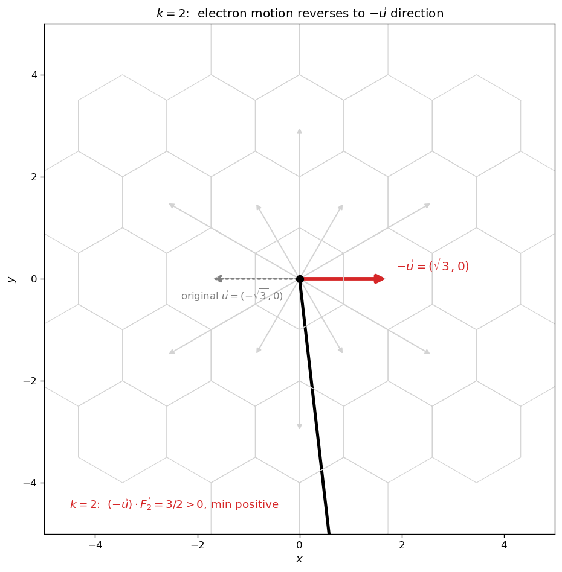

# 격자 위 평면벡터의 내적

물리·재료과학에서는 결정 격자 (crystal lattice) 위에서 입자가 이동하는 상황을 자주 다룬다. 격자가 6각 (그래핀과 같은) 모양일 때, 이동 가능한 단위벡터는 격자의 대칭성에 의해 미리 결정된다. 이 절에서는 **격자 위 12개의 기본벡터** 를 분류하고, **외부 힘 벡터와의 내적** 을 통해 입자가 어느 방향으로 이동하는지 결정하는 문제를 다룬다.

!!! note "사용 도구"
    1. **벡터의 연산과 위치벡터**: 평면벡터 $\vec{u} = (u_1, u_2)$, $\vec{v} = (v_1, v_2)$ 에 대하여 덧셈·뺄셈·실수배는 좌표별로 수행한다.

    2. **평면벡터의 내적**: 두 평면벡터의 내적은

        $$
        \vec{u}\cdot\vec{v} = u_1 v_1 + u_2 v_2 = |\vec{u}|\,|\vec{v}|\cos\theta
        $$

        $\theta$ 는 두 벡터의 사잇각.

    3. **내적의 부호와 사잇각**: $\vec{u}\cdot\vec{v} > 0$ ⟺ 사잇각이 예각, $= 0$ ⟺ 수직, $< 0$ ⟺ 둔각.

---

## 보기 1: 6각 격자의 구조

그래핀은 탄소 원자가 정육각형 형태로 무한히 반복되는 벌집모양의 격자구조를 갖는 물질이다. 본 절에서 다루는 모든 격자는 **한 변의 길이가 $1$ 인 정육각형** 으로 구성되며, 두 종류의 기본 이동경로가 있다.

- **A 경로**: 인접한 두 정육각형의 중심을 잇는 방향 — 한 칸 ($\sqrt{3}$ 거리) 이동.
- **B 경로**: 같은 종류의 정육각형으로 두 칸 더 멀리 ($3$ 거리) 이동.

<figure markdown>
  { width=560 }
  <figcaption markdown>한 변의 길이가 $1$ 인 정육각형 격자. 원점 $(0, 0)$ 에서 출발한 입자가 격자의 대칭성을 따라 두 종류의 기본벡터 (A 경로·B 경로) 로 이동한다.</figcaption>
</figure>

---

## 보기 2: 내적의 부호가 알려주는 것

두 벡터 $\vec{u}, \vec{v}$ 의 내적 $\vec{u}\cdot\vec{v} = |\vec{u}||\vec{v}|\cos\theta$ 의 부호는 사잇각 $\theta$ 에 의해 결정된다.

<figure markdown>
  { width=720 }
  <figcaption markdown>두 벡터의 사잇각이 예각이면 내적 양수 (같은 쪽 성분이 우세), 직각이면 영, 둔각이면 음수. 즉 **내적의 부호 = 두 벡터가 "대체로 같은 방향" 인지 "반대 방향" 인지의 부호**이다.</figcaption>
</figure>

특히 외부 힘 벡터 $\vec{F}$ 가 주어진 격자 위 입자가 "힘의 방향을 따라 이동" 하려면, 입자의 이동 기본벡터 $\vec{u}$ 가

$$
\vec{u}\cdot\vec{F} > 0
$$

이어야 한다 (사잇각이 예각). 가능한 여러 후보 중에서 **내적의 크기가 가장 작은 양의 값** 을 갖는 $\vec{u}$ 가 "에너지를 최소로 소비하는 다음 한 걸음" 으로 해석될 수 있다.

!!! info "핵심 아이디어"
    격자의 대칭성으로 결정된 **유한 개의 기본벡터** 가 후보가 되고, 외부 힘 $\vec{F}$ 와의 내적이라는 **단순한 산술 양** 이 어느 방향으로 이동할지를 결정한다. 12개 후보의 내적을 모두 계산해 비교하는 것이 직접적인 방법이다.

---

## 연습문제

이 절의 연습문제는 모두 정육각형 격자 위에서 진행된다. 격자의 한 변의 길이는 $1$.

---

**연습문제 1.** [기본벡터 분류] 그래핀 격자 내 전자의 초기 위치를 $(0, 0)$ 이라 할 때, 외부 전자기력 $\vec{F}$ 에 대하여 해당 전자가 가질 수 있는 모든 이동경로에 대한 $12$ 개의 기본벡터들을 성분으로 나타내고, 각 벡터가 A 경로인지 B 경로인지 구분하시오.

??? success "연습문제 1 풀이"

    원점 $(0, 0)$ 에서 갈 수 있는 이웃 정육각형의 중심은 정확히 $12$ 개 — A 경로 (인접 hex, 거리 $\sqrt{3}$) 6 개, B 경로 (대각선 hex, 거리 $3$) 6 개.

    **A 경로 기본벡터 (길이 $\sqrt{3}$):** 시계 방향 $3$ 시 위치부터 $60^\circ$ 간격으로

    $$
    (\sqrt{3},\,0),\quad \left(\tfrac{\sqrt{3}}{2},\,\tfrac{3}{2}\right),\quad \left(-\tfrac{\sqrt{3}}{2},\,\tfrac{3}{2}\right),\quad (-\sqrt{3},\,0),\quad \left(-\tfrac{\sqrt{3}}{2},\,-\tfrac{3}{2}\right),\quad \left(\tfrac{\sqrt{3}}{2},\,-\tfrac{3}{2}\right)
    $$

    **B 경로 기본벡터 (길이 $3$):** A 경로 사이의 각 $30^\circ$ 어긋난 6 방향

    $$
    \left(\tfrac{3\sqrt{3}}{2},\,\tfrac{3}{2}\right),\quad (0,\,3),\quad \left(-\tfrac{3\sqrt{3}}{2},\,\tfrac{3}{2}\right),\quad \left(-\tfrac{3\sqrt{3}}{2},\,-\tfrac{3}{2}\right),\quad (0,\,-3),\quad \left(\tfrac{3\sqrt{3}}{2},\,-\tfrac{3}{2}\right)
    $$

    A 경로 벡터의 크기는 $\sqrt{3 + 0} = \sqrt{3}$ 또는 $\sqrt{\tfrac{3}{4} + \tfrac{9}{4}} = \sqrt{3}$. B 경로 벡터의 크기는 $\sqrt{\tfrac{27}{4} + \tfrac{9}{4}} = \sqrt{9} = 3$ 또는 $\sqrt{0 + 9} = 3\quad\square$

    <figure markdown>
      { width=560 }
      <figcaption markdown>원점 $(0, 0)$ 에서 출발 가능한 $12$ 개의 기본벡터. A 경로 (빨강, 길이 $\sqrt{3}$) 와 B 경로 (파랑, 길이 $3$) 가 $30^\circ$ 어긋나 교대로 배치된다.</figcaption>
    </figure>

---

**연습문제 2.** [내적 최소의 기본벡터 선택] 전자는 그래핀 격자 내에서 기본벡터 $\vec{u}$ 와 전자기력 벡터 $\vec{F}$ 의 내적 $\vec{u}\cdot\vec{F} > 0$ 이면서, $\vec{u}\cdot\vec{F}$ 가 최소인 경로를 따라 이동한다. 전자기력 벡터 $\vec{F_1} = \left(-\dfrac{\sqrt{3}}{2},\,-\dfrac{5}{2}\right)$ 를 가해 주었을 때, 전자는 연습문제 1 의 12 개 기본벡터 중 어떤 기본벡터를 갖는 경로로 이동하는지 그 성분을 나타내시오. 또한, 해당 기본벡터와 $\vec{F_1}$ 의 내적을 구하시오. (단, A 경로와 B 경로의 기본벡터들과 $\vec{F_1}$ 의 내적이 동일한 경우, 전자는 A 경로로 이동한다.)

??? success "연습문제 2 풀이"

    각 기본벡터 $\vec{u}$ 와 $\vec{F_1}$ 의 내적을 계산한다.

    **A 경로:**

    $$\begin{array}{lll}
    (\sqrt{3},0)\cdot\vec{F_1} &=& -\tfrac{3}{2} \\
    \left(\tfrac{\sqrt{3}}{2},\tfrac{3}{2}\right)\cdot\vec{F_1} &=& -\tfrac{3}{4} - \tfrac{15}{4} = -\tfrac{9}{2} \\
    \left(-\tfrac{\sqrt{3}}{2},\tfrac{3}{2}\right)\cdot\vec{F_1} &=& \tfrac{3}{4} - \tfrac{15}{4} = -3 \\
    (-\sqrt{3},0)\cdot\vec{F_1} &=& \tfrac{3}{2}\quad(\text{양수}) \\
    \left(-\tfrac{\sqrt{3}}{2},-\tfrac{3}{2}\right)\cdot\vec{F_1} &=& \tfrac{3}{4} + \tfrac{15}{4} = \tfrac{9}{2} \\
    \left(\tfrac{\sqrt{3}}{2},-\tfrac{3}{2}\right)\cdot\vec{F_1} &=& -\tfrac{3}{4} + \tfrac{15}{4} = 3
    \end{array}$$

    **B 경로:**

    $$\begin{array}{lll}
    \left(\tfrac{3\sqrt{3}}{2},\tfrac{3}{2}\right)\cdot\vec{F_1} &=& -\tfrac{9}{4} - \tfrac{15}{4} = -6 \\
    (0,3)\cdot\vec{F_1} &=& -\tfrac{15}{2} \\
    \left(-\tfrac{3\sqrt{3}}{2},\tfrac{3}{2}\right)\cdot\vec{F_1} &=& \tfrac{9}{4} - \tfrac{15}{4} = -\tfrac{3}{2} \\
    \left(-\tfrac{3\sqrt{3}}{2},-\tfrac{3}{2}\right)\cdot\vec{F_1} &=& \tfrac{9}{4} + \tfrac{15}{4} = 6 \\
    (0,-3)\cdot\vec{F_1} &=& \tfrac{15}{2} \\
    \left(\tfrac{3\sqrt{3}}{2},-\tfrac{3}{2}\right)\cdot\vec{F_1} &=& -\tfrac{9}{4} + \tfrac{15}{4} = \tfrac{3}{2}\quad(\text{양수})
    \end{array}$$

    <figure markdown>
      { width=720 }
      <figcaption markdown>12 개 기본벡터의 $\vec{u}\cdot\vec{F_1}$ 값. 양수가 6 개 있고, 그 중 최솟값은 $\tfrac{3}{2}$ — A 경로 $(-\sqrt{3}, 0)$ 과 B 경로 $\left(\tfrac{3\sqrt{3}}{2}, -\tfrac{3}{2}\right)$ 두 곳에서 동시에 달성된다.</figcaption>
    </figure>

    양수 중 최솟값 $\tfrac{3}{2}$ 는 **두 곳에서 동시에** 달성된다 — A 경로 $(-\sqrt{3}, 0)$ 와 B 경로 $\left(\tfrac{3\sqrt{3}}{2}, -\tfrac{3}{2}\right)$. 문제의 단서 "A 경로와 B 경로의 내적이 동일한 경우 A 경로로 이동" 에 따라 **전자는 A 경로의 기본벡터 $(-\sqrt{3}, 0)$ 를 따라 이동** 하고, 그 때

    $$
    \vec{u}\cdot\vec{F_1} = (-\sqrt{3}, 0)\cdot\left(-\tfrac{\sqrt{3}}{2},\,-\tfrac{5}{2}\right) = \tfrac{3}{2}\quad\square
    $$

    <figure markdown>
      { width=620 }
      <figcaption markdown>$\vec{F_1}$ (검정) 과 사잇각이 예각인 기본벡터 6 개 (녹색). 그 중 내적이 최솟값 $\tfrac{3}{2}$ 인 두 벡터는 A 경로 $(-\sqrt{3}, 0)$ (빨강, 굵게) 과 B 경로 $\left(\tfrac{3\sqrt{3}}{2}, -\tfrac{3}{2}\right)$. 동률 시 A 경로 선택 규칙에 따라 $(-\sqrt{3}, 0)$ 이 선택된다.</figcaption>
    </figure>

---

**연습문제 3.** [경로 반대 변경 조건] 연습문제 2 에서 전자기력 벡터 $\vec{F_1}$ 을 $\vec{F_2} = 3\vec{F_1} + (\sqrt{3}\,k,\,0)$ 으로 변화시켰다. 이때, 전자의 이동이 연습문제 2 에서 도출된 경로로부터 반대 경로로 변경되는 양의 정수 $k$ 의 최솟값을 구하시오. (단, 반대 경로란 방향이 반대인 기본벡터 $-\vec{u}$ 를 갖는 경로를 의미한다.)

??? success "연습문제 3 풀이"

    **1단계 — $\vec{F_2}$ 의 좌표.** $\vec{F_1} = \left(-\tfrac{\sqrt{3}}{2}, -\tfrac{5}{2}\right)$ 이므로

    $$
    \vec{F_2} = 3\left(-\tfrac{\sqrt{3}}{2},\,-\tfrac{5}{2}\right) + (\sqrt{3}\,k,\,0) = \left(-\tfrac{3\sqrt{3}}{2} + \sqrt{3}\,k,\,-\tfrac{15}{2}\right)
    $$

    **2단계 — 반대 방향 $-\vec{u}$ 의 후보.** 연습문제 2 에서 $\vec{u} = (-\sqrt{3}, 0)$ 이었으므로 $-\vec{u} = (\sqrt{3}, 0)$.

    **3단계 — $(-\vec{u})\cdot\vec{F_2}$ 의 부호.**

    $$
    (-\vec{u})\cdot\vec{F_2} = (\sqrt{3}, 0)\cdot\left(-\tfrac{3\sqrt{3}}{2} + \sqrt{3}\,k,\,-\tfrac{15}{2}\right) = \sqrt{3}\left(-\tfrac{3\sqrt{3}}{2} + \sqrt{3}\,k\right) = -\tfrac{9}{2} + 3k
    $$

    이 값이 양수가 되려면 $3k > \tfrac{9}{2}$, 즉 $k > \tfrac{3}{2}$. $k$ 가 자연수이므로 **$k \geq 2$**.

    **4단계 — $k = 2$ 가 정말 최솟값을 주는지 검증.** $k = 2$ 일 때 $\vec{F_2} = \left(-\tfrac{3\sqrt{3}}{2} + \sqrt{3}\cdot 2,\,-\tfrac{15}{2}\right) = \left(\tfrac{\sqrt{3}}{2},\,-\tfrac{15}{2}\right)$.

    이 $\vec{F_2}$ 에 대해 12 개의 모든 기본벡터의 내적을 비교해 **양수 중 최솟값이 정말 $-\vec{u} = (\sqrt{3}, 0)$ 에서 발생하는지** 확인한다. $(-\vec{u})\cdot\vec{F_2} = -\tfrac{9}{2} + 6 = \tfrac{3}{2}$. 다른 양수 후보들 (계산 생략, 모두 $\tfrac{3}{2}$ 보다 큼) 과 비교하면 최소.

    또한 $k = 1$ 일 때: $(-\vec{u})\cdot\vec{F_2} = -\tfrac{9}{2} + 3 = -\tfrac{3}{2} < 0$ — 음수이므로 $-\vec{u}$ 자체가 후보에서 제외. 경로 반대 변경 불가.

    따라서 **$k$ 의 최솟값은 $2$** $\quad\square$

    <figure markdown>
      { width=580 }
      <figcaption markdown>$k = 2$ 일 때 $\vec{F_2} = \left(\tfrac{\sqrt{3}}{2}, -\tfrac{15}{2}\right)$. 이때 반대 방향 기본벡터 $-\vec{u} = (\sqrt{3}, 0)$ (빨강, 굵게) 가 양수 내적 중 최솟값 $\tfrac{3}{2}$ 를 달성하여 전자가 이 방향으로 이동. $k = 1$ 에서는 $(-\vec{u})\cdot\vec{F_2} < 0$ 이어서 불가.</figcaption>
    </figure>

    !!! tip "큰 그림"
        이 문제는 **격자 대칭성으로 유한 후보 집합 (12 벡터) 을 만든 뒤, 내적이라는 단순한 산술 양으로 후보 사이의 순서를 정한다**. 핵심은 다음 세 가지를 동시에 만족시켜야 한다는 것:

        1. **양수 조건**: $\vec{u}\cdot\vec{F} > 0$ — 입자가 힘과 같은 쪽으로 움직임.
        2. **최소 조건**: 그러한 양수 중 가장 작음 — "에너지가 가장 적게 드는 한 걸음".
        3. **동률 시 A 우선**: 격자의 두 종류 경로 중 더 짧은 (A 경로) 가 우선.

        연습문제 3 의 매개변수 $k$ 는 외부 힘의 $x$ 성분을 조절하는데, 이 조절이 어느 순간 "양수 조건" 의 부호를 뒤집는 임계값을 가진다. 그 임계값을 정확히 찾아 그 이후 첫 자연수 ($k = 2$) 가 답.
