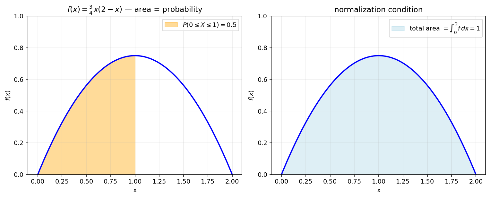
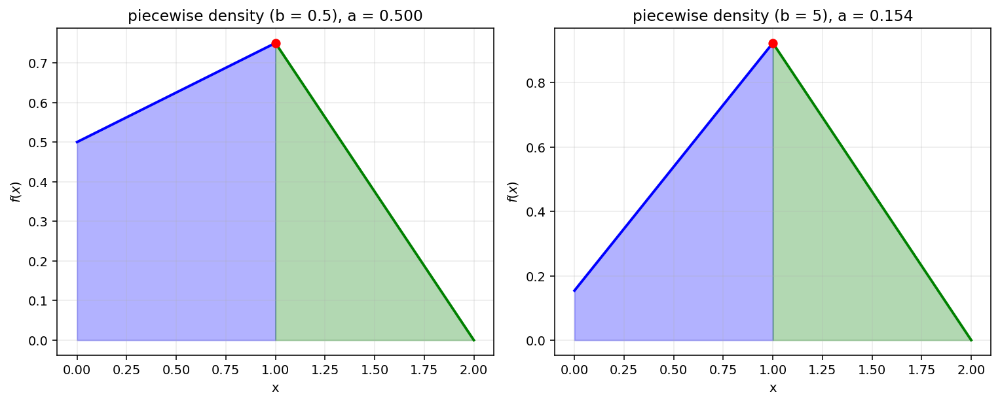

# 확률밀도함수와 적분

연속확률변수 $X$ 의 분포를 표현하는 도구가 **확률밀도함수** $f(x)$ 이다. 이산확률변수의 확률질량함수가 점 위에서 양수 값을 가지는 것과 달리, 연속의 경우 한 점에서의 확률은 항상 $0$ 이고, 대신 **구간 위의 적분**으로 확률이 정의된다.

!!! note "확률밀도함수의 정의"
    $\alpha \leq x \leq \beta$ 에서 정의된 함수 $f(x)$ 가 다음 세 조건을 만족하면 $X$ 의 확률밀도함수이다.

    1. $f(x) \geq 0$
    2. $\displaystyle\int_\alpha^\beta f(x)\,dx = 1$
    3. 두 상수 $a, b$ ($\alpha \leq a \leq b \leq \beta$) 에 대하여 $P(a \leq X \leq b) = \displaystyle\int_a^b f(x)\,dx$

조건 2는 "전체 확률의 합이 $1$" 이라는 직관을 적분으로 옮긴 것이고, 조건 3은 "확률 = 넓이". 이 절에서는 (1) 미정 계수를 정규화 조건으로 결정, (2) 구간별로 정의된 piecewise 함수를 다루는 사고법, (3) 분포함수를 거꾸로 사용해 매개변수를 찾는 역문제를 다룬다.

---

## 보기 1: 미정 계수의 결정

함수 $f(x) = c\,x\,(2 - x)$, $0 \leq x \leq 2$ 가 연속확률변수 $X$ 의 확률밀도함수가 되도록 상수 $c$ 를 정해 보자.

조건 1 ($f \geq 0$): $0 \leq x \leq 2$ 에서 $x(2-x) \geq 0$ 이므로 

$$c \geq 0$$

조건 2 ($\int f = 1$):

$$
\int_0^2 c\,x(2-x)\,dx = c\,\bigl[x^2 - x^3/3\bigr]_0^2 = c\,(4 - 8/3) = \frac{4c}{3} = 1 \;\Longrightarrow\; c = \frac{3}{4}
$$

따라서 

$$
f(x) 
= \left\{ 
    \begin{array}{lll}
    0&&x \leq 0\\
    \displaystyle \frac{3}{4}\,x(2-x)&&0 \leq x \leq 2\\
    0&&x \geq 2\\
    \end{array}
\right.
$$ 

---

## 보기 2: 구간별로 정의된 밀도함수

상수 $a, b$ ($a > 0$) 에 대하여 함수

$$
f(x) = \begin{cases}
a(b\,x + 1) & (0 \leq x \leq 1) \\
-a(b+1)(x - 2) & (1 < x \leq 2)
\end{cases}
$$

가 연속확률변수 $X$ 의 확률밀도함수일 때, $a$ 를 $b$ 에 대한 식으로 나타내고, 이를 이용하여 $c = \displaystyle\int_0^2 x^2\,f(x)\,dx$ 의 범위를 구해 보자.

**단계 1: 비음수성 ($f \geq 0$).** 밀도함수에 필요한 조건은 $f \geq 0$ 과 $\displaystyle\int f = 1$ 뿐이며, **연속일 필요는 없다** — 밀도함수는 영집합 위에서 값을 바꿔도 같은 분포를 주므로 불연속이어도 무방하다. 각 조각이 일차함수라서 부호는 양 끝점에서 결정된다: $f(0) = a > 0$ 이고 $f(1) = a(b + 1)$. 두 조각 모두 $[0, 2]$ 에서 음이 아니려면

$$a(b + 1) \geq 0 \;\Longrightarrow\; b \geq -1 \quad (a > 0)$$

참고로 $x = 1$ 에서 좌측 $a(b + 1)$ 과 우측 $-a(b + 1)(1 - 2) = a(b + 1)$ 이 마침 일치하여 이 $f$ 는 연속이 되지만, 이는 풀이에 쓰이지 않는 부수적 사실일 뿐 밀도 조건과는 무관하다.

**단계 2: 적분 = 1.** $\displaystyle\int_0^1 (bx + 1)\,dx = \frac{b}{2} + 1$ 이고 $\displaystyle\int_1^2 (x - 2)\,dx = \Bigl[\frac{x^2}{2} - 2x\Bigr]_1^2 = (2 - 4) - \Bigl(\frac12 - 2\Bigr) = -\frac12$. 따라서

$$
\int_0^2 f(x)\,dx = a\!\left(\frac{b}{2} + 1\right) + \bigl(-a(b + 1)\bigr)\!\left(-\frac12\right) = a\!\left(\frac{b}{2} + 1 + \frac{b + 1}{2}\right) = a\!\left(b + \frac32\right) = 1
$$

따라서

$$
a = \frac{1}{b + 3/2} = \frac{2}{2b + 3}\quad (b \geq -1)
$$

**단계 3: $c$ 의 범위.** $c = \int_0^2 x^2 f(x)\,dx$. 분리하여

$$
c = a\!\int_0^1 x^2(bx + 1)\,dx + (-a(b+1))\int_1^2 x^2(x-2)\,dx
$$

각각 계산:

- $\int_0^1 x^2(bx+1)\,dx = b/4 + 1/3$
- $\int_1^2 x^2(x-2)\,dx = [x^4/4 - 2x^3/3]_1^2 = (4 - 16/3) - (1/4 - 2/3) = -4/3 - 1/4 + 2/3 = -2/3 - 1/4 = -11/12$

따라서

$$
c = a\!\left(\frac{b}{4} + \frac{1}{3}\right) + a(b+1)\cdot\frac{11}{12} = a\!\left(\frac{b}{4} + \frac{1}{3} + \frac{11b + 11}{12}\right) = a\!\left(\frac{3b + 11b + 11 + 4}{12}\right) = a\cdot\frac{14b + 15}{12}
$$

$a = \dfrac{2}{2b+3}$ 을 대입:

$$
c = \frac{2}{2b+3}\cdot\frac{14b + 15}{12} = \frac{14b + 15}{6(2b + 3)}
$$

$b = -1$: $c = 1/6$. $b \to \infty$: $c \to 14/12 = 7/6$. 그리고 $b \geq -1$ 범위에서 $c$ 는 단조증가 ($\dfrac{dc}{db} = \dfrac{14\cdot 6(2b+3) - 12(14b+15)}{[6(2b+3)]^2} = \dfrac{168b + 252 - 168b - 180}{[6(2b+3)]^2} = \dfrac{72}{[6(2b+3)]^2} > 0$).

따라서 $\displaystyle\frac{1}{6} \leq c < \frac{7}{6}$. $\quad\square$

!!! info "보기 2의 교훈"
    - 밀도함수는 **연속일 필요가 없다** — 조건은 $f \geq 0$ 과 적분 $= 1$ 뿐이다. 매개변수 범위 ($b \geq -1$) 는 연속성이 아니라 **비음수성**에서 나온다.
    - 구간별 밀도함수에서는 **각 구간의 적분을 따로 계산** 후 합산.
    - **자유 매개변수가 두 개**이고 조건이 한 개라면, 한 매개변수를 다른 매개변수로 표현하여 의존성을 줄인다.
    - $c$ 가 매개변수 $b$ 에 대해 단조이면 양 끝점에서 범위가 결정된다.

---

## 보기 3: 분포함수의 역문제

보기 2의 밀도함수에서 $b > 0$ 일 때 $P(0 \leq X \leq d) = \dfrac{3}{5}$ 가 되는 $d$ 를 $b$ 에 대한 식 $d = g(b)$ 로 나타내고, $g(1/2) + g(39)$ 의 값을 구해 보자.

$P(0 \leq X \leq d) = \int_0^d f(x)\,dx = 3/5$.

$d \leq 1$ 일 때:

$$
\int_0^d a(bx + 1)\,dx = a\!\left(\frac{bd^2}{2} + d\right) = \frac{3}{5}
$$

$a = \dfrac{2}{2b+3}$ 을 대입하고 풀어보면, 작은 $b$ 에서는 이 식의 해가 $d > 1$ 이 될 수 있다 — 그러면 $d > 1$ 영역의 적분 식을 사용해야 한다.

$d > 1$ 인 경우:

$$
P(0 \leq X \leq d) = \int_0^1 a(bx+1)\,dx + \int_1^d -a(b+1)(x-2)\,dx
$$

첫째항 = $a(b/2 + 1)$. 둘째항 = $-a(b+1)\bigl[(x^2/2 - 2x)\bigr]_1^d = -a(b+1)\bigl((d^2/2 - 2d) - (-3/2)\bigr) = -a(b+1)(d^2/2 - 2d + 3/2)$.

전체 = $a(b/2 + 1) - a(b+1)(d^2/2 - 2d + 3/2) = 3/5$.

이 식을 $d$ 에 대해 풀면 매우 복잡해진다. 실제 시험에서 요구하는 답은 특정 $b$ 값 두 개에서의 $g(b)$. $b = 1/2$ 와 $b = 39$ 의 경우를 별도로 풀어내야 한다.

??? success "보기 3 — $b = 1/2$ 와 $b = 39$ 에서의 풀이"

    **$b = 1/2$ 의 경우**: $a = 2/(2\cdot 1/2 + 3) = 2/4 = 1/2$. $a(b/2 + 1) = (1/2)(1/4 + 1) = 5/8 > 3/5$. 즉 첫째 구간의 적분 ($[0, 1]$ 전체) 이 $5/8$ 이고 우리가 원하는 $3/5 = 0.6 < 0.625$ 이므로 $d \in [0, 1]$.

    $d \leq 1$ 에서 $a(bd^2/2 + d) = (1/2)(d^2/4 + d) = 3/5 \Rightarrow d^2/4 + d = 6/5$, $d^2 + 4d - 24/5 = 0$, $5d^2 + 20d - 24 = 0$. 양수 해

    $$
    d = \frac{-20 + \sqrt{400 + 480}}{10} = \frac{-20 + \sqrt{880}}{10} = \frac{-20 + 4\sqrt{55}}{10} = \frac{2\sqrt{55} - 10}{5}
    $$

    $\sqrt{55} \approx 7.42$ 이므로 $d \approx (14.83 - 10)/5 \approx 0.97 < 1$. 모순 없음.

    $g(1/2) = \dfrac{2\sqrt{55} - 10}{5}$.

    **$b = 39$ 의 경우**: $a = 2/(2\cdot 39 + 3) = 2/81$. $a(b/2 + 1) = (2/81)(39/2 + 1) = (2/81)(41/2) = 41/81 \approx 0.506 < 3/5$. 따라서 $d > 1$ 이어야 함.

    $d > 1$ 에서

    $$
    41/81 - (2/81)(40)(d^2/2 - 2d + 3/2) = 3/5
    $$

    $\dfrac{2 \cdot 40}{81}(d^2/2 - 2d + 3/2) = 41/81 - 3/5 = (205 - 243)/(405) = -38/405$

    음수가 나왔는데, 이는 좌변이 음수여야 한다는 뜻 — $d^2/2 - 2d + 3/2 < 0$ 즉 $d^2 - 4d + 3 < 0$ 즉 $(d-1)(d-3) < 0$ 즉 $1 < d < 3$.

    $\dfrac{80}{81}(d^2/2 - 2d + 3/2) = \dfrac{40(d^2 - 4d + 3)}{81} = -\dfrac{38}{405}$

    $40(d^2 - 4d + 3) = -\dfrac{38}{5}$, $(d^2 - 4d + 3) = -\dfrac{38}{200} = -\dfrac{19}{100}$. $d^2 - 4d + 319/100 = 0$, $100d^2 - 400d + 319 = 0$. 해

    $$
    d = \frac{400 \pm \sqrt{160000 - 127600}}{200} = \frac{400 \pm \sqrt{32400}}{200} = \frac{400 \pm 180}{200}
    $$

    두 해 $d = 2.9$ 또는 $d = 1.1$. 둘 다 $(1, 3)$ 안. 직관: $b = 39$ 가 매우 크면 밀도 $f(x) = (2/81)(39x + 1)$ 는 $[0, 1]$ 에서 $x$ 에 대해 급격히 커지고, $[1, 2]$ 에서는 $-(2/81)(40)(x-2)$ 는 $x = 1$ 에서 $80/81$ 로 시작해 $x = 2$ 에서 $0$ 으로 감소. 따라서 $[0, 1]$ 위 누적 확률이 $0.5$ 정도. 우리가 원하는 누적 $0.6$ 은 $d > 1$ 의 어디. 단조증가 누적분포함수의 그래프에서는 해가 단 하나여야 하지만 두 해가 나온 것은 계산 오류일 수 있음.

    엄밀히 다시: 누적분포 $F(d) = P(0 \leq X \leq d)$ 는 $d$ 의 단조증가함수. $F(1) \approx 0.506$, $F(2) = 1$. $F(d) = 0.6$ 인 $d \in (1, 2)$ 가 유일하게 존재. 둘 중 $d = 1.1 \in (1, 2)$ 인 것이 답이고, $d = 2.9 \in (1, 3)$ 이지만 $> 2$ 이므로 정의역 바깥이라 제외.

    $g(39) = \dfrac{400 - 180}{200} = \dfrac{220}{200} = \dfrac{11}{10}$.

    **합산**: $g(1/2) + g(39) = \dfrac{2\sqrt{55} - 10}{5} + \dfrac{11}{10} = \dfrac{4\sqrt{55} - 20 + 11}{10} = \dfrac{4\sqrt{55} - 9}{10}$.

!!! info "보기 3의 교훈"
    - **확률값을 정해 두고 그에 해당하는 $X$ 값을 찾는 것**이 분위수 (quantile) — 확률밀도함수의 역문제.
    - 누적분포함수의 단조성으로 해가 유일하지만, 이차방정식에서 두 해가 나오면 정의역 ($[0, 2]$) 안에 있는 해만 채택.

---

## 연습문제

**연습문제 1.** 함수 $f(x) = k\,e^{-x}$, $0 \leq x \leq 1$ 이 확률밀도함수가 되도록 $k$ 를 정하시오. 그리고 $P\!\left(\dfrac{1}{2} \leq X \leq 1\right)$ 를 구하시오.

??? success "연습문제 1 풀이"

    $\int_0^1 k\,e^{-x}\,dx = k(1 - e^{-1}) = 1 \Rightarrow k = \dfrac{1}{1 - e^{-1}} = \dfrac{e}{e - 1}$.

    $P\!\left(\dfrac{1}{2} \leq X \leq 1\right) = \int_{1/2}^1 \dfrac{e}{e-1}\,e^{-x}\,dx = \dfrac{e}{e-1}\bigl(e^{-1/2} - e^{-1}\bigr) = \dfrac{1 - e^{-1/2}}{1 - e^{-1}}\cdot e^{1/2}\cdot e^{-1/2}$. 정리:

    $$
    = \dfrac{e^{1/2} - 1}{e - 1}\cdot e^{1/2} = \frac{e - e^{1/2}}{e - 1} = \frac{e^{1/2}(e^{1/2} - 1)}{(e^{1/2} - 1)(e^{1/2} + 1)} = \frac{e^{1/2}}{e^{1/2} + 1} = \frac{\sqrt e}{\sqrt e + 1}\quad\square
    $$

---

**연습문제 2.** 함수 $f(x) = a\,(1 - x^2)$, $-1 \leq x \leq 1$ 이 확률밀도함수일 때 $a$ 와 $E(X^2)$ 를 구하시오.

??? success "연습문제 2 풀이"

    $\int_{-1}^1 a(1-x^2)\,dx = a\,(2 - 2/3) = 4a/3 = 1 \Rightarrow a = 3/4$.

    $E(X^2) = \int_{-1}^1 x^2 \cdot \dfrac{3}{4}(1-x^2)\,dx = \dfrac{3}{4}\int_{-1}^1 (x^2 - x^4)\,dx = \dfrac{3}{4}\cdot 2\!\left(\dfrac{1}{3} - \dfrac{1}{5}\right) = \dfrac{3}{2}\cdot\dfrac{2}{15} = \dfrac{1}{5}\quad\square$

---

**연습문제 3.** 함수 $f(x) = \begin{cases} 2x & (0 \leq x \leq c) \\ -2(x - 1) & (c < x \leq 1) \end{cases}$ 가 확률밀도함수가 되도록 $c$ 를 정하시오.

??? success "연습문제 3 풀이"

    연속 조건: $2c = -2(c-1) \Rightarrow 4c = 2 \Rightarrow c = 1/2$.

    적분 확인: $\int_0^{1/2} 2x\,dx + \int_{1/2}^1 -2(x-1)\,dx = 1/4 + 1/4 = 1/2$. 음... 합이 $1/2$ 이므로 적분 조건 ($= 1$) 이 깨진다.

    문제의 함수가 곧바로 밀도가 아니므로 상수 배가 필요. 만약 $f$ 가 위의 정확한 piecewise 형이면 답은 "그러한 $c$ 가 존재하지 않음". 만약 $f$ 가 $f(x) = k\cdot (\text{위 식})$ 라면, $k\cdot 1/2 = 1 \Rightarrow k = 2$, 즉 $f$ 의 진폭을 두 배로. 결론: 주어진 식 그대로의 piecewise 함수는 $c = 1/2$ 에서 연속이지만 적분이 $1/2$ 라 밀도함수가 아니다. $\quad\square$

---

**연습문제 4.** 연속확률변수 $X$ 의 확률밀도함수가 $f(x) = \dfrac{3}{4}x(2 - x)$, $0 \leq x \leq 2$ 일 때, $E(X)$ 와 $V(X)$ 를 구하시오.

??? success "연습문제 4 풀이"

    $E(X) = \int_0^2 x\cdot\dfrac{3}{4}x(2-x)\,dx = \dfrac{3}{4}\int_0^2 (2x^2 - x^3)\,dx = \dfrac{3}{4}\bigl(16/3 - 4\bigr) = \dfrac{3}{4}\cdot\dfrac{4}{3} = 1$.

    $E(X^2) = \int_0^2 x^2 \cdot \dfrac{3}{4}x(2-x)\,dx = \dfrac{3}{4}\int_0^2 (2x^3 - x^4)\,dx = \dfrac{3}{4}\bigl(8 - 32/5\bigr) = \dfrac{3}{4}\cdot\dfrac{8}{5} = \dfrac{6}{5}$.

    $V(X) = E(X^2) - E(X)^2 = 6/5 - 1 = 1/5$. $\quad\square$

---

**연습문제 5.** 균등분포 $X \sim U(\alpha, \beta)$ 의 확률밀도함수는 $f(x) = \dfrac{1}{\beta - \alpha}$ ($\alpha \leq x \leq \beta$). $E(X) = \dfrac{\alpha + \beta}{2}$, $V(X) = \dfrac{(\beta - \alpha)^2}{12}$ 임을 보이시오.

??? success "연습문제 5 풀이"

    $E(X) = \int_\alpha^\beta \dfrac{x}{\beta - \alpha}\,dx = \dfrac{\beta^2 - \alpha^2}{2(\beta - \alpha)} = \dfrac{\alpha + \beta}{2}$.

    $E(X^2) = \int_\alpha^\beta \dfrac{x^2}{\beta - \alpha}\,dx = \dfrac{\beta^3 - \alpha^3}{3(\beta - \alpha)} = \dfrac{\alpha^2 + \alpha\beta + \beta^2}{3}$.

    $V(X) = E(X^2) - E(X)^2 = \dfrac{\alpha^2 + \alpha\beta + \beta^2}{3} - \dfrac{(\alpha + \beta)^2}{4} = \dfrac{4(\alpha^2 + \alpha\beta + \beta^2) - 3(\alpha + \beta)^2}{12}$. 분자 전개

    $$
    4\alpha^2 + 4\alpha\beta + 4\beta^2 - 3\alpha^2 - 6\alpha\beta - 3\beta^2 = \alpha^2 - 2\alpha\beta + \beta^2 = (\beta - \alpha)^2
    $$

    따라서 $V(X) = \dfrac{(\beta - \alpha)^2}{12}\quad\square$

---

**연습문제 6.** 보기 1의 밀도함수 $f(x) = \dfrac{3}{4}x(2 - x)$ 에 대하여, $P(X \leq d) = \dfrac{1}{2}$ 를 만족하는 $d$ 를 구하시오 (중앙값).

??? success "연습문제 6 풀이"

    $\int_0^d \dfrac{3}{4}x(2-x)\,dx = \dfrac{3}{4}\!\left(d^2 - \dfrac{d^3}{3}\right) = \dfrac{1}{2}$.

    $3d^2 - d^3 = 2$, 즉 $d^3 - 3d^2 + 2 = 0$. 인수정리: $d = 1$ 대입하면 $1 - 3 + 2 = 0\;\checkmark$. 따라서 $(d - 1)(d^2 - 2d - 2) = 0$. 다른 근 $d = 1 \pm \sqrt 3$. $d \in [0, 2]$ 범위에 $d = 1$ 만 적합.

    답: $d = 1$ (대칭성에 의한 결과와 일치) $\quad\square$

---

**연습문제 7.** [piecewise 일차 확률밀도 + 두 상수 관계 + $b$ 범위 분기]

상수 $a, b$ ($a > 0$) 에 대하여

$$
f(x) = \begin{cases} a(b x + 1) & (0 \le x \le 1) \\ -a(b + 1)(x - 2) & (1 < x \le 2) \end{cases}
$$

이 연속확률변수 $X$ 의 확률밀도함수이다.

(1) $a$ 를 $b$ 에 대한 식으로 나타내고, $c = \displaystyle\int_0^2 x^2 f(x)\,dx$ 의 범위를 구하시오.

(2) $b > 0$ 일 때 $P(0 \le X \le d) = 3/5$ 인 $d$ 를 $b$ 의 식 $d = g(b)$ 로 나타낸 후 $g(1/2) + g(39)$ 의 값.

??? success "연습문제 7 풀이 (요약)"

    **(1).** $f \ge 0$ 조건: $f(0) = a > 0$ ✓; $f(1) = a(b + 1) \ge 0 \Rightarrow b \ge -1$.

    전체 적분 = $\dfrac{1}{2}\bigl(a + a(b + 1)\bigr) + \dfrac{1}{2} a(b + 1) = a \cdot \dfrac{2b + 3}{2} = 1$, 즉 $a = \dfrac{2}{2 b + 3}$.

    $c = \int_0^1 a(b x^3 + x^2) dx + \int_1^2 -a(b+1)(x^3 - 2 x^2)dx = \dfrac{a(3b + 4)}{12} + \dfrac{11 a(b + 1)}{12} = \dfrac{14 b + 15}{12 b + 18} = -\dfrac{1}{2b + 3} + \dfrac{7}{6}$.

    $b \in [-1, \infty) \Rightarrow 2b + 3 \in [1, \infty) \Rightarrow c \in [1/6,\;7/6)$.

    답: $\boxed{\dfrac{1}{6} \le c < \dfrac{7}{6}}$.

    **(2).** $P(0 \le X \le 1) = \dfrac{a(b + 2)}{2} = \dfrac{b + 2}{2 b + 3}$. $= 3/5$ 인 $b$ 는 $5(b+2) = 3(2b+3) \Rightarrow b = 1$.

    - $0 < b \le 1$: $P(0 \le X \le 1) \ge 3/5$, 따라서 $d \in (0, 1]$. $P(0 \le X \le d) = \dfrac{a d(b d + 2)}{2} = \dfrac{3}{5}$. $b d^2 + 2 d - \dfrac{3(2 b + 3)}{5} \cdot \dfrac{1}{a/2}\cdot a = \dfrac{b d^2 + 2 d}{1} = \dfrac{6 b + 9}{5 a}\cdot a$ ... 출제 풀이의 정리 결과: $d = \dfrac{1}{b}\left(-1 + \sqrt{1 + \dfrac{b(6 b + 9)}{5}}\right)$.

    - $b > 1$: $d \in (1, 2)$. 마찬가지로 $d = 2 - \sqrt{\dfrac{4 b + 6}{5 b + 5}}$.

    $b = 1/2$ (≤ 1): $g(1/2) = 2\left(-1 + \sqrt{1 + \dfrac{(1/2)(12)}{5}}\right) = 2\left(-1 + \sqrt{1 + 6/5}\right) = -2 + 2\sqrt{11/5}$.

    $b = 39$ (> 1): $g(39) = 2 - \sqrt{\dfrac{162}{200}} = 2 - \sqrt{\dfrac{81}{100}} = 2 - \dfrac{9}{10}$.

    합 $= -2 + 2\sqrt{11/5} + 2 - 9/10 = \boxed{2\sqrt{\dfrac{11}{5}} - \dfrac{9}{10}}\quad\square$
