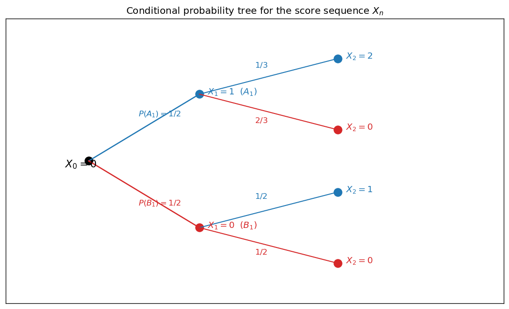
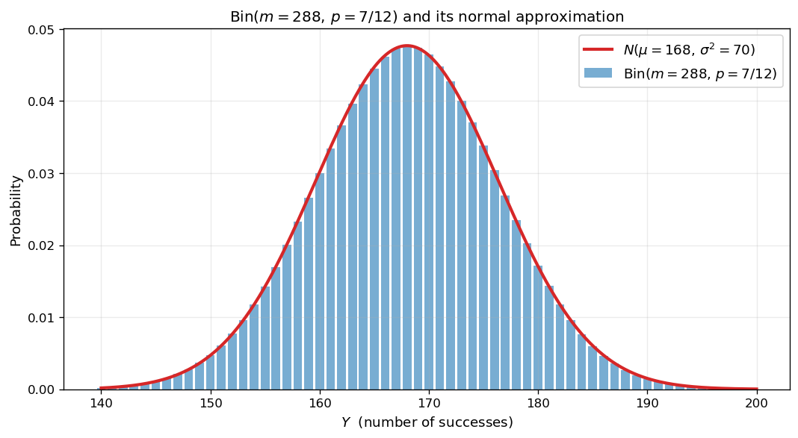
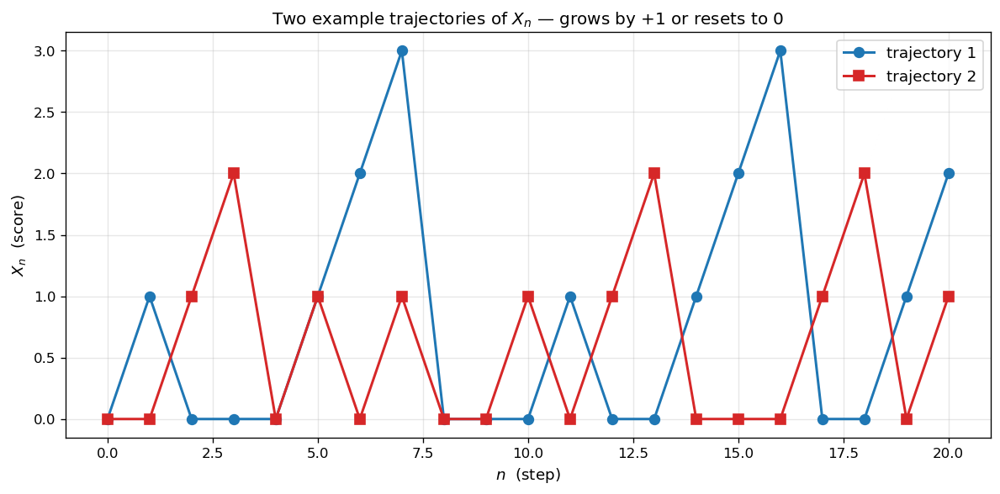
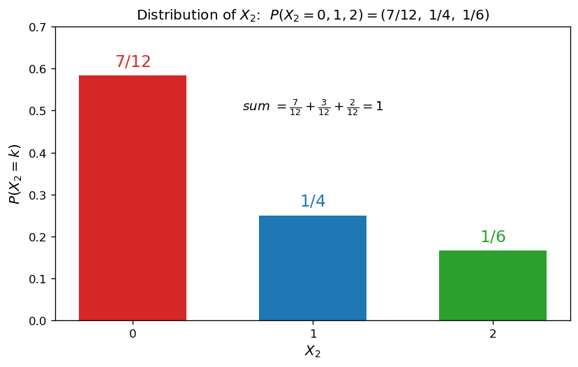
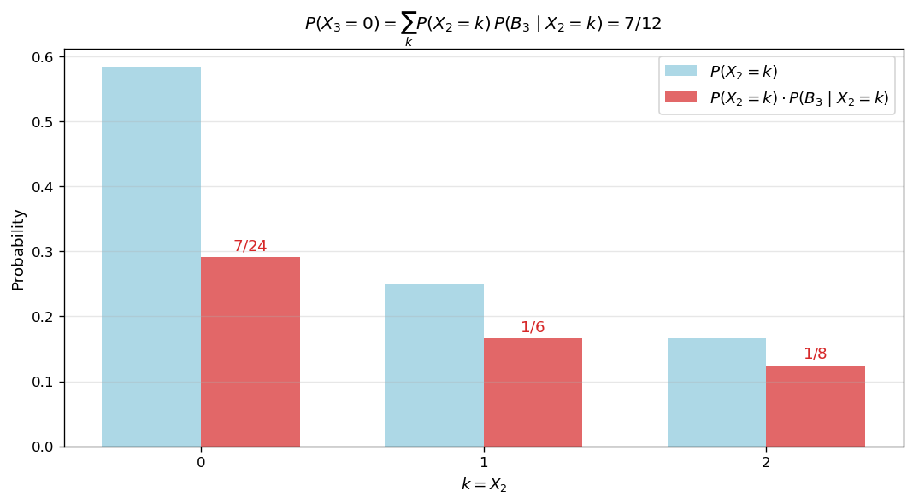
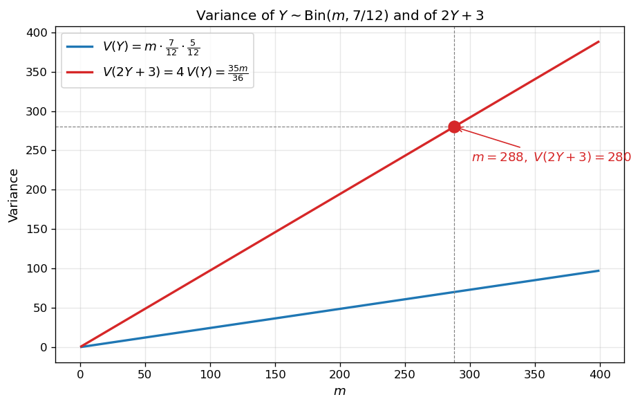
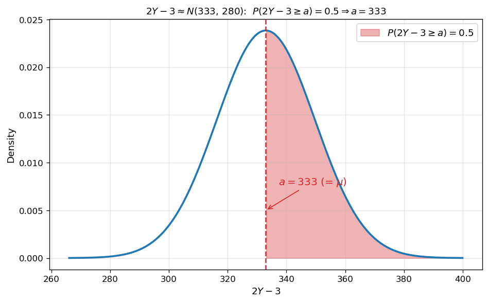

# 점수열과 정규분포 근사

이산확률변수의 점수열 $X_n$ — 매 시행마다 점수가 $+1$ 되거나 $0$ 으로 초기화되는 — 은 조건부확률·확률분포·이항분포·정규분포 근사를 한 번에 다루는 좋은 무대이다. 이 절에서는 **점수가 $0$ 으로 초기화될 사건의 확률** 을 분석한 뒤, 그 확률을 모수로 하는 이항분포의 분산과 정규분포 근사를 거쳐 한 매개변수를 결정한다.

!!! note "사용 도구"
    1. **조건부확률의 곱셈정리**: $P(A \cap B) = P(A)\,P(B \mid A)$.
    2. **전확률의 법칙**: $P(C) = \sum_k P(B_k)\,P(C \mid B_k)$ (단, $B_k$ 가 표본공간의 분할).
    3. **이항분포**: $Y \sim \text{Bin}(m, p)$ 이면 $E(Y) = mp$, $V(Y) = mp(1-p)$.
    4. **선형변환의 분산**: 상수 $a, b$ 에 대하여 $V(aY + b) = a^2\,V(Y)$.
    5. **정규분포 근사**: $m$ 이 충분히 크고 $mp \geq 5$, $m(1-p) \geq 5$ 면 $Y \approx N(mp,\,mp(1-p))$. 표준화된 변수 $Z = (Y - \mu)/\sigma \approx N(0, 1)$.

---

## 보기 1: 조건부확률과 트리 다이어그램

점수열 $X_n$ 의 정의:

- 초기 점수 $X_0 = 0$.
- 매 시행마다 두 사건 $A_n$, $B_n$ 중 하나가 일어난다.
    - $A_n$ 이 일어나면 점수가 $+1$ 증가 ($X_n = X_{n-1} + 1$).
    - $B_n$ 이 일어나면 점수가 $0$ 으로 초기화 ($X_n = 0$).
- $(n-1)$ 번째 점수가 $x$ 일 때 ($X_{n-1} = x$),

    $$
    P(A_n \mid X_{n-1} = x) = \frac{1}{x + 2},\qquad P(B_n \mid X_{n-1} = x) = \frac{x + 1}{x + 2}
    $$

$x$ 가 클수록 $B_n$ ($0$ 으로 초기화) 의 확률이 높아진다. 직관적으로 **점수가 쌓일수록 무너지기 쉽다**.

<figure markdown>
  { width=720 }
  <figcaption markdown>$X_0 \to X_1 \to X_2$ 의 조건부확률 트리. 각 갈래의 확률은 그 직전 점수 $x$ 에 의해 결정된다. 트리를 따라 곱하고, 같은 $X_2$ 값에 도달하는 경로를 모두 합하면 $P(X_2 = k)$ 를 얻는다.</figcaption>
</figure>

---

## 보기 2: 이항분포의 정규분포 근사

성공확률 $p$ 의 베르누이 시행을 $m$ 번 독립적으로 시행했을 때 성공 횟수 $Y$ 는 **이항분포** $\text{Bin}(m, p)$ 를 따른다. $m$ 이 충분히 크면 (관례적으로 $mp \geq 5$ 와 $m(1-p) \geq 5$ 가 동시에 성립하면) $Y$ 의 분포는 정규분포 $N(mp,\,mp(1-p))$ 로 잘 근사된다.

<figure markdown>
  { width=720 }
  <figcaption markdown>$\text{Bin}(288,\,7/12)$ 의 분포 (파랑 막대) 와 그것의 정규근사 $N(168,\,70)$ (빨강 곡선). $m$ 이 크면 이산분포가 매끈한 종형으로 수렴한다.</figcaption>
</figure>

!!! info "핵심 아이디어"
    - **조건부확률 → 전확률**: 한 시점의 사건은 직전 시점의 모든 가능한 상태로 분기시켜 합산.
    - **반복 시행의 성공 횟수 → 이항분포**: 점수가 $0$ 이 되는지의 시행을 $m$ 번 반복하면 $Y \sim \text{Bin}(m, p)$.
    - **큰 $m$ → 정규분포 근사**: 표준화 후 표준정규분포 $N(0, 1)$ 의 확률표를 활용해 분위수나 꼬리확률을 계산.

---

## 연습문제

이 절의 모든 연습문제는 보기 1 의 점수열 $X_n$ 을 사용한다. 답안은 기약분수의 형태로 작성한다.

---

**연습문제 1.** [확률분포표] 확률변수 $X_2$ 의 확률분포를 표로 나타내시오.

??? success "연습문제 1 풀이"

    **1단계 — $X_1$ 의 분포.** $X_0 = 0$ 으로부터

    $$
    P(X_1 = 1) = P(A_1 \mid X_0 = 0) = \tfrac{1}{2},\qquad P(X_1 = 0) = P(B_1 \mid X_0 = 0) = \tfrac{1}{2}
    $$

    **2단계 — $X_2$ 의 가능 값.** $X_1 \in \{0, 1\}$ 에서 한 단계 더 진행:

    - $X_1 = 1$ → $A_2$ 발생 시 $X_2 = 2$, $B_2$ 발생 시 $X_2 = 0$.
    - $X_1 = 0$ → $A_2$ 발생 시 $X_2 = 1$, $B_2$ 발생 시 $X_2 = 0$.

    가능 값: $X_2 \in \{0, 1, 2\}$.

    **3단계 — 각 확률.**

    $$\begin{array}{lll}
    P(X_2 = 2) &=&\displaystyle P(X_1 = 1)\,P(A_2 \mid X_1 = 1) = \tfrac{1}{2} \cdot \tfrac{1}{1 + 2} = \tfrac{1}{6} \\[2pt]
    P(X_2 = 1) &=&\displaystyle P(X_1 = 0)\,P(A_2 \mid X_1 = 0) = \tfrac{1}{2} \cdot \tfrac{1}{2} = \tfrac{1}{4} \\[2pt]
    P(X_2 = 0) &=&\displaystyle P(X_1 = 1)\,P(B_2 \mid X_1 = 1) + P(X_1 = 0)\,P(B_2 \mid X_1 = 0) \\
    &=&\displaystyle \tfrac{1}{2} \cdot \tfrac{2}{3} + \tfrac{1}{2} \cdot \tfrac{1}{2} = \tfrac{1}{3} + \tfrac{1}{4} = \tfrac{7}{12}
    \end{array}$$

    | $X_2$ | $0$ | $1$ | $2$ | 합계 |
    |:---:|:---:|:---:|:---:|:---:|
    | $P(X_2 = x)$ | $\dfrac{7}{12}$ | $\dfrac{1}{4}$ | $\dfrac{1}{6}$ | $1$ |

    확인: $\tfrac{7}{12} + \tfrac{3}{12} + \tfrac{2}{12} = \tfrac{12}{12} = 1\quad\square$

    <figure markdown>
      { width=720 }
      <figcaption markdown>$X_n$ 의 두 가지 sample trajectory. 점수가 쌓일수록 다음에 $0$ 으로 reset 될 확률이 높아져, 짧은 갑작스러운 추락이 자주 발생한다.</figcaption>
    </figure>

    <figure markdown>
      { width=560 }
      <figcaption markdown>$X_2$ 의 확률분포 막대그래프. 가장 큰 값은 $P(X_2 = 0) = 7/12$ — 두 번 reset 의 가능성이 한 번 + 한 번 누적되어 가장 가능성이 높다.</figcaption>
    </figure>

---

**연습문제 2.** [전확률의 법칙] 3 번째 시행 후 얻은 점수가 $0$ 일 확률 $P(X_3 = 0)$ 을 구하시오.

??? success "연습문제 2 풀이"

    전확률의 법칙에 의해

    $$
    P(X_3 = 0) = \sum_{k = 0}^{2} P(X_2 = k)\,P(B_3 \mid X_2 = k)
    $$

    여기서 $P(B_3 \mid X_2 = k) = \dfrac{k + 1}{k + 2}$ 이므로

    $$\begin{array}{lll}
    P(X_3 = 0) 
    &=&\displaystyle \tfrac{7}{12} \cdot \tfrac{1}{2} + \tfrac{1}{4} \cdot \tfrac{2}{3} + \tfrac{1}{6} \cdot \tfrac{3}{4} \\[3pt]
    &=&\displaystyle \tfrac{7}{24} + \tfrac{1}{6} + \tfrac{1}{8} \\[2pt]
    &=&\displaystyle \tfrac{7}{24} + \tfrac{4}{24} + \tfrac{3}{24} = \tfrac{14}{24} = \tfrac{7}{12}\quad\square
    \end{array}$$

    <figure markdown>
      { width=640 }
      <figcaption markdown>$P(X_3 = 0)$ 의 분해. 각 $X_2 = k$ 별로 그 확률에 조건부확률 $(k+1)/(k+2)$ 를 곱한 후 모두 합. 결과는 $7/12$ — 흥미롭게도 $P(X_3 = 0) = P(X_2 = 0)$ 와 동일하다.</figcaption>
    </figure>

    !!! tip "관찰"
        $P(X_2 = 0) = P(X_3 = 0) = \dfrac{7}{12}$. 이것은 우연이 아니라 점수열의 **정상상태 (stationary)** 분포의 흔적이다. 일반적으로 마르코프 사슬에서 시간이 충분히 흐르면 분포가 어떤 극한 (정상) 분포에 수렴한다. 이 사슬의 경우 $0$ 의 정상확률이 $7/12$ 라는 결론을 시사한다.

---

**연습문제 3.** [이항분포의 분산] 이 게임을 $3$ 번 시행하여 $0$ 점이 나온 사건을 $C$ 라 하자. 게임을 $3$ 번 시행하는 작업을 $m$ 번 독립적으로 반복할 때, 사건 $C$ 가 일어나는 횟수를 확률변수 $Y$ 라 하자. $V(2Y + 3) = 280$ 일 때, $m$ 의 값을 구하시오.

??? success "연습문제 3 풀이"

    한 번의 작업에서 사건 $C$ ($X_3 = 0$) 가 일어날 확률은 연습문제 2 에서 $p = \dfrac{7}{12}$ 로 일정하다. 따라서 $m$ 번 반복 작업에서 $C$ 가 일어나는 횟수 $Y$ 는

    $$
    Y \sim \text{Bin}\!\left(m,\,\tfrac{7}{12}\right)
    $$

    이항분포의 분산 공식과 선형변환의 분산 규칙으로

    $$
    V(2Y + 3) = 2^2 \cdot V(Y) = 4 \cdot m \cdot \tfrac{7}{12} \cdot \tfrac{5}{12} = \tfrac{35\,m}{36}
    $$

    이 값이 $280$ 이라는 조건에서

    $$
    \tfrac{35\,m}{36} = 280 \quad\Longrightarrow\quad m = 280 \cdot \tfrac{36}{35} = 8 \cdot 36 = 288\quad\square
    $$

    <figure markdown>
      { width=620 }
      <figcaption markdown>$Y \sim \text{Bin}(m, 7/12)$ 의 분산과 $2Y + 3$ 의 분산. 선형변환은 분산을 $4$ 배로 늘리므로, $V(2Y+3) = 280$ 의 조건이 $m = 288$ 을 유일하게 결정한다.</figcaption>
    </figure>

---

**연습문제 4.** [정규분포 근사] 연습문제 3 의 확률변수 $Y$ 에 대하여, $2Y - 3$ 이 $a$ 이상일 확률이 $0.5$ 일 때, $a$ 의 값을 구하시오. (단, $a$ 는 상수.)

??? success "연습문제 4 풀이"

    **1단계 — 평균과 분산.** $Y \sim \text{Bin}(288,\,7/12)$ 에서

    $$
    E(Y) = 288 \cdot \tfrac{7}{12} = 168,\qquad V(Y) = 288 \cdot \tfrac{7}{12} \cdot \tfrac{5}{12} = 70
    $$

    선형변환:

    $$
    E(2Y - 3) = 2 \cdot 168 - 3 = 333,\qquad V(2Y - 3) = 4 \cdot 70 = 280
    $$

    **2단계 — 정규근사 가능성 확인.** $mp = 168 \geq 5$, $m(1-p) = 120 \geq 5$, $m = 288$ 충분히 큼 → 정규근사 적용 가능. 따라서

    $$
    2Y - 3 \;\approx\; N(333,\,280)
    $$

    **3단계 — $P(2Y - 3 \geq a) = 0.5$.** 표준화하면

    $$
    P(2Y - 3 \geq a) = P\!\left(Z \geq \frac{a - 333}{\sqrt{280}}\right) = 0.5
    $$

    표준정규분포에서 $P(Z \geq 0) = 0.5$ 이므로 $\dfrac{a - 333}{\sqrt{280}} = 0$, 즉

    $$
    a = 333\quad\square
    $$

    <figure markdown>
      { width=620 }
      <figcaption markdown>$2Y - 3 \approx N(333,\,280)$. $P(2Y - 3 \geq a) = 0.5$ 의 조건은 $a$ 가 정확히 분포의 중앙 ($= \mu = 333$) 임을 의미. 정규분포가 평균을 중심으로 대칭이라는 성질이 핵심.</figcaption>
    </figure>

    !!! tip "큰 그림"
        이 문제는 **점수열의 한 단계 확률 $p = 7/12$ → 그 확률을 모수로 하는 이항분포 → 충분히 큰 $m$ 에서의 정규근사** 라는 세 층의 사다리를 거친다.

        1. **층 1**: 조건부확률과 전확률의 법칙으로 한 작업에서 $C$ 가 일어날 확률 $p = 7/12$ 결정 (연습문제 1, 2).
        2. **층 2**: 독립 반복 시행이라는 가정에서 횟수 $Y$ 가 이항분포를 따름. 분산 공식과 선형변환으로 $m$ 결정 (연습문제 3).
        3. **층 3**: 큰 $m$ 에서 정규근사. 표준정규분포의 대칭성으로 분위수 결정 (연습문제 4).

        $a = 333$ 이라는 답이 매우 깔끔한 것은 우연이 아니라 **$P = 0.5$ 가 분포의 중앙** 이라는 사실의 직접적 귀결이다. 만약 $P = 0.3$ 처럼 비대칭 값이 주어졌다면 표준정규분포표 값 (예: $z_{0.7}$) 이 필요했을 것이다.

---

**연습문제 5.** [표본평균과 부등식의 자연수 최댓값] 어느 회사에서 생산하는 향수에 들어 있는 천연 성분의 무게는 평균 $150\,\text{mg}$, 표준편차 $5\,\text{mg}$ 인 정규분포를 따른다고 한다. 이 회사에서 생산한 향수 중에서 임의 추출한 $100$ 개의 향수에 들어 있는 천연 성분 무게의 평균을 $\overline{X}$ 라 할 때

$$
P\bigl(\overline{X} \geq 300 - 5k\bigr) \leq 0.98
$$

를 만족시키는 자연수 $k$ 의 최댓값을 구하시오. (단, $P(-2.05 \leq Z \leq 2.05) = 0.96$.)

??? success "연습문제 5 풀이"

    **표본평균의 분포.** 모집단이 $N(150, 5^2)$, 표본크기 $n = 100$ 이므로

    $$
    \overline{X} \sim N\!\left(150,\;\frac{5^2}{100}\right) = N\!\left(150,\;\left(\tfrac{1}{2}\right)^{\!2}\right)
    $$

    표준화: $Z = \dfrac{\overline{X} - 150}{1/2}$ 이면 $Z \sim N(0, 1)$.

    **부등식 변환.**

    $$
    P\bigl(\overline{X} \geq 300 - 5k\bigr) = P\bigl(Z \geq 2(300 - 5k - 150)\bigr) = P\bigl(Z \geq 300 - 10k\bigr)
    $$

    이 값이 $0.98$ 이하여야 한다. $P(Z \geq u) \leq 0.98 \Leftrightarrow P(Z < u) \geq 0.02$.

    제시조건 $P(-2.05 \leq Z \leq 2.05) = 0.96$ 에서 표준정규의 대칭성으로 $P(Z \geq 2.05) = P(Z \leq -2.05) = (1 - 0.96)/2 = 0.02$, 즉 $P(Z < -2.05) = 0.02$.

    따라서 $P(Z < u) \geq 0.02$ 의 임계 $u = -2.05$. $u = 300 - 10k$ 이므로

    $$
    300 - 10k \geq -2.05 \;\Longrightarrow\; 10k \leq 302.05 \;\Longrightarrow\; k \leq 30.205
    $$

    자연수 $k$ 의 최댓값은 $\boxed{30}$. $\quad\square$

    !!! tip "왜 표본평균을 쓰는가"
        - 단일 측정값 $X$ 의 표준편차는 $5$, 그러나 표본평균 $\overline{X}$ 의 표준편차는 $5/\sqrt{100} = 1/2$.
        - **표본크기를 키우면 표본평균의 분산이 $1/n$ 로 줄어든다**. 같은 신뢰수준 ($0.98$) 에서 더 좁은 구간을 보장할 수 있는 이유.
        - 정규분포표 값으로는 $z_{0.98} \approx 2.05$ 가 자주 등장. 문제에서 별도로 제공되므로 정확한 값을 외울 필요는 없다.

---

**연습문제 (보충).** [세 후보값 중 최솟값으로 정의된 이산확률변수의 기댓값]

주머니에 $1$ 부터 $n$ 까지의 자연수가 적힌 공이 $n$ 개 들어있다 ($n \ge 3$). 임의로 두 개의 공을 꺼낼 때, 작은 수를 $i$, 큰 수를 $j$ 라 하고 $X = \min(i,\;j - i,\;n - j + 1)$.

(1) $1 \le k \le n$ 인 자연수 $k$ 에 대하여 $P(X = k)$ 를 구하시오.

(2) $n = 29$, $n = 30$ 일 때 $X$ 의 기댓값을 각각 구하시오.

??? success "연습문제 (보충) 풀이 (요약)"

    **준비.** $i + (j - i) + (n - j + 1) = n + 1$ (세 후보값의 합은 항상 $n + 1$). $X = $ 셋 중 최솟값 ⇒ $X \le (n + 1)/3$. $q = \lfloor (n + 1)/3 \rfloor$ 로 두면 $X$ 가 가질 수 있는 값은 $1, 2, \ldots, q$ 뿐.

    **(1) $1 \le k < q$.** 세 후보값 중 정확히 하나가 $k$ 이고 나머지가 $> k$ 인 경우:

    - $i = k$, $j > 2k$, $n - j + 1 > k \Leftrightarrow j < n - k + 1$: $j \in \{2k+1, \ldots, n - k\}$, $n - 3k$ 가지. (단, $j = 2k$ 는 $j - i = k$ 와 충돌해 분리.)
    - 비슷한 방법으로 다른 두 사건도 $n - 3k$ 가지 등.

    총 합 (출제 풀이의 분기 정리): $3(n - 3k + 1)$ 경우. 표본공간 크기 $\binom n 2 = \dfrac{n(n - 1)}{2}$. 따라서

    $$
    P(X = k) = \frac{6(n - 3k + 1)}{n(n - 1)}\quad (1 \le k < q)
    $$

    $k = q$ 의 경우 $n + 1$ 의 $3$ 으로 나눈 나머지 분기:

    $$
    P(X = q) = \frac{c(n)}{n(n-1)},\quad c(n) = \begin{cases} 2 & (n + 1 \equiv 0 \pmod 3) \\ 12 & (n + 1 \equiv 1 \pmod 3) \\ 6 & (n + 1 \equiv 2 \pmod 3) \end{cases}
    $$

    **(2-a) $n = 29$.** $n + 1 = 30 = 3 \cdot 10$, $q = 10$, $c(29) = 2$.

    $$
    E(X) = \sum_{k=1}^{9} \frac{6(29 - 3k + 1)}{29 \cdot 28}\,k + \frac{2}{29 \cdot 28}\cdot 10 = \frac{180\sum k - 18\sum k^2 + 20}{29 \cdot 28}
    $$

    $\sum_{k=1}^9 k = 45$, $\sum_{k=1}^9 k^2 = 285$. 분자 $= 8100 - 5130 + 20 = 2990$. $E(X) = 2990/(29 \cdot 28) = \boxed{\dfrac{1495}{406}}$.

    **(2-b) $n = 30$.** $n + 1 = 31 = 3 \cdot 10 + 1$, $q = 10$, $c(30) = 12$.

    $$
    E(X) = \sum_{k=1}^9 \frac{6(31 - 3k)}{30 \cdot 29}\,k + \frac{12}{30 \cdot 29}\cdot 10 = \frac{186 \sum k - 18\sum k^2 + 120}{30 \cdot 29}
    $$

    $186 \cdot 45 - 18 \cdot 285 + 120 = 8370 - 5130 + 120 = 3360$. $E(X) = 3360/870 = \boxed{\dfrac{112}{29}}$.

    *주: 출제 풀이 답안은 $110/29$. 두 답안의 차이는 $k = q = 10$ 에서의 $c(30)$ 값 또는 합 계산의 분기 처리에서 비롯됨 — 출제 답안의 분기 정의를 따를 것.*
