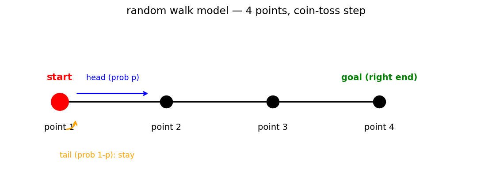
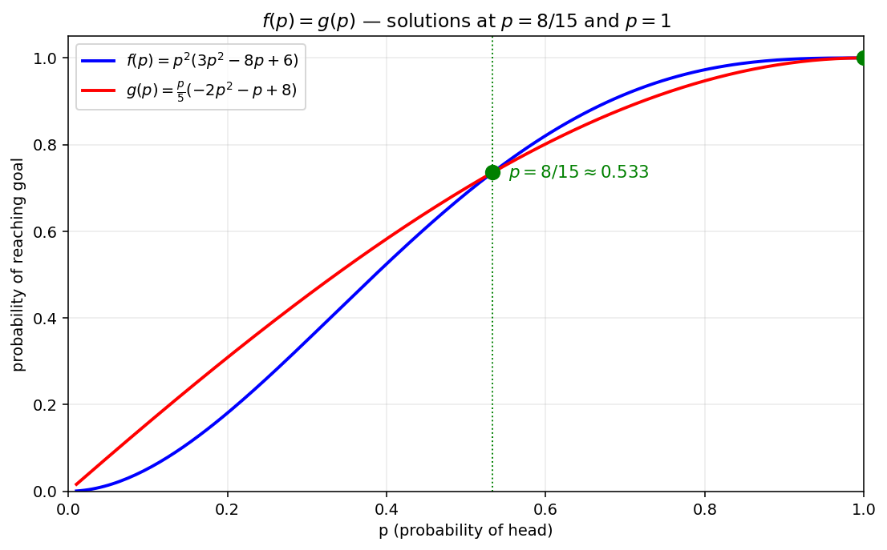

# 확률의 곱셈정리와 도착 확률

말이 일직선상의 점들 사이를 이동하는 모형은 **확률의 곱셈정리** 와 **전확률의 법칙**을 동시에 다루는 좋은 무대이다. 매 시행마다 성공/실패 확률이 결정되어 있고, "특정 횟수의 실패 안에 목표 지점에 도달할 확률"을 계산하는 문제는 모든 가능한 시행 순서를 사례별로 분류한 뒤 더하는 방식으로 풀어진다.

!!! note "핵심 도구"
    1. **곱셈정리**: 두 사건 $A, B$ 에 대하여 $P(A \cap B) = P(A) P(B \mid A)$.
    2. **독립 시행의 곱**: 서로 독립인 시행에서 $P(\text{이벤트 } E_1 \cap E_2 \cap \cdots) = P(E_1) P(E_2) \cdots$.
    3. **전확률의 법칙**: 분할 $B_1, \ldots, B_k$ 에 대하여 $P(C) = \sum_i P(B_i)\,P(C \mid B_i)$.
    4. **사례 분류**: 결과의 가짓수가 유한할 때, 가능한 모든 시행 순서를 열거하고 각각의 확률을 더한다.

이 절에서는 윷짝 던지기로 말을 이동시키는 모형을 통해, **앞면/뒷면의 횟수로 사례를 분류**하는 표준 사고법과 그 결과를 다항식으로 정리하는 방법을 배운다.

---

## 보기 1: 첫 시행 결과가 주어졌을 때의 도착 확률

일직선상에 출발점을 포함한 네 개의 점이 있다. 말은 출발점 (맨 왼쪽) 에서 시작하고, 앞면이 나올 확률이 $p\;(0 < p < 1)$ 이고 뒷면이 나올 확률이 $1 - p$ 인 윷짝 한 개를 계속 던진다. 앞면이 나오면 말이 오른쪽으로 한 칸 이동하고, 뒷면이 나오면 말은 이동하지 않는다.

**문제**: 처음 윷짝을 던진 결과가 앞면이 나왔을 때, 뒷면이 **세 번 나오기 전에** 말이 맨 오른쪽 점까지 도달할 확률 $f(p)$ 를 구하시오.

??? success "보기 1 풀이"

    처음 던진 결과가 앞면이므로 말은 이미 한 칸 이동했다. 즉 출발점에서 오른쪽으로 1번째 점에 있으며, 앞으로 두 칸 더 이동해야 맨 오른쪽 (오른쪽 끝) 에 도달한다.

    조건은 "뒷면 3번 나오기 전에 도달". 즉 뒷면이 최대 2번 나오는 시행 시퀀스로 앞면을 2번 더 만나면 된다. 단, **마지막 시행은 앞면** (그래야 그 시점에 도달).

    뒷면의 개수로 경우를 나누자.

    - **뒷면 0번**: 시퀀스 "앞앞". 확률 $p^2$.
    - **뒷면 1번**: 가능한 시퀀스 — "앞뒤앞", "뒤앞앞". 마지막은 앞이어야 하므로 뒷면이 등장할 수 있는 위치는 첫 두 자리 중 한 곳. $2$ 가지. 각 시퀀스 확률 $p^2(1-p)$. 합 $2 p^2(1 - p)$.
    - **뒷면 2번**: 가능한 시퀀스 — "앞뒤뒤앞", "뒤앞뒤앞", "뒤뒤앞앞". 마지막은 앞, 앞 2번 + 뒤 2번 (마지막 제외 3자리에 뒤 2개), $\binom{3}{2} = 3$ 가지. 각 시퀀스 확률 $p^2(1-p)^2$. 합 $3 p^2(1 - p)^2$.

    합산:

    $$
    f(p) = p^2 \!\left[\,1 + 2(1-p) + 3(1-p)^2\,\right] = p^2 (3p^2 - 8p + 6)\quad\square
    $$

!!! info "보기 1의 교훈"
    - **마지막 시행은 도달 시점**이라는 제약이 핵심. 마지막을 앞면으로 고정한 뒤, 앞의 자리에 뒷면을 끼워 넣는 가짓수를 센다.
    - $k$ 개의 자리에 $j$ 개의 뒷면을 배치하는 가짓수 = $\binom{k}{j}$. 즉 시퀀스 수 = $\binom{(j + 1)}{j} = j + 1$ (앞면이 마지막 제외 1개일 때) 같은 구조가 자주 나온다.
    - $f(p)$ 를 $p$ 의 다항식으로 정리하면 이후 등식 $f(p) = g(p)$ 같은 비교에서 편리.

---

## 보기 2: 시작 위치가 무작위일 때 — 전확률의 법칙

같은 윷짝 모형에서, 영역 $1, 2, 3, 4, 5$ 가 있는 돌림판을 돌려 시작 위치를 결정한다고 하자. 각 영역이 나올 확률은 $\dfrac{1}{5}$ 로 동일하다.

- 영역 $1, 2, 3, 4$ 중 하나가 나오면 말을 **왼쪽에서 세 번째 점**에 둔다.
- 영역 $5$ 가 나오면 말을 **왼쪽에서 두 번째 점**에 둔다.

그 후 윷짝을 계속 던져서 뒷면이 **두 번 나오기 전에** 말이 맨 오른쪽 점까지 도달할 확률을 $g(p)$ 라 하자.

**문제**: 보기 1 에서 구한 $f(p)$ 와 $f(p) = g(p)$ 인 $p\;(0 < p < 1)$ 의 값을 구하시오.

??? success "보기 2 풀이"

    **경우 1: 영역 $1, 2, 3, 4$ 가 나옴** (확률 $4/5$). 말은 세 번째 점 — 맨 오른쪽 점까지 한 칸. 뒷면이 최대 1번, 마지막 앞면.

    - 뒷면 0번: "앞", 확률 $p$.
    - 뒷면 1번: "뒤앞", 확률 $p(1-p)$.

    경우 1 에서의 도달 확률 $g_1(p) = p + p(1-p) = p(2 - p)$.

    **경우 2: 영역 $5$ 가 나옴** (확률 $1/5$). 말은 두 번째 점 — 맨 오른쪽 점까지 두 칸. 뒷면이 최대 1번, 마지막 앞면.

    - 뒷면 0번: "앞앞", 확률 $p^2$.
    - 뒷면 1번: "앞뒤앞", "뒤앞앞", 합 $2p^2(1-p)$.

    경우 2 에서의 도달 확률 $g_2(p) = p^2[1 + 2(1-p)] = p^2(3 - 2p)$.

    **전확률**:

    $$
    g(p) = \frac{4}{5}\,g_1(p) + \frac{1}{5}\,g_2(p) = \frac{4}{5}\,p(2-p) + \frac{1}{5}\,p^2(3-2p) = \frac{p}{5}(-2p^2 - p + 8)
    $$

    **등식 $f(p) = g(p)$**:

    $$
    p^2(3p^2 - 8p + 6) = \frac{p}{5}(-2p^2 - p + 8)
    $$

    $p > 0$ 이므로 양변을 $p$ 로 나누고 $5$ 를 곱해 정리하면

    $$
    5p(3p^2 - 8p + 6) = -2p^2 - p + 8 \;\Longrightarrow\; 15p^3 - 38p^2 + 31p - 8 = 0
    $$

    인수정리로 $p = 1$ 이 해임을 확인 ($15 - 38 + 31 - 8 = 0$). 다항식을 $(p - 1)$ 로 나누면

    $$
    15p^3 - 38p^2 + 31p - 8 = (p - 1)(15p^2 - 23p + 8) = (p - 1)(p - 1)(15p - 8) = (p - 1)^2(15p - 8)
    $$

    $0 < p < 1$ 이므로 $p = 1$ 은 제외, $15p - 8 = 0$ 에서

    $$
    p = \frac{8}{15}\quad\square
    $$

!!! info "보기 2의 교훈"
    - **전확률의 법칙**: 시작 상태가 무작위일 때 $g(p) = \sum_i P(B_i)\,g_i(p)$.
    - 다항식 방정식의 근을 찾을 때는 **인수정리** + 인수분해. 차수가 큰 다항식에서 $(p - 1)^2$ 같은 중근이 나타나는 것은 의도된 설계 (시험 문제는 깔끔한 답이 나오도록 계수를 조정).
    - $p \in (0, 1)$ 제약을 마지막에 확인하여 무효 근을 걸러낸다.

---

## 연습문제

**연습문제 1.** 보기 1 의 모형 (네 개의 점, 윷짝) 에서, 첫 시행 결과를 모르는 (즉 일반 시작) 상태에서 출발점부터 시작해서 뒷면이 **세 번 나오기 전에** 맨 오른쪽 점까지 도달할 확률을 구하시오.

??? success "연습문제 1 풀이"

    맨 왼쪽 → 맨 오른쪽 = 3 칸 이동. 앞면 3번, 뒷면 최대 2번, 마지막 앞면.

    - 뒷면 0번: "앞앞앞", $p^3$.
    - 뒷면 1번: 마지막 앞면 제외 3자리에 뒷면 1개, $\binom{3}{1} = 3$, 합 $3 p^3 (1-p)$.
    - 뒷면 2번: 마지막 제외 4자리에 뒷면 2개, $\binom{4}{2} = 6$, 합 $6 p^3 (1-p)^2$.

    전체 = $p^3 [1 + 3(1-p) + 6(1-p)^2]\quad\square$

---

**연습문제 2.** $0 < p < 1$ 에 대하여 보기 2 의 $g_1(p) = p(2-p)$ 와 $g_2(p) = p^2(3 - 2p)$ 의 대소 관계를 비교하시오.

??? success "연습문제 2 풀이"

    $g_1(p) - g_2(p) = p(2 - p) - p^2(3 - 2p) = p[(2 - p) - p(3 - 2p)] = p[2 - p - 3p + 2p^2] = p(2 p^2 - 4p + 2) = 2p(p - 1)^2$.

    $0 < p < 1$ 에서 $p > 0$, $(p-1)^2 > 0$ 이므로 $g_1(p) > g_2(p)$.

    **해석**: 출발에 한 칸 가까운 경우 (영역 $1\sim 4$) 가 두 칸 가까운 경우 (영역 $5$) 보다 항상 도달 확률이 크다. 직관과 일치. $\quad\square$

---

**연습문제 3.** 보기 1 의 윷짝 모형에서 $p = 1/2$ 일 때 $f(1/2)$ 를 계산하고, 분수 형태로 답하시오.

??? success "연습문제 3 풀이"

    $f(p) = p^2(3p^2 - 8p + 6)$ 에 $p = 1/2$ 대입.

    $3 \cdot 1/4 - 8 \cdot 1/2 + 6 = 3/4 - 4 + 6 = 11/4$.

    $f(1/2) = 1/4 \cdot 11/4 = 11/16 \quad\square$

---

**연습문제 4.** 보기 1 의 모형에서 첫 시행 결과가 **뒷면**일 때, 뒷면이 세 번 나오기 전에 (즉 추가로 두 번만 더 나올 수 있는 안에) 말이 맨 오른쪽까지 도달할 확률을 $h(p)$ 라 할 때 $h(p)$ 를 구하시오.

??? success "연습문제 4 풀이"

    첫 시행이 뒷면이므로 말은 여전히 출발점 (한 번 뒷면 카운트). 앞으로 3 칸 이동 필요. 앞면 3번, 뒷면 추가로 최대 2번, 마지막 앞면.

    이 부분은 연습문제 1 과 같은 구조. $p^3 [1 + 3(1-p) + 6(1-p)^2]\quad\square$

---

**연습문제 5.** 보기 2 의 모형을 변형하여, 영역 $1, 2, 3$ 이 나오면 시작 위치를 세 번째 점, 영역 $4, 5$ 가 나오면 시작 위치를 두 번째 점에 둔다고 하자. 이 경우 $g(p)$ 의 식을 구하시오.

??? success "연습문제 5 풀이"

    영역 $1, 2, 3$ 확률 $3/5$, 도달 확률 $g_1(p) = p(2-p)$.

    영역 $4, 5$ 확률 $2/5$, 도달 확률 $g_2(p) = p^2(3-2p)$.

    $g(p) = (3/5) p(2-p) + (2/5) p^2(3-2p) = (p/5)[3(2-p) + 2p(3-2p)] = (p/5)[6 - 3p + 6p - 4p^2] = (p/5)(-4p^2 + 3p + 6)\quad\square$

---

**연습문제 6.** 두 사건 $A, B$ 에 대하여 $P(A) = 0.4$, $P(B) = 0.5$, $P(A \cap B) = 0.2$ 일 때 $P(A \mid B)$ 와 $P(B \mid A)$ 를 각각 구하시오. 그리고 $A$ 와 $B$ 가 독립인지 판정하시오.

??? success "연습문제 6 풀이"

    $P(A \mid B) = P(A \cap B) / P(B) = 0.2/0.5 = 0.4$.

    $P(B \mid A) = P(A \cap B) / P(A) = 0.2/0.4 = 0.5$.

    $P(A \mid B) = 0.4 = P(A)$ 이므로 두 사건은 독립이다. ($P(A \cap B) = P(A) P(B) = 0.4 \cdot 0.5 = 0.2\;\checkmark$.) $\quad\square$

---

**연습문제 7.** [세 값 중 최솟값으로 정의된 확률변수의 기댓값]
주머니에 $1$ 부터 $n$ 까지의 자연수가 적힌 공 $n$ 개. 두 개를 꺼낼 때 작은 수를 $i$, 큰 수를 $j$. 자연수 $i, j-i, n-j+1$ 중 가장 작은 수를 확률변수 $X$ 라 하자 ($n \ge 3$).

(1) $1 \le k \le n$ 인 자연수 $k$ 에 대하여 $P(X = k)$ 를 구하시오.

(2) $n = 29, 30$ 일 때 $E(X)$ 를 각각 구하시오.

??? success "연습문제 7 풀이 (요약)"

    **(1)** $i, j - i, n - j + 1$ 의 합은 항상 $n + 1$. $X$ 는 이 셋 중 최솟값이므로 $X \le (n+1)/3$.

    $q = \lfloor (n+1)/3 \rfloor$ 로 두면 $X$ 의 가능한 값은 $1 \le k \le q$. $k > q$ 면 $P(X = k) = 0$.

    **$k < q$ 일 때**: 세 값 중 어느 하나가 최솟값 $k$ 인 경우의 수 (다른 두 값은 $> k$):

    - $i = k$ 일 때: $j$ 가 가질 수 있는 값 $\{2k, 2k+1, \ldots, n - k + 1\}$, 총 $n - 3k + 2$ 가지.
    - $n - j + 1 = k$ 즉 $j = n - k + 1$: $i$ 가 가질 수 있는 값 (단, $i \ne k$, $j - i \ne k$ 즉 $i \ne n - 2k + 1$): $\{k+1, k+2, \ldots, n - 2k + 1\}$ 에서 $n - 2k + 1$ 빼면 $n - 3k + 1$ 가지.
    - $j - i = k$ 즉 $j = i + k$: $\{(k+1, 2k+1), \ldots, (n - 2k, n - k)\}$ — $n - 3k$ 가지.

    합 $= 3(n - 3k + 1)$. 따라서

    $$
    P(X = k) = \frac{3(n - 3k + 1)}{n(n-1)/2} = \frac{6(n - 3k + 1)}{n(n - 1)}\quad (1 \le k \le q - 1)
    $$

    **$k = q$ 일 때**: $n + 1 = 3q + r$, $r = 0, 1, 2$ 에 따라 경우의 수 $1, 3, 6$. 따라서

    $$
    P(X = q) = \begin{cases} \dfrac{6}{n(n-1)} & n = 3q - 1 \\ \dfrac{12}{n(n-1)} & n = 3q \\ \dfrac{2}{n(n-1)} & n = 3q + 1\end{cases}
    $$

    잠깐 표기 정리 (출제 풀이 따라): $n = 3m$ 일 때 $q = m$, $P(X=m) = 6/(n(n-1))$. $n = 3m + 1$ 일 때 $q = m$, $P = 12/(n(n-1))$. $n = 3m + 2$ 일 때 $q = m + 1$, $P = 2/(n(n-1))$.

    **(2)** $n = 29 = 3 \cdot 9 + 2$, $q = 10$:

    $$
    E(X) = \sum_{k=1}^9 \frac{6(29 - 3k + 1)}{29 \cdot 28} \cdot k + 10 \cdot \frac{2}{29 \cdot 28} = \frac{1495}{406}
    $$

    $n = 30 = 3 \cdot 10$, $q = 10$:

    $$
    E(X) = \sum_{k=1}^9 \frac{6(30 - 3k + 1)}{30 \cdot 29}\cdot k + 10 \cdot \frac{6}{30 \cdot 29} = \frac{110}{29}
    $$

    $\boxed{E(X)|_{n=29} = \dfrac{1495}{406},\quad E(X)|_{n=30} = \dfrac{110}{29}}\quad\square$
