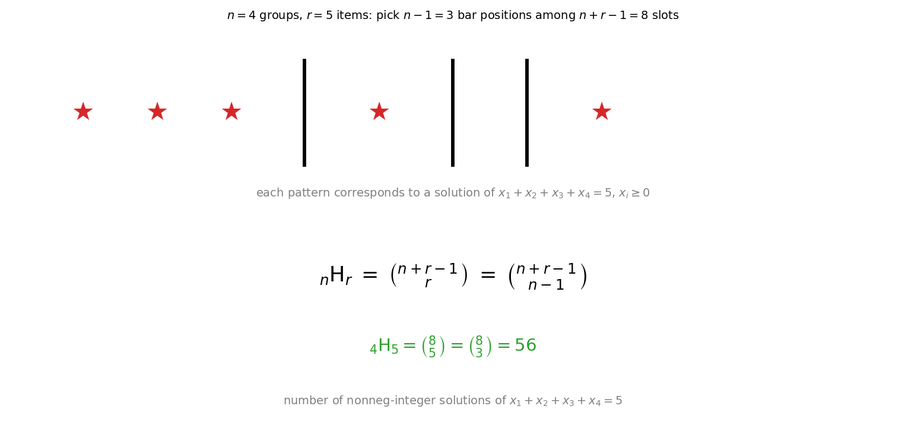
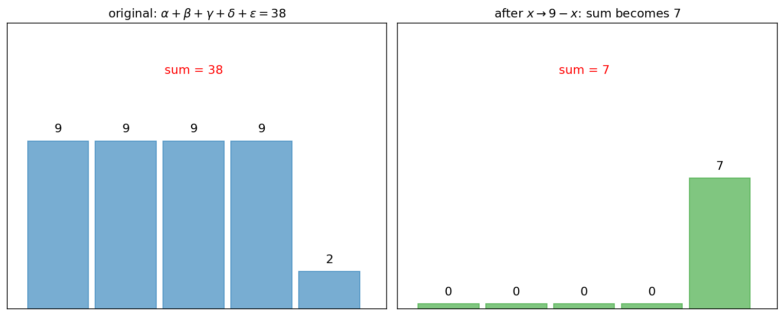

# 중복순열과 중복조합

서로 다른 $n$ 개의 대상에서 $r$ 개를 선택·배열할 때 **중복을 허용하는** 두 가지 셈법은 다음과 같다.

!!! note "정의"
    - **중복순열** $\,{}_n\Pi_r = n^r$ — 순서를 구별하며 같은 것을 다시 선택할 수 있는 배열의 수.
    - **중복조합** $\,{}_n\mathrm{H}_r = {}_{n+r-1}\mathrm{C}_r$ — 순서를 구별하지 않고 같은 것을 다시 선택할 수 있는 선택의 수.

중복조합의 공식은 흔히 "**막대와 별**" 논증으로 유도된다. $r$ 개의 별 ★ 사이에 $n-1$ 개의 막대 │ 를 넣어 $n$ 개의 그룹으로 나누면, 각 배치가 $i$ 번째 대상을 몇 개 골랐는지에 대응한다. 별과 막대를 합한 $n+r-1$ 자리 중 막대 $n-1$ 개 (또는 별 $r$ 개) 의 위치를 고르는 가짓수가 $\binom{n+r-1}{r}$ 이다.

방정식 $x_1 + x_2 + \cdots + x_n = r$ (각 $x_i \ge 0$ 인 정수) 의 해의 수가 정확히 ${}_n\mathrm{H}_r$ 와 같다는 사실은 매우 유용하다.

---

## 보기 1: 비밀번호 — 중복순열의 정형 예

특수문자 $32$ 개, 숫자 $10$ 개, 알파벳 대문자 $26$ 개, 소문자 $26$ 개로 구성된 문자 집합에서, 다섯 자리 비밀번호를 만들고자 한다. **문자의 중복을 허용**하며 대소문자는 서로 다른 글자로 본다.

특수문자 한 개, 알파벳 대문자 한 개, 그리고 나머지 세 자리는 **숫자 또는 소문자** 중에서 (중복을 허용하여) 선택하는 비밀번호는 모두 몇 개인가?

??? success "보기 1 풀이"

    다섯 자리를 채우는 절차를 단계로 분해한다.

    1. **특수문자가 들어갈 자리**: 다섯 자리 중 한 자리를 고르므로 $5$ 가지.
    2. **그 자리에 들어갈 특수문자**: $32$ 가지.
    3. **알파벳 대문자가 들어갈 자리**: 남은 네 자리 중 한 자리이므로 $4$ 가지.
    4. **그 자리에 들어갈 대문자**: $26$ 가지.
    5. **남은 세 자리**: 각 자리에 숫자 $10$ 개 또는 소문자 $26$ 개 (합 $36$ 개) 중 어느 것이든, 중복을 허용하여 들어갈 수 있으므로 $36^{\,3}$ 가지.

    곱의 법칙에 의하여

    $$
    5 \times 32 \times 4 \times 26 \times 36^{\,3} = 16{,}640 \times 36^{\,3}
    $$

    이는 $n \times k^{\,3}$ 꼴이므로 $n = 16{,}640$, $k = 36 \quad\square$

!!! info "보기 1의 교훈"
    - "한 자리에 들어갈 자리 선택" 과 "그 자리에 들어갈 글자 선택" 을 **분리**하면, 위치와 내용의 두 차원을 헷갈리지 않는다.
    - 남은 세 자리에 두 종류의 글자를 섞어 넣는 경우 — 두 종류를 따로 분리해서 셈하지 말고 **합집합 36 개 글자에서 중복허용 배열** 로 통합 처리.

---

## 보기 2: 비밀번호 자릿수 합 — 중복조합의 정형 예

숫자 $0\!\sim\!9$ 만을 사용하여 다섯 자리 비밀번호를 만든다. 각 자리의 숫자의 합이 $38$ 인 경우의 수를 구해 보자.

다섯 자리 비밀번호의 자릿수를 $\alpha,\,\beta,\,\gamma,\,\delta,\,\epsilon$ 이라 하면 각 변수는 $0$ 이상 $9$ 이하의 정수이고

$$
\alpha + \beta + \gamma + \delta + \epsilon = 38
$$

이다. 그대로 셈하기 어렵다. **여집합 변환**을 시도하자. $\alpha_1 = 9 - \alpha,\;\beta_1 = 9 - \beta,\,\ldots,\;\epsilon_1 = 9 - \epsilon$ 으로 두면 각 변수는 다시 $0$ 이상 $9$ 이하이고

$$
\alpha_1 + \beta_1 + \gamma_1 + \delta_1 + \epsilon_1 = 45 - 38 = 7
$$

이 방정식의 해의 수는 ${}_5\mathrm{H}_7 = {}_{11}\mathrm{C}_7 = {}_{11}\mathrm{C}_4 = 330$ 이다.

??? success "보기 2 풀이"

    위 변환에 따라 자릿수가 $0$ 이상 $9$ 이하인 정수해의 개수는

    $$
    {}_5\mathrm{H}_7 = \binom{5 + 7 - 1}{7} = \binom{11}{7} = \binom{11}{4} = \frac{11 \cdot 10 \cdot 9 \cdot 8}{4!} = 330
    $$

    이때 각 $\alpha_1$ 등이 $9$ 를 넘는 경우 (즉 원래 $\alpha$ 가 음수가 되는 경우) 는 합이 $7$ 이므로 어떤 변수도 $8$ 이상이 될 수 없어 자동으로 모두 $0 \le \cdot \le 7$ 의 범위에 들어간다. 따라서 답은 $330$ $\quad\square$

!!! info "보기 2의 교훈"
    - 큰 합 $38$ 을 작은 합 $7$ 로 바꾸는 **대칭 변환** $x \mapsto 9 - x$ 가 핵심.
    - 합이 충분히 작아진 뒤에는 상한 조건 ($\le 9$) 이 자동으로 충족되므로 단순한 중복조합 공식이 그대로 통한다.
    - 만약 변환 후 합이 $10$ 이상이라면 상한 조건이 깨질 수 있어 **포함-배제** 원리로 보정해야 한다.

---

## 연습문제

**연습문제 1.** 보기 1 의 비밀번호에서, 특수문자 한 개 그리고 알파벳 대문자 한 개를 포함하면서 **남은 세 자리는 모두 숫자만** 사용하는 경우의 수를 구하시오.

??? success "연습문제 1 풀이"

    위치를 고르는 방법은 보기 1과 동일하다.

    1. 특수문자 자리: $5$ 가지.
    2. 특수문자: $32$ 가지.
    3. 대문자 자리: $4$ 가지.
    4. 대문자: $26$ 가지.
    5. 남은 세 자리는 숫자 $10$ 개에서 중복 허용: $10^{\,3}$ 가지.

    $$
    5 \times 32 \times 4 \times 26 \times 1{,}000 = 16{,}640{,}000\quad\square
    $$

---

**연습문제 2.** 보기 1과 같은 문자 집합 (특수문자 $32$, 숫자 $10$, 대문자 $26$, 소문자 $26$) 에서 **특수문자 하나와 숫자 하나만** 반드시 포함하고 나머지 세 자리는 알파벳 대·소문자 중 어느 것이든 (중복 허용) 사용하는 다섯 자리 비밀번호의 수를 구하시오.

??? success "연습문제 2 풀이"

    1. 특수문자 자리 선택: $5$. 그 자리 글자: $32$.
    2. 숫자 자리 선택: 남은 $4$ 자리 중 하나, $4$. 그 자리 글자: $10$.
    3. 남은 세 자리: 알파벳 $52$ 개 중 중복 허용, $52^{\,3}$.

    $$
    5 \times 32 \times 4 \times 10 \times 52^{\,3} = 6{,}400 \times 52^{\,3} \quad\square
    $$

---

**연습문제 3.** 숫자 $0\!\sim\!9$ 만을 사용하여 다섯 자리 비밀번호를 만들 때, 각 자리의 숫자의 합이 $10$ 인 경우의 수를 구하시오.

??? success "연습문제 3 풀이"

    $\alpha + \beta + \gamma + \delta + \epsilon = 10$, $0 \le \cdot \le 9$.

    상한 제약이 없다고 보면 ${}_5\mathrm{H}_{10} = {}_{14}\mathrm{C}_{10} = {}_{14}\mathrm{C}_4 = \dfrac{14\cdot 13\cdot 12\cdot 11}{24} = 1{,}001$.

    상한 제약을 어기는 경우 — 어떤 변수가 $10$ 이상인 경우. 그 변수를 $\alpha = 10 + \alpha'$ 로 치환하면 $\alpha' + \beta + \gamma + \delta + \epsilon = 0$, 즉 모두 $0$ 인 경우 하나. 어느 변수가 $10$ 이상인지 다섯 가지 선택이 있고, 두 변수가 동시에 $10$ 이상인 경우는 합이 $20$ 이상이라 불가능.

    따라서 답은 $1{,}001 - 5 = 996 \quad\square$

---

**연습문제 4.** $1$ 년 $1$ 월 $1$ 일부터 $2025$ 년 $12$ 월 $31$ 일까지의 날짜를 여덟 자리 숫자 ①②③④⑤⑥⑦⑧ 의 형태로 표현한다 (①②③④ 는 연도, ⑤⑥ 은 월, ⑦⑧ 은 일). 단순화를 위해 $1, 3, 5, 7, 8, 10, 12$ 월은 $31$ 일, $2$ 월은 $28$ 일, 그 외 달은 $30$ 일까지 있다고 한다. ① 위치에는 $0, 1, 2$, ⑤ 위치에는 $0, 1$, ⑦ 위치에는 $0, 1, 2, 3$ 만 올 수 있다.

여덟 자리 숫자가 모두 다른 경우, ① 위치에 올 수 있는 숫자를 모두 구하시오.

??? success "연습문제 4 풀이"

    여덟 자리에 모두 다른 숫자가 들어가려면 $0, 1, 2, \ldots, 9$ 의 $10$ 개 중 $8$ 개를 골라 배치해야 한다 — 즉 사용되지 않는 숫자가 정확히 두 개이다.

    ① 의 후보는 $0, 1, 2$.

    - ① $= 0$: 가능한 연도 ④자리수 합. 적어도 $0001 \!\sim\! 0999$ 의 범위. 가능.
    - ① $= 1$: $1000 \!\sim\! 1999$ 범위. 가능.
    - ① $= 2$: $2000 \!\sim\! 2025$ 범위. 가능.

    각 경우 모두 사용되지 않은 두 숫자를 적절히 배제하여 모든 자리가 서로 다른 날짜를 만들 수 있는지 확인하면 된다.

    실제로 $0$, $1$, $2$ 모두 가능하므로 답은 $\{0,\,1,\,2\}$ $\quad\square$

---

**연습문제 5.** $5$ 명의 어른과 $3$ 명의 어린이가 원탁에 둘러앉으려고 한다. 어린이 셋이 서로 이웃하지 않도록 앉는 경우의 수를 구하시오 (회전하여 같은 자리는 같은 것으로 본다).

??? success "연습문제 5 풀이"

    어른 $5$ 명을 먼저 원탁에 앉히는 방법은 $(5-1)! = 4! = 24$ 가지.

    이때 어른들 사이에 만들어지는 $5$ 개의 빈 자리에 어린이 $3$ 명을 서로 다른 자리에 앉히면 어떤 두 어린이도 이웃하지 않는다. $5$ 자리 중 $3$ 자리를 골라 어린이를 배열하는 방법은 ${}_5\mathrm{P}_3 = 5 \cdot 4 \cdot 3 = 60$ 가지.

    $$
    24 \times 60 = 1{,}440\quad\square
    $$

---

**연습문제 6.** 방정식 $x + y + z + w = 12$ 의 음이 아닌 정수해의 개수를 구하시오. 또한 각 변수가 양의 정수일 때 (즉 $x, y, z, w \ge 1$) 의 해의 개수도 구하시오.

??? success "연습문제 6 풀이"

    음이 아닌 정수해 (즉 $\ge 0$): ${}_4\mathrm{H}_{12} = {}_{15}\mathrm{C}_{12} = {}_{15}\mathrm{C}_3 = \dfrac{15 \cdot 14 \cdot 13}{6} = 455$.

    양의 정수해 (즉 $\ge 1$): $x' = x - 1$ 등으로 치환하면 $x' + y' + z' + w' = 8$, 음이 아닌 정수해. ${}_4\mathrm{H}_8 = {}_{11}\mathrm{C}_8 = {}_{11}\mathrm{C}_3 = \dfrac{11 \cdot 10 \cdot 9}{6} = 165 \quad\square$

---

**연습문제 7.** $0$ 부터 $9$ 까지의 숫자를 사용하여 네 자리 자연수를 만들 때 (천의 자리는 $0$ 이 아님), 각 자리 숫자가 모두 다른 경우의 수와 각 자리 숫자가 같아도 되는 (중복 허용) 경우의 수를 각각 구하시오.

??? success "연습문제 7 풀이"

    중복 허용: 천 자리 $9$ 가지, 백·십·일 자리 각각 $10$ 가지. $9 \times 10^{\,3} = 9{,}000$.

    모두 다름: 천 자리 $9$ 가지, 백 자리 $9$ 가지 (천 자리에 쓴 것 제외, 그러나 $0$ 사용 가능), 십 자리 $8$, 일 자리 $7$. $9 \times 9 \times 8 \times 7 = 4{,}536 \quad\square$

---

**연습문제 8.** 같은 종류의 사과 $4$ 개와 같은 종류의 배 $3$ 개, 그리고 같은 종류의 감 $2$ 개를 일렬로 나열하는 방법의 수를 구하시오.

??? success "연습문제 8 풀이"

    같은 것이 있는 순열의 공식

    $$
    \frac{(4+3+2)!}{4!\,\cdot\,3!\,\cdot\,2!} = \frac{9!}{4!\,\cdot\,3!\,\cdot\,2!} = \frac{362{,}880}{24 \cdot 6 \cdot 2} = \frac{362{,}880}{288} = 1{,}260\quad\square
    $$
