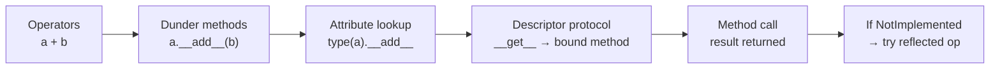

# Introduction to Dunder

Python uses a special set of methods as hooks that let user-defined classes integrate seamlessly with built-in syntax. When you write `a + b`, Python calls `a.__add__(b)` behind the scenes. When you call `len(obj)`, Python calls `obj.__len__()`. These hooks are called dunder methods, and understanding them is key to writing classes that feel natural and Pythonic.

!!! tip "Mental Model"
    Dunder methods are Python's plug-in system for operators and built-in functions. Each built-in operation (`+`, `len()`, `str()`, `for`) has a corresponding hook (`__add__`, `__len__`, `__str__`, `__iter__`) that your class can implement. By filling in the right hooks, your objects become first-class citizens of the language -- indistinguishable from built-in types at the call site.

## What Are Dunder Methods?

### 1. Definition

Dunder methods — short for "double underscore" methods — are special methods whose names begin and end with two underscores, like `__init__` or `__add__`. They are sometimes called "magic methods" because Python calls them implicitly in response to operations like addition, comparison, or string conversion. You rarely call them directly; instead, you define them in your class and let Python invoke them at the right moment.

### 2. Naming Convention
- Start and end with double underscores: `__method__`
- Examples: `__init__`, `__str__`, `__add__`, `__len__`

### 3. Purpose
Enable objects to interact with Python's built-in operations:

- Arithmetic: `+`, `-`, `*`, `/`
- Comparisons: `==`, `<`, `>`
- Container operations: `len()`, `[]`, `in`
- String representations: `str()`, `repr()`

## Common Categories

Dunder methods fall into several functional categories. The following sections provide an overview of the most commonly used groups.

### 1. Initialization

These methods control how instances are created, initialized, and destroyed.

- `__init__`: Initializer — sets up the instance's initial state after creation
- `__new__`: Instance creation — constructs and returns the new instance
- `__del__`: Finalizer — called when the instance is about to be garbage-collected

### 2. Representation

These methods control how an object is converted to a string for display or debugging.

- `__str__`: User-friendly string returned by `str()` and `print()`
- `__repr__`: Developer-friendly representation returned by `repr()` and the interactive console
- `__format__`: Custom formatting used by `format()` and f-strings

### 3. Operators

These methods let your class support built-in operators and container protocols.

- `__add__`, `__sub__`, `__mul__`, `__truediv__`: arithmetic operators
- `__eq__`, `__lt__`, `__gt__`: comparison operators
- `__len__`, `__getitem__`, `__setitem__`: container and indexing operations

## The Python Data Model: Protocols, Not Just Methods

Dunder methods are not isolated features. They form **protocols** --- groups of methods that, when implemented together, make your object behave like a built-in type. For example, implementing `__len__` and `__getitem__` gives you the sequence protocol; implementing `__eq__` and `__hash__` makes your object usable in sets and as dictionary keys.

The mental model is:

1. **Python asks your object what it can do** by looking for the appropriate dunder method.
2. **If the method returns `NotImplemented`**, Python tries a fallback (e.g., the reflected method on the other operand).
3. **If no method handles the operation**, Python raises a `TypeError`.

!!! note "Connection to Descriptors"

    Dunder methods are triggered by syntax (e.g., `+` calls `__add__`), but the way Python *finds* those methods is controlled by the descriptor protocol and the attribute lookup chain. When you write `obj + other`, Python looks up `type(obj).__add__` — and that lookup follows the same MRO and descriptor rules described in the [Attribute Lookup](../object_model/attribute_lookup.md) section. Methods themselves are non-data descriptors: accessing `obj.method` invokes `__get__` to produce a bound method. This means descriptors and dunder methods are not separate systems — they are two facets of the same underlying mechanism.

This protocol-based approach means you don't inherit from a special base class to be "list-like" or "number-like" --- you just implement the right methods. See the [quick reference](magic_methods_quick_reference.md) for which methods each protocol requires.

## The Full Chain

Everything in Python connects through one mechanism:



```text
Operators      → dunder methods
Dunder methods → attribute lookup
Lookup         → descriptor protocol
Classes        → metaclass (type)
```

This is the entire Python object model in one chain. Everything you write as clean syntax (`a + b`, `obj.method()`, `len(x)`) passes through this same machinery.

## Summary

- Dunder methods are the mechanism Python uses to connect user-defined classes with built-in syntax and operations.
- You define them in your class, and Python calls them automatically when the corresponding operator or function is used.
- The most commonly overridden dunder methods cover initialization, string representation, [arithmetic operators](dunder_arithmetic.md), [comparisons](dunder_comparison.md), [string conversion](dunder_string.md), and [object lifecycle](dunder_lifecycle.md).

---

## Runnable Example: `init_and_repr_tutorial.py`

```python
"""
Example 1: Object Initialization and Representation
Demonstrates: __init__, __repr__, __str__, __format__
"""


class Book:
    """A class representing a book with magic methods for representation."""
    
    def __init__(self, title, author, year, pages):
        """Initialize a Book object."""
        self.title = title
        self.author = author
        self.year = year
        self.pages = pages
    
    def __repr__(self):
        """Official representation - should be unambiguous and ideally recreate object."""
        return f"Book('{self.title}', '{self.author}', {self.year}, {self.pages})"
    
    def __str__(self):
        """Informal representation - human-readable."""
        return f"'{self.title}' by {self.author} ({self.year})"
    
    def __format__(self, format_spec):
        """Custom formatting support."""
        if format_spec == 'short':
            return f"{self.title} - {self.author}"
        elif format_spec == 'full':
            return f"{self.title} by {self.author}, published in {self.year} ({self.pages} pages)"
        elif format_spec == 'year':
            return str(self.year)
        else:
            return str(self)


# Examples
if __name__ == "__main__":
    book = Book("1984", "George Orwell", 1949, 328)
    
    # ============================================================================
    print("=== Representation Examples ===")
    print(f"repr(book): {repr(book)}")
    print(f"str(book):  {str(book)}")
    print(f"print(book): ", end="")
    print(book)
    
    print("\n=== Format Examples ===")
    print(f"Short format: {book:short}")
    print(f"Full format:  {book:full}")
    print(f"Year only:    {book:year}")
    
    print("\n=== Recreating Object from repr ===")
    book_repr = repr(book)
    print(f"Original repr: {book_repr}")
    recreated_book = eval(book_repr)
    print(f"Recreated:     {recreated_book}")
    print(f"Are they equal strings? {str(book) == str(recreated_book)}")


class Point:
    """A class representing a 2D point."""
    
    def __init__(self, x, y):
        self.x = x
        self.y = y
    
    def __repr__(self):
        return f"Point({self.x}, {self.y})"
    
    def __str__(self):
        return f"({self.x}, {self.y})"


# Example with Point
if __name__ == "__main__":
    print("\n\n=== Point Examples ===")
    p1 = Point(3, 4)
    print(f"Point repr: {repr(p1)}")
    print(f"Point str:  {str(p1)}")
    
    # When used in collections, __repr__ is called
    points = [Point(1, 2), Point(3, 4), Point(5, 6)]
    print(f"List of points: {points}")
```

---

## Exercises

**Exercise 1.**
Create a `Color` class with `r`, `g`, `b` attributes. Implement `__repr__` (returns `Color(r, g, b)`), `__str__` (returns the hex string like `#FF0000`), and `__eq__` (compares RGB values). Demonstrate the difference between `repr()` and `str()` output.

??? success "Solution to Exercise 1"

        class Color:
            def __init__(self, r, g, b):
                self.r = r
                self.g = g
                self.b = b

            def __repr__(self):
                return f"Color({self.r}, {self.g}, {self.b})"

            def __str__(self):
                return f"#{self.r:02X}{self.g:02X}{self.b:02X}"

            def __eq__(self, other):
                return (self.r, self.g, self.b) == (other.r, other.g, other.b)

        red = Color(255, 0, 0)
        print(repr(red))  # Color(255, 0, 0)
        print(str(red))   # #FF0000
        print(red == Color(255, 0, 0))  # True

---

**Exercise 2.**
Write a `Duration` class representing time in seconds. Implement `__init__` (accepts seconds), `__repr__`, `__str__` (formats as `"Xh Ym Zs"`), `__add__` (adds two durations), and `__bool__` (returns `False` for zero duration). Demonstrate all methods.

??? success "Solution to Exercise 2"

        class Duration:
            def __init__(self, seconds):
                self.seconds = seconds

            def __repr__(self):
                return f"Duration({self.seconds})"

            def __str__(self):
                h = self.seconds // 3600
                m = (self.seconds % 3600) // 60
                s = self.seconds % 60
                return f"{h}h {m}m {s}s"

            def __add__(self, other):
                return Duration(self.seconds + other.seconds)

            def __bool__(self):
                return self.seconds != 0

        d1 = Duration(3661)
        print(str(d1))            # 1h 1m 1s
        print(d1 + Duration(1800)) # 1h 31m 1s
        print(bool(Duration(0)))   # False

---

**Exercise 3.**
Build a `Bag` class (a multiset/counter). Implement `__init__` (accepts a list of items), `__contains__` (checks if an item is in the bag), `__len__` (returns total count of all items), `__repr__`, and `__add__` (merges two bags). Show that `"apple" in bag` and `len(bag)` work as expected.

??? success "Solution to Exercise 3"

        from collections import Counter

        class Bag:
            def __init__(self, items=None):
                self._counter = Counter(items or [])

            def __contains__(self, item):
                return self._counter[item] > 0

            def __len__(self):
                return sum(self._counter.values())

            def __add__(self, other):
                new_bag = Bag()
                new_bag._counter = self._counter + other._counter
                return new_bag

            def __repr__(self):
                return f"Bag({dict(self._counter)})"

        bag1 = Bag(["apple", "banana", "apple"])
        print("apple" in bag1)  # True
        print(len(bag1))        # 3
        merged = bag1 + Bag(["banana", "cherry"])
        print(merged)  # Bag({'apple': 2, 'banana': 2, 'cherry': 1})
