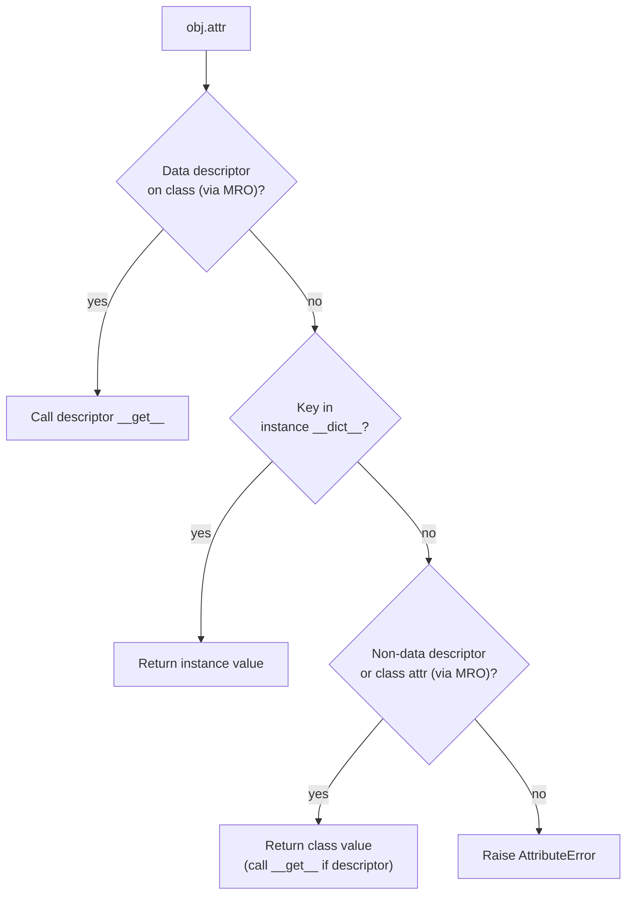

# Attribute Lookup

When you access an attribute on a Python object, the interpreter does not simply retrieve a stored value. Instead, it follows a well-defined search chain that involves descriptors, instance dictionaries, and the class hierarchy. Understanding this lookup mechanism is essential for working with inheritance, class design, and advanced features like properties and custom descriptors.

!!! tip "Mental Model: A Prioritized Chain"

    Think of attribute lookup not as a "search" but as a **prioritized chain** with three tiers:

    1. **Class-controlled access** — data descriptors (e.g., `property`) can intercept reads and writes before the instance is even consulted.
    2. **Object state** — the instance's own `__dict__`, where `self.x = value` stores data.
    3. **Class defaults** — class attributes and non-data descriptors (notably functions that become methods, including instance methods, `classmethod`, and `staticmethod`), inherited via the MRO.

    The first tier that matches wins. Everything in Python attributes — methods, properties, slots, plain variables — is built on this single system.

## Lookup Order

### The Full Resolution Model

When you write `obj.attr`, Python does not just check "instance, then class, then parent." The actual resolution involves **descriptors** --- objects that define `__get__`, `__set__`, or `__delete__` methods and can intercept attribute access. The complete lookup order is:

1. **Data descriptors on the class** (via MRO) --- objects that define `__set__` or `__delete__` (and usually `__get__`). Examples: `property`, `__slots__`.
2. **Instance `__dict__`** --- the instance's own namespace
3. **Non-data descriptors and other class attributes** (via MRO) --- objects that define only `__get__` (e.g., regular functions/methods, `@classmethod`, `@staticmethod`), plus plain class variables that are not descriptors at all.

This ordering explains why `@property` can intercept attribute access even when an instance has a key of the same name in its `__dict__`: properties are data descriptors, so they take priority over instance attributes.

!!! warning "Common Misconception: @property Without a Setter"

    A `@property` with only a getter is still a **data descriptor (tier 1)**, not a non-data descriptor. The `property` class always implements `__set__` internally --- if you don't define a setter, it installs one that raises `AttributeError("can't set attribute")`. The same applies to `__delete__`. Because `__set__` exists (even though it raises), `@property` is always tier 1.

    | What | Descriptor type | Tier |
    |---|---|---|
    | `@property` (getter only) | Data descriptor | 1 |
    | `@property` + setter | Data descriptor | 1 |
    | `def method(self)` (function) | Non-data descriptor | 3 |
    | `@classmethod` / `@staticmethod` | Non-data descriptor | 3 |
    | Plain class variable (`x = 10`) | Not a descriptor | 3 |



### A Surprising Consequence

Because data descriptors take priority over instance `__dict__`, assigning to an attribute does not always mean you can read back the same value from `__dict__`:

```python
class Surprise:
    @property
    def x(self):
        return "from descriptor"

    @x.setter
    def x(self, value):
        print(f"Setter called with {value}, but not stored as x")

obj = Surprise()
obj.x = 10         # setter intercepts — does not store in __dict__
print(obj.x)        # "from descriptor" — getter intercepts the read
print(obj.__dict__) # {} — no 'x' key at all
```

This is not a trick — it is exactly how `@property` works in practice. The property descriptor sits at tier 1 of the lookup chain, so it intercepts both reads and writes before the instance `__dict__` is ever consulted.

### Simplified View: Instance, Class, Parent

For everyday code that does not involve descriptors, the lookup simplifies to:

1. Check the instance's own `__dict__`
2. Check the class's `__dict__`
3. Walk up the MRO through parent classes

The first match wins.

```python
class Parent:
    x = "parent"

class Child(Parent):
    y = "child"

obj = Child()
obj.z = "instance"

print(obj.z)  # instance (found in instance)
print(obj.y)  # child (found in class)
print(obj.x)  # parent (found in parent)
```

In this example, `obj.z` is found directly on the instance. The name `obj.y` is not on the instance, so Python checks `Child` and finds it there. Finally, `obj.x` is not on the instance or on `Child`, so Python continues up to `Parent` where it finds the match.

## The `__dict__` Dictionary

Every object and class in Python maintains a `__dict__` dictionary that stores its attributes. This dictionary is the underlying data structure that powers the attribute lookup chain described above. For details on how instance and class dictionaries differ, see [Instance Attributes](instance_attributes.md) and [Class Attributes](class_attributes.md).

### Instance Dict

Attributes set through `self.x = value` inside a method (or directly on the instance) are stored in the instance's `__dict__`. This is the first place Python looks during attribute resolution (after checking for data descriptors).

```python
class MyClass:
    def __init__(self, x):
        self.x = x

obj = MyClass(10)
print(obj.__dict__)  # {'x': 10}
```

### Class Dict

Class-level attributes, methods, and other definitions live in the class's `__dict__`. Python searches here after checking the instance namespace. Descriptors also live here --- functions, properties, `classmethod`, and `staticmethod` are all stored as descriptor objects in the class `__dict__`, and Python invokes them during attribute lookup when they are found there.

```python
print(MyClass.__dict__)
# Contains class attributes, including descriptor objects
# (functions, properties, classmethod, staticmethod)
# that define how attribute access behaves
```

## Descriptors and Properties

Properties and methods are implemented using Python's **descriptor protocol**. A descriptor is any object that defines at least one of `__get__`, `__set__`, or `__delete__`. When Python encounters a descriptor during attribute lookup, it calls the appropriate method instead of returning the descriptor object itself.

- **Data descriptors** define `__set__` (and usually `__get__`). Examples: `property`, attributes created by `__slots__`.
- **Non-data descriptors** define only `__get__`. Example: regular functions (which become bound methods).

!!! note "Intuition: Why Two Kinds?"

    Data descriptors **must** win over instance `__dict__` so that `@property` validation cannot be bypassed by writing directly to the instance. Non-data descriptors (like methods) **should** lose to instance `__dict__` so that you can shadow a method on a specific instance if needed. The split exists to serve these two different design needs.

This is why `@property` can add validation to attribute access --- it installs a data descriptor on the class that intercepts reads and writes:

```python
class Temperature:
    def __init__(self, celsius):
        self._celsius = celsius

    @property
    def celsius(self):
        return self._celsius

    @celsius.setter
    def celsius(self, value):
        if value < -273.15:
            raise ValueError("Below absolute zero")
        self._celsius = value

t = Temperature(25)
print(t.celsius)       # calls property __get__
t.celsius = 100        # calls property __set__
print(t.__dict__)      # {'_celsius': 100} --- no 'celsius' key
print(type(t).__dict__['celsius'])  # <property object>
```

Notice that `celsius` does not appear in the instance `__dict__` --- the data descriptor on the class intercepts the access before the instance dictionary is consulted.

## Summary

- Python resolves attribute access through a three-tier system: data descriptors, instance `__dict__`, then non-data descriptors and class attributes.
- For most everyday code, the simplified view (instance, class, parents via MRO) is sufficient.
- The `__dict__` dictionary on each object and class is the storage mechanism behind this lookup chain.
- Properties and methods work because of the descriptor protocol, which intercepts attribute access at the class level.

---

## Runnable Example: `properties_tutorial.py`

```python
"""
05: Properties and Decorators (@property)

Properties provide a way to customize access to instance attributes.
They allow you to use getter/setter methods while maintaining simple attribute syntax.
"""

# ============================================================================
# Example 1: Problem without properties
class TemperatureBasic:
    def __init__(self, celsius):
        self.celsius = celsius

if __name__ == "__main__":

    temp = TemperatureBasic(25)
    print("WITHOUT PROPERTIES:")
    print(f"Temperature: {temp.celsius}°C")

    # Problem: No validation
    temp.celsius = -500  # Unrealistic temperature!
    print(f"After invalid assignment: {temp.celsius}°C (This shouldn't be allowed!)")


    # ============================================================================
    # Example 2: Using properties with @property decorator
    class Temperature:
        def __init__(self, celsius):
            self._celsius = celsius  # Protected attribute

        @property
        def celsius(self):
            """Getter for celsius"""
            return self._celsius

        @celsius.setter
        def celsius(self, value):
            """Setter with validation"""
            if value < -273.15:  # Absolute zero
                raise ValueError("Temperature cannot be below absolute zero (-273.15°C)")
            self._celsius = value

        @property
        def fahrenheit(self):
            """Calculated property"""
            return (self._celsius * 9/5) + 32

        @fahrenheit.setter
        def fahrenheit(self, value):
            """Set temperature using Fahrenheit"""
            self.celsius = (value - 32) * 5/9

        @property
        def kelvin(self):
            """Another calculated property"""
            return self._celsius + 273.15

    print("\n" + "="*50)
    print("WITH PROPERTIES:")
    temp = Temperature(25)
    print(f"Temperature: {temp.celsius}°C")
    print(f"In Fahrenheit: {temp.fahrenheit}°F")
    print(f"In Kelvin: {temp.kelvin}K")

    # Now validation happens automatically
    try:
        temp.celsius = -500
    except ValueError as e:
        print(f"Validation works! Error: {e}")

    # Can set using different units
    temp.fahrenheit = 86
    print(f"\nSet to 86°F = {temp.celsius}°C")


    # ============================================================================
    # Example 3: Read-only properties
    class Circle:
        def __init__(self, radius):
            self._radius = radius

        @property
        def radius(self):
            return self._radius

        @radius.setter
        def radius(self, value):
            if value < 0:
                raise ValueError("Radius cannot be negative")
            self._radius = value

        @property
        def diameter(self):
            """Read-only property (no setter)"""
            return self._radius * 2

        @property
        def area(self):
            """Read-only calculated property"""
            return 3.14159 * self._radius ** 2

        @property
        def circumference(self):
            """Read-only calculated property"""
            return 2 * 3.14159 * self._radius

    print("\n" + "="*50)
    print("READ-ONLY PROPERTIES:")
    circle = Circle(5)
    print(f"Radius: {circle.radius}")
    print(f"Diameter: {circle.diameter}")
    print(f"Area: {circle.area:.2f}")
    print(f"Circumference: {circle.circumference:.2f}")

    # Can change radius
    circle.radius = 10
    print(f"\nAfter changing radius to 10:")
    print(f"Diameter: {circle.diameter}")
    print(f"Area: {circle.area:.2f}")

    # Cannot change diameter directly (no setter)
    try:
        circle.diameter = 50
    except AttributeError as e:
        print(f"\nCannot set diameter: {e}")


    # ============================================================================
    # Example 4: Properties with validation logic
    class Person:
        def __init__(self, name, age):
            self._name = name
            self._age = age
            self._email = None

        @property
        def name(self):
            return self._name

        @name.setter
        def name(self, value):
            if not value or not value.strip():
                raise ValueError("Name cannot be empty")
            self._name = value.strip()

        @property
        def age(self):
            return self._age

        @age.setter
        def age(self, value):
            if not isinstance(value, int):
                raise TypeError("Age must be an integer")
            if value < 0 or value > 150:
                raise ValueError("Age must be between 0 and 150")
            self._age = value

        @property
        def email(self):
            return self._email

        @email.setter
        def email(self, value):
            if value and '@' not in value:
                raise ValueError("Invalid email format")
            self._email = value

        @property
        def is_adult(self):
            """Computed property"""
            return self._age >= 18

    print("\n" + "="*50)
    print("VALIDATION WITH PROPERTIES:")
    person = Person("Alice", 25)
    print(f"{person.name} is {person.age} years old")
    print(f"Is adult: {person.is_adult}")

    # Validation in action
    try:
        person.age = -5
    except ValueError as e:
        print(f"Validation error: {e}")

    try:
        person.email = "invalid-email"
    except ValueError as e:
        print(f"Email validation error: {e}")

    person.email = "alice@example.com"
    print(f"Valid email set: {person.email}")


    # ============================================================================
    # Example 5: Properties with lazy loading
    class DataProcessor:
        def __init__(self, filename):
            self._filename = filename
            self._data = None  # Not loaded yet
            self._processed = None

        @property
        def data(self):
            """Lazy loading - only load when accessed"""
            if self._data is None:
                print(f"Loading data from {self._filename}...")
                # Simulate loading data
                self._data = [1, 2, 3, 4, 5]
            return self._data

        @property
        def processed_data(self):
            """Process data only when needed"""
            if self._processed is None:
                print("Processing data...")
                self._processed = [x * 2 for x in self.data]
            return self._processed

    print("\n" + "="*50)
    print("LAZY LOADING WITH PROPERTIES:")
    processor = DataProcessor("data.txt")
    print("DataProcessor created (data not loaded yet)")
    print(f"Accessing data: {processor.data}")  # Loads here
    print(f"Accessing again: {processor.data}")  # Uses cached version
    print(f"Processed: {processor.processed_data}")


    # ============================================================================
    # Example 6: Using properties for data transformation
    class Product:
        def __init__(self, name, price):
            self._name = name
            self._price = price
            self._discount = 0

        @property
        def price(self):
            return self._price

        @price.setter
        def price(self, value):
            if value < 0:
                raise ValueError("Price cannot be negative")
            self._price = value

        @property
        def discount(self):
            return self._discount

        @discount.setter
        def discount(self, value):
            if not 0 <= value <= 100:
                raise ValueError("Discount must be between 0 and 100")
            self._discount = value

        @property
        def final_price(self):
            """Calculated property with discount"""
            return self._price * (1 - self._discount / 100)

        @property
        def savings(self):
            """How much money is saved"""
            return self._price - self.final_price

    print("\n" + "="*50)
    print("DATA TRANSFORMATION:")
    product = Product("Laptop", 1000)
    print(f"Original price: ${product.price}")
    product.discount = 20
    print(f"With 20% discount: ${product.final_price:.2f}")
    print(f"You save: ${product.savings:.2f}")


    # ============================================================================
    # Example 7: Properties vs regular methods comparison
    class Rectangle:
        def __init__(self, length, width):
            self._length = length
            self._width = width

        # Using property
        @property
        def area(self):
            return self._length * self._width

        # Using method
        def calculate_area(self):
            return self._length * self._width

    print("\n" + "="*50)
    print("PROPERTY VS METHOD:")
    rect = Rectangle(5, 3)

    # Property: accessed like an attribute
    print(f"Using property: {rect.area}")

    # Method: needs parentheses
    print(f"Using method: {rect.calculate_area()}")

    # Property is more intuitive for calculated values


    # Key Takeaways:
    # 1. @property makes methods accessible like attributes
    # 2. Provides encapsulation - hide implementation details
    # 3. Allows validation when setting values
    # 4. Can create read-only properties (no setter)
    # 5. Good for computed/derived values
    # 6. Maintains clean syntax while adding functionality
    # 7. Can implement lazy loading
    # 8. Use properties when value needs computation or validation
    # 9. Use regular methods when action/operation is being performed
```

---

## Exercises

**Exercise 1.**
Create a class hierarchy `A -> B -> C` where `A` defines a class attribute `x = "A"`, `B` defines `x = "B"`, and `C` does not define `x`. Create an instance of `C` and predict what `instance.x` returns. Then assign `instance.x = "instance"` and show how `instance.x`, `C.x`, `B.x`, and `A.x` each resolve differently. Explain the lookup order using `__mro__`.

??? success "Solution to Exercise 1"

        class A:
            x = "A"

        class B(A):
            x = "B"

        class C(B):
            pass

        obj = C()
        print(obj.x)  # "B" - found in B (next in MRO after C)
        print(C.__mro__)
        # (<class 'C'>, <class 'B'>, <class 'A'>, <class 'object'>)

        obj.x = "instance"
        print(obj.x)   # "instance" - found in instance __dict__
        print(C.x)     # "B" - class C has no x, looks up to B
        print(B.x)     # "B" - defined on B
        print(A.x)     # "A" - defined on A

---

**Exercise 2.**
Write a class `Config` with a class attribute `defaults = {"debug": False, "verbose": True}`. In `__init__`, do NOT copy `defaults`---just let attribute lookup find it. Create two instances and show that modifying `defaults` through one instance via `self.defaults["debug"] = True` affects the other instance. Then fix the problem by copying `defaults` in `__init__` so each instance has its own dictionary.

??? success "Solution to Exercise 2"

        class Config:
            defaults = {"debug": False, "verbose": True}

            def __init__(self):
                pass  # No copy - shared reference

        c1 = Config()
        c2 = Config()
        c1.defaults["debug"] = True
        print(c2.defaults["debug"])  # True - both share same dict!

        # Fixed version
        class ConfigFixed:
            defaults = {"debug": False, "verbose": True}

            def __init__(self):
                self.defaults = dict(ConfigFixed.defaults)  # Copy

        f1 = ConfigFixed()
        f2 = ConfigFixed()
        f1.defaults["debug"] = True
        print(f2.defaults["debug"])  # False - independent copy

---

**Exercise 3.**
Build a class `Tracker` that uses `__dict__` inspection to demonstrate attribute lookup. Add a class attribute `version = 1`. In `__init__`, set `self.name`. After creating an instance, print `instance.__dict__`, `type(instance).__dict__`, and show that `version` is NOT in `instance.__dict__` but IS in `type(instance).__dict__`. Then shadow `version` on the instance and show the change in both `__dict__` outputs.

??? success "Solution to Exercise 3"

        class Tracker:
            version = 1

            def __init__(self, name):
                self.name = name

        t = Tracker("alpha")
        print(t.__dict__)
        # {'name': 'alpha'}
        print("version" in t.__dict__)
        # False - not on instance
        print("version" in type(t).__dict__)
        # True - on the class

        print(t.version)  # 1 - found via class lookup

        # Shadow version on instance
        t.version = 2
        print(t.__dict__)
        # {'name': 'alpha', 'version': 2}
        print(t.version)         # 2 - instance shadows class
        print(Tracker.version)   # 1 - class attribute unchanged

---

**Exercise 4.**
Predict the output of the following code, then verify by running it. Explain why `obj.celsius` does not appear in `obj.__dict__` even after assignment, and which step of the full lookup model is responsible.

```python
class Temp:
    def __init__(self, c):
        self._c = c

    @property
    def celsius(self):
        return self._c

    @celsius.setter
    def celsius(self, value):
        self._c = value

obj = Temp(20)
obj.celsius = 30
print("celsius" in obj.__dict__)
print("_c" in obj.__dict__)
print(obj.celsius)
```

??? success "Solution to Exercise 4"

        class Temp:
            def __init__(self, c):
                self._c = c

            @property
            def celsius(self):
                return self._c

            @celsius.setter
            def celsius(self, value):
                self._c = value

        obj = Temp(20)
        obj.celsius = 30
        print("celsius" in obj.__dict__)  # False
        print("_c" in obj.__dict__)       # True
        print(obj.celsius)                # 30

        # Explanation:
        # @property creates a data descriptor on the class.
        # Data descriptors are checked BEFORE the instance __dict__
        # (step 1 of the full lookup model).
        # So obj.celsius = 30 calls the property setter, which
        # stores the value in obj._c, not obj.celsius.
        # The key "celsius" never enters the instance __dict__.

---

**Exercise 5.**
A non-data descriptor defines `__get__` but not `__set__`. Create a class `Verbose` that implements `__get__` to print a message and return a value. Install it on a class `Host`. Show that accessing `host.attr` triggers the descriptor. Then assign `host.attr = "direct"` and show that the instance `__dict__` entry now shadows the non-data descriptor. Explain why this shadowing works for non-data descriptors but not for data descriptors like `property`.

??? success "Solution to Exercise 5"

        class Verbose:
            """A non-data descriptor (only __get__, no __set__)."""
            def __init__(self, value):
                self.value = value

            def __get__(self, obj, objtype=None):
                print(f"Descriptor __get__ called")
                return self.value

        class Host:
            attr = Verbose(42)

        host = Host()
        print(host.attr)
        # Descriptor __get__ called
        # 42

        # Shadow the non-data descriptor with an instance attribute
        host.attr = "direct"
        print(host.attr)
        # "direct" --- no descriptor call, instance __dict__ wins
        print(host.__dict__)
        # {'attr': 'direct'}

        # Why this works:
        # Non-data descriptors sit at step 3 of the lookup model.
        # Instance __dict__ is checked at step 2.
        # So after host.attr = "direct" puts a key in instance __dict__,
        # the instance value is found first and the descriptor is skipped.
        #
        # Data descriptors (like property) sit at step 1, BEFORE instance
        # __dict__, so they cannot be shadowed this way.
