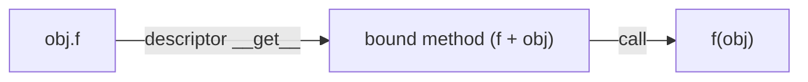

# Descriptors in Python

Descriptors are the **core mechanism behind attribute access in Python**.

!!! tip "Mental Model"
    A descriptor is an object that hijacks attribute access on another object. When a class attribute is a descriptor—an instance of a class that defines `__get__`, `__set__`, or `__delete__`—Python calls those methods instead of simply reading or writing the attribute. Descriptors only work when defined as class attributes; assigning them to instances has no effect. This single mechanism powers properties, methods, `classmethod`, `staticmethod`, and ORMs—understanding descriptors means understanding how Python’s object model actually works.

They power:

- methods
- `@property`
- `classmethod` / `staticmethod`
- ORMs (Django, SQLAlchemy)

---

## 1. What is a Descriptor?

A descriptor is any object that implements one or more of:

```python
__get__(self, obj, objtype=None)
__set__(self, obj, value)
__delete__(self, obj)
```

The `__get__` parameters:

- `self` --- the descriptor instance (lives on the class)
- `obj` --- the instance being accessed (`None` if accessed via the class)
- `objtype` --- the class that owns the descriptor (defaults to `None` for flexibility)

When accessed via an instance (`obj.x`), Python calls `descriptor.__get__(obj, type(obj))`. When accessed via the class (`MyClass.x`), Python calls `descriptor.__get__(None, MyClass)`. This is why descriptors typically check `if obj is None: return self`.

---

## 2. Types of Descriptors

### Data Descriptor

Implements `__get__` AND `__set__` (or `__delete__`):

```python
class DataDescriptor:
    def __get__(self, obj, objtype=None):
        if obj is None:
            return self  # accessed via class
        return obj._x    # accessed via instance

    def __set__(self, obj, value):
        obj._x = value
```

Takes precedence over instance attributes.

### Full Trace

```python
class MyClass:
    x = DataDescriptor()  # descriptor lives on the class

obj = MyClass()
obj.x = 10     # calls DataDescriptor.__set__(descriptor, obj, 10)
               # self = MyClass.__dict__["x"] (the descriptor)
               # obj  = the MyClass instance
               # value = 10
               # stores obj._x = 10

print(obj.x)   # calls DataDescriptor.__get__(descriptor, obj, MyClass)
               # returns obj._x → 10
```

The descriptor stores data in `obj._x` (not `obj.x`) to avoid infinite recursion --- writing to `obj.x` would trigger `__set__` again.

### Why `if obj is None: return self`

Descriptors serve **two roles** depending on how you access them:

```python
obj.x       # instance access → obj is the instance → return the VALUE
MyClass.x   # class access    → obj is None         → return the DESCRIPTOR
```

| Expression | `obj` | Returns | Used for |
|---|---|---|---|
| `obj.x` | the instance | Computed value (`obj._x`) | Normal program logic |
| `MyClass.x` | `None` | The descriptor object itself | Inspection, frameworks, debugging |

Without the `if obj is None` guard, `MyClass.x` would try `None._x` and crash with `AttributeError`. Returning `self` lets frameworks inspect the descriptor (this is how Django discovers model fields and how `type(MyClass.x)` shows `<property>`).

```python
obj = MyClass()
obj.x = 10
print(obj.x)       # 10 — instance access, returns value
print(MyClass.x)   # <DataDescriptor object> — class access, returns descriptor
```

---

### Non-Data Descriptor

Implements only `__get__`:

```python
class NonDataDescriptor:
    def __get__(self, obj, objtype=None):
        return 42
```

Lower priority than instance attributes.

---

## 3. Descriptor in Action

```python
class A:
    x = NonDataDescriptor()

a = A()
print(a.x)  # calls x.__get__(a, A)
```

---

## 4. Where Descriptors Are Used

### 4.1 Methods

```python
class A:
    def f(self): pass
```

`f` is a **non-data descriptor**. Accessing `a.f` calls:

```python
A.__dict__['f'].__get__(a, A)
```

This returns a **bound method** --- an object that pairs the function with the instance, so calling it automatically passes the instance as the first argument (`self`).



A bound method holds two pointers: `__func__` (the original function) and `__self__` (the instance). When you call `obj.f()`, Python calls `f(obj)` behind the scenes. A new bound method is created on every access --- `obj.f is obj.f` is `False` --- but all share the same underlying function.

---

### 4.2 Property

```python
class A:
    @property
    def x(self):
        return 10
```

`property` is a **data descriptor** --- it always intercepts access, even if a key of the same name exists in the instance `__dict__`.

---

### 4.3 Classmethod / Staticmethod

```python
class A:
    @classmethod
    def f(cls): pass

    @staticmethod
    def g(): pass
```

| Type | Descriptor Type |
|---|---|
| `classmethod` | non-data (binds to class) |
| `staticmethod` | non-data (returns raw function) |

---

## 5. Descriptor vs Instance Dictionary

With a non-data descriptor:

```python
class A:
    x = NonDataDescriptor()

a = A()
a.x = 100
print(a.x)  # 100 — instance dict wins
```

With a data descriptor:

```python
class A:
    x = DataDescriptor()

a = A()
a.x = 100
print(a.x)  # descriptor controls access
```

---

## 6. Descriptor Priority

```text
1. Data descriptor
2. Instance __dict__
3. Non-data descriptor
4. Class attribute
```

---

## 7. How Python Uses Descriptors

When you do:

```python
obj.attr
```

Python may call:

```python
descriptor.__get__(obj, type(obj))
```

Descriptors are triggered inside `__getattribute__`. See [`__getattribute__` vs `__getattr__`](getattribute_vs_getattr.md) for how this fits into the full pipeline.

---

## 8. Minimal Custom Descriptor Example

```python
class LoggedAttribute:
    def __set_name__(self, owner, name):
        self.name = name

    def __get__(self, obj, objtype=None):
        if obj is None:
            return self
        print(f"Getting {self.name}")
        return obj.__dict__.get(self.name)

    def __set__(self, obj, value):
        print(f"Setting {self.name} = {value}")
        obj.__dict__[self.name] = value


class A:
    x = LoggedAttribute()

a = A()
a.x = 10      # Setting x = 10
print(a.x)    # Getting x → 10
```

---

## 9. Key Insight

Descriptors are the **engine behind Python attribute behavior**. They unify:

- methods → binding (`self`)
- properties → controlled access
- frameworks → dynamic fields

---

## Summary

- Descriptor = object controlling attribute access via `__get__`, `__set__`, `__delete__`
- Data descriptor > instance attribute > non-data descriptor
- Methods and properties are descriptors
- Core to Python OOP internals

---

## See Also

- [Attribute Lookup (Pipeline)](attribute_lookup.md)
- [`__getattribute__` vs `__getattr__`](getattribute_vs_getattr.md)
- [Properties as Descriptors](property_descriptor_connection.md)

---

## Exercises

**Exercise 1.**
Create a non-data descriptor `Verbose` that prints a message and returns a fixed value from `__get__`. Attach it to a class `Host`. Show that `host.attr` triggers the descriptor. Then assign `host.attr = "direct"` and show that the instance `__dict__` entry now shadows the non-data descriptor.

??? success "Solution to Exercise 1"

        class Verbose:
            def __get__(self, obj, objtype=None):
                if obj is None:
                    return self
                print("Descriptor __get__ called")
                return 42

        class Host:
            attr = Verbose()

        host = Host()
        print(host.attr)
        # Descriptor __get__ called
        # 42

        host.attr = "direct"
        print(host.attr)   # "direct" — instance dict shadows descriptor
        print(host.__dict__)  # {'attr': 'direct'}

---

**Exercise 2.**
Create a data descriptor `Positive` that only allows positive numbers. Implement `__set__` to raise `ValueError` for non-positive values, and `__get__` to return the stored value. Use `__set_name__` to automatically capture the attribute name. Demonstrate that `obj.x = -5` raises an error.

??? success "Solution to Exercise 2"

        class Positive:
            def __set_name__(self, owner, name):
                self.name = name
                self.storage = f"_{name}"

            def __get__(self, obj, objtype=None):
                if obj is None:
                    return self
                return getattr(obj, self.storage, None)

            def __set__(self, obj, value):
                if value <= 0:
                    raise ValueError(f"{self.name} must be positive, got {value}")
                setattr(obj, self.storage, value)

        class Account:
            balance = Positive()

        acc = Account()
        acc.balance = 100
        print(acc.balance)  # 100

        try:
            acc.balance = -5
        except ValueError as e:
            print(e)  # balance must be positive, got -5

---

**Exercise 3.**
Predict the output of both `print` statements. Explain why `MyClass.x` and `obj.x` return different things.

```python
class Demo:
    def __get__(self, obj, objtype=None):
        if obj is None:
            return "I am the descriptor"
        return "I am the value"

class MyClass:
    x = Demo()

obj = MyClass()
print(MyClass.x)
print(obj.x)
```

??? success "Solution to Exercise 3"

        class Demo:
            def __get__(self, obj, objtype=None):
                if obj is None:
                    return "I am the descriptor"
                return "I am the value"

        class MyClass:
            x = Demo()

        obj = MyClass()
        print(MyClass.x)  # "I am the descriptor"
        print(obj.x)      # "I am the value"

        # MyClass.x calls __get__(descriptor, None, MyClass)
        #   → obj is None → returns "I am the descriptor"
        #
        # obj.x calls __get__(descriptor, obj, MyClass)
        #   → obj is not None → returns "I am the value"
        #
        # This is the two-role pattern: class access returns the
        # descriptor itself (for inspection), instance access
        # returns the managed value (for program logic).

---

**Exercise 4.**
Explain why a data descriptor **cannot** be shadowed by an instance attribute, but a non-data descriptor **can**. Write code that proves both behaviors.

??? success "Solution to Exercise 4"

        class DataDesc:
            def __get__(self, obj, objtype=None):
                return "from data descriptor"
            def __set__(self, obj, value):
                print(f"__set__ intercepted: {value}")

        class NonDataDesc:
            def __get__(self, obj, objtype=None):
                return "from non-data descriptor"

        class MyClass:
            x = DataDesc()
            y = NonDataDesc()

        obj = MyClass()

        # Try to shadow data descriptor
        obj.x = "shadow"
        # prints: __set__ intercepted: shadow
        print(obj.x)  # "from data descriptor" — NOT shadowed

        # Shadow non-data descriptor
        obj.y = "shadow"
        print(obj.y)  # "shadow" — instance dict wins

        # Why: data descriptors (tier 1) are checked BEFORE instance
        # __dict__ (tier 2). Non-data descriptors (tier 3) are checked
        # AFTER. So instance __dict__ can override tier 3 but not tier 1.
